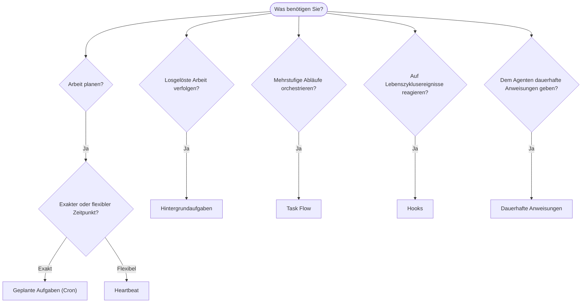

OpenClaw führt Arbeit über Aufgaben, geplante Jobs, Ereignis-Hooks
und dauerhafte Anweisungen im Hintergrund aus. Auf dieser Seite können Sie den passenden Mechanismus auswählen.

## Kurze Entscheidungshilfe

| Anwendungsfall                              | Empfehlung                  | Warum                                               |
| ------------------------------------------- | --------------------------- | --------------------------------------------------- |
| Täglichen Bericht pünktlich um 9 Uhr senden | Geplante Aufgaben (Cron)    | Exakter Zeitpunkt, isolierte Ausführung             |
| In 20 Minuten erinnern                      | Geplante Aufgaben (Cron)    | Einmalige Ausführung mit präzisem Zeitpunkt (`--at`) |
| Wöchentlich eine Tiefenanalyse ausführen    | Geplante Aufgaben (Cron)    | Eigenständige Aufgabe, kann anderes Modell verwenden |
| Posteingang alle 30 Min. prüfen             | Heartbeat                   | Mit anderen Prüfungen gebündelt, kontextbezogen     |
| Kalender auf bevorstehende Termine prüfen   | Heartbeat                   | Natürliche Wahl für regelmäßige Überwachung         |
| Status eines Subagenten oder ACP-Laufs prüfen | Hintergrundaufgaben       | Aufgabenverzeichnis erfasst alle losgelösten Arbeiten |
| Prüfen, was wann ausgeführt wurde           | Hintergrundaufgaben         | `openclaw tasks list` und `openclaw tasks audit` |
| Mehrstufig recherchieren und dann zusammenfassen | Task Flow               | Dauerhafte Orchestrierung mit Revisionsverfolgung   |
| Skript beim Zurücksetzen der Sitzung ausführen | Hooks                    | Ereignisgesteuert, wird bei Lebenszyklusereignissen ausgelöst |
| Code bei jedem Tool-Aufruf ausführen        | Plugin-Hooks                | Prozessinterne Hooks können Tool-Aufrufe abfangen   |
| Vor jeder Antwort stets Compliance prüfen   | Dauerhafte Anweisungen      | Wird automatisch in jede Sitzung eingefügt          |

### Geplante Aufgaben (Cron) im Vergleich zu Heartbeat

| Dimension       | Geplante Aufgaben (Cron)             | Heartbeat                                  |
| --------------- | ------------------------------------ | ------------------------------------------ |
| Zeitpunkt       | Exakt (Cron-Ausdrücke, einmalig)     | Ungefähr (standardmäßig alle 30 Min.)      |
| Sitzungskontext | Neu (isoliert) oder geteilt          | Vollständiger Kontext der Hauptsitzung     |
| Aufgabendatensätze | Werden immer erstellt             | Werden nie erstellt                        |
| Zustellung      | Kanal, Webhook oder still            | Direkt in der Hauptsitzung                 |
| Ideal für       | Berichte, Erinnerungen, Hintergrundjobs | Posteingangsprüfungen, Kalender, Benachrichtigungen |

Verwenden Sie geplante Aufgaben (Cron), wenn Sie einen präzisen Zeitpunkt oder eine isolierte Ausführung benötigen. Verwenden Sie Heartbeat, wenn die Arbeit vom vollständigen Sitzungskontext profitiert und ein ungefährer Zeitpunkt ausreicht.

## Grundkonzepte

### Geplante Aufgaben (Cron)

Cron ist der integrierte Scheduler des Gateways für präzise Zeitplanung. Er speichert Jobs dauerhaft, aktiviert den Agenten zum richtigen Zeitpunkt und kann Ausgaben an einen Chatkanal oder Webhook-Endpunkt zustellen. Unterstützt einmalige Erinnerungen, wiederkehrende Ausdrücke und eingehende Webhook-Auslöser.

Siehe [Geplante Aufgaben](/de/automation/cron-jobs).

### Aufgaben

Das Hintergrundaufgabenverzeichnis erfasst alle losgelösten Arbeiten: ACP-Läufe, gestartete Subagenten, isolierte Cron-Ausführungen und CLI-Operationen. Aufgaben sind Datensätze, keine Scheduler. Verwenden Sie `openclaw tasks list` und `openclaw tasks audit`, um sie einzusehen.

Siehe [Hintergrundaufgaben](/de/automation/tasks).

### Task Flow

Task Flow ist die Ablauf-Orchestrierungsebene über den Hintergrundaufgaben. Sie verwaltet dauerhafte mehrstufige Abläufe mit verwalteten und gespiegelten Synchronisierungsmodi, Revisionsverfolgung und `openclaw tasks flow list|show|cancel` zur Einsicht.

Siehe [Task Flow](/de/automation/taskflow).

### Dauerhafte Anweisungen

Dauerhafte Anweisungen erteilen dem Agenten permanente Ausführungsbefugnisse für definierte Programme. Sie befinden sich in Workspace-Dateien (typischerweise `AGENTS.md`) und werden in jede Sitzung eingefügt. Kombinieren Sie sie mit Cron zur zeitbasierten Durchsetzung.

Siehe [Dauerhafte Anweisungen](/de/automation/standing-orders).

### Hooks

Interne Hooks sind ereignisgesteuerte Skripte, die durch Lebenszyklusereignisse des Agenten
(`/new`, `/reset`, `/stop`), Sitzungs-Compaction, den Start des Gateways und den Nachrichtenfluss
ausgelöst werden. Sie werden in Hook-Verzeichnissen erkannt und mit
`openclaw hooks` verwaltet. Verwenden Sie für das prozessinterne Abfangen von Tool-Aufrufen
[Plugin-Hooks](/de/plugins/hooks).

Siehe [Hooks](/de/automation/hooks).

### Heartbeat

Heartbeat ist ein regelmäßiger Durchlauf in der Hauptsitzung (standardmäßig alle 30 Minuten). Er bündelt die checklistenartige Überwachung (Posteingang, Kalender, Benachrichtigungen) in einem Agentendurchlauf mit vollständigem Sitzungskontext. Heartbeat-Durchläufe erstellen keine Aufgabendatensätze und verlängern nicht die Aktualitätsfrist für das tägliche oder inaktivitätsbedingte Zurücksetzen der Sitzung. Der Heartbeat-Entwurf ist ein kleiner Prompt-Kontext; planen Sie wiederkehrende Arbeit als Cron-Jobs. Bei leerem Heartbeat-Entwurf wird der Durchlauf als `empty-heartbeat-file` übersprungen. Heartbeats werden aufgeschoben, während Cron-Arbeit aktiv ist oder sich in der Warteschlange befindet, und `heartbeat.skipWhenBusy` kann einen Agenten ebenfalls aufschieben, während sitzungsschlüsselgebundene Subagent- oder verschachtelte Lanes desselben Agenten beschäftigt sind.

Siehe [Heartbeat](/de/gateway/heartbeat).

## Zusammenspiel

- **Cron** verwaltet präzise Zeitpläne (tägliche Berichte, wöchentliche Überprüfungen) und einmalige Erinnerungen. Alle Cron-Ausführungen erstellen Aufgabendatensätze.
- **Heartbeat** verarbeitet alle 30 Minuten eine gebündelte Überwachungscheckliste; Cron übernimmt Prüfungen, die unabhängige Intervalle benötigen.
- **Hooks** reagieren mit benutzerdefinierten Skripten auf bestimmte Ereignisse (Zurücksetzen von Sitzungen, Compaction, Nachrichtenfluss). Plugin-Hooks decken Tool-Aufrufe ab.
- **Dauerhafte Anweisungen** geben dem Agenten dauerhaften Kontext und Befugnisgrenzen.
- **Task Flow** koordiniert mehrstufige Abläufe oberhalb einzelner Aufgaben.
- **Aufgaben** erfassen automatisch alle losgelösten Arbeiten, damit Sie diese einsehen und prüfen können.

## Verwandte Themen

- [Geplante Aufgaben](/de/automation/cron-jobs) — präzise Zeitplanung und einmalige Erinnerungen
- [Hintergrundaufgaben](/de/automation/tasks) — Aufgabenverzeichnis für alle losgelösten Arbeiten
- [Task Flow](/de/automation/taskflow) — dauerhafte Orchestrierung mehrstufiger Abläufe
- [Hooks](/de/automation/hooks) — ereignisgesteuerte Lebenszyklusskripte
- [Plugin-Hooks](/de/plugins/hooks) — prozessinterne Tool-, Prompt-, Nachrichten- und Lebenszyklus-Hooks
- [Dauerhafte Anweisungen](/de/automation/standing-orders) — dauerhafte Agentenanweisungen
- [Heartbeat](/de/gateway/heartbeat) — regelmäßige Durchläufe der Hauptsitzung
- [Konfigurationsreferenz](/de/gateway/configuration-reference) — alle Konfigurationsschlüssel
