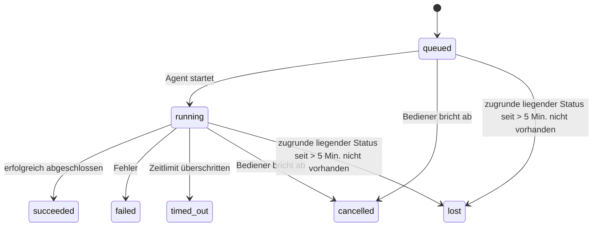

---
read_when:
    - Laufende oder kürzlich abgeschlossene Hintergrundarbeit prüfen
    - Fehlerbehebung bei Zustellungsfehlern für entkoppelte Agent-Ausführungen
    - Verstehen, wie Hintergrundläufe mit Sitzungen, Cron und Heartbeat zusammenhängen
sidebarTitle: Background tasks
summary: Nachverfolgung von Hintergrundaufgaben für ACP-Ausführungen, Subagenten, Cron-Ausführungen und CLI-Operationen
title: Hintergrundaufgaben
x-i18n:
    generated_at: "2026-07-26T17:38:21Z"
    model: gpt-5.6
    postprocess_version: locale-links-v1
    prompt_version: 32
    provider: openai
    source_hash: dbdc5ced133764fec0c8b9ae7b1957e24272dc9c1c86099de81f6923955d6b5a
    source_path: automation/tasks.md
    workflow: 16
---

<Note>
Suchen Sie nach einer Zeitplanung? Unter [Automatisierung](/de/automation) finden Sie Hinweise zur Auswahl des richtigen Mechanismus. Diese Seite ist das Aktivitätsprotokoll für Hintergrundarbeit, nicht der Scheduler.
</Note>

Hintergrundaufgaben erfassen Arbeit, die **außerhalb Ihrer Haupt-Konversationssitzung** ausgeführt wird: ACP-Ausführungen, das Starten von Subagenten, Cron-Job-Ausführungen und über die CLI gestartete Vorgänge.

Aufgaben ersetzen **weder** Sitzungen noch Cron-Jobs oder Heartbeats – sie sind das **Aktivitätsprotokoll**, das aufzeichnet, welche entkoppelte Arbeit wann ausgeführt wurde und ob sie erfolgreich war.

<Note>
Nicht jede Agentenausführung erstellt eine Aufgabe. Heartbeat-Durchläufe und normale interaktive Chats tun dies nicht. Alle Cron-Ausführungen, das Starten von ACP- und Subagent-Sitzungen, vom Gateway ausgeführte CLI-Agentenbefehle und vom Agenten gestartete `exec`-Hintergrundbefehle tun dies.
</Note>

## Kurzfassung

- Aufgaben sind **Datensätze**, keine Scheduler – Cron und Heartbeat bestimmen, _wann_ Arbeit ausgeführt wird; Aufgaben erfassen, _was geschehen ist_.
- ACP, Subagenten, alle Cron-Jobs und CLI-Vorgänge erstellen Aufgaben. Heartbeat-Durchläufe tun dies nicht.
- Jede Aufgabe durchläuft `queued → running → terminal` (erfolgreich, fehlgeschlagen, Zeitüberschreitung, abgebrochen oder verloren).
- Cron-Aufgaben bleiben aktiv, solange die Cron-Laufzeit noch für den Job zuständig ist. Wenn der Laufzeitstatus im Arbeitsspeicher nicht mehr vorhanden ist, prüft die Aufgabenwartung zunächst den dauerhaften Cron-Ausführungsverlauf, bevor sie eine Aufgabe als verloren markiert.
- Abschlüsse werden per Push gemeldet: Entkoppelte Arbeit kann nach Abschluss direkt benachrichtigen oder die anfordernde Sitzung beziehungsweise den Heartbeat aktivieren. Schleifen zur Statusabfrage sind daher normalerweise der falsche Ansatz.
- Isolierte Cron-Ausführungen und abgeschlossene Subagenten versuchen vor der abschließenden Bereinigung der Verwaltungsdaten, nach bestem Bemühen die verfolgten Browser-Tabs und Prozesse ihrer untergeordneten Sitzung zu bereinigen.
- Bei isolierter Cron-Zustellung werden veraltete vorläufige Antworten der übergeordneten Sitzung unterdrückt, solange nachgelagerte Subagent-Arbeit noch ausläuft. Trifft die endgültige Ausgabe eines Nachfolgers vor der Zustellung ein, wird diese bevorzugt.
- Abschlussbenachrichtigungen werden direkt an einen Kanal zugestellt oder für den nächsten Heartbeat in die Warteschlange gestellt.
- `openclaw tasks list` zeigt alle Aufgaben an; `openclaw tasks audit` hebt Probleme hervor.
- Abgeschlossene Datensätze werden 7 Tage lang aufbewahrt (`lost`-Datensätze 24 Stunden) und anschließend automatisch bereinigt.

## Schnellstart

<Tabs>
  <Tab title="Auflisten und filtern">
    ```bash
    # Alle Aufgaben auflisten (neueste zuerst)
    openclaw tasks list

    # Nach Laufzeit oder Status filtern
    openclaw tasks list --runtime acp
    openclaw tasks list --status running
    ```

  </Tab>
  <Tab title="Prüfen">
    ```bash
    # Details zu einer bestimmten Aufgabe anzeigen (nach Aufgaben-ID, Ausführungs-ID oder Sitzungsschlüssel)
    openclaw tasks show <lookup>
    ```
  </Tab>
  <Tab title="Abbrechen und benachrichtigen">
    ```bash
    # Eine laufende Aufgabe abbrechen (beendet die untergeordnete Sitzung)
    openclaw tasks cancel <lookup>

    # Benachrichtigungsrichtlinie für eine Aufgabe ändern
    openclaw tasks notify <lookup> state_changes
    ```

  </Tab>
  <Tab title="Prüfung und Wartung">
    ```bash
    # Zustandsprüfung ausführen
    openclaw tasks audit

    # Wartung in der Vorschau anzeigen oder anwenden
    openclaw tasks maintenance
    openclaw tasks maintenance --apply
    ```

  </Tab>
  <Tab title="TaskFlow">
    ```bash
    # TaskFlow-Status prüfen
    openclaw tasks flow list
    openclaw tasks flow show <lookup>
    openclaw tasks flow cancel <lookup>
    ```
  </Tab>
</Tabs>

## Was eine Aufgabe erstellt

| Quelle                 | Laufzeittyp | Zeitpunkt der Erstellung eines Aufgabendatensatzes                       | Standard-Benachrichtigungsrichtlinie |
| ---------------------- | ------------ | ------------------------------------------------------------------------ | ------------------------------------ |
| ACP-Hintergrundausführungen | `acp` | Beim Starten einer untergeordneten ACP-Sitzung                           | `done_only`                   |
| Subagent-Orchestrierung | `subagent`   | Beim Starten eines Subagenten über `sessions_spawn`                    | `done_only`                   |
| Cron-Jobs (alle Typen) | `cron`   | Bei jeder Cron-Ausführung (Hauptsitzung und isoliert)                    | `silent`                   |
| CLI-Vorgänge           | `cli`   | Bei `openclaw agent`-Befehlen, die über das Gateway ausgeführt werden | `silent`                   |
| Agenten-Medienjobs     | `cli`   | Sitzungsgebundene `image_generate`-/`music_generate`-/`video_generate`-Ausführungen | `silent` |

<AccordionGroup>
  <Accordion title="Benachrichtigungsvorgaben für Cron und Medien">
    Cron-Aufgaben (Hauptsitzung und isoliert) verwenden die Benachrichtigungsrichtlinie `silent` – sie erstellen Datensätze zur Nachverfolgung, erzeugen jedoch keine eigenen Aufgabenbenachrichtigungen; Cron verwaltet den Zustellungsweg.

    Sitzungsgebundene `image_generate`-, `music_generate`- und `video_generate`-Ausführungen verwenden ebenfalls die Benachrichtigungsrichtlinie `silent`. Sie erstellen weiterhin Aufgabendatensätze, der Abschluss wird jedoch als interne Aktivierung an die ursprüngliche Agentensitzung zurückgegeben, damit der Agent die Folgenachricht verfassen und die fertiggestellten Medien selbst anhängen kann. Der anfordernde Agent folgt seinem üblichen Vertrag für sichtbare Antworten: eine automatische abschließende Antwort, wenn dies konfiguriert ist, oder `message(action="send")` zusammen mit `NO_REPLY`, wenn die Sitzung Antworten über das Nachrichtenwerkzeug erfordert. Wenn die anfordernde Sitzung nicht mehr aktiv ist oder ihre aktive Reaktivierung fehlschlägt und der Abschlussagent einige oder alle erzeugten Medien übersieht, sendet OpenClaw einen idempotenten direkten Fallback ausschließlich mit den fehlenden Medien an das ursprüngliche Kanalziel.

  </Accordion>
  <Accordion title="Schutzmechanismus für gleichzeitige Medienerzeugung">
    Solange eine sitzungsgebundene Medienerzeugungsaufgabe noch aktiv ist, schützen `image_generate`, `music_generate` und `video_generate` vor versehentlichen Wiederholungen: Wird der Aufruf für dieselbe Eingabeaufforderung/Anforderung wiederholt, wird der Status der entsprechenden aktiven Aufgabe zurückgegeben, anstatt ein Duplikat zu starten. Eine andere Eingabeaufforderung kann hingegen eine eigene Aufgabe starten. Verwenden Sie `action: "status"`, wenn Sie auf Agentenseite ausdrücklich den Fortschritt oder Status abfragen möchten.
  </Accordion>
  <Accordion title="Was keine Aufgaben erstellt">
    - Heartbeat-Durchläufe – Hauptsitzung; siehe [Heartbeat](/de/gateway/heartbeat)
    - Normale interaktive Chat-Durchläufe
    - Direkte `/command`-Antworten

  </Accordion>
</AccordionGroup>

## Aufgabenlebenszyklus



| Status      | Bedeutung                                                                   |
| ----------- | --------------------------------------------------------------------------- |
| `queued`    | Erstellt; wartet auf den Start des Agenten                                  |
| `running`   | Agentendurchlauf wird aktiv ausgeführt                                      |
| `succeeded` | Erfolgreich abgeschlossen                                                   |
| `failed`    | Mit einem Fehler abgeschlossen                                              |
| `timed_out` | Konfiguriertes Zeitlimit überschritten                                      |
| `cancelled` | Vom Bediener über `openclaw tasks cancel` angehalten oder Ausführung abgebrochen |
| `lost`      | Die Laufzeit hat nach einer Karenzzeit von 5 Minuten den maßgeblichen zugrunde liegenden Status verloren |

Übergänge erfolgen automatisch – Lebenszyklusereignisse der Agentenausführung (Start, Ende, Fehler) aktualisieren den Aufgabenstatus; Sie verwalten ihn nicht manuell.

Der Abschluss einer Agentenausführung ist für aktive Aufgabendatensätze maßgeblich. Eine erfolgreiche entkoppelte Ausführung wird als `succeeded` abgeschlossen, gewöhnliche Ausführungsfehler als `failed`, Zeitüberschreitungen als `timed_out` und Abbruchergebnisse als `cancelled`. Sobald eine Aufgabe einen Endstatus erreicht hat, wird sie durch spätere Lebenszyklussignale nicht herabgestuft – eine vom Bediener abgebrochene oder bereits als `failed`/`timed_out`/`lost` markierte Aufgabe behält diesen Status, selbst wenn danach ein Erfolgssignal eintrifft.

`lost` berücksichtigt die Laufzeit:

- ACP-Aufgaben: Nur ein aktiver prozessinterner ACP-Durchlauf im Gateway belegt, dass die Ausführung noch aktiv ist; dauerhaft gespeicherte Sitzungsmetadaten allein reichen nicht aus. Die Offline-CLI-Prüfung bleibt konservativ und reklamiert ACP-Aufgaben niemals zurück.
- Subagent-Aufgaben: Die zugrunde liegende untergeordnete Sitzung ist aus dem Speicher des Zielagenten verschwunden oder enthält eine Tombstone-Markierung für die Wiederherstellung nach einem Neustart.
- Cron-Aufgaben: Die Cron-Laufzeit verfolgt den Job nicht mehr als aktiv, und der dauerhafte Cron-Ausführungsverlauf enthält kein Endergebnis für diese Ausführung. Die Offline-CLI-Prüfung betrachtet ihren eigenen leeren prozessinternen Cron-Laufzeitstatus nicht als maßgeblich.
- CLI-Aufgaben: Aufgaben mit Ausführungs-ID/Quell-ID verwenden den aktiven Ausführungskontext. Daher halten verbleibende Datensätze untergeordneter Sitzungen oder Chatsitzungen sie nicht aktiv, nachdem die vom Gateway verwaltete Ausführung verschwunden ist. Ältere CLI-Aufgaben ohne Ausführungsidentität greifen weiterhin auf die untergeordnete Sitzung zurück. Gateway-gestützte `openclaw agent`-Ausführungen werden ebenfalls anhand ihres Ausführungsergebnisses abgeschlossen, sodass abgeschlossene Ausführungen nicht aktiv bleiben, bis der Bereinigungsprozess sie als `lost` markiert.

## Zustellung und Benachrichtigungen

Wenn eine Aufgabe einen Endstatus erreicht, benachrichtigt OpenClaw Sie. Dafür gibt es zwei Zustellungswege:

**Direkte Zustellung** – Wenn die Aufgabe ein Kanalziel (`requesterOrigin`) hat, wird die Abschlussnachricht direkt an diesen Kanal gesendet (Discord, Slack, Telegram usw.). Abschlüsse von Gruppen- und Kanalaufgaben werden stattdessen über die anfordernde Sitzung geleitet, damit der übergeordnete Agent die sichtbare Antwort verfassen kann. Bei Abschlüssen von Subagenten bewahrt OpenClaw außerdem gebundene Thread-/Themen-Routen, sofern verfügbar, und kann fehlende `to`-/Kontoinformationen aus der gespeicherten Route der anfordernden Sitzung (`lastChannel` / `lastTo` / `lastAccountId`) ergänzen, bevor die direkte Zustellung aufgegeben wird.

**Zustellung über die Sitzungswarteschlange** – Wenn die direkte Zustellung fehlschlägt oder kein Ursprung festgelegt ist, wird die Aktualisierung als Systemereignis in die Warteschlange der anfordernden Sitzung gestellt und beim nächsten Heartbeat angezeigt.

<Tip>
Über die Sitzungswarteschlange zugestellte Aufgabenabschlüsse lösen eine sofortige Heartbeat-Aktivierung aus, sodass Sie das Ergebnis schnell sehen – Sie müssen nicht auf den nächsten geplanten Heartbeat-Durchlauf warten.
</Tip>

Der übliche Arbeitsablauf ist daher Push-basiert: Starten Sie entkoppelte Arbeit einmal und lassen Sie sich anschließend von der Laufzeit bei Abschluss aktivieren oder benachrichtigen. Fragen Sie den Aufgabenstatus nur ab, wenn Sie Fehler untersuchen, eingreifen oder eine ausdrückliche Prüfung durchführen müssen.

### Benachrichtigungsrichtlinien

Steuern Sie, wie viele Meldungen Sie zu jeder Aufgabe erhalten:

| Richtlinie            | Zugestellte Informationen                               |
| --------------------- | ------------------------------------------------------- |
| `done_only` (Standard) | Nur der Endstatus (erfolgreich, fehlgeschlagen usw.)    |
| `state_changes`       | Jeder Statusübergang und jede Fortschrittsaktualisierung |
| `silent`              | Überhaupt nichts (Standard für Cron-, CLI- und Medienaufgaben) |

Ändern Sie die Richtlinie, während eine Aufgabe ausgeführt wird:

```bash
openclaw tasks notify <lookup> state_changes
```

## CLI-Referenz

<AccordionGroup>
  <Accordion title="tasks list">
    ```bash
    openclaw tasks list [--runtime <acp|subagent|cron|cli>] [--status <status>] [--json]
    ```

    Ausgabespalten: Aufgabe, Art, Status, Zustellung, Ausführung, untergeordnete Sitzung, Zusammenfassung. Ein alleinstehendes `openclaw tasks` verhält sich wie `openclaw tasks list`.

  </Accordion>
  <Accordion title="tasks show">
    ```bash
    openclaw tasks show <lookup> [--json]
    ```

    Das Such-Token akzeptiert eine Aufgaben-ID, Ausführungs-ID oder einen Sitzungsschlüssel. Es zeigt den vollständigen Datensatz einschließlich Zeitangaben, Zustellungsstatus, Fehler und abschließender Zusammenfassung.

  </Accordion>
  <Accordion title="tasks cancel">
    ```bash
    openclaw tasks cancel <lookup>
    ```

    Für ACP- und Subagent-Aufgaben beendet dies die untergeordnete Sitzung; ACP- und Cron-Abbrüche werden über das laufende Gateway geleitet (`tasks.cancel`). Bei von der CLI verfolgten Aufgaben wird der Abbruch in der Aufgabenregistrierung erfasst (es gibt kein separates Handle für die untergeordnete Laufzeit). Der Status wechselt zu `cancelled`, und gegebenenfalls wird eine Zustellungsbenachrichtigung gesendet.

  </Accordion>
  <Accordion title="Aufgaben benachrichtigen">
    ```bash
    openclaw tasks notify <lookup> <done_only|state_changes|silent>
    ```
  </Accordion>
  <Accordion title="Aufgaben prüfen">
    ```bash
    openclaw tasks audit [--severity <warn|error>] [--code <name>] [--limit <n>] [--json]
    ```

    Zeigt betriebliche Probleme für Aufgaben **und** TaskFlows in einem Bericht an. Wenn Probleme erkannt werden, erscheinen die Befunde auch in `openclaw status`.

    Aufgabenbefunde:

    | Befund                    | Schweregrad | Auslöser                                                                                                             |
    | ------------------------- | ----------- | -------------------------------------------------------------------------------------------------------------------- |
    | `stale_queued`        | Warnung     | Seit mehr als 10 Minuten in der Warteschlange                                                                        |
    | `stale_running`        | Fehler      | Seit mehr als 30 Minuten in Ausführung                                                                                |
    | `lost`        | Warnung/Fehler | Die Eigentümerschaft der laufzeitgestützten Aufgabe ist verschwunden; beibehaltene verlorene Aufgaben werden bis `cleanupAfter` als Warnungen geführt und danach zu Fehlern |
    | `delivery_failed`        | Warnung     | Zustellung fehlgeschlagen und die Benachrichtigungsrichtlinie ist nicht `silent`                           |
    | `missing_cleanup`        | Warnung     | Beendete Aufgabe ohne Bereinigungszeitstempel                                                                         |
    | `inconsistent_timestamps`        | Warnung     | Verletzung der Zeitabfolge (beispielsweise Ende vor Beginn)                                                           |

    TaskFlow-Befunde:

    | Befund                    | Schweregrad | Auslöser                                                                                       |
    | ------------------------- | ----------- | ---------------------------------------------------------------------------------------------- |
    | `restore_failed`        | Fehler      | Wiederherstellung der Ablaufregistrierung aus SQLite fehlgeschlagen                             |
    | `stale_running`        | Fehler      | Laufender Ablauf wurde seit mehr als 30 Minuten nicht fortgesetzt                               |
    | `stale_waiting`        | Warnung     | Wartender Ablauf wurde seit mehr als 30 Minuten nicht fortgesetzt                               |
    | `stale_blocked`        | Warnung     | Blockierter Ablauf wurde seit mehr als 30 Minuten nicht fortgesetzt                             |
    | `cancel_stuck`        | Warnung     | Abbruch vor mehr als 5 Minuten angefordert, keine aktiven untergeordneten Aufgaben, weiterhin nicht beendet |
    | `missing_linked_tasks`        | Warnung/Fehler | Veralteter verwalteter Ablauf ohne verknüpfte Aufgaben oder Wartezustand                        |
    | `blocked_task_missing`        | Warnung     | Blockierter Ablauf verweist auf eine nicht mehr vorhandene Aufgaben-ID                          |

  </Accordion>
  <Accordion title="Aufgabenwartung">
    ```bash
    openclaw tasks maintenance [--json]
    openclaw tasks maintenance --apply [--json]
    ```

    Verwenden Sie dies, um Abgleich, Setzen von Bereinigungszeitstempeln und Bereinigung für Aufgaben, den TaskFlow-Zustand und veraltete Registrierungszeilen von Cron-Ausführungssitzungen vorab anzuzeigen oder anzuwenden.

    Der Abgleich berücksichtigt die Laufzeit:

    - ACP-Aufgaben erfordern einen aktiven prozessinternen Durchlauf im Gateway; Subagent-Aufgaben prüfen ihre zugrunde liegende untergeordnete Sitzung.
    - Subagent-Aufgaben, deren untergeordnete Sitzung einen Wiederherstellungs-Tombstone für Neustarts aufweist, werden als verloren markiert, statt als wiederherstellbare zugrunde liegende Sitzungen behandelt zu werden.
    - Cron-Aufgaben prüfen, ob die Cron-Laufzeit noch Eigentümerin des Auftrags ist, und stellen anschließend den Endstatus aus persistenten Cron-Ausführungsprotokollen beziehungsweise dem Auftragszustand wieder her, bevor sie auf `lost` zurückfallen. Nur der Gateway-Prozess ist für die speicherinterne Menge aktiver Cron-Aufträge maßgeblich; die Offline-CLI-Prüfung verwendet den dauerhaften Verlauf, markiert eine Cron-Aufgabe aber nicht allein deshalb als verloren, weil diese lokale Menge leer ist.
    - CLI-Aufgaben mit Ausführungsidentität prüfen den zuständigen aktiven Ausführungskontext, nicht nur Zeilen untergeordneter Sitzungen oder Chatsitzungen.

    Auch die Abschlussbereinigung berücksichtigt die Laufzeit:

    - Beim Abschluss eines Subagent wird nach bestem Bemühen versucht, verfolgte Browser-Tabs und -Prozesse für die untergeordnete Sitzung zu schließen, bevor die Ankündigungsbereinigung fortgesetzt wird.
    - Beim Abschluss eines isolierten Cron-Laufs wird nach bestem Bemühen versucht, verfolgte Browser-Tabs und -Prozesse für die Cron-Sitzung zu schließen, bevor die Ausführung vollständig beendet wird.
    - Die Zustellung eines isolierten Cron-Laufs wartet bei Bedarf auf nachfolgende Aktionen untergeordneter Subagents und unterdrückt veralteten Bestätigungstext des übergeordneten Prozesses, statt ihn anzukündigen.
    - Die Abschlusszustellung eines Subagent verwendet ausschließlich den neuesten sichtbaren Assistententext des untergeordneten Prozesses. Ausgaben von tool/toolResult werden nicht zum Ergebnistext des untergeordneten Prozesses hochgestuft. Fehlgeschlagene beendete Ausführungen melden den Fehlerstatus, ohne erfassten Antworttext erneut wiederzugeben.
    - Bereinigungsfehler verdecken nicht das tatsächliche Aufgabenergebnis.

    Beim Anwenden der Wartung entfernt OpenClaw außerdem veraltete `cron:<jobId>:run:<runId>`-Sitzungsregistrierungszeilen, die älter als 7 Tage sind, wobei Zeilen für derzeit laufende Cron-Aufträge erhalten bleiben und Zeilen von Nicht-Cron-Sitzungen unverändert bleiben.

  </Accordion>
  <Accordion title="Aufgabenablauf auflisten | anzeigen | abbrechen">
    ```bash
    openclaw tasks flow list [--status <status>] [--json]
    openclaw tasks flow show <lookup> [--json]
    openclaw tasks flow cancel <lookup>
    ```

    Das Such-Token für den Ablauf akzeptiert eine Ablauf-ID oder einen Eigentümerschlüssel. Verwenden Sie diese Befehle, wenn Sie sich für den orchestrierenden [Task Flow](/de/automation/taskflow) und nicht für einen einzelnen Datensatz einer Hintergrundaufgabe interessieren.

  </Accordion>
</AccordionGroup>

## Chat-Aufgabenübersicht (`/tasks`)

Verwenden Sie `/tasks` in einer beliebigen Chatsitzung, um die mit dieser Sitzung verknüpften Hintergrundaufgaben anzuzeigen. Die Übersicht zeigt bis zu fünf aktive und kürzlich abgeschlossene Aufgaben mit Laufzeit, Status, Zeitangaben sowie Fortschritts- oder Fehlerdetails.

Wenn die aktuelle Sitzung keine sichtbaren verknüpften Aufgaben enthält, greift `/tasks` auf agentenlokale Aufgabenzahlen zurück, damit Sie weiterhin einen Überblick erhalten, ohne Details anderer Sitzungen offenzulegen.

Verwenden Sie für das vollständige Betriebsprotokoll die CLI: `openclaw tasks list`.

### Control UI

Die Web-Control-UI enthält in der Seitenleiste eine Seite **Aufgaben** mit aktiven und kürzlich abgeschlossenen Hintergrundaufgaben in Echtzeit. Verwenden Sie sie, um den Fortschritt zu prüfen, verknüpfte Sitzungen zu öffnen, das Protokoll zu aktualisieren oder Aufgaben in der Warteschlange und laufende Aufgaben abzubrechen.

Chat-Bereiche verfügen außerdem über eine einklappbare Leiste **Hintergrundaufgaben**, deren Umfang auf den Agenten des Bereichs beschränkt ist: laufende Aufgaben und Subagents mit einer Stoppsteuerung, ein Abschnitt für abgeschlossene Aufgaben sowie Links zum Anzeigen des Transkripts der jeweiligen untergeordneten Sitzung. Öffnen Sie sie über den Aktivitätsschalter in der Kopfzeile des Bereichs (oder über die schwebende Aktivitätsschaltfläche im Einzelbereichs-Chat).

Wählen Sie eine Aufgabe in der Leiste aus, um ihre begrenzte Eingabeaufforderung und die neueste Ausgabe oder Fehlerzusammenfassung zu prüfen. Laufende Arbeiten bleiben von abgeschlossenen Arbeiten getrennt, und abgeschlossene Zeilen zeigen, ob die Aufgabe erfolgreich abgeschlossen wurde oder fehlgeschlagen ist. Öffnen Sie unter iOS **Chat actions → Background Tasks**; öffnen Sie unter Android das Überlaufmenü des Chats und wählen Sie **Background tasks**. Beide mobilen Ansichten verwenden dieselbe Gruppierung in Running und Finished und öffnen bei der Auswahl die Aufgabendetails.

## Statusintegration (Aufgabenauslastung)

`openclaw status` enthält eine Aufgabenzeile für den schnellen Überblick:

```
Aufgaben    2 aktiv · 1 in Warteschlange · 1 in Ausführung · 1 Problem · Prüfung sauber · 6 verfolgt
```

Die Zusammenfassung zählt aktive Arbeit (`queued` + `running`), Fehlschläge (`failed` + `timed_out` + `lost`), Prüfungsbefunde und die Gesamtzahl der verfolgten Datensätze; die JSON-Nutzlast schlüsselt die Zahlen außerdem nach Laufzeit auf (`acp`, `subagent`, `cron`, `cli`).

Sowohl `/status` als auch das Tool `session_status` verwenden eine bereinigungsbewusste Aufgabenmomentaufnahme: Aktive Aufgaben werden bevorzugt, abgelaufene Zeilen ausgeblendet und beendete Aufgaben nur für ein kurzes aktuelles Zeitfenster (5 Minuten) angezeigt, wobei Fehlschläge hervorgehoben werden, wenn keine aktive Arbeit mehr vorhanden ist. Dadurch konzentriert sich die Statuskarte auf das, was gerade wichtig ist.

## Speicherung und Wartung

### Speicherort der Aufgaben

Aufgabendatensätze und Zustellungszustand bleiben in der gemeinsam genutzten OpenClaw-SQLite-Zustandsdatenbank erhalten:

```
~/.openclaw/state/openclaw.sqlite   (Tabellen: task_runs, task_delivery_state, flow_runs)
```

Legen Sie `OPENCLAW_STATE_DIR` fest, um das gesamte Zustandsstammverzeichnis (Standard: `~/.openclaw`) an einen anderen Ort zu verschieben; der Pfad der gemeinsamen Datenbank wird ebenfalls verschoben.

Die Registrierung wird bei der ersten Verwendung in den Arbeitsspeicher geladen und jede Änderung wird zurück in SQLite geschrieben, sodass Datensätze Gateway-Neustarts überstehen. Das WAL-Wachstum bleibt durch den standardmäßigen Autocheckpoint-Schwellenwert von SQLite sowie regelmäßige `PASSIVE`-Checkpoints begrenzt; Checkpoints beim Herunterfahren und bei expliziter Wartung verwenden `TRUNCATE`, damit bei normalen Schließvorgängen WAL-Speicher freigegeben wird, ohne dass die Hintergrundbereinigung auf aktive Leser warten muss.

Veraltete Sidecar-Speicher aus älteren Installationen (`tasks/runs.sqlite`, `flows/registry.sqlite`) werden durch `openclaw doctor` in die gemeinsame Datenbank importiert.

### Automatische Wartung

Eine Bereinigung wird alle **60 Sekunden** ausgeführt (der erste Durchlauf etwa 5 Sekunden nach dem Start des Gateway) und erledigt vier Aufgaben:

<Steps>
  <Step title="Abgleich">
    Prüft, ob aktive Aufgaben weiterhin über eine maßgebliche Laufzeitgrundlage verfügen. ACP-Aufgaben erfordern einen aktiven prozessinternen Durchlauf, Subagent-Aufgaben verwenden den Zustand der untergeordneten Sitzung, Cron-Aufgaben verwenden die Eigentümerschaft des aktiven Auftrags sowie den dauerhaften Ausführungsverlauf und CLI-Aufgaben mit Ausführungsidentität verwenden den zuständigen Ausführungskontext. Wenn die zugrunde liegende Zustandsinformation länger als 5 Minuten fehlt (30 Minuten bei nativen Subagent-Aufgaben ohne untergeordnete Sitzung), wird die Aufgabe als `lost` markiert.
  </Step>
  <Step title="Reparatur von ACP-Sitzungen">
    Schließt beendete oder verwaiste, dem übergeordneten Prozess gehörende einmalige ACP-Sitzungen und schließt veraltete beendete oder verwaiste persistente ACP-Sitzungen nur, wenn keine aktive Gesprächsbindung mehr besteht.
  </Step>
  <Step title="Setzen von Bereinigungszeitstempeln">
    Setzt einen `cleanupAfter`-Zeitstempel für beendete Aufgaben (Beendigungszeitpunkt + Aufbewahrungszeitraum). Während der Aufbewahrung erscheinen verlorene Aufgaben in der Prüfung weiterhin als Warnungen; nachdem `cleanupAfter` abgelaufen ist oder wenn Bereinigungsmetadaten fehlen, werden sie zu Fehlern.
  </Step>
  <Step title="Bereinigung">
    Löscht Datensätze nach ihrem `cleanupAfter`-Datum.
  </Step>
</Steps>

<Note>
**Aufbewahrung:** Datensätze beendeter Aufgaben werden **7 Tage** lang aufbewahrt (`lost`-Datensätze **24 Stunden**) und anschließend automatisch bereinigt. Keine Konfiguration erforderlich.
</Note>

## Beziehung von Aufgaben zu anderen Systemen

<AccordionGroup>
  <Accordion title="Aufgaben und Task Flow">
    [Task Flow](/de/automation/taskflow) ist die Ablauf-Orchestrierungsebene oberhalb der Hintergrundaufgaben. Ein einzelner Ablauf kann während seiner Lebensdauer mehrere Aufgaben mithilfe verwalteter oder gespiegelter Synchronisierungsmodi koordinieren. Verwenden Sie `openclaw tasks`, um einzelne Aufgabendatensätze zu prüfen, und `openclaw tasks flow`, um den orchestrierenden Ablauf zu prüfen.

  </Accordion>
  <Accordion title="Aufgaben und Cron">
    Cron-Auftragsdefinitionen, Laufzeitausführungszustand und Ausführungsverlauf befinden sich in der gemeinsam genutzten SQLite-Zustandsdatenbank von OpenClaw. **Jede** Cron-Ausführung erstellt einen Aufgabendatensatz – sowohl in der Hauptsitzung als auch isoliert – mit der Benachrichtigungsrichtlinie `silent`, sodass Cron-Ausführungen verfolgt werden, ohne eigene Aufgabenbenachrichtigungen zu erzeugen.

    Siehe [Cron-Aufträge](/de/automation/cron-jobs).

  </Accordion>
  <Accordion title="Aufgaben und Heartbeat">
    Heartbeat-Ausführungen sind Durchläufe der Hauptsitzung – sie erstellen keine Aufgabendatensätze. Wenn eine Aufgabe abgeschlossen wird, kann sie ein Heartbeat-Aufwecken auslösen, sodass Sie das Ergebnis zeitnah sehen.

    Siehe [Heartbeat](/de/gateway/heartbeat).

  </Accordion>
  <Accordion title="Aufgaben und Sitzungen">
    Eine Aufgabe kann auf eine `childSessionKey` (wo die Arbeit ausgeführt wird) und einen `requesterSessionKey` (wer sie gestartet hat) verweisen. Ihre `agentId` identifiziert den Agenten, der die Arbeit ausführt, während die Felder für Anforderer und Eigentümer den Start- und Steuerungskontext bewahren. Sitzungen bilden den Gesprächskontext; Aufgaben dienen darüber hinaus zur Nachverfolgung von Aktivitäten.
  </Accordion>
  <Accordion title="Aufgaben und Agentenläufe">
    Die `runId` einer Aufgabe verweist auf den Agentenlauf, der die Arbeit ausführt. Ereignisse im Agentenlebenszyklus (Start, Ende, Fehler) aktualisieren den Aufgabenstatus automatisch – Sie müssen den Lebenszyklus nicht manuell verwalten.
  </Accordion>
</AccordionGroup>

## Verwandte Themen

- [Automatisierung](/de/automation) – alle Automatisierungsmechanismen auf einen Blick
- [CLI: Aufgaben](/de/cli/tasks) – Referenz der CLI-Befehle
- [Heartbeat](/de/gateway/heartbeat) – regelmäßige Durchläufe der Hauptsitzung
- [Geplante Aufgaben](/de/automation/cron-jobs) – Planung von Hintergrundarbeiten
- [TaskFlow](/de/automation/taskflow) – Ablauf-Orchestrierung über Aufgaben hinweg
