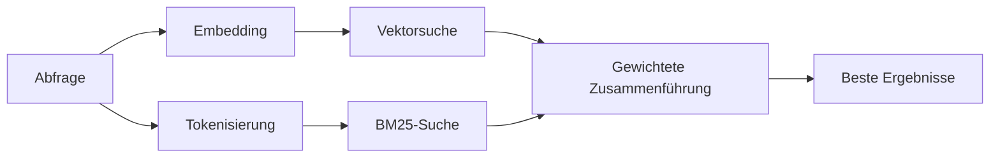

---
read_when:
    - Sie möchten verstehen, wie memory_search funktioniert
    - Sie möchten einen Embedding-Provider auswählen
    - Sie möchten die Suchqualität optimieren
summary: Wie die Speichersuche mithilfe von Embeddings und hybrider Suche relevante Notizen findet
title: Speichersuche
x-i18n:
    generated_at: "2026-07-26T18:24:34Z"
    model: gpt-5.6
    postprocess_version: locale-links-v1
    prompt_version: 32
    provider: openai
    source_hash: b2bd28b63ac55a2a890ed70a3015f76f1c7fbaa792b17a6ead51f4c8712fbd2d
    source_path: concepts/memory-search.md
    workflow: 16
---

`memory_search` findet relevante Notizen in Ihren Speicherdateien, selbst wenn die
Formulierung vom Originaltext abweicht. Dabei wird der Speicher in kleine Abschnitte unterteilt und
mit Embeddings, Schlüsselwörtern oder beidem durchsucht.

## Schnellstart

OpenClaw verwendet standardmäßig OpenAI-Embeddings. Um einen anderen Provider zu verwenden, legen Sie ihn
explizit fest:

```json5
{
  memory: {
    search: {
      provider: "openai", // oder "gemini", "voyage", "mistral", "bedrock", "local", "ollama", "lmstudio", "github-copilot", "openai-compatible"
    },
  },
}
```

`provider` kann auch auf einen benutzerdefinierten `models.providers.<id>`-Eintrag verweisen (zum
Beispiel `ollama-5080`), sofern dieser Eintrag `api` auf `"ollama"` oder
eine andere Provider-ID mit einem Speicher-Embedding-Adapter setzt.

Installieren Sie für lokale Embeddings ohne API-Schlüssel das offizielle llama.cpp-Provider-
Plugin und setzen Sie `provider: "local"`:

```bash
openclaw plugins install @openclaw/llama-cpp-provider
```

Quellcode-Checkouts benötigen weiterhin die Genehmigung nativer Builds: `pnpm approve-builds`, danach
`pnpm rebuild node-llama-cpp`.

Einige OpenAI-kompatible Embedding-Endpunkte erfordern asymmetrische `input_type`-
Bezeichnungen, etwa `"query"` für Suchvorgänge und `"document"`/`"passage"` für indexierte
Abschnitte. Legen Sie diese mit `queryInputType` und `documentInputType` fest; siehe
[Referenz zur Speicherkonfiguration](/de/reference/memory-config#provider-specific-config).

## Unterstützte Provider

| Provider          | ID                  | API-Schlüssel erforderlich | Hinweise                             |
| ----------------- | ------------------- | -------------------------- | ------------------------------------ |
| Bedrock           | `bedrock`           | Nein                       | Verwendet die AWS-Anmeldedatenkette  |
| DeepInfra         | `deepinfra`         | Ja                         | Standardmodell `BAAI/bge-m3`          |
| Gemini            | `gemini`            | Ja                         | Unterstützt Bild-/Audioindexierung   |
| GitHub Copilot    | `github-copilot`    | Nein                       | Verwendet Ihr Copilot-Abonnement     |
| Lokal             | `local`             | Nein                       | GGUF-Modell, automatischer Download von ~0.6 GB |
| LM Studio         | `lmstudio`          | Nein                       | Lokaler/selbst gehosteter Server     |
| Mistral           | `mistral`           | Ja                         |                                      |
| Ollama            | `ollama`            | Nein                       | Lokaler/selbst gehosteter Server     |
| OpenAI            | `openai`            | Ja                         | Standard                             |
| OpenAI-kompatibel | `openai-compatible` | Üblicherweise              | Generischer `/v1/embeddings`-Endpunkt |
| Voyage            | `voyage`            | Ja                         |                                      |

## Funktionsweise der Suche

OpenClaw führt zwei Abrufpfade parallel aus und führt die Ergebnisse zusammen:



- **Vektorsuche** findet ähnliche Bedeutungen („Gateway-Host“ entspricht „der
  Maschine, auf der OpenClaw ausgeführt wird“).
- **BM25-Schlüsselwortsuche** findet exakte Begriffe (IDs, Fehlermeldungen, Konfigurations-
  schlüssel).
- **Dateinamensuche** indexiert Pfade getrennt von den Inhalten der Notizen. Exakte vollständige
  Pfade, Basisdateinamen und Dateinamenstämme werden höher eingestuft als teilweise Pfadübereinstimmungen,
  während Ausschnitte und Schlüsselwortbewertungen des Inhalts weiterhin aus dem Notizinhalt stammen.

Wenn nur ein Pfad verfügbar ist, wird dieser allein ausgeführt.

**Nur-FTS-Modus.** Setzen Sie `provider: "none"`, um Embeddings gezielt zu deaktivieren
und ausschließlich mit Schlüsselwörtern zu suchen. Wenn `provider` nicht gesetzt oder auf `"auto"`
gesetzt ist, wird ebenfalls ohne Fehler auf eine reine Schlüsselwortbewertung zurückgegriffen, falls keine Embedding-Authentifizierung konfiguriert ist;
dasselbe gilt für `provider: "local"` (den GGUF/llama.cpp-
Provider), wenn dieser fehlschlägt.

**Expliziter Provider nicht verfügbar.** Wenn Sie einen anderen Provider explizit angeben
(zum Beispiel `openai`, `ollama`, `gemini`) und dieser zum
Zeitpunkt der Anfrage nicht verfügbar ist (ungültige Authentifizierung, Netzwerkfehler), meldet `memory_search` den Speicher als
nicht verfügbar, statt unbemerkt auf reine FTS-Ergebnisse zurückzufallen. Dadurch bleibt ein
fehlerhaft konfigurierter Provider sichtbar. Setzen Sie `provider: "none"` für einen bewusst
ausschließlich FTS-basierten Abruf oder korrigieren Sie die Provider-/Authentifizierungskonfiguration, um die semantische
Bewertung wiederherzustellen.

## Verbesserung der Suchqualität

Zwei optionale Funktionen helfen bei einem umfangreichen Notizverlauf.

### Zeitlicher Verfall

Alte Notizen verlieren schrittweise an Bewertungsgewicht, sodass aktuelle Informationen zuerst erscheinen.
Bei der standardmäßigen Halbwertszeit von 30 Tagen erreicht eine Notiz vom letzten Monat 50 % ihres
ursprünglichen Gewichts. `MEMORY.md` und andere undatierte Dateien unter `memory/` sind
dauerhaft relevant und unterliegen keinem Verfall; nur datierte `memory/YYYY-MM-DD.md`-Dateien verfallen.

<Tip>
Aktivieren Sie diese Funktion, wenn Ihr Agent über tägliche Notizen aus mehreren Monaten verfügt und veraltete Informationen
regelmäßig höher als der aktuelle Kontext eingestuft werden.
</Tip>

### MMR (Diversität)

Reduziert redundante Ergebnisse. Wenn fünf Notizen dieselbe Router-Konfiguration erwähnen,
stellt MMR sicher, dass die besten Ergebnisse unterschiedliche Themen abdecken, statt sich zu wiederholen.

<Tip>
Aktivieren Sie diese Funktion, wenn `memory_search` regelmäßig nahezu identische Ausschnitte aus
verschiedenen täglichen Notizen zurückgibt.
</Tip>

### Beide aktivieren

```json5
{
  memory: {
    search: {
      query: {
        hybrid: {
          mmr: { enabled: true },
          temporalDecay: { enabled: true },
        },
      },
    },
  },
}
```

## Multimodaler Speicher

Mit `gemini-embedding-2-preview` können Sie Bilder und Audio zusammen mit
Markdown indexieren. Dies gilt nur für Dateien unter `memory.search.extraPaths`; die standardmäßigen
Speicherstammverzeichnisse (`MEMORY.md`, `memory/*.md`) bleiben auf Markdown beschränkt. Suchanfragen
bleiben textbasiert, werden aber mit visuellen und akustischen Inhalten abgeglichen. Informationen zur Einrichtung finden Sie in der
[Referenz zur Speicherkonfiguration](/de/reference/memory-config#multimodal-memory-gemini).

## Sitzungsspeichersuche

Verwenden Sie für den exakten Volltextabruf aus Sitzungstranskripten [`sessions_search`](/de/concepts/session-search)
und öffnen Sie anschließend ein Ergebnis mit `sessions_history`. Die Sitzungsspeichersuche bleibt die semantische,
experimentelle Ergänzung.

Optional können Sie Sitzungstranskripte indexieren, damit `memory_search` frühere
Unterhaltungen abrufen kann. Dies ist optional: Setzen Sie `experimental.sessionMemory: true` und fügen Sie
`"sessions"` zu `sources` hinzu (der Standardwert `sources` ist `["memory"]`).

Sitzungstreffer berücksichtigen `tools.sessions.visibility`: Der Standardwert `"tree"` stellt die
aktuelle Sitzung, von ihr erzeugte Sitzungen und Sitzungen desselben Agents in Gruppen bereit, die
über die Umgebungsgruppenwahrnehmung beobachtet werden. Mit `session.dmScope: "main"` teilt eine Mehrbenutzer-
DM-Einrichtung diese Hauptsitzung, sodass dorthin weitergeleitete Benutzer Inhalte
aus den von ihr beobachteten Gruppen abrufen können. Verwenden Sie für die DM-Isolierung ein peer-spezifisches `dmScope` oder setzen Sie
die Sichtbarkeit auf `"self"`, um Umgebungslesevorgänge aus beobachteten Sitzungen zu deaktivieren. Andere
nicht zugehörige Sitzungen desselben Agents erfordern weiterhin die Sichtbarkeit `"agent"`.

Bei Verwendung des QMD-Backends müssen Sie außerdem `memory.qmd.sessions.enabled: true` setzen, damit
Transkripte in die QMD-Sammlung exportiert werden; `experimental.sessionMemory`
und `sources` allein exportieren keine Transkripte nach QMD. Siehe
[Konfigurationsreferenz](/de/reference/memory-config#session-memory-search-experimental).

## Fehlerbehebung

**Keine Ergebnisse?** Führen Sie `openclaw memory status` aus, um den Index zu überprüfen. Wenn er leer ist, führen Sie
`openclaw memory index --force` aus.

**Nur Schlüsselworttreffer?** Ihr Embedding-Provider ist möglicherweise nicht konfiguriert. Überprüfen Sie
`openclaw memory status --deep`.

**Zeitüberschreitung bei lokalen Embeddings?** `ollama`, `lmstudio` und `local` verwenden längere
Provider-eigene Batch-Zeitlimits. Überprüfen Sie den Zustand des Providers und führen Sie
`openclaw memory index --force` erneut aus.

**CJK-Text wird nicht gefunden?** Erstellen Sie den FTS-Index neu mit
`openclaw memory index --force`.

## Verwandte Themen

- [Speicherübersicht](/de/concepts/memory)
- [Active Memory](/de/concepts/active-memory)
- [Integrierte Speicher-Engine](/de/concepts/memory-builtin)
- [Referenz zur Speicherkonfiguration](/de/reference/memory-config)
