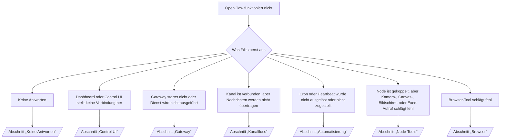

---
read_when:
    - OpenClaw funktioniert nicht und Sie benötigen den schnellsten Weg zu einer Lösung
    - Sie möchten einen Triage-Ablauf, bevor Sie sich mit ausführlichen Runbooks befassen.
summary: Symptombasierte zentrale Anlaufstelle zur Fehlerbehebung für OpenClaw
title: Allgemeine Fehlerbehebung
x-i18n:
    generated_at: "2026-07-26T18:31:41Z"
    model: gpt-5.6
    postprocess_version: locale-links-v1
    prompt_version: 32
    provider: openai
    source_hash: de3554ed680ac536d105017220b44d94456a4408916e949352500b046f4d5f17
    source_path: help/troubleshooting.md
    workflow: 16
---

Triage-Einstieg. In 2 Minuten zur Diagnose, dann zur ausführlichen Seite wechseln.

## Die ersten 60 Sekunden

Führen Sie diese Befehlsfolge der Reihe nach aus:

```bash
openclaw status
openclaw status --all
openclaw gateway probe
openclaw gateway status
openclaw doctor
openclaw channels status --probe
openclaw logs --follow
```

Erwartete Ausgabe, jeweils eine Zeile:

- `openclaw status` zeigt konfigurierte Kanäle und keine Authentifizierungsfehler.
- `openclaw status --all` erstellt einen vollständigen, teilbaren Bericht.
- `openclaw gateway probe` zeigt `Reachable: yes`. `Capability: ...` ist die
  vom Probe nachgewiesene Authentifizierungsstufe; `Read probe: limited - missing scope:
operator.read` bezeichnet eingeschränkte Diagnosen, keinen Verbindungsfehler.
- `openclaw gateway status` zeigt `Runtime: running`, `Connectivity probe:
ok` und einen plausiblen Wert für `Capability: ...`. Fügen Sie `--require-rpc` hinzu, um außerdem
  einen RPC-Nachweis für den Lesebereich zu verlangen.
- `openclaw doctor` meldet keine blockierenden Konfigurations- oder Dienstfehler.
- `openclaw channels status --probe` gibt den aktuellen Transportstatus pro Konto
  (`works` / `audit ok`) zurück, wenn der Gateway erreichbar ist; andernfalls wird auf
  reine Konfigurationszusammenfassungen zurückgegriffen.
- `openclaw logs --follow` zeigt kontinuierliche Aktivität und keine wiederkehrenden schwerwiegenden Fehler.

## Der Assistent wirkt eingeschränkt oder Tools fehlen

Prüfen Sie das wirksame Tool-Profil:

```bash
openclaw status
openclaw status --all
openclaw doctor
```

Häufige Ursachen:

- `tools.profile: "minimal"` erlaubt nur `session_status`.
- `tools.profile: "messaging"` ist eng gefasst und für reine Chat-Agenten vorgesehen.
- `tools.profile: "coding"` ist die Standardeinstellung für neue lokale Konfigurationen (Repository-, Datei-,
  Shell- und Laufzeitaufgaben).
- `tools.profile: "full"` hebt Profilbeschränkungen auf; beschränken Sie dies auf vertrauenswürdige,
  von Betreibern kontrollierte Agenten.
- Agentenspezifische `agents.entries.*.tools` schränken das Stammprofil
  für einen Agenten ein oder erweitern es.

Ändern Sie das Profil, starten oder laden Sie den Gateway neu und prüfen Sie es anschließend erneut mit
`openclaw status --all`. Vollständige Profil-/Gruppentabelle: [Tool-Profile](/de/gateway/config-tools#tool-profiles).

## Anthropic: 429 bei langem Kontext

`HTTP 429: rate_limit_error: Extra usage is required for long context requests`
→ [Anthropic 429: Für langen Kontext ist zusätzliche Nutzung erforderlich](/de/gateway/troubleshooting#anthropic-429-extra-usage-required-for-long-context).

## Lokales OpenAI-kompatibles Backend funktioniert direkt, schlägt aber in OpenClaw fehl

Ihr lokales/selbst gehostetes `/v1`-Backend beantwortet direkte `/v1/chat/completions`-
Probes, schlägt jedoch bei `openclaw infer model run` oder normalen Agentendurchläufen fehl:

1. Der Fehler erwähnt, dass `messages[].content` eine Zeichenfolge erwartet: Legen Sie
   `models.providers.<provider>.models[].compat.requiresStringContent: true` fest.
2. Der Fehler tritt weiterhin nur bei OpenClaw-Agentendurchläufen auf: Legen Sie
   `models.providers.<provider>.models[].compat.supportsTools: false` fest und versuchen Sie es erneut.
3. Kleine direkte Aufrufe funktionieren, aber größere OpenClaw-Prompts bringen das Backend zum Absturz: Dies
   ist eine Beschränkung des vorgelagerten Modells/Servers und kein OpenClaw-Fehler. Fahren Sie unter
   [Lokales OpenAI-kompatibles Backend besteht direkte Probes, aber Agentendurchläufe schlagen fehl](/de/gateway/troubleshooting#local-openai-compatible-backend-passes-direct-probes-but-agent-runs-fail) fort.

## Plugin-Installation schlägt wegen fehlender OpenClaw-Erweiterungen fehl

`package.json missing openclaw.extensions` bedeutet, dass das Plugin-Paket eine
Struktur verwendet, die OpenClaw nicht mehr akzeptiert.

Korrektur im Plugin-Paket:

1. Fügen Sie `openclaw.extensions` zu `package.json` hinzu und verweisen Sie damit auf erstellte Laufzeitdateien
   (normalerweise `./dist/index.js`).
2. Veröffentlichen Sie das Paket erneut und führen Sie anschließend `openclaw plugins install <package>` erneut aus.

```json
{
  "name": "@openclaw/my-plugin",
  "version": "1.2.3",
  "openclaw": {
    "extensions": ["./dist/index.js"]
  }
}
```

Referenz: [Plugin-Architektur](/de/plugins/architecture)

## Installationsrichtlinie blockiert Plugin-Installationen oder -Aktualisierungen

Die Aktualisierung wird abgeschlossen, aber Plugins sind veraltet, deaktiviert oder zeigen `blocked by install
policy`, `install policy failed closed` oder `Disabled "<plugin>" after plugin
update failure` an: Prüfen Sie `security.installPolicy`.

Die Installationsrichtlinie wird bei Plugin-Installationen und -Aktualisierungen angewendet. `@openclaw/*`-Plugin-
Versionen ändern sich normalerweise zusammen mit der OpenClaw-Version, sodass eine OpenClaw-Aktualisierung
während der Synchronisierung nach der Aktualisierung eine passende Plugin-Aktualisierung erfordern kann.

Vermeiden Sie die folgenden Richtlinienstrukturen, sofern Sie nicht auch die entsprechende Aktualisierungsregel pflegen:

- OpenClaw-eigene Plugins auf genau eine alte Version festzulegen (beispielsweise ausschließlich
  `@openclaw/*@2026.5.3`).
- Allein anhand des Quelltyps zu blockieren (jede npm-, Netzwerk- oder `request.mode:
"update"`-Anfrage).
- Den Richtlinienbefehl als optional zu behandeln: Wenn `security.installPolicy`
  aktiviert ist, führt eine fehlende, langsame, nicht lesbare oder durch Berechtigungen blockierte ausführbare Richtliniendatei
  zu einem geschlossenen Fehlerzustand.
- Versionen zu genehmigen, ohne den `openclawVersion` der Anfrage mit
  den Metadaten des Plugin-Kandidaten abzugleichen.

Bevorzugen Sie Regeln, die vertrauenswürdige, mit dem aktuellen Host kompatible `@openclaw/*`-Aktualisierungen
zulassen, statt dauerhaft eine Version festzuschreiben. Wenn Sie npm standardmäßig
blockieren, fügen Sie eine eng gefasste Ausnahme für die verwendeten Plugin-IDs hinzu und wenden Sie für
`request.mode: "update"` dieselbe Vertrauensregel wie für Installationen an.

Wiederherstellung:

```bash
openclaw doctor --deep
openclaw plugins update --all
openclaw status --all
```

Wenn die Richtlinie absichtlich streng ist, lockern Sie sie für das vertrauenswürdige
Aktualisierungszeitfenster, führen Sie `openclaw plugins update --all` erneut aus und stellen Sie anschließend die strengere Regel wieder her.
Falls eine fehlgeschlagene Aktualisierung ein Plugin deaktiviert hat, prüfen Sie es vor der erneuten Aktivierung:

```bash
openclaw plugins inspect <plugin-id> --runtime --json
openclaw plugins enable <plugin-id>
```

Referenz: [Installationsrichtlinie für Betreiber](/de/tools/skills-config#operator-install-policy-securityinstallpolicy)

## Plugin vorhanden, aber wegen verdächtiger Eigentumsverhältnisse blockiert

`openclaw doctor`, die Einrichtung oder Startwarnungen zeigen Folgendes:

```text
Plugin-Kandidat blockiert: verdächtige Eigentumsverhältnisse (... uid=1000, erwartete uid=0 oder root)
Plugin vorhanden, aber blockiert
```

Die Plugin-Dateien gehören einem anderen Unix-Benutzer als dem Prozess, der
sie lädt. Entfernen Sie nicht die Plugin-Konfiguration; korrigieren Sie die Dateieigentümerschaft oder führen Sie
OpenClaw als den Benutzer aus, dem das Zustandsverzeichnis gehört.

Docker-Installationen werden als `node` (uid `1000`) ausgeführt. Reparieren Sie die Bind-Mounts des Hosts:

```bash
sudo chown -R 1000:1000 /path/to/openclaw-config /path/to/openclaw-workspace
openclaw doctor --fix
```

Wenn Sie OpenClaw absichtlich als root ausführen, reparieren Sie stattdessen das verwaltete
Plugin-Stammverzeichnis:

```bash
sudo chown -R root:root /path/to/openclaw-config/npm
openclaw doctor --fix
```

Ausführlichere Dokumentation: [Blockierte Eigentumsverhältnisse des Plugin-Pfads](/de/tools/plugin#blocked-plugin-path-ownership), [Docker: Berechtigungen und EACCES](/de/install/docker#shell-helpers-optional)

## Entscheidungsbaum



<AccordionGroup>
  <Accordion title="Keine Antworten">
    ```bash
    openclaw status
    openclaw gateway status
    openclaw channels status --probe
    openclaw pairing list --channel <channel> [--account <id>]
    openclaw logs --follow
    ```

    Erwartete Ausgabe:

    - `Runtime: running`
    - `Connectivity probe: ok`
    - `Capability: read-only`, `write-capable` oder `admin-capable`
    - Der Kanal zeigt an, dass der Transport verbunden ist, und, sofern unterstützt, `works` oder
      `audit ok` in `channels status --probe`
    - Der Absender ist genehmigt (oder die DM-Richtlinie ist offen/verwendet eine Positivliste)

    Protokollsignaturen:

    - `drop guild message (mention required` → Die Discord-Erwähnungsfilterung hat die Nachricht blockiert.
    - `pairing request` → Der Absender ist nicht genehmigt; die Genehmigung der DM-Kopplung steht aus.
    - `blocked` / `allowlist` in Kanalprotokollen → Absender, Raum oder Gruppe wurde herausgefiltert.

    Ausführliche Seiten: [Keine Antworten](/de/gateway/troubleshooting#no-replies), [Kanal-Fehlerbehebung](/de/channels/troubleshooting), [Kopplung](/de/channels/pairing)

  </Accordion>

  <Accordion title="Dashboard oder Control UI stellt keine Verbindung her">
    ```bash
    openclaw status
    openclaw gateway status
    openclaw logs --follow
    openclaw doctor
    openclaw channels status --probe
    ```

    Erwartete Ausgabe:

    - `Dashboard: http://...` wird in `openclaw gateway status` angezeigt
    - `Connectivity probe: ok`
    - `Capability: read-only`, `write-capable` oder `admin-capable`
    - Keine Authentifizierungsschleife in den Protokollen

    Protokollsignaturen:

    - `device identity required` → Ein HTTP-/unsicherer Kontext kann die Geräteauthentifizierung nicht abschließen.
    - `origin not allowed` → Der Browser-`Origin` ist für das Gateway-Ziel der Control UI nicht zulässig.
    - `AUTH_TOKEN_MISMATCH` mit `canRetryWithDeviceToken=true` → Ein erneuter Versuch mit einem vertrauenswürdigen Gerätetoken kann automatisch erfolgen, wobei die zwischengespeicherten Bereiche des gekoppelten Tokens wiederverwendet werden.
    - Wiederholtes `unauthorized` nach diesem erneuten Versuch → Falsches Token/Passwort, nicht übereinstimmender Authentifizierungsmodus oder veraltetes Token des gekoppelten Geräts.
    - `too many failed authentication attempts (retry later)` → Wiederholte Fehler von diesem Browser-`Origin` werden vorübergehend gesperrt; andere Localhost-Ursprünge verwenden separate Kontingente. Informationen zur Besonderheit gleichzeitiger Wiederholungsversuche bei Tailscale Serve finden Sie unter [Dashboard-/Control-UI-Konnektivität](/de/gateway/troubleshooting#dashboard-control-ui-connectivity).
    - `gateway connect failed:` → Die UI verwendet die falsche URL/den falschen Port oder der Gateway ist nicht erreichbar.

    Ausführliche Seiten: [Dashboard-/Control-UI-Konnektivität](/de/gateway/troubleshooting#dashboard-control-ui-connectivity), [Control UI](/de/web/control-ui), [Authentifizierung](/de/gateway/authentication)

  </Accordion>

  <Accordion title="Gateway startet nicht oder Dienst ist installiert, wird aber nicht ausgeführt">
    ```bash
    openclaw status
    openclaw gateway status
    openclaw logs --follow
    openclaw doctor
    openclaw channels status --probe
    ```

    Erwartete Ausgabe:

    - `Service: ... (loaded)`
    - `Runtime: running`
    - `Connectivity probe: ok`
    - `Capability: read-only`, `write-capable` oder `admin-capable`

    Protokollsignaturen:

    - `Gateway start blocked: set gateway.mode=local` oder `existing config is missing gateway.mode` → Der Gateway-Modus ist „remote“ oder in der Konfiguration fehlt die Kennzeichnung für den lokalen Modus und sie muss repariert werden.
    - `refusing to bind gateway ... without auth` → Bindung außerhalb von Loopback ohne gültigen Authentifizierungspfad (Token/Passwort oder, sofern konfiguriert, vertrauenswürdiger Proxy).
    - `another gateway instance is already listening` oder `EADDRINUSE` → Der Port ist bereits belegt.

    Ausführliche Seiten: [Gateway-Dienst wird nicht ausgeführt](/de/gateway/troubleshooting#gateway-service-not-running), [Hintergrundprozess](/de/gateway/background-process), [Konfiguration](/de/gateway/configuration)

  </Accordion>

  <Accordion title="Kanal ist verbunden, aber Nachrichten werden nicht übertragen">
    ```bash
    openclaw status
    openclaw gateway status
    openclaw logs --follow
    openclaw doctor
    openclaw channels status --probe
    ```

    Erwartete Ausgabe:

    - Kanaltransport verbunden.
    - Prüfungen für Kopplung/Positivliste erfolgreich.
    - Erwähnungen werden erkannt, sofern erforderlich.

    Protokollsignaturen:

    - `mention required` → Die Erwähnungsfilterung der Gruppe hat die Verarbeitung blockiert.
    - `pairing` / `pending` → Der DM-Absender ist noch nicht genehmigt.
    - `not_in_channel`, `missing_scope`, `Forbidden`, `401/403` → Problem mit dem Kanalberechtigungstoken.

    Ausführliche Seiten: [Kanal verbunden, Nachrichten werden nicht übertragen](/de/gateway/troubleshooting#channel-connected-messages-not-flowing), [Kanal-Fehlerbehebung](/de/channels/troubleshooting)

  </Accordion>

  <Accordion title="Cron oder Heartbeat wurde nicht ausgelöst oder nicht zugestellt">
    ```bash
    openclaw status
    openclaw gateway status
    openclaw cron status
    openclaw cron list
    openclaw cron runs --id <jobId> --limit 20
    openclaw logs --follow
    ```

    Erwartete Ausgabe:

    - `cron status` zeigt den aktivierten Scheduler mit dem nächsten Aufweckzeitpunkt.
    - `cron runs` zeigt die neuesten `ok`-Einträge.
    - Heartbeat ist aktiviert und befindet sich innerhalb der aktiven Zeiten.

    Log-Signaturen:

    - `cron: scheduler disabled; jobs will not run automatically` → Cron ist deaktiviert.
    - `heartbeat skipped` Grund `quiet-hours` → außerhalb der konfigurierten aktiven Zeiten.
    - `heartbeat skipped` Grund `empty-heartbeat-file` → der Arbeitsbereich des Heartbeat-Monitors enthält nur leere Elemente, Kommentare, Überschriften, Codezäune oder Gerüste aus leeren Checklisten.
    - `heartbeat skipped` Grund `alerts-disabled` → `showOk`, `showAlerts` und `useIndicator` sind alle deaktiviert.
    - `requests-in-flight` → Hauptspur ausgelastet; Heartbeat-Aufwecken zurückgestellt.
    - `unknown accountId` → das Zielkonto für die Heartbeat-Zustellung ist nicht vorhanden.

    Weiterführende Seiten: [Cron- und Heartbeat-Zustellung](/de/gateway/troubleshooting#cron-and-heartbeat-delivery), [Geplante Aufgaben: Fehlerbehebung](/de/automation/cron-jobs#troubleshooting), [Heartbeat](/de/gateway/heartbeat)

  </Accordion>

  <Accordion title="Node ist gekoppelt, aber das Tool für Kamera, Canvas, Bildschirm oder Exec schlägt fehl">
    ```bash
    openclaw status
    openclaw gateway status
    openclaw nodes status
    openclaw nodes describe --node <idOrNameOrIp>
    openclaw logs --follow
    ```

    Korrekte Ausgabe:

    - Node wird für die Rolle `node` als verbunden und gekoppelt aufgeführt.
    - Die Funktion für den aufgerufenen Befehl ist vorhanden.
    - Die Berechtigung für das Tool wurde erteilt.

    Log-Signaturen:

    - `NODE_BACKGROUND_UNAVAILABLE` → bringen Sie die Node-App in den Vordergrund.
    - `*_PERMISSION_REQUIRED` → Betriebssystemberechtigung verweigert oder nicht vorhanden.
    - `SYSTEM_RUN_DENIED: approval required` → Exec-Genehmigung steht aus.
    - `SYSTEM_RUN_DENIED: allowlist miss` → Befehl steht nicht auf der Exec-Zulassungsliste.

    Weiterführende Seiten: [Node gekoppelt, Tool schlägt fehl](/de/gateway/troubleshooting#node-paired-tool-fails), [Node-Fehlerbehebung](/de/nodes/troubleshooting), [Exec-Genehmigungen](/de/tools/exec-approvals)

  </Accordion>

  <Accordion title="Exec verlangt plötzlich eine Genehmigung">
    ```bash
    openclaw config get tools.exec.host
    openclaw config get tools.exec.security
    openclaw config get tools.exec.ask
    openclaw gateway restart
    ```

    Was sich geändert hat:

    - Ein nicht festgelegtes `tools.exec.host` verwendet standardmäßig `auto`, das bei aktiver Sandbox-Laufzeit zu `sandbox`
      aufgelöst wird, andernfalls zu `gateway`.
    - `host=auto` legt nur das Routing fest; das Verhalten ohne Rückfrage ergibt sich aus
      `security=full` zusammen mit `ask=off` auf Gateway/Node.
    - Ein nicht festgelegtes `tools.exec.security` verwendet auf `gateway`/`node` standardmäßig `full`.
    - Ein nicht festgelegtes `tools.exec.ask` verwendet standardmäßig `off`.
    - Wenn Genehmigungsanfragen angezeigt werden, hat eine hostlokale oder sitzungsspezifische Richtlinie
      Exec gegenüber diesen Standardwerten eingeschränkt.

    Aktuelle Standardwerte ohne Genehmigung wiederherstellen:

    ```bash
    openclaw config set tools.exec.host gateway
    openclaw config set tools.exec.security full
    openclaw config set tools.exec.ask off
    openclaw gateway restart
    ```

    Sicherere Alternativen:

    - Legen Sie nur `tools.exec.host=gateway` fest, um ein stabiles Host-Routing zu erhalten.
    - Verwenden Sie `security=allowlist` mit `ask=on-miss` für Host-Exec mit Überprüfung bei
      fehlenden Einträgen in der Zulassungsliste.
    - Aktivieren Sie den Sandbox-Modus, damit `host=auto` wieder zu `sandbox` aufgelöst wird.

    Log-Signaturen:

    - `Approval required.` → Befehl wartet auf `/approve ...`.
    - `SYSTEM_RUN_DENIED: approval required` → Genehmigung für Exec auf dem Node-Host steht aus.
    - `exec host=sandbox requires a sandbox runtime for this session` → implizite/explizite Sandbox-Auswahl, aber der Sandbox-Modus ist deaktiviert.

    Weiterführende Seiten: [Exec](/de/tools/exec), [Exec-Genehmigungen](/de/tools/exec-approvals), [Sicherheit: Was die Prüfung kontrolliert](/de/gateway/security#what-the-audit-checks-high-level)

  </Accordion>

  <Accordion title="Browser-Tool schlägt fehl">
    ```bash
    openclaw status
    openclaw gateway status
    openclaw browser status
    openclaw logs --follow
    openclaw doctor
    ```

    Korrekte Ausgabe:

    - Der Browserstatus zeigt `running: true` und einen ausgewählten Browser/ein ausgewähltes Profil.
    - Das Profil `openclaw` startet oder das Profil `user` erkennt lokale Chrome-Tabs.

    Log-Signaturen:

    - `unknown command "browser"` → `plugins.allow` ist festgelegt und schließt `browser` aus.
    - `Failed to start Chrome CDP on port` → Start des lokalen Browsers fehlgeschlagen.
    - `browser.executablePath not found` → der konfigurierte Binärpfad ist falsch.
    - `browser.cdpUrl must be http(s) or ws(s)` → die konfigurierte CDP-URL verwendet ein nicht unterstütztes Schema.
    - `browser.cdpUrl has invalid port` → die konfigurierte CDP-URL enthält einen ungültigen oder außerhalb des zulässigen Bereichs liegenden Port.
    - `No Chrome tabs found for profile="user"` → das Chrome-MCP-Anbindungsprofil verfügt über keine geöffneten lokalen Chrome-Tabs.
    - `Remote CDP for profile "<name>" is not reachable` → der konfigurierte entfernte CDP-Endpunkt ist von diesem Host aus nicht erreichbar.
    - `Browser attachOnly is enabled ... not reachable` → das reine Anbindungsprofil verfügt über kein aktives CDP-Ziel.
    - Veraltete Überschreibungen für Ansichtsbereich, Dunkelmodus, Gebietsschema oder Offlinemodus in reinen Anbindungsprofilen oder entfernten CDP-Profilen → führen Sie `openclaw browser stop --browser-profile <name>` aus, um die Steuerungssitzung zu schließen und den Emulationszustand freizugeben, ohne das Gateway neu zu starten.

    Weiterführende Seiten: [Browser-Tool schlägt fehl](/de/gateway/troubleshooting#browser-tool-fails), [Browser-Befehl oder -Tool fehlt](/de/tools/browser#missing-browser-command-or-tool), [Browser: Linux-Fehlerbehebung](/de/tools/browser-linux-troubleshooting), [Browser: Fehlerbehebung für Remote-CDP unter WSL2/Windows](/de/tools/browser-wsl2-windows-remote-cdp-troubleshooting)

  </Accordion>

</AccordionGroup>

## Verwandte Themen

- [FAQ](/de/help/faq) — häufig gestellte Fragen
- [Gateway-Fehlerbehebung](/de/gateway/troubleshooting) — Gateway-spezifische Probleme
- [Doctor](/de/gateway/doctor) — automatisierte Zustandsprüfungen und Reparaturen
- [Fehlerbehebung für Kanäle](/de/channels/troubleshooting) — Probleme mit der Kanalkonnektivität
- [Geplante Aufgaben: Fehlerbehebung](/de/automation/cron-jobs#troubleshooting) — Probleme mit Cron und Heartbeat
