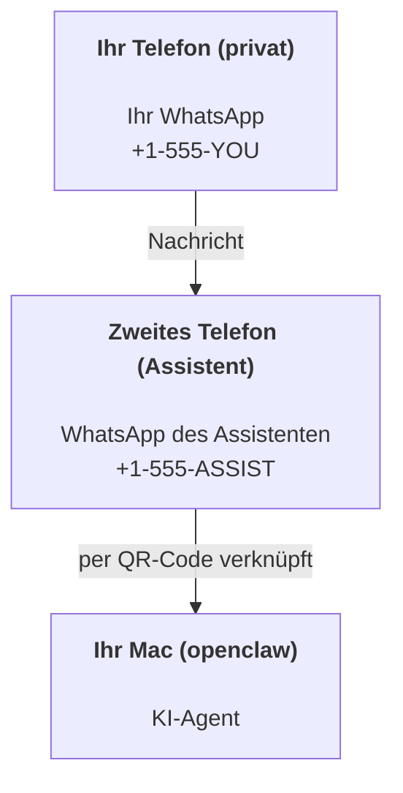

---
read_when:
    - Onboarding einer neuen Assistenteninstanz
    - Überprüfung der Auswirkungen auf Sicherheit und Berechtigungen
summary: End-to-End-Anleitung zur Verwendung von OpenClaw als persönlichem Assistenten mit Sicherheitshinweisen
title: Einrichtung des persönlichen Assistenten
x-i18n:
    generated_at: "2026-07-26T19:15:45Z"
    model: gpt-5.6
    postprocess_version: locale-links-v1
    prompt_version: 32
    provider: openai
    source_hash: ed3e267971fc1ee5c9154194e5b1f98db8c7a7edca8182871a2057a778614217
    source_path: start/openclaw.md
    workflow: 16
---

OpenClaw ist ein selbst gehostetes Gateway, das Discord, Google Chat, iMessage, Matrix, Microsoft Teams, Signal, Slack, Telegram, WhatsApp, Zalo und weitere Dienste mit KI-Agenten verbindet. Dieser Leitfaden behandelt die Einrichtung als „persönlicher Assistent“: eine eigene WhatsApp-Nummer, die als Ihr ständig verfügbarer KI-Assistent fungiert.

## Sicherheit zuerst

Wenn Sie einem Agenten einen Kanal bereitstellen, kann er dadurch Befehle auf Ihrem Computer ausführen (abhängig von Ihrer Tool-Richtlinie), Dateien in Ihrem Arbeitsbereich lesen und schreiben sowie Nachrichten über jeden verbundenen Kanal versenden. Beginnen Sie mit restriktiven Einstellungen:

- Legen Sie immer `channels.whatsapp.allowFrom` fest (führen Sie den Dienst auf Ihrem persönlichen Mac niemals öffentlich für die ganze Welt zugänglich aus).
- Verwenden Sie eine eigene WhatsApp-Nummer für den Assistenten.
- Heartbeats werden standardmäßig alle 30 Minuten ausgeführt. Deaktivieren Sie sie, bis Sie der Einrichtung vertrauen, indem Sie `agents.defaults.heartbeat.every: "0m"` festlegen.

## Voraussetzungen

- OpenClaw ist installiert und das Onboarding wurde abgeschlossen – siehe [Erste Schritte](/de/start/getting-started), falls Sie dies noch nicht erledigt haben
- Eine zweite Telefonnummer (SIM/eSIM/Prepaid) für den Assistenten

## Einrichtung mit zwei Telefonen (empfohlen)

Das gewünschte Ergebnis:



Wenn Sie Ihr persönliches WhatsApp mit OpenClaw verknüpfen, wird jede an Sie gerichtete Nachricht zur „Agenteneingabe“. Das ist nur selten erwünscht.

## Schnellstart in 5 Minuten

1. Koppeln Sie WhatsApp Web (ein QR-Code wird angezeigt; scannen Sie ihn mit dem Telefon des Assistenten):

```bash
openclaw channels login
```

2. Starten Sie das Gateway (lassen Sie es weiterlaufen):

```bash
openclaw gateway --port 18789
```

3. Fügen Sie eine minimale Konfiguration in `~/.openclaw/openclaw.json` ein:

```json5
{
  gateway: { mode: "local" },
  channels: { whatsapp: { allowFrom: ["+15555550123"] } },
}
```

Senden Sie nun von Ihrem auf der Zulassungsliste stehenden Telefon eine Nachricht an die Nummer des Assistenten.

Nach Abschluss des Onboardings öffnet OpenClaw automatisch das Dashboard und gibt einen übersichtlichen Link ohne Token aus. Wenn das Dashboard zur Authentifizierung auffordert, fügen Sie das konfigurierte gemeinsame Geheimnis in die Einstellungen der Control UI ein. Das Onboarding verwendet standardmäßig ein Token (`gateway.auth.token`), aber die Passwortauthentifizierung funktioniert ebenfalls, wenn Sie `gateway.auth.mode` auf `password` umgestellt haben. So öffnen Sie es später erneut: `openclaw dashboard`.

## Dem Agenten einen Arbeitsbereich bereitstellen (AGENTS)

OpenClaw liest Betriebsanweisungen und den „Speicher“ aus seinem Arbeitsbereichsverzeichnis.

Standardmäßig verwendet OpenClaw `~/.openclaw/workspace` als Arbeitsbereich des Agenten und erstellt ihn (einschließlich der anfänglichen Dateien `AGENTS.md`, `SOUL.md`, `TOOLS.md`, `IDENTITY.md`, `USER.md`) beim Onboarding oder beim ersten Agentenlauf automatisch. `BOOTSTRAP.md` wird nur für einen völlig neuen Arbeitsbereich erstellt und sollte nach dem Löschen nicht erneut angelegt werden. `MEMORY.md` ist optional und wird niemals automatisch erstellt; wenn die Datei vorhanden ist, wird sie für normale Sitzungen geladen. In Subagentensitzungen werden nur `AGENTS.md` und `TOOLS.md` eingefügt.

<Tip>
Behandeln Sie diesen Ordner wie den Speicher von OpenClaw und machen Sie ihn zu einem Git-Repository (idealerweise privat), damit Ihre `AGENTS.md`- und Speicherdateien gesichert werden. Wenn Git installiert ist, werden völlig neue Arbeitsbereiche automatisch mit `git init` initialisiert.
</Tip>

So erstellen Sie die Arbeitsbereichs- und Konfigurationsordner, ohne den vollständigen Onboarding-Assistenten auszuführen:

```bash
openclaw setup --baseline
```

(Die alleinige Angabe von `openclaw setup` ist ein Alias für `openclaw onboard` und führt den vollständigen interaktiven Assistenten aus.)

Vollständiger Leitfaden zum Aufbau und zur Sicherung des Arbeitsbereichs: [Agentenarbeitsbereich](/de/concepts/agent-workspace)
Speicherablauf: [Speicher](/de/concepts/memory)

Optional: Wählen Sie mit `agents.defaults.workspace` einen anderen Arbeitsbereich aus (unterstützt `~`).

```json5
{
  agents: {
    defaults: {
      workspace: "~/.openclaw/workspace",
    },
  },
}
```

Wenn Sie bereits eigene Arbeitsbereichsdateien aus einem Repository bereitstellen, können Sie die Erstellung von Bootstrap-Dateien vollständig deaktivieren:

```json5
{
  agents: {
    defaults: {
      skipBootstrap: true,
    },
  },
}
```

## Die Konfiguration, die OpenClaw zu „einem Assistenten“ macht

OpenClaw verwendet standardmäßig eine geeignete Assistentenkonfiguration. Üblicherweise sollten Sie jedoch Folgendes anpassen:

- Persönlichkeit/Anweisungen in [`SOUL.md`](/de/concepts/soul)
- Standardwerte für das Denken (falls gewünscht)
- Heartbeats (sobald Sie der Einrichtung vertrauen)

Beispiel:

```json5
{
  logging: { level: "info" },
  agents: {
    defaults: {
      model: { primary: "anthropic/claude-opus-5" },
      workspace: "~/.openclaw/workspace",
      thinkingDefault: "high",
      timeoutSeconds: 1800,
      // Beginnen Sie mit 0; aktivieren Sie dies später.
      heartbeat: { every: "0m" },
    },
    list: [
      {
        id: "main",
        default: true,
        groupChat: {
          mentionPatterns: ["@openclaw", "openclaw"],
        },
      },
    ],
  },
  channels: {
    whatsapp: {
      allowFrom: ["+15555550123"],
      groups: {
        "*": { requireMention: true },
      },
    },
  },
  session: {
    scope: "per-sender",
    resetTriggers: ["/new", "/reset"],
    reset: {
      mode: "daily",
      atHour: 4,
      idleMinutes: 10080,
    },
  },
}
```

## Sitzungen und Speicher

- Sitzungszeilen, Transkriptzeilen und Metadaten (Token-Nutzung, letzte Route usw.): `~/.openclaw/agents/<agentId>/agent/openclaw-agent.sqlite`
- Legacy-/Archiv-Transkriptartefakte: `~/.openclaw/agents/<agentId>/sessions/`
- Migrationsquelle für Legacy-Zeilen: `~/.openclaw/agents/<agentId>/sessions/sessions.json`
- `/new` oder `/reset` startet eine neue Sitzung für diesen Chat (konfigurierbar über `session.resetTriggers`). Wenn der Befehl allein gesendet wird, bestätigt OpenClaw das Zurücksetzen, ohne das Modell aufzurufen.
- `/compact [instructions]` komprimiert den Sitzungskontext und meldet das verbleibende Kontextbudget.

## Heartbeats (proaktiver Modus)

Standardmäßig führt OpenClaw alle 30 Minuten einen Heartbeat mit folgender Aufforderung aus:
`Follow the heartbeat monitor scratch context when provided. Recurring tasks are cron jobs; create or change their schedules with cron tools or the openclaw cron CLI, not heartbeat scratch. Do not infer or repeat old tasks from prior chats. If nothing needs attention, reply HEARTBEAT_OK.`
Legen Sie zum Deaktivieren `agents.defaults.heartbeat.every: "0m"` fest. Heartbeat-Prüflisten befinden sich im Cron-Arbeitsbereich des Monitors (siehe [Heartbeat](/de/gateway/heartbeat)); `openclaw doctor --fix` migriert eine veraltete `HEARTBEAT.md` aus dem Arbeitsbereich dorthin.

- Wenn der Monitor-Arbeitsbereich vorhanden, aber praktisch leer ist (nur Leerzeilen, Markdown-/HTML-Kommentare, Markdown-Überschriften wie `# Heading`, Begrenzungsmarkierungen für Codeblöcke oder leere Prüflistenfragmente), überspringt OpenClaw den Heartbeat-Lauf, um API-Aufrufe einzusparen.
- Wenn kein Arbeitsbereich vorhanden ist, wird der Heartbeat dennoch ausgeführt und das Modell entscheidet, was zu tun ist.
- Wenn der Agent mit `HEARTBEAT_OK` antwortet (optional mit kurzer Auffüllung; siehe `agents.defaults.heartbeat.ackMaxChars`), unterdrückt OpenClaw für diesen Heartbeat die ausgehende Zustellung.
- Standardmäßig ist die Heartbeat-Zustellung an DM-ähnliche `user:<id>`-Ziele zulässig. Legen Sie `agents.defaults.heartbeat.directPolicy: "block"` fest, um die Zustellung an direkte Ziele zu unterdrücken, während die Heartbeat-Läufe aktiv bleiben.
- Heartbeats führen vollständige Agentendurchläufe aus – kürzere Intervalle verbrauchen mehr Token.

```json5
{
  agents: {
    defaults: {
      heartbeat: { every: "30m" },
    },
  },
}
```

## Eingehende und ausgehende Medien

Eingehende Anhänge (Bilder/Audio/Dokumente) können Ihrem Befehl über Vorlagen bereitgestellt werden:

- `{{AttachmentPath}}` (lokaler Pfad zur temporären Datei)
- `{{AttachmentUrl}}` (ursprüngliche URL oder Provider-Referenz)
- `{{AttachmentContentType}}` (MIME-Inhaltstyp)
- `{{AttachmentDir}}` (Verzeichnis, das den lokalen Pfad enthält)
- `{{AttachmentIndex}}` (nullbasierter Index des Quellfakts)
- `{{Transcript}}` (wenn die Audiotranskription aktiviert ist)

Die älteren Bezeichnungen `{{MediaPath}}`, `{{MediaUrl}}`, `{{MediaType}}` und `{{MediaDir}}`
bleiben als veraltete Kompatibilitätsaliase verfügbar.

Für ausgehende Anhänge des Agenten werden strukturierte Medienfelder im Nachrichtentool oder in den Antwortdaten verwendet, beispielsweise `media`, `mediaUrl`, `mediaUrls`, `path` oder `filePath`. Beispielargumente für das Nachrichtentool:

```json
{
  "message": "Hier ist der Screenshot.",
  "mediaUrl": "https://example.com/screenshot.png"
}
```

OpenClaw sendet strukturierte Medien zusammen mit dem Text. Ältere abschließende Assistentenantworten können zur Kompatibilität weiterhin normalisiert werden, aber Tool-Ausgaben, Browser-Ausgaben, Streaming-Blöcke und Nachrichtenaktionen interpretieren Text nicht als Anhangsbefehle.

Das Verhalten lokaler Pfade folgt demselben Vertrauensmodell für Dateizugriffe wie der Agent:

- Wenn `tools.fs.workspaceOnly` den Wert `true` hat, bleiben ausgehende lokale Medienpfade auf das temporäre Stammverzeichnis von OpenClaw, den Mediencache, die Pfade des Agentenarbeitsbereichs und von der Sandbox erzeugte Dateien beschränkt.
- Wenn `tools.fs.workspaceOnly` den Wert `false` hat, können ausgehende lokale Medien Dateien auf dem Host verwenden, die der Agent bereits lesen darf.
- Lokale Pfade können absolut, relativ zum Arbeitsbereich oder mit `~/` relativ zum Home-Verzeichnis angegeben werden.
- Beim Senden lokaler Host-Dateien sind weiterhin nur Medien und sichere Dokumenttypen zulässig (Bilder, Audio, Video, PDF, Office-Dokumente und validierte Textdokumente wie Markdown/MD, TXT, JSON, YAML und YML). Dies ist eine Erweiterung der bestehenden Vertrauensgrenze für Lesezugriffe auf dem Host und kein Scanner für Geheimnisse: Wenn der Agent eine lokale `secret.txt`- oder `config.json`-Datei auf dem Host lesen kann, kann er sie anhängen, sofern die Prüfung der Erweiterung und des Inhalts erfolgreich ist.

Bewahren Sie vertrauliche Dateien außerhalb des für den Agenten lesbaren Dateisystems auf oder behalten Sie `tools.fs.workspaceOnly: true` bei, um das Senden über lokale Pfade stärker einzuschränken.

## Betriebsprüfliste

```bash
openclaw status          # lokaler Status (Anmeldedaten, Sitzungen, Ereignisse in der Warteschlange)
openclaw status --all    # vollständige Diagnose (schreibgeschützt, zum Einfügen geeignet)
openclaw status --deep   # Kanäle prüfen (WhatsApp Web + Telegram + Discord + Slack + Signal)
openclaw health --json   # Momentaufnahme des Gateway-Zustands über die WS-Verbindung
```

Protokolle befinden sich unter `/tmp/openclaw/`: `openclaw-YYYY-MM-DD.log` für das Standardprofil
und `openclaw-<profile>-YYYY-MM-DD.log` für benannte Profile.

## Nächste Schritte

- WebChat: [WebChat](/de/web/webchat)
- Gateway-Betrieb: [Gateway-Betriebshandbuch](/de/gateway)
- Cron und Aktivierungen: [Cron-Aufgaben](/de/automation/cron-jobs)
- Begleitprogramm für die macOS-Menüleiste: [OpenClaw-App für macOS](/de/platforms/macos)
- iOS-Node-App: [iOS-App](/de/platforms/ios)
- Android-Node-App: [Android-App](/de/platforms/android)
- Windows Hub: [Windows](/de/platforms/windows)
- Linux-Status: [Linux-App](/de/platforms/linux)
- Sicherheit: [Sicherheit](/de/gateway/security)

## Verwandte Themen

- [Erste Schritte](/de/start/getting-started)
- [Einrichtung](/de/start/setup)
- [Kanalübersicht](/de/channels)
