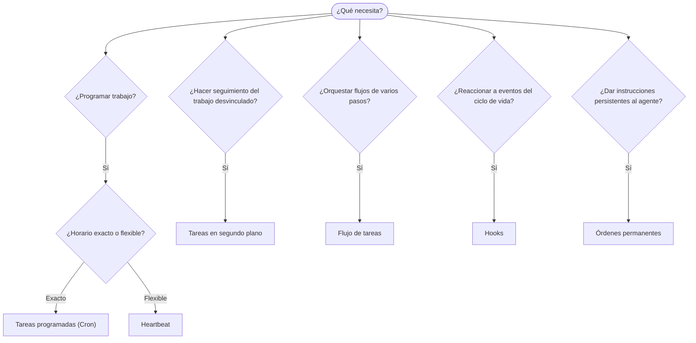

OpenClaw ejecuta trabajo en segundo plano mediante tareas, trabajos programados, hooks de eventos
e instrucciones permanentes. Use esta página para elegir el mecanismo adecuado.

## Guía rápida de decisión

| Caso de uso                                     | Recomendación              | Motivo                                                    |
| ----------------------------------------------- | -------------------------- | --------------------------------------------------------- |
| Enviar un informe diario exactamente a las 9 AM | Tareas programadas (Cron)  | Horario exacto, ejecución aislada                         |
| Recordarme algo dentro de 20 minutos            | Tareas programadas (Cron)  | Ejecución única con horario preciso (`--at`)  |
| Ejecutar semanalmente un análisis exhaustivo    | Tareas programadas (Cron)  | Tarea independiente; puede usar un modelo diferente       |
| Revisar la bandeja de entrada cada 30 min       | Heartbeat                  | Agrupa otras comprobaciones y tiene en cuenta el contexto |
| Supervisar eventos próximos del calendario      | Heartbeat                  | Adecuado de forma natural para la supervisión periódica   |
| Inspeccionar el estado de un subagente o una ejecución de ACP | Tareas en segundo plano | El registro de tareas rastrea todo el trabajo desvinculado |
| Auditar qué se ejecutó y cuándo                 | Tareas en segundo plano    | `openclaw tasks list` y `openclaw tasks audit`                   |
| Investigar en varios pasos y luego resumir      | Flujo de tareas            | Orquestación duradera con seguimiento de revisiones       |
| Ejecutar un script al restablecer la sesión     | Hooks                      | Basado en eventos; se activa con eventos del ciclo de vida |
| Ejecutar código en cada llamada a una herramienta | Hooks de Plugin          | Los hooks en proceso pueden interceptar llamadas a herramientas |
| Comprobar siempre el cumplimiento antes de responder | Órdenes permanentes   | Se insertan automáticamente en cada sesión                |

### Tareas programadas (Cron) frente a Heartbeat

| Dimensión          | Tareas programadas (Cron)              | Heartbeat                                  |
| ------------------ | -------------------------------------- | ------------------------------------------ |
| Horario            | Exacto (expresiones cron, ejecución única) | Aproximado (de forma predeterminada, cada 30 min) |
| Contexto de sesión | Nuevo (aislado) o compartido           | Contexto completo de la sesión principal   |
| Registros de tareas | Siempre se crean                      | Nunca se crean                             |
| Entrega            | Canal, webhook o silenciosa            | Integrada en la sesión principal           |
| Ideal para         | Informes, recordatorios, trabajos en segundo plano | Revisiones de bandeja de entrada, calendario y notificaciones |

Use Tareas programadas (Cron) cuando necesite un horario preciso o una ejecución aislada. Use Heartbeat cuando el trabajo se beneficie del contexto completo de la sesión y baste con un horario aproximado.

## Conceptos principales

### Tareas programadas (cron)

Cron es el planificador integrado del Gateway para horarios precisos. Conserva los trabajos, activa el agente en el momento adecuado y puede entregar la salida a un canal de chat o a un endpoint de webhook. Admite recordatorios de ejecución única, expresiones recurrentes y activadores de webhook entrantes.

Consulte [Tareas programadas](/es/automation/cron-jobs).

### Tareas

El registro de tareas en segundo plano rastrea todo el trabajo desvinculado: ejecuciones de ACP, creación de subagentes, ejecuciones cron aisladas y operaciones de la CLI. Las tareas son registros, no planificadores. Use `openclaw tasks list` y `openclaw tasks audit` para inspeccionarlas.

Consulte [Tareas en segundo plano](/es/automation/tasks).

### Flujo de tareas

El Flujo de tareas es la base de orquestación de flujos situada sobre las tareas en segundo plano. Gestiona flujos duraderos de varios pasos con modos de sincronización gestionada y reflejada, seguimiento de revisiones y `openclaw tasks flow list|show|cancel` para su inspección.

Consulte [Flujo de tareas](/es/automation/taskflow).

### Órdenes permanentes

Las órdenes permanentes conceden al agente autoridad operativa permanente para programas definidos. Se encuentran en archivos del espacio de trabajo (normalmente `AGENTS.md`) y se insertan en cada sesión. Combínelas con cron para aplicar requisitos basados en el tiempo.

Consulte [Órdenes permanentes](/es/automation/standing-orders).

### Hooks

Los hooks internos son scripts basados en eventos que se activan mediante eventos del ciclo de vida del agente
(`/new`, `/reset`, `/stop`), la Compaction de la sesión, el inicio del Gateway y el flujo
de mensajes. Se detectan en directorios de hooks y se gestionan con
`openclaw hooks`. Para interceptar llamadas a herramientas en proceso, use
[Hooks de Plugin](/es/plugins/hooks).

Consulte [Hooks](/es/automation/hooks).

### Heartbeat

Heartbeat es un turno periódico de la sesión principal (de forma predeterminada, cada 30 minutos). Agrupa la supervisión basada en listas de comprobación (bandeja de entrada, calendario y notificaciones) en un solo turno del agente con el contexto completo de la sesión. Los turnos de Heartbeat no crean registros de tareas ni prolongan la vigencia para el restablecimiento diario o por inactividad de la sesión. El espacio temporal de Heartbeat es un contexto pequeño del prompt; programe el trabajo recurrente como trabajos cron. Si el espacio temporal de Heartbeat está vacío, se omite como `empty-heartbeat-file`. Los Heartbeats se aplazan mientras haya trabajo cron activo o en cola, y `heartbeat.skipWhenBusy` también puede aplazar un agente mientras estén ocupados los subagentes vinculados a la clave de sesión de ese mismo agente o sus carriles anidados.

Consulte [Heartbeat](/es/gateway/heartbeat).

## Cómo funcionan en conjunto

- **Cron** gestiona horarios precisos (informes diarios, revisiones semanales) y recordatorios de ejecución única. Todas las ejecuciones cron crean registros de tareas.
- **Heartbeat** gestiona una lista de supervisión agrupada cada 30 minutos; cron se encarga de las comprobaciones que necesitan frecuencias independientes.
- **Los hooks** reaccionan a eventos específicos (restablecimientos de sesión, Compaction y flujo de mensajes) mediante scripts personalizados. Los hooks de Plugin abarcan las llamadas a herramientas.
- **Las órdenes permanentes** proporcionan al agente contexto persistente y límites de autoridad.
- **El Flujo de tareas** coordina flujos de varios pasos por encima de las tareas individuales.
- **Las tareas** rastrean automáticamente todo el trabajo desvinculado para que pueda inspeccionarlo y auditarlo.

## Contenido relacionado

- [Tareas programadas](/es/automation/cron-jobs) — programación precisa y recordatorios de ejecución única
- [Tareas en segundo plano](/es/automation/tasks) — registro de tareas para todo el trabajo desvinculado
- [Flujo de tareas](/es/automation/taskflow) — orquestación duradera de flujos de varios pasos
- [Hooks](/es/automation/hooks) — scripts del ciclo de vida basados en eventos
- [Hooks de Plugin](/es/plugins/hooks) — hooks en proceso para herramientas, prompts, mensajes y el ciclo de vida
- [Órdenes permanentes](/es/automation/standing-orders) — instrucciones persistentes para el agente
- [Heartbeat](/es/gateway/heartbeat) — turnos periódicos de la sesión principal
- [Referencia de configuración](/es/gateway/configuration-reference) — todas las claves de configuración
