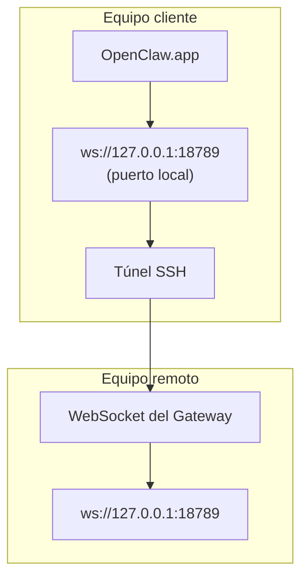

<Note>
Este contenido ahora se encuentra en [Acceso remoto](/es/gateway/remote#macos-persistent-ssh-tunnel-via-launchagent). Consulte esa página para obtener la guía actual; esta página se mantiene como destino de redirección.
</Note>

# Ejecución de OpenClaw.app con un Gateway remoto

OpenClaw.app accede a un Gateway remoto mediante un túnel SSH: un `LocalForward` de SSH asigna un puerto local al puerto WebSocket del Gateway en el host remoto.

## Configuración

1. Añada una entrada de configuración SSH con `LocalForward 18789 127.0.0.1:18789` (consulte [Acceso remoto](/es/gateway/remote#macos-persistent-ssh-tunnel-via-launchagent) para ver el bloque de configuración completo).
2. Copie la clave SSH al host remoto con `ssh-copy-id`.
3. Establezca `gateway.remote.token` (o `gateway.remote.password`) mediante `openclaw config set gateway.remote.token "<your-token>"`.
4. Inicie el túnel: `ssh -N remote-gateway &`.
5. Cierre y vuelva a abrir OpenClaw.app.

Para disponer de un túnel que persista tras los reinicios y se vuelva a conectar automáticamente, utilice la configuración de LaunchAgent de la página [Acceso remoto](/es/gateway/remote#macos-persistent-ssh-tunnel-via-launchagent) en lugar de un `ssh -N` manual.

## Funcionamiento

| Componente                           | Función                                                        |
| ------------------------------------ | -------------------------------------------------------------- |
| `LocalForward 18789 127.0.0.1:18789` | Reenvía el puerto local 18789 al puerto remoto 18789            |
| `ssh -N`                             | SSH sin ejecutar comandos remotos (solo reenvío de puertos)     |
| `KeepAlive`                          | Reinicia el túnel automáticamente si falla (LaunchAgent)        |
| `RunAtLoad`                          | Inicia el túnel cuando se carga LaunchAgent (LaunchAgent)       |

OpenClaw.app se conecta a `ws://127.0.0.1:18789` en el cliente. El túnel reenvía esa conexión al puerto 18789 del host remoto que ejecuta el Gateway.

## Contenido relacionado

- [Acceso remoto](/es/gateway/remote)
- [Tailscale](/es/gateway/tailscale)
