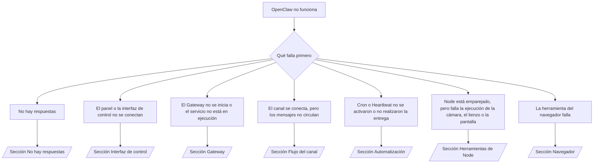

---
read_when:
    - OpenClaw no funciona y se necesita la vía más rápida para solucionarlo
    - Se necesita un flujo de triaje antes de profundizar en los manuales operativos detallados
summary: Centro de resolución de problemas de OpenClaw basado en los síntomas
title: Solución de problemas generales
x-i18n:
    generated_at: "2026-07-26T05:16:43Z"
    model: gpt-5.6
    postprocess_version: locale-links-v1
    prompt_version: 32
    provider: openai
    source_hash: de3554ed680ac536d105017220b44d94456a4408916e949352500b046f4d5f17
    source_path: help/troubleshooting.md
    workflow: 16
---

Puerta de entrada para el triaje. 2 minutos para obtener un diagnóstico y, después, vaya a la página detallada.

## Primeros 60 segundos

Ejecute esta secuencia en orden:

```bash
openclaw status
openclaw status --all
openclaw gateway probe
openclaw gateway status
openclaw doctor
openclaw channels status --probe
openclaw logs --follow
```

Salida correcta, una línea cada una:

- `openclaw status` muestra los canales configurados, sin errores de autenticación.
- `openclaw status --all` genera un informe completo que se puede compartir.
- `openclaw gateway probe` muestra `Reachable: yes`. `Capability: ...` es el
  nivel de autenticación que la sonda verificó; `Read probe: limited - missing scope:
operator.read` indica diagnósticos degradados, no un fallo de conexión.
- `openclaw gateway status` muestra `Runtime: running`, `Connectivity probe:
ok` y un `Capability: ...` plausible. Añada `--require-rpc` para exigir también
  una verificación RPC de ámbito de lectura.
- `openclaw doctor` no informa de errores de configuración o servicio que impidan el funcionamiento.
- `openclaw channels status --probe` devuelve el estado activo del transporte de cada cuenta
  (`works` / `audit ok`) cuando se puede acceder al Gateway; recurre a
  resúmenes basados únicamente en la configuración cuando no se puede.
- `openclaw logs --follow` muestra actividad constante, sin errores fatales repetitivos.

## El asistente parece limitado o no dispone de herramientas

Compruebe el perfil de herramientas efectivo:

```bash
openclaw status
openclaw status --all
openclaw doctor
```

Causas habituales:

- `tools.profile: "minimal"` solo permite `session_status`.
- `tools.profile: "messaging"` es limitado y está destinado a agentes que solo usan chat.
- `tools.profile: "coding"` es el valor predeterminado para las configuraciones locales nuevas (trabajo con repositorios, archivos,
  shell y entorno de ejecución).
- `tools.profile: "full"` elimina las restricciones del perfil; limítelo a agentes de confianza
  controlados por el operador.
- Los `agents.entries.*.tools` específicos de cada agente restringen o amplían el perfil raíz
  para un agente.

Cambie el perfil, reinicie o vuelva a cargar el Gateway y, después, compruébelo de nuevo con
`openclaw status --all`. Tabla completa de perfiles y grupos: [Perfiles de herramientas](/es/gateway/config-tools#tool-profiles).

## Error 429 de contexto largo de Anthropic

`HTTP 429: rate_limit_error: Extra usage is required for long context requests`
→ [Anthropic exige uso adicional para el contexto largo en el error 429](/es/gateway/troubleshooting#anthropic-429-extra-usage-required-for-long-context).

## El backend local compatible con OpenAI funciona directamente, pero falla en OpenClaw

El backend local o autoalojado `/v1` responde a las sondas directas `/v1/chat/completions`,
pero falla con `openclaw infer model run` o durante los turnos normales del agente:

1. El error menciona que `messages[].content` espera una cadena: configure
   `models.providers.<provider>.models[].compat.requiresStringContent: true`.
2. Si sigue fallando únicamente durante los turnos de agentes de OpenClaw: configure
   `models.providers.<provider>.models[].compat.supportsTools: false` y vuelva a intentarlo.
3. Si las llamadas directas pequeñas funcionan, pero los prompts más grandes de OpenClaw bloquean el backend:
   se trata de un límite del modelo o servidor de origen, no de un error de OpenClaw. Continúe en
   [El backend local compatible con OpenAI supera las sondas directas, pero las ejecuciones de agentes fallan](/es/gateway/troubleshooting#local-openai-compatible-backend-passes-direct-probes-but-agent-runs-fail).

## La instalación del Plugin falla porque faltan extensiones de OpenClaw

`package.json missing openclaw.extensions` significa que el paquete del Plugin utiliza una
estructura que OpenClaw ya no acepta.

Corríjalo en el paquete del Plugin:

1. Añada `openclaw.extensions` a `package.json` y haga que apunte a los archivos compilados del entorno de ejecución
   (normalmente `./dist/index.js`).
2. Vuelva a publicarlo y, después, ejecute de nuevo `openclaw plugins install <package>`.

```json
{
  "name": "@openclaw/my-plugin",
  "version": "1.2.3",
  "openclaw": {
    "extensions": ["./dist/index.js"]
  }
}
```

Referencia: [Arquitectura de Plugins](/es/plugins/architecture)

## La política de instalación bloquea las instalaciones o actualizaciones de Plugins

La actualización finaliza, pero los Plugins están obsoletos, desactivados o muestran `blocked by install
policy`, `install policy failed closed` o `Disabled "<plugin>" after plugin
update failure`: compruebe `security.installPolicy`.

La política de instalación se ejecuta durante las instalaciones y actualizaciones de Plugins. Las versiones de Plugins
`@openclaw/*` suelen avanzar con la versión de OpenClaw, por lo que una actualización de OpenClaw puede
requerir una actualización correspondiente del Plugin durante la sincronización posterior a la actualización.

Evite estas estructuras de políticas, salvo que mantenga también la regla de actualización correspondiente:

- Inmovilizar los Plugins propiedad de OpenClaw en una única versión antigua exacta (por ejemplo, solo
  `@openclaw/*@2026.5.3`).
- Bloquear únicamente por el tipo de origen (todas las solicitudes de npm, red o `request.mode:
"update"`).
- Tratar el comando de política como opcional: cuando `security.installPolicy` está
  habilitado, un ejecutable de política ausente, lento, ilegible o bloqueado por permisos
  provoca un fallo cerrado.
- Aprobar versiones sin comprobar el `openclawVersion` de la solicitud con
  los metadatos del Plugin candidato.

Prefiera reglas que permitan actualizaciones de confianza de `@openclaw/*` compatibles con el
host actual, en lugar de fijar una versión para siempre. Si bloquea npm de forma
predeterminada, añada una excepción específica para los identificadores de Plugins que utiliza y aplique la misma
regla de confianza a `request.mode: "update"` que a las instalaciones.

Recuperación:

```bash
openclaw doctor --deep
openclaw plugins update --all
openclaw status --all
```

Si la política es estricta de manera intencionada, relájela durante el intervalo de actualización
de confianza, vuelva a ejecutar `openclaw plugins update --all` y, después, restaure la regla más estricta.
Si el fallo de actualización desactivó un Plugin, examínelo antes de volver a habilitarlo:

```bash
openclaw plugins inspect <plugin-id> --runtime --json
openclaw plugins enable <plugin-id>
```

Referencia: [Política de instalación del operador](/es/tools/skills-config#operator-install-policy-securityinstallpolicy)

## El Plugin está presente, pero bloqueado por una propiedad sospechosa

`openclaw doctor`, la configuración o las advertencias de inicio muestran:

```text
candidato a Plugin bloqueado: propiedad sospechosa (... uid=1000, se esperaba uid=0 o root)
Plugin presente, pero bloqueado
```

Los archivos del Plugin pertenecen a un usuario de Unix distinto del proceso que los carga.
No elimine la configuración del Plugin; corrija la propiedad de los archivos o ejecute
OpenClaw como el usuario propietario del directorio de estado.

Las instalaciones de Docker se ejecutan como `node` (uid `1000`). Repare los montajes enlazados del host:

```bash
sudo chown -R 1000:1000 /path/to/openclaw-config /path/to/openclaw-workspace
openclaw doctor --fix
```

Si ejecuta OpenClaw como root de manera intencionada, repare en su lugar la raíz administrada del Plugin:

```bash
sudo chown -R root:root /path/to/openclaw-config/npm
openclaw doctor --fix
```

Documentación detallada: [Propiedad bloqueada de la ruta del Plugin](/es/tools/plugin#blocked-plugin-path-ownership), [Docker: permisos y EACCES](/es/install/docker#shell-helpers-optional)

## Árbol de decisiones



<AccordionGroup>
  <Accordion title="No hay respuestas">
    ```bash
    openclaw status
    openclaw gateway status
    openclaw channels status --probe
    openclaw pairing list --channel <channel> [--account <id>]
    openclaw logs --follow
    ```

    Salida correcta:

    - `Runtime: running`
    - `Connectivity probe: ok`
    - `Capability: read-only`, `write-capable` o `admin-capable`
    - El canal muestra el transporte conectado y, cuando sea compatible, `works` o
      `audit ok` en `channels status --probe`
    - El remitente está aprobado (o la política de mensajes directos está abierta o usa una lista de permitidos)

    Firmas de registro:

    - `drop guild message (mention required` → el control de menciones de Discord bloqueó el mensaje.
    - `pairing request` → el remitente no está aprobado; se espera la aprobación del emparejamiento por mensaje directo.
    - `blocked` / `allowlist` en los registros del canal → se filtró el remitente, la sala o el grupo.

    Páginas detalladas: [No hay respuestas](/es/gateway/troubleshooting#no-replies), [Solución de problemas de canales](/es/channels/troubleshooting), [Emparejamiento](/es/channels/pairing)

  </Accordion>

  <Accordion title="El panel o la interfaz de control no se conectan">
    ```bash
    openclaw status
    openclaw gateway status
    openclaw logs --follow
    openclaw doctor
    openclaw channels status --probe
    ```

    Salida correcta:

    - `Dashboard: http://...` se muestra en `openclaw gateway status`
    - `Connectivity probe: ok`
    - `Capability: read-only`, `write-capable` o `admin-capable`
    - No hay ningún bucle de autenticación en los registros

    Firmas de registro:

    - `device identity required` → el contexto HTTP/no seguro no puede completar la autenticación del dispositivo.
    - `origin not allowed` → el `Origin` del navegador no está permitido para el destino del Gateway de la interfaz de control.
    - `AUTH_TOKEN_MISMATCH` con `canRetryWithDeviceToken=true` → puede producirse automáticamente un reintento con el token de un dispositivo de confianza, reutilizando los ámbitos almacenados en caché del token emparejado.
    - `unauthorized` repetido después de ese reintento → token o contraseña incorrectos, modo de autenticación incompatible o token de dispositivo emparejado obsoleto.
    - `too many failed authentication attempts (retry later)` → los fallos repetidos desde ese `Origin` del navegador se bloquean temporalmente; otros orígenes de localhost utilizan grupos separados. Consulte [Conectividad del panel y la interfaz de control](/es/gateway/troubleshooting#dashboard-control-ui-connectivity) para conocer el matiz de los reintentos simultáneos de Tailscale Serve.
    - `gateway connect failed:` → la interfaz apunta a la URL o puerto incorrectos, o no se puede acceder al Gateway.

    Páginas detalladas: [Conectividad del panel y la interfaz de control](/es/gateway/troubleshooting#dashboard-control-ui-connectivity), [Interfaz de control](/es/web/control-ui), [Autenticación](/es/gateway/authentication)

  </Accordion>

  <Accordion title="El Gateway no se inicia o el servicio está instalado, pero no está en ejecución">
    ```bash
    openclaw status
    openclaw gateway status
    openclaw logs --follow
    openclaw doctor
    openclaw channels status --probe
    ```

    Salida correcta:

    - `Service: ... (loaded)`
    - `Runtime: running`
    - `Connectivity probe: ok`
    - `Capability: read-only`, `write-capable` o `admin-capable`

    Firmas de registro:

    - `Gateway start blocked: set gateway.mode=local` o `existing config is missing gateway.mode` → el modo del Gateway es remoto, o a la configuración le falta la marca de modo local y debe repararse.
    - `refusing to bind gateway ... without auth` → enlace fuera de la interfaz de bucle invertido sin una ruta de autenticación válida (token/contraseña o proxy de confianza cuando esté configurado).
    - `another gateway instance is already listening` o `EADDRINUSE` → el puerto ya está ocupado.

    Páginas detalladas: [El servicio del Gateway no está en ejecución](/es/gateway/troubleshooting#gateway-service-not-running), [Proceso en segundo plano](/es/gateway/background-process), [Configuración](/es/gateway/configuration)

  </Accordion>

  <Accordion title="El canal se conecta, pero los mensajes no circulan">
    ```bash
    openclaw status
    openclaw gateway status
    openclaw logs --follow
    openclaw doctor
    openclaw channels status --probe
    ```

    Salida correcta:

    - El transporte del canal está conectado.
    - Las comprobaciones de emparejamiento o lista de permitidos se superan.
    - Las menciones se detectan cuando son obligatorias.

    Firmas de registro:

    - `mention required` → el control de menciones del grupo bloqueó el procesamiento.
    - `pairing` / `pending` → el remitente del mensaje directo aún no está aprobado.
    - `not_in_channel`, `missing_scope`, `Forbidden`, `401/403` → problema con el token de permisos del canal.

    Páginas detalladas: [Canal conectado, pero los mensajes no circulan](/es/gateway/troubleshooting#channel-connected-messages-not-flowing), [Solución de problemas de canales](/es/channels/troubleshooting)

  </Accordion>

  <Accordion title="Cron o Heartbeat no se activaron o no realizaron la entrega">
    ```bash
    openclaw status
    openclaw gateway status
    openclaw cron status
    openclaw cron list
    openclaw cron runs --id <jobId> --limit 20
    openclaw logs --follow
    ```

    Salida correcta:

    - `cron status` muestra el planificador habilitado con una próxima activación.
    - `cron runs` muestra entradas recientes de `ok`.
    - Heartbeat está habilitado y dentro del horario activo.

    Firmas de registro:

    - `cron: scheduler disabled; jobs will not run automatically` → Cron está deshabilitado.
    - `heartbeat skipped` motivo `quiet-hours` → fuera del horario activo configurado.
    - `heartbeat skipped` motivo `empty-heartbeat-file` → el borrador del monitor de Heartbeat solo contiene elementos de estructura en blanco, comentarios, encabezados, bloques delimitados o listas de comprobación vacías.
    - `heartbeat skipped` motivo `alerts-disabled` → `showOk`, `showAlerts` y `useIndicator` están desactivados.
    - `requests-in-flight` → el canal principal está ocupado; la activación de Heartbeat se ha pospuesto.
    - `unknown accountId` → la cuenta de destino para la entrega de Heartbeat no existe.

    Páginas detalladas: [Entrega de Cron y Heartbeat](/es/gateway/troubleshooting#cron-and-heartbeat-delivery), [Tareas programadas: solución de problemas](/es/automation/cron-jobs#troubleshooting), [Heartbeat](/es/gateway/heartbeat)

  </Accordion>

  <Accordion title="El Node está emparejado, pero la herramienta de cámara, lienzo, pantalla o ejecución falla">
    ```bash
    openclaw status
    openclaw gateway status
    openclaw nodes status
    openclaw nodes describe --node <idOrNameOrIp>
    openclaw logs --follow
    ```

    Salida correcta:

    - El Node aparece como conectado y emparejado para el rol `node`.
    - Existe la capacidad necesaria para el comando que se está invocando.
    - El estado de los permisos indica que están concedidos para la herramienta.

    Firmas de registro:

    - `NODE_BACKGROUND_UNAVAILABLE` → lleve la aplicación del Node al primer plano.
    - `*_PERMISSION_REQUIRED` → permiso del sistema operativo denegado o ausente.
    - `SYSTEM_RUN_DENIED: approval required` → la aprobación de ejecución está pendiente.
    - `SYSTEM_RUN_DENIED: allowlist miss` → el comando no está en la lista de permitidos de ejecución.

    Páginas detalladas: [Node emparejado, la herramienta falla](/es/gateway/troubleshooting#node-paired-tool-fails), [Solución de problemas del Node](/es/nodes/troubleshooting), [Aprobaciones de ejecución](/es/tools/exec-approvals)

  </Accordion>

  <Accordion title="La ejecución solicita aprobación de repente">
    ```bash
    openclaw config get tools.exec.host
    openclaw config get tools.exec.security
    openclaw config get tools.exec.ask
    openclaw gateway restart
    ```

    Qué ha cambiado:

    - Si `tools.exec.host` no está definido, su valor predeterminado es `auto`, que se resuelve como `sandbox`
      cuando hay un entorno de ejecución de aislamiento activo y como `gateway` en caso contrario.
    - `host=auto` solo controla el enrutamiento; el comportamiento sin solicitudes de confirmación proviene de
      `security=full` junto con `ask=off` en el Gateway o Node.
    - Si `tools.exec.security` no está definido, su valor predeterminado es `full` en `gateway`/`node`.
    - Si `tools.exec.ask` no está definido, su valor predeterminado es `off`.
    - Si aparecen solicitudes de aprobación, alguna política local del host o específica de la sesión
      ha restringido la ejecución con respecto a estos valores predeterminados.

    Restaure los valores predeterminados actuales sin aprobación:

    ```bash
    openclaw config set tools.exec.host gateway
    openclaw config set tools.exec.security full
    openclaw config set tools.exec.ask off
    openclaw gateway restart
    ```

    Alternativas más seguras:

    - Establezca solo `tools.exec.host=gateway` para obtener un enrutamiento estable al host.
    - Use `security=allowlist` con `ask=on-miss` para ejecutar en el host con revisión cuando
      no haya coincidencias en la lista de permitidos.
    - Habilite el modo de aislamiento para que `host=auto` vuelva a resolverse como `sandbox`.

    Firmas de registro:

    - `Approval required.` → el comando está esperando `/approve ...`.
    - `SYSTEM_RUN_DENIED: approval required` → la aprobación de ejecución en el host del Node está pendiente.
    - `exec host=sandbox requires a sandbox runtime for this session` → selección implícita o explícita del aislamiento, pero el modo de aislamiento está desactivado.

    Páginas detalladas: [Ejecución](/es/tools/exec), [Aprobaciones de ejecución](/es/tools/exec-approvals), [Seguridad: qué comprueba la auditoría](/es/gateway/security#what-the-audit-checks-high-level)

  </Accordion>

  <Accordion title="La herramienta del navegador falla">
    ```bash
    openclaw status
    openclaw gateway status
    openclaw browser status
    openclaw logs --follow
    openclaw doctor
    ```

    Salida correcta:

    - El estado del navegador muestra `running: true` y un navegador/perfil seleccionado.
    - El perfil `openclaw` se inicia, o el perfil `user` detecta pestañas locales de Chrome.

    Firmas de registro:

    - `unknown command "browser"` → `plugins.allow` está definido y excluye `browser`.
    - `Failed to start Chrome CDP on port` → no se pudo iniciar el navegador local.
    - `browser.executablePath not found` → la ruta configurada del ejecutable es incorrecta.
    - `browser.cdpUrl must be http(s) or ws(s)` → la URL de CDP configurada utiliza un esquema no compatible.
    - `browser.cdpUrl has invalid port` → la URL de CDP configurada contiene un puerto incorrecto o fuera de rango.
    - `No Chrome tabs found for profile="user"` → el perfil de conexión de Chrome MCP no tiene pestañas locales de Chrome abiertas.
    - `Remote CDP for profile "<name>" is not reachable` → no se puede acceder al punto de conexión remoto de CDP configurado desde este host.
    - `Browser attachOnly is enabled ... not reachable` → el perfil de solo conexión no tiene ningún destino de CDP activo.
    - Persisten anulaciones obsoletas de área de visualización, modo oscuro, configuración regional o modo sin conexión en perfiles de solo conexión o de CDP remoto → ejecute `openclaw browser stop --browser-profile <name>` para cerrar la sesión de control y liberar el estado de emulación sin reiniciar el Gateway.

    Páginas detalladas: [La herramienta del navegador falla](/es/gateway/troubleshooting#browser-tool-fails), [Falta el comando o la herramienta del navegador](/es/tools/browser#missing-browser-command-or-tool), [Navegador: solución de problemas en Linux](/es/tools/browser-linux-troubleshooting), [Navegador: solución de problemas de CDP remoto en WSL2/Windows](/es/tools/browser-wsl2-windows-remote-cdp-troubleshooting)

  </Accordion>

</AccordionGroup>

## Contenido relacionado

- [Preguntas frecuentes](/es/help/faq) — preguntas frecuentes
- [Solución de problemas del Gateway](/es/gateway/troubleshooting) — problemas específicos del Gateway
- [Doctor](/es/gateway/doctor) — comprobaciones y reparaciones automatizadas del estado
- [Solución de problemas de canales](/es/channels/troubleshooting) — problemas de conectividad de los canales
- [Tareas programadas: solución de problemas](/es/automation/cron-jobs#troubleshooting) — problemas de Cron y Heartbeat
