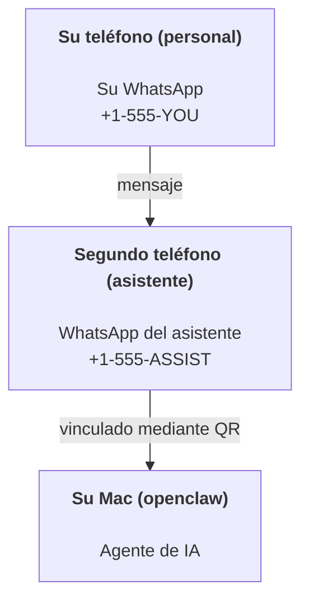

---
read_when:
    - Incorporación de una nueva instancia del asistente
    - Revisión de las implicaciones de seguridad y permisos
summary: Guía integral para usar OpenClaw como asistente personal con advertencias de seguridad
title: Configuración del asistente personal
x-i18n:
    generated_at: "2026-07-26T05:56:52Z"
    model: gpt-5.6
    postprocess_version: locale-links-v1
    prompt_version: 32
    provider: openai
    source_hash: ed3e267971fc1ee5c9154194e5b1f98db8c7a7edca8182871a2057a778614217
    source_path: start/openclaw.md
    workflow: 16
---

OpenClaw es un gateway autoalojado que conecta Discord, Google Chat, iMessage, Matrix, Microsoft Teams, Signal, Slack, Telegram, WhatsApp, Zalo y otros servicios con agentes de IA. Esta guía aborda la configuración de un «asistente personal»: un número de WhatsApp dedicado que se comporta como un asistente de IA siempre disponible.

## La seguridad ante todo

Dar a un agente acceso a un canal lo sitúa en una posición desde la que puede ejecutar comandos en el equipo (según la política de herramientas), leer y escribir archivos en el espacio de trabajo y enviar mensajes mediante cualquier canal conectado. Comience con una configuración restrictiva:

- Establezca siempre `channels.whatsapp.allowFrom` (nunca lo ejecute abierto a todo el mundo en su Mac personal).
- Use un número de WhatsApp dedicado para el asistente.
- De forma predeterminada, los Heartbeats se ejecutan cada 30 minutos. Desactívelos hasta que confíe en la configuración estableciendo `agents.defaults.heartbeat.every: "0m"`.

## Requisitos previos

- OpenClaw instalado y configurado inicialmente; consulte [Primeros pasos](/es/start/getting-started) si aún no lo ha hecho
- Un segundo número de teléfono (SIM/eSIM/prepago) para el asistente

## Configuración con dos teléfonos (recomendada)

El objetivo es este:



Si vincula su WhatsApp personal a OpenClaw, cada mensaje que reciba se convertirá en «entrada del agente». Rara vez es lo que se desea.

## Inicio rápido en 5 minutos

1. Vincule WhatsApp Web (se muestra un código QR; escanéelo con el teléfono del asistente):

```bash
openclaw channels login
```

2. Inicie el Gateway (déjelo en ejecución):

```bash
openclaw gateway --port 18789
```

3. Añada una configuración mínima en `~/.openclaw/openclaw.json`:

```json5
{
  gateway: { mode: "local" },
  channels: { whatsapp: { allowFrom: ["+15555550123"] } },
}
```

Ahora envíe un mensaje al número del asistente desde el teléfono incluido en la lista de permitidos.

Cuando finaliza la configuración inicial, OpenClaw abre automáticamente el panel de control e imprime un enlace limpio (sin token). Si el panel de control solicita autenticación, pegue el secreto compartido configurado en los ajustes de Control UI. La configuración inicial usa un token de forma predeterminada (`gateway.auth.token`), pero la autenticación con contraseña también funciona si cambió `gateway.auth.mode` a `password`. Para volver a abrirlo más adelante: `openclaw dashboard`.

## Proporcione al agente un espacio de trabajo (AGENTS)

OpenClaw lee las instrucciones de funcionamiento y la «memoria» de su directorio de espacio de trabajo.

De forma predeterminada, OpenClaw usa `~/.openclaw/workspace` como espacio de trabajo del agente y lo crea automáticamente (junto con los archivos iniciales `AGENTS.md`, `SOUL.md`, `TOOLS.md`, `IDENTITY.md` y `USER.md`) durante la configuración inicial o la primera ejecución del agente. `BOOTSTRAP.md` solo se crea para un espacio de trabajo completamente nuevo y no debe volver a aparecer después de eliminarlo. `MEMORY.md` es opcional y nunca se crea automáticamente; cuando está presente, se carga para las sesiones normales. Las sesiones de subagentes solo incorporan `AGENTS.md` y `TOOLS.md`.

<Tip>
Trate esta carpeta como la memoria de OpenClaw y conviértala en un repositorio de git (preferiblemente privado) para que se creen copias de seguridad de `AGENTS.md` y de los archivos de memoria. Si git está instalado, los espacios de trabajo completamente nuevos se inicializan automáticamente con `git init`.
</Tip>

Para crear las carpetas del espacio de trabajo y de configuración sin ejecutar el asistente completo de configuración inicial:

```bash
openclaw setup --baseline
```

(`openclaw setup` sin argumentos es un alias de `openclaw onboard` y ejecuta el asistente interactivo completo).

Diseño completo del espacio de trabajo y guía de copias de seguridad: [Espacio de trabajo del agente](/es/concepts/agent-workspace)
Flujo de trabajo de memoria: [Memoria](/es/concepts/memory)

Opcional: elija otro espacio de trabajo con `agents.defaults.workspace` (admite `~`).

```json5
{
  agents: {
    defaults: {
      workspace: "~/.openclaw/workspace",
    },
  },
}
```

Si ya proporciona sus propios archivos de espacio de trabajo desde un repositorio, puede desactivar por completo la creación de archivos de inicialización:

```json5
{
  agents: {
    defaults: {
      skipBootstrap: true,
    },
  },
}
```

## La configuración que lo convierte en «un asistente»

La configuración predeterminada de OpenClaw ofrece una buena base para un asistente, pero normalmente conviene ajustar:

- la personalidad y las instrucciones en [`SOUL.md`](/es/concepts/soul)
- los valores predeterminados de razonamiento (si se desea)
- los Heartbeats (cuando se confíe en el sistema)

Ejemplo:

```json5
{
  logging: { level: "info" },
  agents: {
    defaults: {
      model: { primary: "anthropic/claude-opus-5" },
      workspace: "~/.openclaw/workspace",
      thinkingDefault: "high",
      timeoutSeconds: 1800,
      // Comience con 0; actívelo más adelante.
      heartbeat: { every: "0m" },
    },
    list: [
      {
        id: "main",
        default: true,
        groupChat: {
          mentionPatterns: ["@openclaw", "openclaw"],
        },
      },
    ],
  },
  channels: {
    whatsapp: {
      allowFrom: ["+15555550123"],
      groups: {
        "*": { requireMention: true },
      },
    },
  },
  session: {
    scope: "per-sender",
    resetTriggers: ["/new", "/reset"],
    reset: {
      mode: "daily",
      atHour: 4,
      idleMinutes: 10080,
    },
  },
}
```

## Sesiones y memoria

- Filas de sesiones, filas de transcripciones y metadatos (uso de tokens, última ruta, etc.): `~/.openclaw/agents/<agentId>/agent/openclaw-agent.sqlite`
- Artefactos de transcripciones heredadas o archivadas: `~/.openclaw/agents/<agentId>/sessions/`
- Origen de migración de filas heredadas: `~/.openclaw/agents/<agentId>/sessions/sessions.json`
- `/new` o `/reset` inicia una sesión nueva para ese chat (se puede configurar mediante `session.resetTriggers`). Si se envía por separado, OpenClaw confirma el restablecimiento sin invocar el modelo.
- `/compact [instructions]` compacta el contexto de la sesión e informa del presupuesto de contexto restante.

## Heartbeats (modo proactivo)

De forma predeterminada, OpenClaw ejecuta un Heartbeat cada 30 minutos con la instrucción:
`Follow the heartbeat monitor scratch context when provided. Recurring tasks are cron jobs; create or change their schedules with cron tools or the openclaw cron CLI, not heartbeat scratch. Do not infer or repeat old tasks from prior chats. If nothing needs attention, reply HEARTBEAT_OK.`
Establezca `agents.defaults.heartbeat.every: "0m"` para desactivarlo. Las listas de comprobación de Heartbeat se encuentran en el espacio temporal de Cron del monitor (consulte [Heartbeat](/es/gateway/heartbeat)); `openclaw doctor --fix` migra a este una versión heredada de `HEARTBEAT.md` del espacio de trabajo.

- Si el espacio temporal del monitor existe, pero está prácticamente vacío (solo contiene líneas en blanco, comentarios de Markdown/HTML, encabezados de Markdown como `# Heading`, marcadores de bloques delimitados o listas de comprobación vacías), OpenClaw omite la ejecución del Heartbeat para ahorrar llamadas a la API.
- Si no existe ningún espacio temporal, el Heartbeat se ejecuta igualmente y el modelo decide qué hacer.
- Si el agente responde con `HEARTBEAT_OK` (opcionalmente con un breve relleno; consulte `agents.defaults.heartbeat.ackMaxChars`), OpenClaw suprime la entrega saliente de ese Heartbeat.
- De forma predeterminada, se permite entregar los Heartbeats a destinos `user:<id>` de tipo mensaje directo. Establezca `agents.defaults.heartbeat.directPolicy: "block"` para suprimir la entrega a destinos directos y mantener activas las ejecuciones de Heartbeat.
- Los Heartbeats ejecutan turnos completos del agente; los intervalos más cortos consumen más tokens.

```json5
{
  agents: {
    defaults: {
      heartbeat: { every: "30m" },
    },
  },
}
```

## Entrada y salida de contenido multimedia

Los archivos adjuntos entrantes (imágenes, audio y documentos) pueden ponerse a disposición del comando mediante plantillas:

- `{{AttachmentPath}}` (ruta del archivo temporal local)
- `{{AttachmentUrl}}` (URL original o referencia del proveedor)
- `{{AttachmentContentType}}` (tipo de contenido MIME)
- `{{AttachmentDir}}` (directorio que contiene la ruta local)
- `{{AttachmentIndex}}` (índice de origen de base cero)
- `{{Transcript}}` (si la transcripción de audio está activada)

Los nombres anteriores `{{MediaPath}}`, `{{MediaUrl}}`, `{{MediaType}}` y `{{MediaDir}}`
siguen disponibles como alias de compatibilidad obsoletos.

Los archivos adjuntos salientes del agente usan campos multimedia estructurados en la herramienta de mensajes o en la carga de respuesta, como `media`, `mediaUrl`, `mediaUrls`, `path` o `filePath`. Ejemplo de argumentos de la herramienta de mensajes:

```json
{
  "message": "Aquí está la captura de pantalla.",
  "mediaUrl": "https://example.com/screenshot.png"
}
```

OpenClaw envía contenido multimedia estructurado junto con el texto. Las respuestas finales heredadas del asistente aún pueden normalizarse por compatibilidad, pero la salida de herramientas, la salida del navegador, los bloques de transmisión y las acciones de mensajes no interpretan el texto como comandos de archivos adjuntos.

El comportamiento de las rutas locales sigue el mismo modelo de confianza de lectura de archivos que el agente:

- Si `tools.fs.workspaceOnly` es `true`, las rutas de contenido multimedia local saliente permanecen restringidas a la raíz temporal de OpenClaw, la caché multimedia, las rutas del espacio de trabajo del agente y los archivos generados por el entorno aislado.
- Si `tools.fs.workspaceOnly` es `false`, el contenido multimedia local saliente puede usar archivos locales del host que el agente ya tenga permiso para leer.
- Las rutas locales pueden ser absolutas, relativas al espacio de trabajo o relativas al directorio de inicio mediante `~/`.
- Los envíos desde el host local siguen permitiendo únicamente contenido multimedia y tipos de documentos seguros (imágenes, audio, vídeo, PDF, documentos de Office y documentos de texto validados como Markdown/MD, TXT, JSON, YAML y YML). Se trata de una ampliación del límite de confianza de lectura existente en el host, no de un detector de secretos: si el agente puede leer un archivo `secret.txt` o `config.json` local del host, puede adjuntarlo cuando la extensión y la validación del contenido coincidan.

Mantenga los archivos confidenciales fuera del sistema de archivos que puede leer el agente o conserve `tools.fs.workspaceOnly: true` para restringir más los envíos mediante rutas locales.

## Lista de comprobación operativa

```bash
openclaw status          # estado local (credenciales, sesiones y eventos en cola)
openclaw status --all    # diagnóstico completo (solo lectura, se puede pegar)
openclaw status --deep   # sondear canales (WhatsApp Web + Telegram + Discord + Slack + Signal)
openclaw health --json   # instantánea del estado del gateway mediante la conexión WS
```

Los registros se almacenan en `/tmp/openclaw/`: `openclaw-YYYY-MM-DD.log` para el perfil
predeterminado y `openclaw-<profile>-YYYY-MM-DD.log` para los perfiles con nombre.

## Pasos siguientes

- WebChat: [WebChat](/es/web/webchat)
- Operaciones del Gateway: [Manual de operaciones del Gateway](/es/gateway)
- Cron y reactivaciones: [Tareas de Cron](/es/automation/cron-jobs)
- Complemento para la barra de menús de macOS: [Aplicación de OpenClaw para macOS](/es/platforms/macos)
- Aplicación Node para iOS: [Aplicación para iOS](/es/platforms/ios)
- Aplicación Node para Android: [Aplicación para Android](/es/platforms/android)
- Centro de Windows: [Windows](/es/platforms/windows)
- Estado de Linux: [Aplicación para Linux](/es/platforms/linux)
- Seguridad: [Seguridad](/es/gateway/security)

## Contenido relacionado

- [Primeros pasos](/es/start/getting-started)
- [Configuración](/es/start/setup)
- [Descripción general de los canales](/es/channels)
