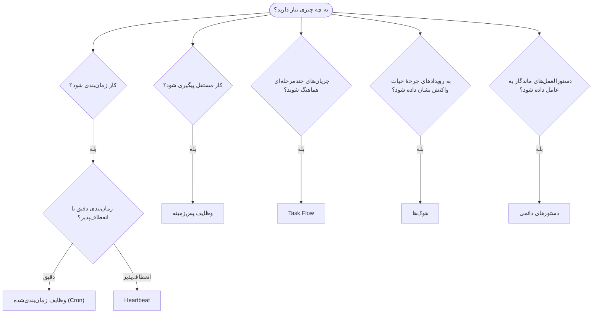

OpenClaw کارها را در پس‌زمینه از طریق وظایف، کارهای زمان‌بندی‌شده، هوک‌های رویداد
و دستورالعمل‌های دائمی اجرا می‌کند. از این صفحه برای انتخاب سازوکار مناسب استفاده کنید.

## راهنمای تصمیم‌گیری سریع

| مورد استفاده                                | پیشنهادشده            | دلیل                                              |
| --------------------------------------- | ---------------------- | ------------------------------------------------ |
| ارسال گزارش روزانه دقیقاً ساعت 9 صبح         | وظایف زمان‌بندی‌شده (Cron) | زمان‌بندی دقیق، اجرای ایزوله                 |
| 20 دقیقهٔ دیگر یادآوری کن                 | وظایف زمان‌بندی‌شده (Cron) | اجرای یک‌باره با زمان‌بندی دقیق (`--at`)            |
| اجرای تحلیل عمیق هفتگی                | وظایف زمان‌بندی‌شده (Cron) | وظیفهٔ مستقل، امکان استفاده از مدل متفاوت         |
| بررسی صندوق ورودی هر 30 دقیقه                | Heartbeat              | تجمیع با بررسی‌های دیگر، آگاه از زمینه         |
| پایش تقویم برای رویدادهای پیش رو    | Heartbeat              | مناسب طبیعی برای آگاهی دوره‌ای               |
| بررسی وضعیت یک زیرعامل یا اجرای ACP | وظایف پس‌زمینه       | دفتر وظایف همهٔ کارهای مستقل را پیگیری می‌کند            |
| ممیزی اینکه چه چیزی و چه زمانی اجرا شده                 | وظایف پس‌زمینه       | `openclaw tasks list` و `openclaw tasks audit` |
| پژوهش چندمرحله‌ای و سپس خلاصه‌سازی      | Task Flow              | هماهنگ‌سازی ماندگار با پیگیری بازبینی     |
| اجرای اسکریپت هنگام بازنشانی نشست           | هوک‌ها                  | رویدادمحور، در رویدادهای چرخهٔ حیات فعال می‌شود          |
| اجرای کد در هر فراخوانی ابزار         | هوک‌های Plugin           | هوک‌های درون‌فرایندی می‌توانند فراخوانی‌های ابزار را رهگیری کنند        |
| همیشه پیش از پاسخ‌دادن انطباق را بررسی کن | دستورهای دائمی        | به‌طور خودکار به هر نشست تزریق می‌شود        |

### وظایف زمان‌بندی‌شده (Cron) در برابر Heartbeat

| بُعد       | وظایف زمان‌بندی‌شده (Cron)              | Heartbeat                             |
| --------------- | ----------------------------------- | ------------------------------------- |
| زمان‌بندی          | دقیق (عبارت‌های cron، یک‌باره)  | تقریبی (پیش‌فرض هر 30 دقیقه)    |
| زمینهٔ نشست | تازه (ایزوله) یا مشترک          | زمینهٔ کامل نشست اصلی             |
| رکوردهای وظیفه    | همیشه ایجاد می‌شوند                      | هرگز ایجاد نمی‌شوند                         |
| تحویل        | کانال، webhook یا بی‌صدا         | درون‌خطی در نشست اصلی                |
| مناسب برای        | گزارش‌ها، یادآوری‌ها، کارهای پس‌زمینه | بررسی صندوق ورودی، تقویم، اعلان‌ها |

هنگامی که به زمان‌بندی دقیق یا اجرای ایزوله نیاز دارید، از وظایف زمان‌بندی‌شده (Cron) استفاده کنید. هنگامی که کار از زمینهٔ کامل نشست بهره می‌برد و زمان‌بندی تقریبی قابل‌قبول است، از Heartbeat استفاده کنید.

## مفاهیم اصلی

### وظایف زمان‌بندی‌شده (cron)

Cron زمان‌بند داخلی Gateway برای زمان‌بندی دقیق است. کارها را ماندگار می‌کند، عامل را در زمان مناسب بیدار می‌کند و می‌تواند خروجی را به یک کانال گفت‌وگو یا نقطهٔ پایانی webhook تحویل دهد. از یادآوری‌های یک‌باره، عبارت‌های تکرارشونده و محرک‌های webhook ورودی پشتیبانی می‌کند.

به [وظایف زمان‌بندی‌شده](/fa/automation/cron-jobs) مراجعه کنید.

### وظایف

دفتر وظایف پس‌زمینه همهٔ کارهای مستقل را پیگیری می‌کند: اجراهای ACP، ایجاد زیرعامل‌ها، اجراهای ایزولهٔ cron و عملیات CLI. وظایف رکورد هستند، نه زمان‌بند. برای بررسی آن‌ها از `openclaw tasks list` و `openclaw tasks audit` استفاده کنید.

به [وظایف پس‌زمینه](/fa/automation/tasks) مراجعه کنید.

### Task Flow

Task Flow زیرساخت هماهنگ‌سازی جریان در سطحی بالاتر از وظایف پس‌زمینه است. جریان‌های چندمرحله‌ای ماندگار را با حالت‌های همگام‌سازی مدیریت‌شده و آینه‌ای، پیگیری بازبینی و `openclaw tasks flow list|show|cancel` برای بررسی مدیریت می‌کند.

به [Task Flow](/fa/automation/taskflow) مراجعه کنید.

### دستورهای دائمی

دستورهای دائمی برای برنامه‌های تعریف‌شده، اختیار عملیاتی همیشگی به عامل می‌دهند. آن‌ها در فایل‌های فضای کاری (معمولاً `AGENTS.md`) قرار دارند و به هر نشست تزریق می‌شوند. برای اعمال مبتنی بر زمان، آن‌ها را با cron ترکیب کنید.

به [دستورهای دائمی](/fa/automation/standing-orders) مراجعه کنید.

### هوک‌ها

هوک‌های داخلی اسکریپت‌های رویدادمحوری هستند که رویدادهای چرخهٔ حیات عامل
(`/new`، `/reset`، `/stop`)، Compaction نشست، راه‌اندازی Gateway و جریان
پیام آن‌ها را فعال می‌کنند. آن‌ها از دایرکتوری‌های هوک شناسایی و با
`openclaw hooks` مدیریت می‌شوند. برای رهگیری درون‌فرایندی فراخوانی ابزار، از
[هوک‌های Plugin](/fa/plugins/hooks) استفاده کنید.

به [هوک‌ها](/fa/automation/hooks) مراجعه کنید.

### Heartbeat

Heartbeat یک نوبت دوره‌ای در نشست اصلی است (پیش‌فرض هر 30 دقیقه). پایش به‌سبک چک‌لیست (صندوق ورودی، تقویم، اعلان‌ها) را در یک نوبت عامل و با زمینهٔ کامل نشست تجمیع می‌کند. نوبت‌های Heartbeat رکورد وظیفه ایجاد نمی‌کنند و تازگی بازنشانی روزانه/ناشی از بی‌کاری نشست را تمدید نمی‌کنند. چرک‌نویس Heartbeat زمینهٔ کوچک پرامپت است؛ کارهای تکرارشونده را به‌صورت کارهای cron زمان‌بندی کنید. چرک‌نویس خالی Heartbeat با عنوان `empty-heartbeat-file` نادیده گرفته می‌شود. Heartbeatها هنگام فعال یا در صف بودن کار cron به تعویق می‌افتند و `heartbeat.skipWhenBusy` نیز می‌تواند عامل را هنگامی به تعویق بیندازد که مسیرهای زیرعامل مبتنی بر کلید نشست یا مسیرهای تو‌در‌توی همان عامل مشغول باشند.

به [Heartbeat](/fa/gateway/heartbeat) مراجعه کنید.

## نحوهٔ همکاری آن‌ها

- **Cron** زمان‌بندی‌های دقیق (گزارش‌های روزانه، بازبینی‌های هفتگی) و یادآوری‌های یک‌باره را مدیریت می‌کند. همهٔ اجراهای cron رکورد وظیفه ایجاد می‌کنند.
- **Heartbeat** هر 30 دقیقه یک چک‌لیست پایش تجمیع‌شده را مدیریت می‌کند؛ بررسی‌هایی که به دوره‌های زمانی مستقل نیاز دارند بر عهدهٔ cron هستند.
- **هوک‌ها** با اسکریپت‌های سفارشی به رویدادهای مشخص (بازنشانی نشست، Compaction، جریان پیام) واکنش نشان می‌دهند. هوک‌های Plugin فراخوانی ابزار را پوشش می‌دهند.
- **دستورهای دائمی** زمینهٔ ماندگار و مرزهای اختیار را در اختیار عامل قرار می‌دهند.
- **Task Flow** جریان‌های چندمرحله‌ای را در سطحی بالاتر از وظایف منفرد هماهنگ می‌کند.
- **وظایف** همهٔ کارهای مستقل را به‌طور خودکار پیگیری می‌کنند تا بتوانید آن‌ها را بررسی و ممیزی کنید.

## مرتبط

- [وظایف زمان‌بندی‌شده](/fa/automation/cron-jobs) — زمان‌بندی دقیق و یادآوری‌های یک‌باره
- [وظایف پس‌زمینه](/fa/automation/tasks) — دفتر وظایف برای همهٔ کارهای مستقل
- [Task Flow](/fa/automation/taskflow) — هماهنگ‌سازی ماندگار جریان چندمرحله‌ای
- [هوک‌ها](/fa/automation/hooks) — اسکریپت‌های رویدادمحور چرخهٔ حیات
- [هوک‌های Plugin](/fa/plugins/hooks) — هوک‌های درون‌فرایندی ابزار، پرامپت، پیام و چرخهٔ حیات
- [دستورهای دائمی](/fa/automation/standing-orders) — دستورالعمل‌های ماندگار عامل
- [Heartbeat](/fa/gateway/heartbeat) — نوبت‌های دوره‌ای نشست اصلی
- [مرجع پیکربندی](/fa/gateway/configuration-reference) — همهٔ کلیدهای پیکربندی
