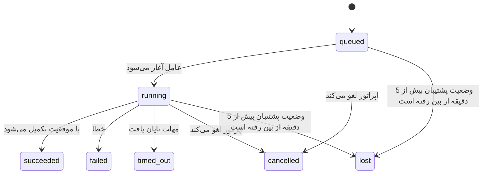

---
read_when:
    - بررسی کارهای پس‌زمینه در حال انجام یا به‌تازگی تکمیل‌شده
    - اشکال‌زدایی خطاهای تحویل در اجرای جداشدهٔ عامل‌ها
    - درک ارتباط اجراهای پس‌زمینه با نشست‌ها، Cron و Heartbeat
sidebarTitle: Background tasks
summary: ردیابی وظایف پس‌زمینه برای اجرای ACP، زیرعامل‌ها، اجرای cron و عملیات CLI
title: وظایف پس‌زمینه
x-i18n:
    generated_at: "2026-07-27T13:42:20Z"
    model: gpt-5.6
    postprocess_version: locale-links-v1
    prompt_version: 32
    provider: openai
    source_hash: dbdc5ced133764fec0c8b9ae7b1957e24272dc9c1c86099de81f6923955d6b5a
    source_path: automation/tasks.md
    workflow: 16
---

<Note>
به‌دنبال زمان‌بندی هستید؟ برای انتخاب سازوکار مناسب، [اتوماسیون](/fa/automation) را ببینید. این صفحه دفتر ثبت فعالیت‌های پس‌زمینه است، نه زمان‌بند.
</Note>

وظایف پس‌زمینه، کارهایی را پیگیری می‌کنند که **خارج از نشست اصلی مکالمه شما** اجرا می‌شوند: اجراهای ACP، ایجاد زیرعامل‌ها، اجرای کارهای Cron و عملیات آغازشده از CLI.

وظایف جایگزین نشست‌ها، کارهای Cron یا Heartbeatها **نمی‌شوند**؛ آن‌ها **دفتر ثبت فعالیت‌ها** هستند که ثبت می‌کند چه کار جداشده‌ای، چه زمانی انجام شده و آیا موفق بوده است یا نه.

<Note>
هر اجرای عامل یک وظیفه ایجاد نمی‌کند. نوبت‌های Heartbeat و گفت‌وگوی تعاملی عادی چنین کاری نمی‌کنند. همه اجراهای Cron، ایجادهای ACP، ایجادهای زیرعامل، فرمان‌های عامل CLI ارسال‌شده از طریق Gateway و فرمان‌های پس‌زمینه `exec` که عامل آغاز می‌کند، وظیفه ایجاد می‌کنند.
</Note>

## خلاصه

- وظایف **رکورد** هستند، نه زمان‌بند؛ Cron و Heartbeat تعیین می‌کنند کار _چه زمانی_ اجرا شود و وظایف پیگیری می‌کنند _چه اتفاقی افتاده است_.
- ACP، زیرعامل‌ها، همه کارهای Cron و عملیات CLI وظیفه ایجاد می‌کنند. نوبت‌های Heartbeat چنین کاری نمی‌کنند.
- هر وظیفه از وضعیت‌های `queued → running → terminal` عبور می‌کند (موفق، ناموفق، پایان‌یافته به‌دلیل مهلت، لغوشده یا ازدست‌رفته).
- تا زمانی که زمان اجرای Cron همچنان مالک کار باشد، وظایف Cron فعال می‌مانند؛ اگر وضعیت درون‌حافظه‌ای زمان اجرا از بین رفته باشد، نگه‌داری وظایف پیش از علامت‌گذاری یک وظیفه به‌عنوان ازدست‌رفته، ابتدا تاریخچه پایدار اجرای Cron را بررسی می‌کند.
- تکمیل به‌صورت مبتنی بر ارسال انجام می‌شود: کار جداشده پس از پایان می‌تواند مستقیماً اطلاع‌رسانی کند یا نشست درخواست‌کننده/Heartbeat را بیدار کند؛ بنابراین حلقه‌های نظرسنجی وضعیت معمولاً الگوی مناسبی نیستند.
- اجراهای ایزوله Cron و تکمیل زیرعامل‌ها، پیش از ثبت نهایی پاک‌سازی، در حد توان زبانه‌ها/فرایندهای مرورگر پیگیری‌شده برای نشست فرزند خود را پاک‌سازی می‌کنند.
- تا زمانی که کار زیرعامل‌های نواده همچنان در حال تخلیه است، تحویل ایزوله Cron پاسخ‌های میانی قدیمی والد را سرکوب می‌کند و اگر خروجی نهایی نواده پیش از تحویل برسد، آن را ترجیح می‌دهد.
- اعلان‌های تکمیل مستقیماً به یک کانال تحویل داده می‌شوند یا برای Heartbeat بعدی در صف قرار می‌گیرند.
- `openclaw tasks list` همه وظایف را نشان می‌دهد؛ `openclaw tasks audit` مشکلات را نمایان می‌کند.
- رکوردهای پایانی به‌مدت 7 روز (رکوردهای `lost` به‌مدت 24 ساعت) نگه‌داری و سپس به‌طور خودکار حذف می‌شوند.

## شروع سریع

<Tabs>
  <Tab title="فهرست و فیلتر">
    ```bash
    # فهرست همه وظایف (ابتدا جدیدترین‌ها)
    openclaw tasks list

    # فیلتر بر اساس زمان اجرا یا وضعیت
    openclaw tasks list --runtime acp
    openclaw tasks list --status running
    ```

  </Tab>
  <Tab title="بررسی">
    ```bash
    # نمایش جزئیات یک وظیفه مشخص (بر اساس شناسه وظیفه، شناسه اجرا یا کلید نشست)
    openclaw tasks show <lookup>
    ```
  </Tab>
  <Tab title="لغو و اطلاع‌رسانی">
    ```bash
    # لغو یک وظیفه در حال اجرا (نشست فرزند را متوقف می‌کند)
    openclaw tasks cancel <lookup>

    # تغییر سیاست اطلاع‌رسانی یک وظیفه
    openclaw tasks notify <lookup> state_changes
    ```

  </Tab>
  <Tab title="ممیزی و نگه‌داری">
    ```bash
    # اجرای ممیزی سلامت
    openclaw tasks audit

    # پیش‌نمایش یا اعمال نگه‌داری
    openclaw tasks maintenance
    openclaw tasks maintenance --apply
    ```

  </Tab>
  <Tab title="جریان وظیفه">
    ```bash
    # بررسی وضعیت TaskFlow
    openclaw tasks flow list
    openclaw tasks flow show <lookup>
    openclaw tasks flow cancel <lookup>
    ```
  </Tab>
</Tabs>

## چه چیزهایی وظیفه ایجاد می‌کنند

| منبع                   | نوع زمان اجرا | زمان ایجاد رکورد وظیفه                                                | سیاست پیش‌فرض اطلاع‌رسانی |
| ---------------------- | ------------ | ---------------------------------------------------------------------- | --------------------- |
| اجراهای پس‌زمینه ACP   | `acp`        | ایجاد یک نشست فرزند ACP                                               | `done_only`           |
| هماهنگ‌سازی زیرعامل    | `subagent`   | ایجاد یک زیرعامل از طریق `sessions_spawn`                              | `done_only`           |
| کارهای Cron (همه انواع) | `cron`       | هر اجرای Cron (نشست اصلی و ایزوله)                                    | `silent`              |
| عملیات CLI             | `cli`        | فرمان‌های `openclaw agent` که از طریق Gateway اجرا می‌شوند             | `silent`              |
| کارهای رسانه‌ای عامل   | `cli`        | اجراهای مبتنی بر نشست `image_generate`/`music_generate`/`video_generate` | `silent`              |

<AccordionGroup>
  <Accordion title="پیش‌فرض‌های اطلاع‌رسانی برای Cron و رسانه">
    وظایف Cron (نشست اصلی و ایزوله) از سیاست اطلاع‌رسانی `silent` استفاده می‌کنند؛ آن‌ها برای پیگیری رکورد ایجاد می‌کنند، اما خودشان اعلان وظیفه تولید نمی‌کنند؛ Cron مالک مسیر تحویل خود است.

    اجراهای مبتنی بر نشست `image_generate`، `music_generate` و `video_generate` نیز از سیاست اطلاع‌رسانی `silent` استفاده می‌کنند. آن‌ها همچنان رکورد وظیفه ایجاد می‌کنند، اما تکمیل به‌شکل یک بیدارباش داخلی به نشست عامل اصلی بازگردانده می‌شود تا عامل بتواند پیام پیگیری را بنویسد و رسانه تکمیل‌شده را خودش پیوست کند. عامل درخواست‌کننده از قرارداد عادی پاسخ قابل‌مشاهده خود پیروی می‌کند: پاسخ نهایی خودکار در صورت پیکربندی، یا `message(action="send")` به‌همراه `NO_REPLY` هنگامی که نشست به پاسخ‌های ابزار پیام نیاز دارد. اگر نشست درخواست‌کننده دیگر فعال نباشد یا بیدارباش فعال آن ناموفق شود و عامل تکمیل بخشی یا همه رسانه‌های تولیدشده را از دست بدهد، OpenClaw یک جایگزین مستقیم و تکرارناپذیر را که فقط شامل رسانه‌های ازدست‌رفته است، به مقصد کانال اصلی ارسال می‌کند.

  </Accordion>
  <Accordion title="محافظ اجرای هم‌زمان تولید رسانه">
    تا زمانی که یک وظیفه تولید رسانه مبتنی بر نشست فعال است، `image_generate`، `music_generate` و `video_generate` از تلاش مجدد تصادفی جلوگیری می‌کنند: تکرار فراخوانی برای همان اعلان/درخواست، به‌جای آغاز یک نسخه تکراری، وضعیت وظیفه فعال منطبق را برمی‌گرداند؛ درحالی‌که یک اعلان متمایز می‌تواند وظیفه خودش را آغاز کند. هنگامی که از سمت عامل به جست‌وجوی صریح پیشرفت/وضعیت نیاز دارید، از `action: "status"` استفاده کنید.
  </Accordion>
  <Accordion title="چه چیزهایی وظیفه ایجاد نمی‌کنند">
    - نوبت‌های Heartbeat ـ نشست اصلی؛ [Heartbeat](/fa/gateway/heartbeat) را ببینید
    - نوبت‌های گفت‌وگوی تعاملی عادی
    - پاسخ‌های مستقیم `/command`

  </Accordion>
</AccordionGroup>

## چرخه عمر وظیفه



| وضعیت      | معنی آن                                                               |
| ----------- | --------------------------------------------------------------------------- |
| `queued`    | ایجاد شده و منتظر آغاز عامل است                                      |
| `running`   | نوبت عامل فعالانه در حال اجرا است                                    |
| `succeeded` | با موفقیت تکمیل شده است                                                |
| `failed`    | با خطا تکمیل شده است                                                   |
| `timed_out` | از مهلت پیکربندی‌شده فراتر رفته است                                    |
| `cancelled` | اپراتور آن را از طریق `openclaw tasks cancel` متوقف کرده یا اجرا خاتمه داده شده است |
| `lost`      | زمان اجرا پس از یک دوره ارفاق 5 دقیقه‌ای، وضعیت پشتیبان معتبر را از دست داده است |

انتقال‌ها به‌طور خودکار انجام می‌شوند؛ رویدادهای چرخه عمر اجرای عامل (آغاز، پایان، خطا) وضعیت وظیفه را به‌روزرسانی می‌کنند و نیازی نیست آن را به‌صورت دستی مدیریت کنید.

تکمیل اجرای عامل برای رکوردهای وظیفه فعال مرجع نهایی است. اجرای جداشده موفق با وضعیت `succeeded` نهایی می‌شود، خطاهای عادی اجرا با `failed`، پایان مهلت‌ها با `timed_out` و نتایج لغو/خاتمه با `cancelled` نهایی می‌شوند. هنگامی که یک وظیفه پایانی شود، سیگنال‌های بعدی چرخه عمر وضعیت آن را تنزل نمی‌دهند؛ وظیفه‌ای که اپراتور لغو کرده یا از قبل `failed`/`timed_out`/`lost` است، حتی اگر پس از آن سیگنال موفقیت برسد، در همان وضعیت باقی می‌ماند.

`lost` از زمان اجرا آگاه است:

- وظایف ACP: فقط یک نوبت ACP زنده و درون‌فرایندی در Gateway ثابت می‌کند که اجرا زنده است؛ فراداده پایدار نشست به‌تنهایی کافی نیست. ممیزی آفلاین CLI محافظه‌کارانه عمل می‌کند و هرگز وظایف ACP را بازپس‌گیری نمی‌کند.
- وظایف زیرعامل: نشست فرزند پشتیبان از مخزن عامل مقصد ناپدید شده است (یا سنگ‌قبر بازیابی پس از راه‌اندازی مجدد دارد).
- وظایف Cron: زمان اجرای Cron دیگر کار را به‌عنوان فعال پیگیری نمی‌کند و تاریخچه پایدار اجرای Cron هیچ نتیجه پایانی برای آن اجرا نشان نمی‌دهد. ممیزی آفلاین CLI وضعیت خالی زمان اجرای Cron درون‌فرایندی خودش را مرجع معتبر در نظر نمی‌گیرد.
- وظایف CLI: وظایفی که شناسه اجرا/شناسه منبع دارند از زمینه اجرای زنده استفاده می‌کنند؛ بنابراین پس از ناپدیدشدن اجرای تحت مالکیت Gateway، باقی‌ماندن ردیف‌های نشست فرزند یا نشست گفت‌وگو آن‌ها را زنده نگه نمی‌دارد. وظایف قدیمی CLI بدون هویت اجرا همچنان از نشست فرزند به‌عنوان جایگزین استفاده می‌کنند. اجراهای مبتنی بر Gatewayِ `openclaw agent` نیز از نتیجه اجرای خود نهایی می‌شوند؛ بنابراین اجراهای تکمیل‌شده تا زمانی که پاک‌ساز آن‌ها را `lost` علامت‌گذاری کند، فعال باقی نمی‌مانند.

## تحویل و اعلان‌ها

هنگامی که یک وظیفه به وضعیت پایانی می‌رسد، OpenClaw به شما اطلاع می‌دهد. دو مسیر تحویل وجود دارد:

**تحویل مستقیم** ـ اگر وظیفه مقصد کانال داشته باشد (`requesterOrigin`)، پیام تکمیل مستقیماً به همان کانال می‌رود (Discord، Slack، Telegram و غیره). در عوض، تکمیل وظایف گروه و کانال از طریق نشست درخواست‌کننده مسیریابی می‌شود تا عامل والد بتواند پاسخ قابل‌مشاهده را بنویسد. برای تکمیل زیرعامل‌ها، OpenClaw همچنین مسیریابی وابسته رشته/موضوع را در صورت وجود حفظ می‌کند و پیش از صرف‌نظرکردن از تحویل مستقیم، می‌تواند `to` / حساب ازدست‌رفته را از مسیر ذخیره‌شده نشست درخواست‌کننده (`lastChannel` / `lastTo` / `lastAccountId`) تکمیل کند.

**تحویل در صف نشست** ـ اگر تحویل مستقیم ناموفق باشد یا هیچ مبدأیی تنظیم نشده باشد، به‌روزرسانی به‌عنوان یک رویداد سیستمی در نشست درخواست‌کننده در صف قرار می‌گیرد و در Heartbeat بعدی نمایش داده می‌شود.

<Tip>
تکمیل وظایف در صف نشست، بیدارباش فوری Heartbeat را فعال می‌کند؛ بنابراین نتیجه را سریع می‌بینید و لازم نیست تا نوبت برنامه‌ریزی‌شده بعدی Heartbeat منتظر بمانید.
</Tip>

یعنی گردش کار معمول مبتنی بر ارسال است: کار جداشده را یک‌بار آغاز کنید، سپس اجازه دهید زمان اجرا پس از تکمیل شما را بیدار کند یا اطلاع دهد. فقط هنگامی وضعیت وظیفه را نظرسنجی کنید که به اشکال‌زدایی، مداخله یا ممیزی صریح نیاز دارید.

### سیاست‌های اطلاع‌رسانی

میزان اطلاع‌رسانی درباره هر وظیفه را کنترل کنید:

| سیاست                | آنچه تحویل داده می‌شود                                       |
| --------------------- | ------------------------------------------------------- |
| `done_only` (پیش‌فرض) | فقط وضعیت پایانی (موفق، ناموفق و غیره)                 |
| `state_changes`       | هر انتقال وضعیت و به‌روزرسانی پیشرفت                     |
| `silent`              | هیچ‌چیز (پیش‌فرض برای وظایف Cron، CLI و رسانه)          |

سیاست را هنگام اجرای یک وظیفه تغییر دهید:

```bash
openclaw tasks notify <lookup> state_changes
```

## مرجع CLI

<AccordionGroup>
  <Accordion title="tasks list">
    ```bash
    openclaw tasks list [--runtime <acp|subagent|cron|cli>] [--status <status>] [--json]
    ```

    ستون‌های خروجی: وظیفه، نوع، وضعیت، تحویل، اجرا، نشست فرزند، خلاصه. `openclaw tasks` بدون آرگومان مانند `openclaw tasks list` عمل می‌کند.

  </Accordion>
  <Accordion title="tasks show">
    ```bash
    openclaw tasks show <lookup> [--json]
    ```

    نشانه جست‌وجو یک شناسه وظیفه، شناسه اجرا یا کلید نشست را می‌پذیرد. رکورد کامل شامل زمان‌بندی، وضعیت تحویل، خطا و خلاصه پایانی را نمایش می‌دهد.

  </Accordion>
  <Accordion title="tasks cancel">
    ```bash
    openclaw tasks cancel <lookup>
    ```

    برای وظایف ACP و زیرعامل، این کار نشست فرزند را خاتمه می‌دهد؛ لغوهای ACP و Cron از طریق Gateway در حال اجرا هدایت می‌شوند (`tasks.cancel`). برای وظایف رهگیری‌شده توسط CLI، لغو در رجیستری وظایف ثبت می‌شود (هیچ هندل زمان‌اجرای فرزند جداگانه‌ای وجود ندارد). وضعیت به `cancelled` تغییر می‌کند و در صورت کاربرد، اعلان تحویل ارسال می‌شود.

  </Accordion>
  <Accordion title="اعلان وظایف">
    ```bash
    openclaw tasks notify <lookup> <done_only|state_changes|silent>
    ```
  </Accordion>
  <Accordion title="ممیزی وظایف">
    ```bash
    openclaw tasks audit [--severity <warn|error>] [--code <name>] [--limit <n>] [--json]
    ```

    مشکلات عملیاتی وظایف **و** TaskFlowها را در یک گزارش نمایش می‌دهد. هنگام شناسایی مشکلات، یافته‌ها در `openclaw status` نیز ظاهر می‌شوند.

    یافته‌های وظایف:

    | یافته                   | شدت   | محرک                                                                                                      |
    | ------------------------- | ---------- | ------------------------------------------------------------------------------------------------------------ |
    | `stale_queued`            | هشدار       | بیش از 10 دقیقه در صف مانده است                                                                              |
    | `stale_running`           | خطا      | بیش از 30 دقیقه در حال اجرا بوده است                                                                             |
    | `lost`                    | هشدار/خطا | مالکیت وظیفه متکی به زمان‌اجرا ناپدید شده است؛ وظایف مفقودِ نگه‌داری‌شده تا `cleanupAfter` هشدار می‌دهند و سپس به خطا تبدیل می‌شوند |
    | `delivery_failed`         | هشدار       | تحویل ناموفق بوده و سیاست اعلان `silent` نیست                                                            |
    | `missing_cleanup`         | هشدار       | وظیفه پایانی بدون مهر زمانی پاک‌سازی                                                                      |
    | `inconsistent_timestamps` | هشدار       | نقض خط زمانی (برای مثال، پیش از شروع پایان یافته است)                                                        |

    یافته‌های TaskFlow:

    | یافته                | شدت   | محرک                                                                    |
    | ---------------------- | ---------- | --------------------------------------------------------------------------- |
    | `restore_failed`       | خطا      | بازیابی رجیستری جریان از SQLite ناموفق بود                                    |
    | `stale_running`        | خطا      | جریان در حال اجرا بیش از 30 دقیقه پیشرفتی نداشته است                      |
    | `stale_waiting`        | هشدار       | جریان منتظر بیش از 30 دقیقه پیشرفتی نداشته است                      |
    | `stale_blocked`        | هشدار       | جریان مسدودشده بیش از 30 دقیقه پیشرفتی نداشته است                      |
    | `cancel_stuck`         | هشدار       | لغو بیش از 5 دقیقه پیش درخواست شده، هیچ وظیفه فرزند فعالی وجود ندارد و جریان همچنان ناپایانی است |
    | `missing_linked_tasks` | هشدار/خطا | جریان مدیریت‌شده قدیمی بدون وظیفه پیوندخورده یا حالت انتظار                       |
    | `blocked_task_missing` | هشدار       | جریان مسدودشده به شناسه وظیفه‌ای اشاره می‌کند که دیگر وجود ندارد                      |

  </Accordion>
  <Accordion title="نگه‌داری وظایف">
    ```bash
    openclaw tasks maintenance [--json]
    openclaw tasks maintenance --apply [--json]
    ```

    از این فرمان برای پیش‌نمایش یا اعمال تطبیق، ثبت مهر پاک‌سازی و هرس‌کردن وظایف، وضعیت TaskFlow و ردیف‌های قدیمی رجیستری نشست اجرای Cron استفاده کنید.

    تطبیق از زمان‌اجرا آگاه است:

    - وظایف ACP به یک نوبت زنده درون‌فرایندی در Gateway نیاز دارند؛ وظایف زیرعامل نشست فرزند پشتیبان خود را بررسی می‌کنند.
    - وظایف زیرعاملی که نشست فرزندشان سنگ‌قبر بازیابی پس از راه‌اندازی مجدد دارد، به‌جای تلقی‌شدن به‌عنوان نشست‌های پشتیبان قابل‌بازیابی، مفقود علامت‌گذاری می‌شوند.
    - وظایف Cron بررسی می‌کنند که آیا زمان‌اجرای Cron هنوز مالک کار است، سپس پیش از بازگشت به `lost`، وضعیت پایانی را از گزارش‌های پایدار اجرای Cron یا وضعیت کار بازیابی می‌کنند. فقط فرایند Gateway برای مجموعه درون‌حافظه‌ای کارهای فعال Cron مرجع معتبر است؛ ممیزی آفلاین CLI از تاریخچه پایدار استفاده می‌کند، اما صرفاً به‌دلیل خالی‌بودن آن مجموعه محلی، یک وظیفه Cron را مفقود علامت‌گذاری نمی‌کند.
    - وظایف CLI دارای هویت اجرا، زمینه اجرای زنده مالک را بررسی می‌کنند، نه فقط ردیف‌های نشست فرزند یا نشست گفت‌وگو را.

    پاک‌سازی تکمیل نیز از زمان‌اجرا آگاه است:

    - تکمیل زیرعامل، پیش از ادامه پاک‌سازی اعلان، به‌صورت بهترین‌تلاش زبانه‌ها و فرایندهای مرورگر رهگیری‌شده برای نشست فرزند را می‌بندد.
    - تکمیل Cron ایزوله، پیش از برچیده‌شدن کامل اجرا، به‌صورت بهترین‌تلاش زبانه‌ها و فرایندهای مرورگر رهگیری‌شده برای نشست Cron را می‌بندد.
    - تحویل Cron ایزوله، در صورت نیاز منتظر پایان پیگیری زیرعامل‌های نواده می‌ماند و به‌جای اعلام متن تأیید قدیمی والد، آن را سرکوب می‌کند.
    - تحویل تکمیل زیرعامل فقط از آخرین متن قابل‌مشاهده دستیار در فرزند استفاده می‌کند. خروجی tool/toolResult به متن نتیجه فرزند ارتقا نمی‌یابد. اجراهای پایانی ناموفق، وضعیت شکست را بدون بازپخش متن پاسخ ضبط‌شده اعلام می‌کنند.
    - شکست‌های پاک‌سازی نتیجه واقعی وظیفه را پنهان نمی‌کنند.

    هنگام اعمال نگه‌داری، OpenClaw همچنین ردیف‌های قدیمی رجیستری نشست `cron:<jobId>:run:<runId>` با عمر بیش از 7 روز را حذف می‌کند، در حالی که ردیف‌های مربوط به کارهای Cron در حال اجرا را حفظ می‌کند و ردیف‌های نشست غیرCron را دست‌نخورده باقی می‌گذارد.

  </Accordion>
  <Accordion title="فهرست | نمایش | لغو جریان وظایف">
    ```bash
    openclaw tasks flow list [--status <status>] [--json]
    openclaw tasks flow show <lookup> [--json]
    openclaw tasks flow cancel <lookup>
    ```

    توکن جست‌وجوی جریان یک شناسه جریان یا کلید مالک را می‌پذیرد. هنگامی از این فرمان‌ها استفاده کنید که [Task Flow](/fa/automation/taskflow) هماهنگ‌کننده برایتان مهم است، نه یک رکورد منفرد وظیفه پس‌زمینه.

  </Accordion>
</AccordionGroup>

## تابلوی وظایف گفت‌وگو (`/tasks`)

در هر نشست گفت‌وگو از `/tasks` استفاده کنید تا وظایف پس‌زمینه پیوندخورده به آن نشست را ببینید. تابلو حداکثر پنج وظیفه فعال و به‌تازگی تکمیل‌شده را همراه با زمان‌اجرا، وضعیت، زمان‌بندی و جزئیات پیشرفت یا خطا نمایش می‌دهد.

وقتی نشست فعلی هیچ وظیفه پیوندخورده قابل‌مشاهده‌ای ندارد، `/tasks` به تعداد وظایف محلی عامل برمی‌گردد تا بدون افشای جزئیات نشست‌های دیگر، همچنان یک نمای کلی ارائه شود.

برای دفترکل کامل اپراتور، از CLI استفاده کنید: `openclaw tasks list`.

### رابط کاربری کنترل

رابط کاربری کنترل وب، صفحه **وظایف** را در نوار کناری دارد که وظایف پس‌زمینه فعال و اخیر را به‌صورت زنده نشان می‌دهد. از آن برای بررسی پیشرفت، بازکردن نشست‌های پیوندخورده، تازه‌سازی دفترکل یا لغو وظایف در صف و در حال اجرا استفاده کنید.

پنجره‌های گفت‌وگو همچنین یک نوار جمع‌شونده **وظایف پس‌زمینه** با دامنه عامل همان پنجره دارند: وظایف و زیرعامل‌های در حال اجرا همراه با کنترل توقف، یک بخش پایان‌یافته‌ها و پیوندهای مشاهده رونوشت به نشست فرزند هر وظیفه. آن را از کلید فعالیت در سربرگ پنجره (یا دکمه شناور فعالیت در گفت‌وگوی تک‌پنجره‌ای) باز کنید.

برای بررسی اعلان ورودی محدودشده و آخرین خروجی یا خلاصه خطا، یک وظیفه را در نوار انتخاب کنید. کارهای در حال اجرا از کارهای پایان‌یافته جدا می‌مانند و ردیف‌های پایان‌یافته نشان می‌دهند که وظیفه تکمیل شده یا شکست خورده است. در iOS، **Chat actions → Background Tasks** را باز کنید؛ در Android، منوی سرریز Chat را باز کرده و **Background tasks** را انتخاب کنید. هر دو نمای موبایل از گروه‌بندی یکسان Running و Finished استفاده می‌کنند و با انتخاب، جزئیات وظیفه را باز می‌کنند.

## یکپارچه‌سازی وضعیت (فشار وظایف)

`openclaw status` یک خط خلاصه وظایف را شامل می‌شود:

```
وظایف    2 فعال · 1 در صف · 1 در حال اجرا · 1 مشکل · ممیزی پاک · 6 رهگیری‌شده
```

خلاصه، کار فعال (`queued` + `running`)، شکست‌ها (`failed` + `timed_out` + `lost`)، یافته‌های ممیزی و کل رکوردهای رهگیری‌شده را می‌شمارد؛ بار JSON نیز شمارش‌ها را بر اساس زمان‌اجرا تفکیک می‌کند (`acp`، `subagent`، `cron`، `cli`).

هم `/status` و هم ابزار `session_status` از تصویری از وظایف استفاده می‌کنند که از پاک‌سازی آگاه است: وظایف فعال در اولویت‌اند، ردیف‌های منقضی پنهان می‌شوند و وظایف پایانی فقط برای یک بازه کوتاه اخیر (5 دقیقه) ظاهر می‌شوند؛ وقتی هیچ کار فعالی باقی نمانده باشد، تمرکز بر شکست‌هاست. این کار کارت وضعیت را بر آنچه همین حالا اهمیت دارد متمرکز نگه می‌دارد.

## ذخیره‌سازی و نگه‌داری

### محل نگه‌داری وظایف

رکوردهای وظایف و وضعیت تحویل در پایگاه داده مشترک وضعیت SQLite متعلق به OpenClaw پایدار می‌مانند:

```
~/.openclaw/state/openclaw.sqlite   (جداول: task_runs, task_delivery_state, flow_runs)
```

برای انتقال کل ریشه وضعیت (پیش‌فرض `~/.openclaw`) به مکانی دیگر، `OPENCLAW_STATE_DIR` را تنظیم کنید؛ مسیر پایگاه داده مشترک نیز همراه آن منتقل می‌شود.

رجیستری در نخستین استفاده در حافظه بارگذاری می‌شود و هر نوشتن را دوباره در SQLite پایدار می‌کند، بنابراین رکوردها پس از راه‌اندازی مجدد Gateway باقی می‌مانند. رشد WAL از طریق آستانه پیش‌فرض وارسی خودکار SQLite و نقاط وارسی دوره‌ای `PASSIVE` محدود می‌ماند؛ نقاط وارسی هنگام خاموش‌شدن و نگه‌داری صریح از `TRUNCATE` استفاده می‌کنند تا بسته‌شدن‌های عادی فضای WAL را بدون منتظرگذاشتن جاروبگر پس‌زمینه برای خوانندگان فعال بازیابی کنند.

ذخیره‌گاه‌های جانبی قدیمی از نصب‌های پیشین (`tasks/runs.sqlite`، `flows/registry.sqlite`) توسط `openclaw doctor` به پایگاه داده مشترک وارد می‌شوند.

### نگه‌داری خودکار

یک جاروبگر هر **60 ثانیه** اجرا می‌شود (نخستین گذر حدود 5 ثانیه پس از شروع Gateway) و چهار مورد را مدیریت می‌کند:

<Steps>
  <Step title="تطبیق">
    بررسی می‌کند که آیا وظایف فعال هنوز پشتیبانی معتبر زمان‌اجرا دارند یا نه. وظایف ACP به یک نوبت زنده درون‌فرایندی نیاز دارند، وظایف زیرعامل از وضعیت نشست فرزند استفاده می‌کنند، وظایف Cron از مالکیت کار فعال به‌همراه تاریخچه پایدار اجرا استفاده می‌کنند و وظایف CLI دارای هویت اجرا از زمینه اجرای مالک استفاده می‌کنند. اگر وضعیت پشتیبان بیش از 5 دقیقه (برای وظایف بومی زیرعامل بدون فرزند، 30 دقیقه) از بین رفته باشد، وظیفه `lost` علامت‌گذاری می‌شود.
  </Step>
  <Step title="ترمیم نشست ACP">
    نشست‌های یک‌باره ACP متعلق به والد را که پایانی یا بی‌سرپرست هستند می‌بندد، و نشست‌های پایدار ACP قدیمیِ پایانی یا بی‌سرپرست را فقط زمانی می‌بندد که هیچ پیوند گفت‌وگوی فعالی باقی نمانده باشد.
  </Step>
  <Step title="ثبت مهر پاک‌سازی">
    یک مهر زمانی `cleanupAfter` را روی وظایف پایانی تنظیم می‌کند (زمان پایان + بازه نگه‌داری). در طول نگه‌داری، وظایف مفقود همچنان در ممیزی به‌عنوان هشدار ظاهر می‌شوند؛ پس از انقضای `cleanupAfter` یا هنگامی که فراداده پاک‌سازی وجود ندارد، به خطا تبدیل می‌شوند.
  </Step>
  <Step title="هرس‌کردن">
    رکوردهای پس از تاریخ `cleanupAfter` خود را حذف می‌کند.
  </Step>
</Steps>

<Note>
**نگه‌داری:** رکوردهای وظایف پایانی به‌مدت **7 روز** نگه داشته می‌شوند (رکوردهای `lost` به‌مدت **24 ساعت**) و سپس به‌طور خودکار هرس می‌شوند. نیازی به پیکربندی نیست.
</Note>

## ارتباط وظایف با سامانه‌های دیگر

<AccordionGroup>
  <Accordion title="وظایف و Task Flow">
    [Task Flow](/fa/automation/taskflow) لایه هماهنگ‌سازی جریان در بالای وظایف پس‌زمینه است. یک جریان منفرد ممکن است در طول عمر خود با استفاده از حالت‌های همگام‌سازی مدیریت‌شده یا آینه‌ای، چندین وظیفه را هماهنگ کند. برای بررسی رکوردهای منفرد وظیفه از `openclaw tasks` و برای بررسی جریان هماهنگ‌کننده از `openclaw tasks flow` استفاده کنید.

  </Accordion>
  <Accordion title="وظایف و Cron">
    تعریف‌های کار Cron، وضعیت اجرای زمان‌اجرا و تاریخچه اجرا در پایگاه داده مشترک وضعیت SQLite متعلق به OpenClaw قرار دارند. **هر** اجرای Cron، چه نشست اصلی و چه ایزوله، یک رکورد وظیفه با سیاست اعلان `silent` ایجاد می‌کند؛ بنابراین اجراهای Cron بدون ایجاد اعلان وظیفه مستقل رهگیری می‌شوند.

    [کارهای Cron](/fa/automation/cron-jobs) را ببینید.

  </Accordion>
  <Accordion title="وظایف و Heartbeat">
    اجراهای Heartbeat نوبت‌های نشست اصلی هستند و رکورد وظیفه ایجاد نمی‌کنند. هنگامی که یک وظیفه تکمیل می‌شود، می‌تواند بیدارباش Heartbeat را فعال کند تا نتیجه را سریع ببینید.

    [Heartbeat](/fa/gateway/heartbeat) را ببینید.

  </Accordion>
  <Accordion title="وظایف و نشست‌ها">
    یک وظیفه ممکن است به یک `childSessionKey` (محل اجرای کار) و یک `requesterSessionKey` (فردی که آن را آغاز کرده است) ارجاع دهد. `agentId` آن، عامل اجراکنندهٔ کار را مشخص می‌کند، درحالی‌که فیلدهای درخواست‌کننده و مالک، زمینهٔ راه‌اندازی و کنترل را حفظ می‌کنند. نشست‌ها زمینهٔ مکالمه هستند؛ وظایف، لایه‌ای برای پیگیری فعالیت بر روی آن هستند.
  </Accordion>
  <Accordion title="وظایف و اجراهای عامل">
    `runId` یک وظیفه به اجرای عاملی که کار را انجام می‌دهد پیوند دارد. رویدادهای چرخهٔ عمر عامل (شروع، پایان، خطا) به‌طور خودکار وضعیت وظیفه را به‌روزرسانی می‌کنند؛ نیازی نیست چرخهٔ عمر را به‌صورت دستی مدیریت کنید.
  </Accordion>
</AccordionGroup>

## مرتبط

- [خودکارسازی](/fa/automation) - همهٔ سازوکارهای خودکارسازی در یک نگاه
- [CLI: وظایف](/fa/cli/tasks) - مرجع فرمان‌های CLI
- [Heartbeat](/fa/gateway/heartbeat) - نوبت‌های دوره‌ای نشست اصلی
- [وظایف زمان‌بندی‌شده](/fa/automation/cron-jobs) - زمان‌بندی کارهای پس‌زمینه
- [جریان وظیفه](/fa/automation/taskflow) - هماهنگ‌سازی جریان در سطحی بالاتر از وظایف
