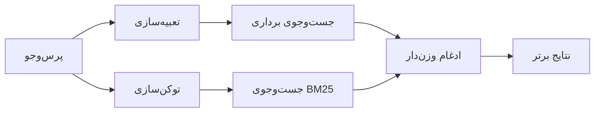

---
read_when:
    - می‌خواهید بدانید memory_search چگونه کار می‌کند
    - می‌خواهید یک ارائه‌دهندهٔ امبدینگ انتخاب کنید
    - می‌خواهید کیفیت جست‌وجو را تنظیم کنید
summary: جست‌وجوی حافظه چگونه با استفاده از تعبیه‌سازی‌ها و بازیابی ترکیبی، یادداشت‌های مرتبط را پیدا می‌کند
title: جست‌وجوی حافظه
x-i18n:
    generated_at: "2026-07-27T15:23:08Z"
    model: gpt-5.6
    postprocess_version: locale-links-v1
    prompt_version: 32
    provider: openai
    source_hash: b2bd28b63ac55a2a890ed70a3015f76f1c7fbaa792b17a6ead51f4c8712fbd2d
    source_path: concepts/memory-search.md
    workflow: 16
---

`memory_search` یادداشت‌های مرتبط را از فایل‌های حافظه پیدا می‌کند، حتی زمانی که
عبارت‌بندی با متن اصلی متفاوت باشد. حافظه را به بخش‌های کوچک تقسیم می‌کند و
آن‌ها را با تعبیه‌سازی‌ها، کلیدواژه‌ها یا هر دو جست‌وجو می‌کند.

## شروع سریع

OpenClaw به‌طور پیش‌فرض از تعبیه‌سازی‌های OpenAI استفاده می‌کند. برای استفاده از ارائه‌دهنده‌ای دیگر، آن را
صریحاً تنظیم کنید:

```json5
{
  memory: {
    search: {
      provider: "openai", // یا "gemini"، "voyage"، "mistral"، "bedrock"، "local"، "ollama"، "lmstudio"، "github-copilot"، "openai-compatible"
    },
  },
}
```

`provider` همچنین می‌تواند به یک ورودی سفارشی `models.providers.<id>` ارجاع دهد (برای
مثال `ollama-5080`)؛ به‌شرط آنکه آن ورودی، `api` را روی `"ollama"` یا
شناسه ارائه‌دهنده دیگری دارای آداپتور تعبیه‌سازی حافظه تنظیم کند.

برای تعبیه‌سازی محلی بدون کلید API، Plugin رسمی ارائه‌دهنده llama.cpp را نصب
و `provider: "local"` را تنظیم کنید:

```bash
openclaw plugins install @openclaw/llama-cpp-provider
```

نسخه‌های دریافت‌شده از کد منبع همچنان به تأیید ساخت بومی نیاز دارند: `pnpm approve-builds`، سپس
`pnpm rebuild node-llama-cpp`.

برخی نقاط پایانی تعبیه‌سازی سازگار با OpenAI به برچسب‌های نامتقارن `input_type`
نیاز دارند؛ مانند `"query"` برای جست‌وجوها و `"document"`/`"passage"` برای قطعه‌های
نمایه‌شده. این موارد را با `queryInputType` و `documentInputType` تنظیم کنید؛ به
[مرجع پیکربندی حافظه](/fa/reference/memory-config#provider-specific-config) مراجعه کنید.

## ارائه‌دهندگان پشتیبانی‌شده

| ارائه‌دهنده       | شناسه               | نیازمند کلید API | توضیحات                                  |
| ----------------- | ------------------- | ------------- | --------------------------------- |
| Bedrock           | `bedrock`           | خیر           | از زنجیره اعتبارنامه AWS استفاده می‌کند |
| DeepInfra         | `deepinfra`         | بله           | مدل پیش‌فرض `BAAI/bge-m3`           |
| Gemini            | `gemini`            | بله           | از نمایه‌سازی تصویر/صدا پشتیبانی می‌کند  |
| GitHub Copilot    | `github-copilot`    | خیر           | از اشتراک Copilot شما استفاده می‌کند     |
| محلی              | `local`             | خیر           | مدل GGUF، بارگیری خودکار حدود 0.6 GB     |
| LM Studio         | `lmstudio`          | خیر           | سرور محلی/خودمیزبان                       |
| Mistral           | `mistral`           | بله           |                                           |
| Ollama            | `ollama`            | خیر           | سرور محلی/خودمیزبان                       |
| OpenAI            | `openai`            | بله           | پیش‌فرض                                    |
| سازگار با OpenAI  | `openai-compatible` | معمولاً       | نقطه پایانی عمومی `/v1/embeddings`     |
| Voyage            | `voyage`            | بله           |                                           |

## نحوه کار جست‌وجو

OpenClaw دو مسیر بازیابی را به‌صورت موازی اجرا و نتایج را ادغام می‌کند:



- **جست‌وجوی برداری** معناهای مشابه را تطبیق می‌دهد («میزبان Gateway» با «
  دستگاهی که OpenClaw را اجرا می‌کند» تطبیق دارد).
- **جست‌وجوی کلیدواژه‌ای BM25** عبارت‌های دقیق را تطبیق می‌دهد (شناسه‌ها، رشته‌های خطا، کلیدهای
  پیکربندی).
- **جست‌وجوی نام فایل** مسیرها را جدا از بدنه یادداشت‌ها نمایه‌سازی می‌کند. مسیرهای کامل و دقیق،
  نام‌های پایه و بن‌نام فایل بالاتر از تطبیق‌های جزئی مسیر رتبه می‌گیرند،
  درحالی‌که قطعه‌متن‌ها و امتیازهای کلیدواژه‌ای بدنه همچنان از محتوای یادداشت به‌دست می‌آیند.

اگر فقط یک مسیر در دسترس باشد، همان مسیر به‌تنهایی اجرا می‌شود.

**حالت فقط FTS.** برای غیرفعال‌کردن عمدی تعبیه‌سازی‌ها و
جست‌وجو فقط با کلیدواژه‌ها، `provider: "none"` را تنظیم کنید. تنظیم‌نکردن `provider` یا تنظیم آن روی `"auto"`
نیز اگر هیچ احراز هویت تعبیه‌سازی پیکربندی نشده باشد، بدون ایجاد خطا
به رتبه‌بندی فقط کلیدواژه‌ای بازمی‌گردد؛ `provider: "local"` (ارائه‌دهنده
GGUF/llama.cpp) نیز هنگام شکست همین رفتار را دارد.

**در دسترس نبودن ارائه‌دهنده صریح.** اگر هر ارائه‌دهنده دیگری را صریحاً نام ببرید
(برای مثال `openai`، `ollama`، `gemini`) و در زمان
درخواست از دسترس خارج شود (احراز هویت نامعتبر، شکست شبکه)، `memory_search` به‌جای تنزل بی‌سروصدا به نتایج فقط FTS،
حافظه را در دسترس‌ناپذیر گزارش می‌کند. این رفتار باعث می‌شود خرابی ارائه‌دهنده پیکربندی‌شده
قابل مشاهده بماند. برای بازیابی عمدی فقط FTS، `provider: "none"` را تنظیم کنید،
یا برای بازیابی رتبه‌بندی معنایی، پیکربندی ارائه‌دهنده/احراز هویت را اصلاح کنید.

## بهبود کیفیت جست‌وجو

دو قابلیت اختیاری برای تاریخچه بزرگ یادداشت‌ها مفید هستند.

### زوال زمانی

یادداشت‌های قدیمی به‌تدریج وزن رتبه‌بندی خود را از دست می‌دهند تا اطلاعات جدیدتر ابتدا نمایش داده شوند.
با نیمه‌عمر پیش‌فرض 30روزه، امتیاز یادداشتی از ماه گذشته به 50% وزن
اصلی آن می‌رسد. `MEMORY.md` و دیگر فایل‌های بدون تاریخ زیر `memory/`
همیشگی هستند و هرگز دچار زوال نمی‌شوند؛ فقط فایل‌های تاریخ‌دار `memory/YYYY-MM-DD.md` زوال می‌یابند.

<Tip>
اگر عامل شما چندین ماه یادداشت روزانه دارد و اطلاعات قدیمی
همچنان بالاتر از زمینه جدید رتبه می‌گیرند، این قابلیت را فعال کنید.
</Tip>

### MMR (تنوع)

نتایج تکراری را کاهش می‌دهد. اگر پنج یادداشت همگی به پیکربندی یکسان مسیریاب اشاره کنند،
MMR تضمین می‌کند نتایج برتر به‌جای تکرار، موضوعات متفاوتی را پوشش دهند.

<Tip>
اگر `memory_search` پیوسته قطعه‌متن‌های تقریباً تکراری را از
یادداشت‌های روزانه متفاوت بازمی‌گرداند، این قابلیت را فعال کنید.
</Tip>

### فعال‌کردن هر دو

```json5
{
  memory: {
    search: {
      query: {
        hybrid: {
          mmr: { enabled: true },
          temporalDecay: { enabled: true },
        },
      },
    },
  },
}
```

## حافظه چندوجهی

با `gemini-embedding-2-preview` می‌توانید تصاویر و صدا را در کنار
Markdown نمایه‌سازی کنید. این قابلیت فقط برای فایل‌های زیر `memory.search.extraPaths` اعمال می‌شود؛ ریشه‌های پیش‌فرض
حافظه (`MEMORY.md`، `memory/*.md`) فقط Markdown باقی می‌مانند. پرس‌وجوهای جست‌وجو
همچنان متنی هستند، اما با محتوای دیداری و صوتی تطبیق داده می‌شوند. برای راه‌اندازی به
[مرجع پیکربندی حافظه](/fa/reference/memory-config#multimodal-memory-gemini)
مراجعه کنید.

## جست‌وجوی حافظه نشست

برای بازیابی دقیق تمام‌متن از رونوشت‌های نشست، از [`sessions_search`](/fa/concepts/session-search)
استفاده کنید و سپس یک نتیجه را با `sessions_history` باز کنید. جست‌وجوی حافظه نشست، مکمل معنایی
و آزمایشی باقی می‌ماند.

در صورت تمایل، رونوشت‌های نشست را نمایه‌سازی کنید تا `memory_search` بتواند گفت‌وگوهای
قبلی را بازیابی کند. این قابلیت انتخابی است: `experimental.sessionMemory: true` را تنظیم کنید و
`"sessions"` را به `sources` اضافه کنید (`sources` پیش‌فرض، `["memory"]` است).

نتایج نشست از `tools.sessions.visibility` پیروی می‌کنند: مقدار پیش‌فرض `"tree"`،
نشست جاری، نشست‌های ایجادشده توسط آن و نشست‌های گروهی همان عامل را که از طریق
آگاهی محیطی گروه رصد می‌شوند، در دسترس قرار می‌دهد. با `session.dmScope: "main"`،
یک راه‌اندازی پیام مستقیم چندکاربره آن نشست اصلی را به‌اشتراک می‌گذارد؛ بنابراین کاربرانی که به آن هدایت می‌شوند می‌توانند محتوای
گروه‌های رصدشده آن را بازیابی کنند. برای جداسازی پیام مستقیم، از یک `dmScope` به‌ازای هر همتا استفاده کنید، یا
نمایانی را روی `"self"` تنظیم کنید تا از خواندن نشست‌های رصدشده محیطی انصراف دهید. دیگر
نشست‌های نامرتبط همان عامل همچنان به نمایانی `"agent"` نیاز دارند.

هنگام استفاده از پشتیبان QMD، `memory.qmd.sessions.enabled: true` را نیز تنظیم کنید تا
رونوشت‌ها به مجموعه QMD صادر شوند؛ `experimental.sessionMemory`
و `sources` به‌تنهایی رونوشت‌ها را به QMD صادر نمی‌کنند. به
[مرجع پیکربندی](/fa/reference/memory-config#session-memory-search-experimental) مراجعه کنید.

## عیب‌یابی

**نتیجه‌ای پیدا نمی‌شود؟** برای بررسی نمایه، `openclaw memory status` را اجرا کنید. اگر خالی است،
`openclaw memory index --force` را اجرا کنید.

**فقط تطبیق‌های کلیدواژه‌ای؟** ممکن است ارائه‌دهنده تعبیه‌سازی شما پیکربندی نشده باشد.
`openclaw memory status --deep` را بررسی کنید.

**تعبیه‌سازی‌های محلی مهلت‌شان تمام می‌شود؟** `ollama`، `lmstudio` و `local` از
مهلت‌های دسته‌ای طولانی‌ترِ متعلق به ارائه‌دهنده استفاده می‌کنند. سلامت ارائه‌دهنده را بررسی و
`openclaw memory index --force` را دوباره اجرا کنید.

**متن CJK پیدا نمی‌شود؟** نمایه FTS را با
`openclaw memory index --force` دوباره بسازید.

## مرتبط

- [نمای کلی حافظه](/fa/concepts/memory)
- [Active Memory](/fa/concepts/active-memory)
- [موتور داخلی حافظه](/fa/concepts/memory-builtin)
- [مرجع پیکربندی حافظه](/fa/reference/memory-config)
