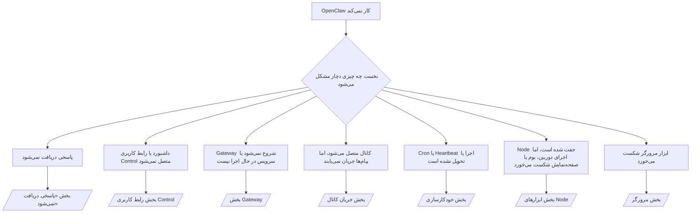

---
read_when:
    - OpenClaw کار نمی‌کند و به سریع‌ترین مسیر برای رفع مشکل نیاز دارید
    - پیش از ورود به راهنماهای عملیاتی عمیق، به یک جریان تریاژ نیاز دارید
summary: مرکز عیب‌یابی OpenClaw بر اساس نشانه‌ها
title: عیب‌یابی عمومی
x-i18n:
    generated_at: "2026-07-27T16:38:49Z"
    model: gpt-5.6
    postprocess_version: locale-links-v1
    prompt_version: 32
    provider: openai
    source_hash: de3554ed680ac536d105017220b44d94456a4408916e949352500b046f4d5f17
    source_path: help/troubleshooting.md
    workflow: 16
---

درگاه ورودی عیب‌یابی. در 2 دقیقه به تشخیص برسید، سپس به صفحهٔ تخصصی بروید.

## 60 ثانیهٔ نخست

این مراحل را به‌ترتیب اجرا کنید:

```bash
openclaw status
openclaw status --all
openclaw gateway probe
openclaw gateway status
openclaw doctor
openclaw channels status --probe
openclaw logs --follow
```

خروجی مطلوب، برای هر مورد یک خط:

- `openclaw status` کانال‌های پیکربندی‌شده را بدون خطای احراز هویت نشان می‌دهد.
- `openclaw status --all` گزارشی کامل و قابل‌اشتراک‌گذاری تولید می‌کند.
- `openclaw gateway probe` مقدار `Reachable: yes` را نشان می‌دهد. `Capability: ...` سطح
  احراز هویتی است که کاوشگر اثبات کرده است؛ `Read probe: limited - missing scope:
operator.read` به‌معنای تشخیص‌های تنزل‌یافته است، نه شکست اتصال.
- `openclaw gateway status` مقادیر `Runtime: running`، `Connectivity probe:
ok` و یک `Capability: ...` معقول را نشان می‌دهد. برای الزامی‌کردن
  اثبات RPC با دامنهٔ خواندن نیز، `--require-rpc` را اضافه کنید.
- `openclaw doctor` هیچ خطای مسدودکننده‌ای در پیکربندی یا سرویس گزارش نمی‌کند.
- `openclaw channels status --probe` هنگامی‌که Gateway در دسترس باشد، وضعیت زندهٔ انتقال را برای هر حساب
  (`works` / `audit ok`) برمی‌گرداند؛ در غیر این صورت، به
  خلاصه‌های صرفاً مبتنی بر پیکربندی بازمی‌گردد.
- `openclaw logs --follow` فعالیتی پایدار و بدون خطاهای مهلک تکرارشونده نشان می‌دهد.

## دستیار محدود به نظر می‌رسد یا ابزارهایی را در اختیار ندارد

پروفایل مؤثر ابزار را بررسی کنید:

```bash
openclaw status
openclaw status --all
openclaw doctor
```

علت‌های رایج:

- `tools.profile: "minimal"` فقط `session_status` را مجاز می‌کند.
- `tools.profile: "messaging"` محدود و مخصوص عامل‌های صرفاً گفت‌وگویی است.
- `tools.profile: "coding"` پیش‌فرض پیکربندی‌های محلی جدید است (کار با مخزن، فایل،
  پوسته و زمان اجرا).
- `tools.profile: "full"` محدودیت‌های پروفایل را حذف می‌کند؛ استفاده از آن را به عامل‌های مورداعتماد
  و تحت کنترل اپراتور محدود کنید.
- مقادیر `agents.entries.*.tools` مختص هر عامل، پروفایل ریشه را
  برای یک عامل محدودتر یا گسترده‌تر می‌کنند.

پروفایل را تغییر دهید، Gateway را راه‌اندازی مجدد یا بازخوانی کنید، سپس دوباره با
`openclaw status --all` بررسی کنید. جدول کامل پروفایل‌ها و گروه‌ها: [پروفایل‌های ابزار](/fa/gateway/config-tools#tool-profiles).

## خطای 429 در زمینهٔ طولانی Anthropic

`HTTP 429: rate_limit_error: Extra usage is required for long context requests`
← [برای زمینهٔ طولانی Anthropic در خطای 429 به مصرف اضافه نیاز است](/fa/gateway/troubleshooting#anthropic-429-extra-usage-required-for-long-context).

## بک‌اند محلی سازگار با OpenAI مستقیماً کار می‌کند، اما در OpenClaw شکست می‌خورد

بک‌اند محلی یا خودمیزبان `/v1` به کاوش‌های مستقیم `/v1/chat/completions`
پاسخ می‌دهد، اما در `openclaw infer model run` یا نوبت‌های عادی عامل شکست می‌خورد:

1. خطا اشاره می‌کند که `messages[].content` باید رشته باشد: مقدار
   `models.providers.<provider>.models[].compat.requiresStringContent: true` را تنظیم کنید.
2. اگر همچنان فقط در نوبت‌های عامل OpenClaw شکست می‌خورد، مقدار
   `models.providers.<provider>.models[].compat.supportsTools: false` را تنظیم و دوباره تلاش کنید.
3. اگر فراخوانی‌های مستقیم کوچک کار می‌کنند، اما پرامپت‌های بزرگ‌تر OpenClaw بک‌اند را از کار می‌اندازند،
   این محدودیت مدل یا سرور بالادستی است، نه باگ OpenClaw. ادامه را در
   [بک‌اند محلی سازگار با OpenAI کاوش‌های مستقیم را می‌گذراند، اما اجرای عامل‌ها شکست می‌خورد](/fa/gateway/troubleshooting#local-openai-compatible-backend-passes-direct-probes-but-agent-runs-fail) دنبال کنید.

## نصب Plugin به‌دلیل نبود افزونه‌های openclaw شکست می‌خورد

`package.json missing openclaw.extensions` یعنی بستهٔ Plugin از
ساختاری استفاده می‌کند که OpenClaw دیگر آن را نمی‌پذیرد.

اصلاح در بستهٔ Plugin:

1. مقدار `openclaw.extensions` را به `package.json` اضافه کنید و آن را به فایل‌های ساخته‌شدهٔ زمان اجرا
   (معمولاً `./dist/index.js`) ارجاع دهید.
2. دوباره منتشر کنید، سپس `openclaw plugins install <package>` را دوباره اجرا کنید.

```json
{
  "name": "@openclaw/my-plugin",
  "version": "1.2.3",
  "openclaw": {
    "extensions": ["./dist/index.js"]
  }
}
```

مرجع: [معماری Plugin](/fa/plugins/architecture)

## سیاست نصب، نصب یا به‌روزرسانی Pluginها را مسدود می‌کند

به‌روزرسانی تمام می‌شود، اما Pluginها قدیمی یا غیرفعال هستند یا `blocked by install
policy`، `install policy failed closed` یا `Disabled "<plugin>" after plugin
update failure` را نشان می‌دهند: `security.installPolicy` را بررسی کنید.

سیاست نصب هنگام نصب و به‌روزرسانی Pluginها اجرا می‌شود. نسخه‌های Plugin
`@openclaw/*` معمولاً همراه با انتشار OpenClaw تغییر می‌کنند؛ بنابراین به‌روزرسانی OpenClaw ممکن است
طی همگام‌سازی پس از به‌روزرسانی، به به‌روزرسانی منطبق Plugin نیز نیاز داشته باشد.

از این شکل‌های سیاستی اجتناب کنید، مگر اینکه قانون ارتقای منطبق با آن را نیز نگهداری کنید:

- ثابت‌کردن Pluginهای متعلق به OpenClaw روی دقیقاً یک نسخهٔ قدیمی (برای مثال، فقط
  `@openclaw/*@2026.5.3`).
- مسدودسازی صرفاً بر اساس نوع منبع (تمام درخواست‌های npm، شبکه یا `request.mode:
"update"`).
- اختیاری در نظر گرفتن فرمان سیاست: وقتی `security.installPolicy`
  فعال باشد، فایل اجرایی سیاستِ مفقود، کند، ناخوانا یا مسدودشده بر اثر مجوز
  به‌صورت بسته شکست می‌خورد.
- تأیید نسخه‌ها بدون بررسی `openclawVersion` درخواست در برابر
  فرادادهٔ نامزد Plugin.

به‌جای ثابت‌کردن دائمی یک انتشار، قوانینی را ترجیح دهید که به‌روزرسانی‌های مورداعتماد
`@openclaw/*` و سازگار با میزبان فعلی را مجاز می‌کنند. اگر npm را به‌طور
پیش‌فرض مسدود می‌کنید، برای شناسه‌های Plugin مورداستفاده استثنایی محدود اضافه کنید و همان
قانون اعتماد نصب‌ها را برای `request.mode: "update"` نیز اعمال کنید.

بازیابی:

```bash
openclaw doctor --deep
openclaw plugins update --all
openclaw status --all
```

اگر سیاست عمداً سخت‌گیرانه است، آن را در بازهٔ ارتقای مورداعتماد
تسهیل کنید، `openclaw plugins update --all` را دوباره اجرا کنید، سپس قانون سخت‌گیرانه‌تر را بازگردانید.
اگر شکست به‌روزرسانی یک Plugin را غیرفعال کرده است، پیش از فعال‌سازی مجدد آن را بررسی کنید:

```bash
openclaw plugins inspect <plugin-id> --runtime --json
openclaw plugins enable <plugin-id>
```

مرجع: [سیاست نصب اپراتور](/fa/tools/skills-config#operator-install-policy-securityinstallpolicy)

## Plugin موجود است، اما به‌دلیل مالکیت مشکوک مسدود شده است

`openclaw doctor`، راه‌اندازی اولیه یا هشدارهای شروع این موارد را نشان می‌دهند:

```text
نامزد Plugin مسدود شد: مالکیت مشکوک (... uid=1000، uid موردانتظار=0 یا root)
Plugin موجود است، اما مسدود شده است
```

فایل‌های Plugin متعلق به کاربر Unix متفاوتی از فرایندی هستند که
آن‌ها را بارگذاری می‌کند. پیکربندی Plugin را حذف نکنید؛ مالکیت فایل‌ها را اصلاح کنید یا
OpenClaw را با کاربری اجرا کنید که مالک دایرکتوری وضعیت است.

نصب‌های Docker با کاربر `node` (uid برابر با `1000`) اجرا می‌شوند. اتصال‌های bind میزبان را اصلاح کنید:

```bash
sudo chown -R 1000:1000 /path/to/openclaw-config /path/to/openclaw-workspace
openclaw doctor --fix
```

اگر عمداً OpenClaw را با کاربر root اجرا می‌کنید، در عوض ریشهٔ مدیریت‌شدهٔ Plugin
را اصلاح کنید:

```bash
sudo chown -R root:root /path/to/openclaw-config/npm
openclaw doctor --fix
```

مستندات تخصصی‌تر: [مالکیت مسیر Plugin مسدودشده](/fa/tools/plugin#blocked-plugin-path-ownership)، [Docker: مجوزها و EACCES](/fa/install/docker#shell-helpers-optional)

## درخت تصمیم



<AccordionGroup>
  <Accordion title="پاسخی دریافت نمی‌شود">
    ```bash
    openclaw status
    openclaw gateway status
    openclaw channels status --probe
    openclaw pairing list --channel <channel> [--account <id>]
    openclaw logs --follow
    ```

    خروجی مطلوب:

    - `Runtime: running`
    - `Connectivity probe: ok`
    - `Capability: read-only`، `write-capable` یا `admin-capable`
    - کانال اتصال انتقال را نشان می‌دهد و در صورت پشتیبانی، `works` یا
      `audit ok` را در `channels status --probe` نشان می‌دهد
    - فرستنده تأیید شده است (یا سیاست پیام مستقیم باز/دارای فهرست مجاز است)

    نشانه‌های گزارش:

    - `drop guild message (mention required` ← کنترل منشن Discord پیام را مسدود کرده است.
    - `pairing request` ← فرستنده تأیید نشده و در انتظار تأیید جفت‌سازی پیام مستقیم است.
    - `blocked` / `allowlist` در گزارش‌های کانال ← فرستنده، اتاق یا گروه فیلتر شده است.

    صفحات تخصصی: [پاسخی دریافت نمی‌شود](/fa/gateway/troubleshooting#no-replies)، [عیب‌یابی کانال](/fa/channels/troubleshooting)، [جفت‌سازی](/fa/channels/pairing)

  </Accordion>

  <Accordion title="داشبورد یا رابط کاربری Control متصل نمی‌شود">
    ```bash
    openclaw status
    openclaw gateway status
    openclaw logs --follow
    openclaw doctor
    openclaw channels status --probe
    ```

    خروجی مطلوب:

    - `Dashboard: http://...` در `openclaw gateway status` نشان داده می‌شود
    - `Connectivity probe: ok`
    - `Capability: read-only`، `write-capable` یا `admin-capable`
    - هیچ حلقهٔ احراز هویتی در گزارش‌ها وجود ندارد

    نشانه‌های گزارش:

    - `device identity required` ← زمینهٔ HTTP/غیرامن نمی‌تواند احراز هویت دستگاه را تکمیل کند.
    - `origin not allowed` ← مقدار `Origin` مرورگر برای مقصد Gateway رابط کاربری Control مجاز نیست.
    - `AUTH_TOKEN_MISMATCH` همراه با `canRetryWithDeviceToken=true` ← ممکن است یک تلاش مجدد با توکن دستگاه مورداعتماد به‌طور خودکار انجام شود و دامنه‌های ذخیره‌شدهٔ توکن جفت‌شده را دوباره به کار گیرد.
    - تکرار `unauthorized` پس از آن تلاش مجدد ← توکن/گذرواژه اشتباه، عدم تطابق حالت احراز هویت یا توکن قدیمی دستگاه جفت‌شده.
    - `too many failed authentication attempts (retry later)` ← شکست‌های مکرر از آن `Origin` مرورگر موقتاً مسدود می‌شوند؛ مبدأهای localhost دیگر سطل‌های جداگانه‌ای دارند. برای جزئیات تلاش مجدد هم‌زمان Tailscale Serve به [اتصال داشبورد/رابط کاربری Control](/fa/gateway/troubleshooting#dashboard-control-ui-connectivity) مراجعه کنید.
    - `gateway connect failed:` ← رابط کاربری URL/درگاه اشتباهی را هدف گرفته یا Gateway در دسترس نیست.

    صفحات تخصصی: [اتصال داشبورد/رابط کاربری Control](/fa/gateway/troubleshooting#dashboard-control-ui-connectivity)، [رابط کاربری Control](/fa/web/control-ui)، [احراز هویت](/fa/gateway/authentication)

  </Accordion>

  <Accordion title="Gateway شروع نمی‌شود یا سرویس نصب شده اما در حال اجرا نیست">
    ```bash
    openclaw status
    openclaw gateway status
    openclaw logs --follow
    openclaw doctor
    openclaw channels status --probe
    ```

    خروجی مطلوب:

    - `Service: ... (loaded)`
    - `Runtime: running`
    - `Connectivity probe: ok`
    - `Capability: read-only`، `write-capable` یا `admin-capable`

    نشانه‌های گزارش:

    - `Gateway start blocked: set gateway.mode=local` یا `existing config is missing gateway.mode` ← حالت Gateway از راه دور است، یا پیکربندی فاقد نشان حالت محلی است و به اصلاح نیاز دارد.
    - `refusing to bind gateway ... without auth` ← اتصال غیر loopback بدون مسیر احراز هویت معتبر (توکن/گذرواژه، یا پراکسی مورداعتماد در صورت پیکربندی).
    - `another gateway instance is already listening` یا `EADDRINUSE` ← درگاه از قبل اشغال است.

    صفحات تخصصی: [سرویس Gateway در حال اجرا نیست](/fa/gateway/troubleshooting#gateway-service-not-running)، [فرایند پس‌زمینه](/fa/gateway/background-process)، [پیکربندی](/fa/gateway/configuration)

  </Accordion>

  <Accordion title="کانال متصل می‌شود، اما پیام‌ها جریان نمی‌یابند">
    ```bash
    openclaw status
    openclaw gateway status
    openclaw logs --follow
    openclaw doctor
    openclaw channels status --probe
    ```

    خروجی مطلوب:

    - انتقال کانال متصل است.
    - بررسی‌های جفت‌سازی/فهرست مجاز موفق هستند.
    - در صورت نیاز، منشن‌ها شناسایی می‌شوند.

    نشانه‌های گزارش:

    - `mention required` ← کنترل منشن گروه، پردازش را مسدود کرده است.
    - `pairing` / `pending` ← فرستندهٔ پیام مستقیم هنوز تأیید نشده است.
    - `not_in_channel`، `missing_scope`، `Forbidden`، `401/403` ← مشکل توکن مجوز کانال.

    صفحات تخصصی: [کانال متصل است، اما پیام‌ها جریان نمی‌یابند](/fa/gateway/troubleshooting#channel-connected-messages-not-flowing)، [عیب‌یابی کانال](/fa/channels/troubleshooting)

  </Accordion>

  <Accordion title="Cron یا Heartbeat اجرا یا تحویل نشده است">
    ```bash
    openclaw status
    openclaw gateway status
    openclaw cron status
    openclaw cron list
    openclaw cron runs --id <jobId> --limit 20
    openclaw logs --follow
    ```

    خروجی مطلوب:

    - `cron status` زمان‌بند را در حالت فعال همراه با زمان بیدارباش بعدی نشان می‌دهد.
    - `cron runs` ورودی‌های اخیر `ok` را نشان می‌دهد.
    - Heartbeat فعال است و در ساعات فعال قرار دارد.

    نشانه‌های گزارش:

    - `cron: scheduler disabled; jobs will not run automatically` → cron غیرفعال است.
    - `heartbeat skipped` با دلیل `quiet-hours` → خارج از ساعات فعال پیکربندی‌شده.
    - `heartbeat skipped` با دلیل `empty-heartbeat-file` → چرک‌نویس پایشگر Heartbeat فقط شامل داربست خالی، نظر، سرصفحه، حصار یا چک‌لیست خالی است.
    - `heartbeat skipped` با دلیل `alerts-disabled` → همهٔ `showOk`، `showAlerts` و `useIndicator` خاموش هستند.
    - `requests-in-flight` → مسیر اصلی مشغول است؛ بیدارباش Heartbeat به تعویق افتاد.
    - `unknown accountId` → حساب مقصد تحویل Heartbeat وجود ندارد.

    صفحات تفصیلی: [تحویل Cron و Heartbeat](/fa/gateway/troubleshooting#cron-and-heartbeat-delivery)، [وظایف زمان‌بندی‌شده: عیب‌یابی](/fa/automation/cron-jobs#troubleshooting)، [Heartbeat](/fa/gateway/heartbeat)

  </Accordion>

  <Accordion title="Node جفت شده است، اما ابزار camera canvas screen exec ناموفق است">
    ```bash
    openclaw status
    openclaw gateway status
    openclaw nodes status
    openclaw nodes describe --node <idOrNameOrIp>
    openclaw logs --follow
    ```

    خروجی مطلوب:

    - Node برای نقش `node` به‌صورت متصل و جفت‌شده فهرست شده است.
    - قابلیت لازم برای فرمانی که فراخوانی می‌کنید وجود دارد.
    - مجوز ابزار اعطا شده است.

    نشانه‌های گزارش:

    - `NODE_BACKGROUND_UNAVAILABLE` → برنامهٔ Node را به پیش‌زمینه بیاورید.
    - `*_PERMISSION_REQUIRED` → مجوز سیستم‌عامل رد شده یا موجود نیست.
    - `SYSTEM_RUN_DENIED: approval required` → تأیید exec در انتظار است.
    - `SYSTEM_RUN_DENIED: allowlist miss` → فرمان در فهرست مجاز exec نیست.

    صفحات تفصیلی: [Node جفت شده، ابزار ناموفق است](/fa/gateway/troubleshooting#node-paired-tool-fails)، [عیب‌یابی Node](/fa/nodes/troubleshooting)، [تأییدهای exec](/fa/tools/exec-approvals)

  </Accordion>

  <Accordion title="Exec ناگهان درخواست تأیید می‌کند">
    ```bash
    openclaw config get tools.exec.host
    openclaw config get tools.exec.security
    openclaw config get tools.exec.ask
    openclaw gateway restart
    ```

    چه چیزی تغییر کرده است:

    - `tools.exec.host` تنظیم‌نشده به‌طور پیش‌فرض `auto` است که هنگام فعال‌بودن محیط اجرای sandbox به `sandbox`
      و در غیر این صورت به `gateway` تبدیل می‌شود.
    - `host=auto` فقط مسیریابی می‌کند؛ رفتار بدون اعلان از
      `security=full` به‌همراه `ask=off` در gateway/node ناشی می‌شود.
    - `tools.exec.security` تنظیم‌نشده در `gateway`/`node` به‌طور پیش‌فرض `full` است.
    - `tools.exec.ask` تنظیم‌نشده به‌طور پیش‌فرض `off` است.
    - اگر درخواست‌های تأیید را مشاهده می‌کنید، یکی از سیاست‌های محلی میزبان یا مختص نشست،
      exec را نسبت به این پیش‌فرض‌ها محدودتر کرده است.

    بازیابی پیش‌فرض‌های فعلی بدون تأیید:

    ```bash
    openclaw config set tools.exec.host gateway
    openclaw config set tools.exec.security full
    openclaw config set tools.exec.ask off
    openclaw gateway restart
    ```

    گزینه‌های امن‌تر:

    - برای مسیریابی پایدار میزبان فقط `tools.exec.host=gateway` را تنظیم کنید.
    - برای اجرای exec روی میزبان همراه با بازبینی مواردی که در فهرست مجاز نیستند، از `security=allowlist` به‌همراه `ask=on-miss`
      استفاده کنید.
    - حالت sandbox را فعال کنید تا `host=auto` دوباره به `sandbox` تبدیل شود.

    نشانه‌های گزارش:

    - `Approval required.` → فرمان در انتظار `/approve ...` است.
    - `SYSTEM_RUN_DENIED: approval required` → تأیید exec روی میزبان Node در انتظار است.
    - `exec host=sandbox requires a sandbox runtime for this session` → sandbox به‌صورت ضمنی یا صریح انتخاب شده، اما حالت sandbox خاموش است.

    صفحات تفصیلی: [Exec](/fa/tools/exec)، [تأییدهای exec](/fa/tools/exec-approvals)، [امنیت: ممیزی چه مواردی را بررسی می‌کند](/fa/gateway/security#what-the-audit-checks-high-level)

  </Accordion>

  <Accordion title="ابزار مرورگر ناموفق است">
    ```bash
    openclaw status
    openclaw gateway status
    openclaw browser status
    openclaw logs --follow
    openclaw doctor
    ```

    خروجی مطلوب:

    - وضعیت مرورگر، `running: true` و یک مرورگر/نمایهٔ انتخاب‌شده را نشان می‌دهد.
    - نمایهٔ `openclaw` راه‌اندازی می‌شود یا نمایهٔ `user` زبانه‌های محلی Chrome را می‌بیند.

    نشانه‌های گزارش:

    - `unknown command "browser"` → `plugins.allow` تنظیم شده و `browser` را مستثنا می‌کند.
    - `Failed to start Chrome CDP on port` → راه‌اندازی مرورگر محلی ناموفق بود.
    - `browser.executablePath not found` → مسیر دودویی پیکربندی‌شده اشتباه است.
    - `browser.cdpUrl must be http(s) or ws(s)` → نشانی CDP پیکربندی‌شده از طرحی پشتیبانی‌نشده استفاده می‌کند.
    - `browser.cdpUrl has invalid port` → نشانی CDP پیکربندی‌شده دارای درگاهی نامعتبر یا خارج از محدوده است.
    - `No Chrome tabs found for profile="user"` → نمایهٔ اتصال Chrome MCP هیچ زبانهٔ محلی باز Chrome ندارد.
    - `Remote CDP for profile "<name>" is not reachable` → نقطهٔ پایانی CDP راه‌دور پیکربندی‌شده از این میزبان دسترس‌پذیر نیست.
    - `Browser attachOnly is enabled ... not reachable` → نمایهٔ فقط‌اتصال هیچ مقصد فعال CDP ندارد.
    - نادیده‌گیری‌های منسوخ viewport/dark-mode/locale/offline در نمایه‌های فقط‌اتصال یا CDP راه‌دور → برای بستن نشست کنترل و آزادسازی وضعیت شبیه‌سازی بدون راه‌اندازی مجدد gateway، `openclaw browser stop --browser-profile <name>` را اجرا کنید.

    صفحات تفصیلی: [ابزار مرورگر ناموفق است](/fa/gateway/troubleshooting#browser-tool-fails)، [فرمان یا ابزار مرورگر موجود نیست](/fa/tools/browser#missing-browser-command-or-tool)، [مرورگر: عیب‌یابی Linux](/fa/tools/browser-linux-troubleshooting)، [مرورگر: عیب‌یابی CDP راه‌دور در WSL2/Windows](/fa/tools/browser-wsl2-windows-remote-cdp-troubleshooting)

  </Accordion>

</AccordionGroup>

## مرتبط

- [پرسش‌های متداول](/fa/help/faq) — پرسش‌های پرتکرار
- [عیب‌یابی Gateway](/fa/gateway/troubleshooting) — مشکلات مختص Gateway
- [Doctor](/fa/gateway/doctor) — بررسی‌ها و تعمیرات خودکار سلامت
- [عیب‌یابی کانال](/fa/channels/troubleshooting) — مشکلات اتصال کانال
- [وظایف زمان‌بندی‌شده: عیب‌یابی](/fa/automation/cron-jobs#troubleshooting) — مشکلات cron و Heartbeat
