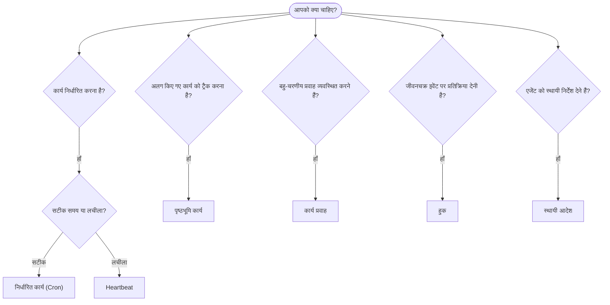

OpenClaw, कार्यों, निर्धारित जॉब, इवेंट हुक और स्थायी निर्देशों के माध्यम से पृष्ठभूमि में काम चलाता है।
सही तंत्र चुनने के लिए इस पृष्ठ का उपयोग करें।

## त्वरित निर्णय मार्गदर्शिका

| उपयोग का मामला                                | अनुशंसित            | कारण                                              |
| --------------------------------------- | ---------------------- | ------------------------------------------------ |
| रोज़ाना ठीक सुबह 9 बजे रिपोर्ट भेजें         | निर्धारित कार्य (Cron) | सटीक समय, पृथक निष्पादन                 |
| मुझे 20 मिनट में याद दिलाएँ                 | निर्धारित कार्य (Cron) | सटीक समय वाला एकबारगी कार्य (`--at`)            |
| साप्ताहिक गहन विश्लेषण चलाएँ                | निर्धारित कार्य (Cron) | स्वतंत्र कार्य, अलग मॉडल का उपयोग कर सकता है         |
| हर 30 मिनट में इनबॉक्स जाँचें                | Heartbeat              | अन्य जाँचों के साथ बैच बनाता है, संदर्भ-जागरूक         |
| आगामी इवेंट के लिए कैलेंडर की निगरानी करें    | Heartbeat              | आवधिक जागरूकता के लिए स्वाभाविक रूप से उपयुक्त               |
| किसी सबएजेंट या ACP रन की स्थिति जाँचें | पृष्ठभूमि कार्य       | कार्य बही सभी अलग किए गए कार्यों को ट्रैक करती है            |
| क्या और कब चला, इसका ऑडिट करें                 | पृष्ठभूमि कार्य       | `openclaw tasks list` और `openclaw tasks audit` |
| बहु-चरणीय शोध करके सारांश बनाएँ      | कार्य प्रवाह              | संशोधन ट्रैकिंग के साथ टिकाऊ व्यवस्था     |
| सेशन रीसेट पर स्क्रिप्ट चलाएँ           | हुक                  | इवेंट-संचालित, जीवनचक्र इवेंट पर सक्रिय होता है          |
| प्रत्येक टूल कॉल पर कोड निष्पादित करें         | Plugin हुक           | इन-प्रोसेस हुक टूल कॉल को इंटरसेप्ट कर सकते हैं        |
| जवाब देने से पहले हमेशा अनुपालन जाँचें | स्थायी आदेश        | प्रत्येक सेशन में स्वतः अंतःक्षेपित होता है        |

### निर्धारित कार्य (Cron) बनाम Heartbeat

| आयाम       | निर्धारित कार्य (Cron)              | Heartbeat                             |
| --------------- | ----------------------------------- | ------------------------------------- |
| समय          | सटीक (cron एक्सप्रेशन, एकबारगी)  | अनुमानित (डिफ़ॉल्ट रूप से हर 30 मिनट)    |
| सेशन संदर्भ | नया (पृथक) या साझा          | मुख्य सेशन का पूर्ण संदर्भ             |
| कार्य रिकॉर्ड    | हमेशा बनाए जाते हैं                      | कभी नहीं बनाए जाते                         |
| डिलीवरी        | चैनल, webhook या मौन         | मुख्य सेशन में इनलाइन                |
| इनके लिए सर्वोत्तम        | रिपोर्ट, रिमाइंडर, पृष्ठभूमि जॉब | इनबॉक्स जाँच, कैलेंडर, सूचनाएँ |

जब आपको सटीक समय या पृथक निष्पादन चाहिए, तब निर्धारित कार्य (Cron) का उपयोग करें। जब कार्य के लिए पूर्ण सेशन संदर्भ लाभदायक हो और अनुमानित समय पर्याप्त हो, तब Heartbeat का उपयोग करें।

## मुख्य अवधारणाएँ

### निर्धारित कार्य (cron)

Cron सटीक समय के लिए Gateway का अंतर्निहित शेड्यूलर है। यह जॉब को स्थायी रखता है, सही समय पर एजेंट को सक्रिय करता है और आउटपुट को चैट चैनल या webhook एंडपॉइंट पर भेज सकता है। यह एकबारगी रिमाइंडर, आवर्ती एक्सप्रेशन और इनबाउंड webhook ट्रिगर का समर्थन करता है।

[निर्धारित कार्य](/hi/automation/cron-jobs) देखें।

### कार्य

पृष्ठभूमि कार्य बही सभी अलग किए गए कार्यों को ट्रैक करती है: ACP रन, सबएजेंट स्पॉन, पृथक cron निष्पादन और CLI संचालन। कार्य रिकॉर्ड हैं, शेड्यूलर नहीं। उनकी जाँच के लिए `openclaw tasks list` और `openclaw tasks audit` का उपयोग करें।

[पृष्ठभूमि कार्य](/hi/automation/tasks) देखें।

### कार्य प्रवाह

कार्य प्रवाह, पृष्ठभूमि कार्यों के ऊपर स्थित प्रवाह व्यवस्था का आधार है। यह प्रबंधित और मिरर किए गए सिंक मोड, संशोधन ट्रैकिंग और निरीक्षण के लिए `openclaw tasks flow list|show|cancel` के साथ टिकाऊ बहु-चरणीय प्रवाह प्रबंधित करता है।

[कार्य प्रवाह](/hi/automation/taskflow) देखें।

### स्थायी आदेश

स्थायी आदेश एजेंट को निर्धारित प्रोग्राम के लिए स्थायी संचालन प्राधिकार प्रदान करते हैं। वे वर्कस्पेस फ़ाइलों (आमतौर पर `AGENTS.md`) में रहते हैं और प्रत्येक सेशन में अंतःक्षेपित किए जाते हैं। समय-आधारित प्रवर्तन के लिए इन्हें cron के साथ संयोजित करें।

[स्थायी आदेश](/hi/automation/standing-orders) देखें।

### हुक

आंतरिक हुक, एजेंट जीवनचक्र इवेंट
(`/new`, `/reset`, `/stop`), सेशन Compaction, Gateway स्टार्टअप और संदेश
प्रवाह से ट्रिगर होने वाली इवेंट-संचालित स्क्रिप्ट हैं। उन्हें हुक डायरेक्टरी से खोजा जाता है और
`openclaw hooks` से प्रबंधित किया जाता है। इन-प्रोसेस टूल-कॉल इंटरसेप्शन के लिए
[Plugin हुक](/hi/plugins/hooks) का उपयोग करें।

[हुक](/hi/automation/hooks) देखें।

### Heartbeat

Heartbeat एक आवधिक मुख्य-सेशन टर्न है (डिफ़ॉल्ट रूप से हर 30 मिनट)। यह पूर्ण सेशन संदर्भ वाले एक एजेंट टर्न में चेकलिस्ट-शैली की निगरानी (इनबॉक्स, कैलेंडर, सूचनाएँ) को बैच करता है। Heartbeat टर्न कार्य रिकॉर्ड नहीं बनाते और दैनिक/निष्क्रिय सेशन रीसेट की नवीनता अवधि नहीं बढ़ाते। Heartbeat स्क्रैच एक छोटा प्रॉम्प्ट संदर्भ है; आवर्ती कार्य को cron जॉब के रूप में निर्धारित करें। खाली Heartbeat स्क्रैच को `empty-heartbeat-file` के रूप में छोड़ दिया जाता है। cron कार्य सक्रिय या कतारबद्ध होने पर Heartbeat स्थगित हो जाते हैं और जब उसी एजेंट की सेशन-कुंजीयुक्त सबएजेंट या नेस्टेड लेन व्यस्त हों, तब `heartbeat.skipWhenBusy` भी उस एजेंट को स्थगित कर सकता है।

[Heartbeat](/hi/gateway/heartbeat) देखें।

## ये एक साथ कैसे काम करते हैं

- **Cron** सटीक शेड्यूल (दैनिक रिपोर्ट, साप्ताहिक समीक्षाएँ) और एकबारगी रिमाइंडर संभालता है। सभी cron निष्पादन कार्य रिकॉर्ड बनाते हैं।
- **Heartbeat** हर 30 मिनट में एक बैच की गई निगरानी चेकलिस्ट संभालता है; स्वतंत्र आवृत्तियों की आवश्यकता वाली जाँचों का स्वामी cron है।
- **हुक** कस्टम स्क्रिप्ट के साथ विशिष्ट इवेंट (सेशन रीसेट, Compaction, संदेश प्रवाह) पर प्रतिक्रिया देते हैं। Plugin हुक टूल कॉल को कवर करते हैं।
- **स्थायी आदेश** एजेंट को स्थायी संदर्भ और प्राधिकार सीमाएँ देते हैं।
- **कार्य प्रवाह** अलग-अलग कार्यों के ऊपर बहु-चरणीय प्रवाह का समन्वय करता है।
- **कार्य** सभी अलग किए गए कार्यों को स्वतः ट्रैक करते हैं, ताकि आप उनका निरीक्षण और ऑडिट कर सकें।

## संबंधित

- [निर्धारित कार्य](/hi/automation/cron-jobs) — सटीक शेड्यूलिंग और एकबारगी रिमाइंडर
- [पृष्ठभूमि कार्य](/hi/automation/tasks) — सभी अलग किए गए कार्यों के लिए कार्य बही
- [कार्य प्रवाह](/hi/automation/taskflow) — टिकाऊ बहु-चरणीय प्रवाह व्यवस्था
- [हुक](/hi/automation/hooks) — इवेंट-संचालित जीवनचक्र स्क्रिप्ट
- [Plugin हुक](/hi/plugins/hooks) — इन-प्रोसेस टूल, प्रॉम्प्ट, संदेश और जीवनचक्र हुक
- [स्थायी आदेश](/hi/automation/standing-orders) — स्थायी एजेंट निर्देश
- [Heartbeat](/hi/gateway/heartbeat) — आवधिक मुख्य-सेशन टर्न
- [कॉन्फ़िगरेशन संदर्भ](/hi/gateway/configuration-reference) — सभी कॉन्फ़िगरेशन कुंजियाँ
