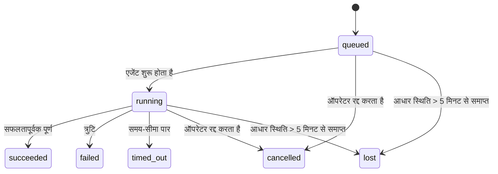

---
read_when:
    - प्रगति पर चल रहे या हाल ही में पूरे हुए पृष्ठभूमि कार्य का निरीक्षण करना
    - अलग किए गए एजेंट रन की डिलीवरी विफलताओं की डीबगिंग
    - यह समझना कि बैकग्राउंड रन, सत्रों, Cron और Heartbeat से कैसे संबंधित हैं
sidebarTitle: Background tasks
summary: ACP रन, सबएजेंट, Cron निष्पादन और CLI संचालन के लिए बैकग्राउंड कार्य ट्रैकिंग
title: पृष्ठभूमि कार्य
x-i18n:
    generated_at: "2026-07-27T17:19:18Z"
    model: gpt-5.6
    postprocess_version: locale-links-v1
    prompt_version: 32
    provider: openai
    source_hash: dbdc5ced133764fec0c8b9ae7b1957e24272dc9c1c86099de81f6923955d6b5a
    source_path: automation/tasks.md
    workflow: 16
---

<Note>
शेड्यूलिंग खोज रहे हैं? सही तंत्र चुनने के लिए [ऑटोमेशन](/hi/automation) देखें। यह पृष्ठ बैकग्राउंड कार्य का गतिविधि लेखा है, शेड्यूलर नहीं।
</Note>

बैकग्राउंड कार्य ऐसे काम को ट्रैक करते हैं जो **आपके मुख्य वार्तालाप सत्र के बाहर** चलता है: ACP रन, सबएजेंट स्पॉन, Cron जॉब निष्पादन और CLI से शुरू किए गए ऑपरेशन।

कार्य सत्रों, Cron जॉब या Heartbeat को **प्रतिस्थापित नहीं** करते - वे **गतिविधि लेखा** हैं, जो दर्ज करता है कि कौन-सा अलग किया गया कार्य हुआ, कब हुआ और वह सफल रहा या नहीं।

<Note>
हर एजेंट रन कोई कार्य नहीं बनाता। Heartbeat टर्न और सामान्य इंटरैक्टिव चैट ऐसा नहीं करते। सभी Cron निष्पादन, ACP स्पॉन, सबएजेंट स्पॉन, Gateway द्वारा प्रेषित CLI एजेंट कमांड और एजेंट द्वारा शुरू किए गए बैकग्राउंड `exec` कमांड ऐसा करते हैं।
</Note>

## संक्षेप में

- कार्य **रिकॉर्ड** हैं, शेड्यूलर नहीं - Cron और Heartbeat तय करते हैं कि काम _कब_ चलेगा, जबकि कार्य ट्रैक करते हैं कि _क्या हुआ_।
- ACP, सबएजेंट, सभी Cron जॉब और CLI ऑपरेशन कार्य बनाते हैं। Heartbeat टर्न ऐसा नहीं करते।
- प्रत्येक कार्य `queued → running → terminal` (सफल, विफल, समय-सीमा समाप्त, रद्द या लुप्त) से होकर गुजरता है।
- जब तक Cron रनटाइम जॉब का स्वामी रहता है, Cron कार्य सक्रिय रहते हैं; यदि इन-मेमोरी रनटाइम स्थिति समाप्त हो गई हो, तो कार्य को लुप्त चिह्नित करने से पहले कार्य रखरखाव स्थायी Cron रन इतिहास की जाँच करता है।
- पूर्णता पुश द्वारा संचालित होती है: अलग किया गया कार्य पूरा होने पर सीधे सूचना दे सकता है या अनुरोधकर्ता सत्र/Heartbeat को सक्रिय कर सकता है, इसलिए स्थिति पोलिंग लूप आम तौर पर सही तरीका नहीं हैं।
- अलग-थलग Cron रन और सबएजेंट पूर्णताएँ अंतिम क्लीनअप लेखांकन से पहले अपने चाइल्ड सत्र के लिए ट्रैक किए गए ब्राउज़र टैब/प्रोसेस को सर्वोत्तम प्रयास के आधार पर साफ़ करती हैं।
- जब वंशज सबएजेंट कार्य अभी समाप्त हो रहा हो, तब अलग-थलग Cron डिलीवरी पुराने अंतरिम पैरेंट उत्तरों को रोकती है और यदि डिलीवरी से पहले अंतिम वंशज आउटपुट आ जाए, तो उसे प्राथमिकता देती है।
- पूर्णता सूचनाएँ सीधे किसी चैनल पर पहुँचाई जाती हैं या अगले Heartbeat के लिए कतार में रखी जाती हैं।
- `openclaw tasks list` सभी कार्य दिखाता है; `openclaw tasks audit` समस्याएँ सामने लाता है।
- टर्मिनल रिकॉर्ड 7 दिनों तक (`lost` रिकॉर्ड 24 घंटों तक) रखे जाते हैं, फिर स्वतः हटा दिए जाते हैं।

## त्वरित शुरुआत

<Tabs>
  <Tab title="सूची और फ़िल्टर">
    ```bash
    # सभी कार्यों की सूची बनाएँ (सबसे नया पहले)
    openclaw tasks list

    # रनटाइम या स्थिति के आधार पर फ़िल्टर करें
    openclaw tasks list --runtime acp
    openclaw tasks list --status running
    ```

  </Tab>
  <Tab title="निरीक्षण">
    ```bash
    # किसी विशिष्ट कार्य का विवरण दिखाएँ (कार्य ID, रन ID या सत्र कुंजी द्वारा)
    openclaw tasks show <lookup>
    ```
  </Tab>
  <Tab title="रद्द करें और सूचना दें">
    ```bash
    # चल रहे कार्य को रद्द करें (चाइल्ड सत्र समाप्त करता है)
    openclaw tasks cancel <lookup>

    # किसी कार्य की सूचना नीति बदलें
    openclaw tasks notify <lookup> state_changes
    ```

  </Tab>
  <Tab title="ऑडिट और रखरखाव">
    ```bash
    # स्वास्थ्य ऑडिट चलाएँ
    openclaw tasks audit

    # रखरखाव का पूर्वावलोकन करें या उसे लागू करें
    openclaw tasks maintenance
    openclaw tasks maintenance --apply
    ```

  </Tab>
  <Tab title="कार्य प्रवाह">
    ```bash
    # TaskFlow स्थिति का निरीक्षण करें
    openclaw tasks flow list
    openclaw tasks flow show <lookup>
    openclaw tasks flow cancel <lookup>
    ```
  </Tab>
</Tabs>

## कार्य किन कारणों से बनता है

| स्रोत                  | रनटाइम प्रकार | कार्य रिकॉर्ड कब बनाया जाता है                                         | डिफ़ॉल्ट सूचना नीति |
| ---------------------- | ------------ | ---------------------------------------------------------------------- | --------------------- |
| ACP बैकग्राउंड रन      | `acp`        | चाइल्ड ACP सत्र स्पॉन करते समय                                         | `done_only`           |
| सबएजेंट ऑर्केस्ट्रेशन | `subagent`   | `sessions_spawn` के माध्यम से सबएजेंट स्पॉन करते समय                   | `done_only`           |
| Cron जॉब (सभी प्रकार)  | `cron`       | प्रत्येक Cron निष्पादन (मुख्य-सत्र और अलग-थलग)                         | `silent`              |
| CLI ऑपरेशन             | `cli`        | Gateway के माध्यम से चलने वाले `openclaw agent` कमांड                  | `silent`              |
| एजेंट मीडिया जॉब       | `cli`        | सत्र-समर्थित `image_generate`/`music_generate`/`video_generate` रन | `silent`              |

<AccordionGroup>
  <Accordion title="Cron और मीडिया के लिए सूचना डिफ़ॉल्ट">
    Cron कार्य (मुख्य-सत्र और अलग-थलग) `silent` सूचना नीति का उपयोग करते हैं - वे ट्रैकिंग के लिए रिकॉर्ड बनाते हैं, लेकिन स्वयं कार्य सूचनाएँ उत्पन्न नहीं करते; Cron अपने डिलीवरी पथ का स्वामी है।

    सत्र-समर्थित `image_generate`, `music_generate` और `video_generate` रन भी `silent` सूचना नीति का उपयोग करते हैं। वे फिर भी कार्य रिकॉर्ड बनाते हैं, लेकिन पूर्णता को आंतरिक सक्रियण के रूप में मूल एजेंट सत्र को वापस सौंप दिया जाता है, ताकि एजेंट फ़ॉलो-अप संदेश लिख सके और पूर्ण मीडिया को स्वयं संलग्न कर सके। अनुरोधकर्ता एजेंट अपने सामान्य दृश्यमान-उत्तर अनुबंध का पालन करता है: कॉन्फ़िगर होने पर स्वचालित अंतिम उत्तर, या जब सत्र को संदेश-टूल उत्तरों की आवश्यकता हो तब `message(action="send")` के साथ `NO_REPLY`। यदि अनुरोधकर्ता सत्र अब सक्रिय नहीं है या उसका सक्रिय वेक विफल हो जाता है और पूर्णता एजेंट कुछ या सभी जनरेट किए गए मीडिया से चूक जाता है, तो OpenClaw केवल छूटे हुए मीडिया के साथ मूल चैनल लक्ष्य को एक आइडेम्पोटेंट प्रत्यक्ष फ़ॉलबैक भेजता है।

  </Accordion>
  <Accordion title="समवर्ती मीडिया जनरेशन सुरक्षा">
    जब तक सत्र-समर्थित मीडिया-जनरेशन कार्य सक्रिय रहता है, `image_generate`, `music_generate` और `video_generate` आकस्मिक पुनः प्रयासों से बचाते हैं: समान प्रॉम्प्ट/अनुरोध के लिए कॉल दोहराने पर डुप्लिकेट शुरू करने के बजाय मेल खाते सक्रिय कार्य की स्थिति लौटती है, जबकि अलग प्रॉम्प्ट अपना कार्य शुरू कर सकता है। एजेंट की ओर से स्पष्ट प्रगति/स्थिति जाँच के लिए `action: "status"` का उपयोग करें।
  </Accordion>
  <Accordion title="किन चीज़ों से कार्य नहीं बनते">
    - Heartbeat टर्न - मुख्य-सत्र; [Heartbeat](/hi/gateway/heartbeat) देखें
    - सामान्य इंटरैक्टिव चैट टर्न
    - प्रत्यक्ष `/command` प्रतिक्रियाएँ

  </Accordion>
</AccordionGroup>

## कार्य जीवनचक्र



| स्थिति      | इसका अर्थ                                                                    |
| ----------- | --------------------------------------------------------------------------- |
| `queued`    | बनाया गया, एजेंट के शुरू होने की प्रतीक्षा में                              |
| `running`   | एजेंट टर्न सक्रिय रूप से निष्पादित हो रहा है                                |
| `succeeded` | सफलतापूर्वक पूर्ण                                                           |
| `failed`    | त्रुटि के साथ पूर्ण                                                         |
| `timed_out` | कॉन्फ़िगर की गई समय-सीमा पार हुई                                            |
| `cancelled` | ऑपरेटर द्वारा `openclaw tasks cancel` के माध्यम से रोका गया, या रन निरस्त किया गया |
| `lost`      | रनटाइम ने 5-मिनट की अनुग्रह अवधि के बाद प्रामाणिक आधार स्थिति खो दी         |

संक्रमण स्वतः होते हैं - एजेंट रन जीवनचक्र घटनाएँ (आरंभ, समाप्ति, त्रुटि) कार्य स्थिति को अपडेट करती हैं; आप इसे मैन्युअल रूप से प्रबंधित नहीं करते।

सक्रिय कार्य रिकॉर्ड के लिए एजेंट रन की पूर्णता प्रामाणिक होती है। सफल अलग किया गया रन `succeeded` के रूप में अंतिम होता है, सामान्य रन त्रुटियाँ `failed` के रूप में, समय-सीमाएँ `timed_out` के रूप में और रद्द/निरस्त परिणाम `cancelled` के रूप में अंतिम होते हैं। किसी कार्य के टर्मिनल हो जाने के बाद, बाद के जीवनचक्र संकेत उसकी स्थिति को निम्नतर नहीं करते - ऑपरेटर द्वारा रद्द किया गया या पहले से `failed`/`timed_out`/`lost` कार्य वैसा ही रहता है, भले ही बाद में सफलता संकेत आ जाए।

`lost` रनटाइम-सचेत है:

- ACP कार्य: Gateway में केवल सक्रिय इन-प्रोसेस ACP टर्न ही सिद्ध करता है कि रन सक्रिय है; केवल स्थायी सत्र मेटाडेटा ऐसा नहीं करता। ऑफ़लाइन CLI ऑडिट सतर्क रहता है और ACP कार्यों को कभी पुनः प्राप्त नहीं करता।
- सबएजेंट कार्य: आधार चाइल्ड सत्र लक्ष्य एजेंट स्टोर से गायब हो गया है (या उसमें पुनरारंभ-पुनर्प्राप्ति टूम्बस्टोन है)।
- Cron कार्य: Cron रनटाइम अब जॉब को सक्रिय रूप से ट्रैक नहीं करता और स्थायी Cron रन इतिहास उस रन के लिए टर्मिनल परिणाम नहीं दिखाता। ऑफ़लाइन CLI ऑडिट अपनी खाली इन-प्रोसेस Cron रनटाइम स्थिति को प्रामाणिक नहीं मानता।
- CLI कार्य: रन ID/स्रोत ID वाले कार्य सक्रिय रन संदर्भ का उपयोग करते हैं, इसलिए Gateway-स्वामित्व वाला रन गायब होने के बाद शेष चाइल्ड-सत्र या चैट-सत्र पंक्तियाँ उन्हें सक्रिय नहीं रखतीं। रन पहचान के बिना पुराने CLI कार्य अब भी चाइल्ड सत्र पर निर्भर होते हैं। Gateway-समर्थित `openclaw agent` रन भी अपने रन परिणाम से अंतिम होते हैं, इसलिए पूर्ण रन तब तक सक्रिय नहीं रहते जब तक स्वीपर उन्हें `lost` चिह्नित न करे।

## डिलीवरी और सूचनाएँ

जब कोई कार्य टर्मिनल स्थिति में पहुँचता है, तो OpenClaw आपको सूचित करता है। डिलीवरी के दो पथ हैं:

**प्रत्यक्ष डिलीवरी** - यदि कार्य का कोई चैनल लक्ष्य (`requesterOrigin`) है, तो पूर्णता संदेश सीधे उस चैनल (Discord, Slack, Telegram आदि) पर जाता है। इसके बजाय समूह और चैनल कार्य पूर्णताएँ अनुरोधकर्ता सत्र के माध्यम से रूट की जाती हैं, ताकि पैरेंट एजेंट दृश्यमान उत्तर लिख सके। सबएजेंट पूर्णताओं के लिए, OpenClaw उपलब्ध होने पर बाउंड थ्रेड/विषय रूटिंग भी बनाए रखता है और प्रत्यक्ष डिलीवरी छोड़ने से पहले अनुरोधकर्ता सत्र के संग्रहीत रूट (`lastChannel` / `lastTo` / `lastAccountId`) से अनुपलब्ध `to` / खाता भर सकता है।

**सत्र-कतारबद्ध डिलीवरी** - यदि प्रत्यक्ष डिलीवरी विफल हो जाती है या कोई मूल सेट नहीं है, तो अपडेट अनुरोधकर्ता के सत्र में सिस्टम घटना के रूप में कतारबद्ध होता है और अगले Heartbeat पर दिखाई देता है।

<Tip>
सत्र-कतारबद्ध कार्य पूर्णताएँ तुरंत Heartbeat वेक ट्रिगर करती हैं, इसलिए आपको परिणाम शीघ्र दिखाई देता है - आपको अगले निर्धारित Heartbeat टिक की प्रतीक्षा नहीं करनी पड़ती।
</Tip>

इसका अर्थ है कि सामान्य कार्यप्रवाह पुश-आधारित है: अलग किया गया कार्य एक बार शुरू करें, फिर पूर्ण होने पर रनटाइम को आपको सक्रिय या सूचित करने दें। कार्य स्थिति को केवल तभी पोल करें जब आपको डीबगिंग, हस्तक्षेप या स्पष्ट ऑडिट की आवश्यकता हो।

### सूचना नीतियाँ

नियंत्रित करें कि आपको प्रत्येक कार्य के बारे में कितनी जानकारी मिले:

| नीति                  | क्या डिलीवर किया जाता है                                |
| --------------------- | ------------------------------------------------------- |
| `done_only` (डिफ़ॉल्ट) | केवल टर्मिनल स्थिति (सफल, विफल आदि)                    |
| `state_changes`       | प्रत्येक स्थिति संक्रमण और प्रगति अपडेट                 |
| `silent`              | कुछ भी नहीं (Cron, CLI और मीडिया कार्यों के लिए डिफ़ॉल्ट) |

कार्य चलने के दौरान नीति बदलें:

```bash
openclaw tasks notify <lookup> state_changes
```

## CLI संदर्भ

<AccordionGroup>
  <Accordion title="tasks list">
    ```bash
    openclaw tasks list [--runtime <acp|subagent|cron|cli>] [--status <status>] [--json]
    ```

    आउटपुट कॉलम: कार्य, प्रकार, स्थिति, डिलीवरी, रन, चाइल्ड सत्र, सारांश। केवल `openclaw tasks` का व्यवहार `openclaw tasks list` जैसा होता है।

  </Accordion>
  <Accordion title="tasks show">
    ```bash
    openclaw tasks show <lookup> [--json]
    ```

    लुकअप टोकन कार्य ID, रन ID या सत्र कुंजी स्वीकार करता है। समय, डिलीवरी स्थिति, त्रुटि और टर्मिनल सारांश सहित पूरा रिकॉर्ड दिखाता है।

  </Accordion>
  <Accordion title="tasks cancel">
    ```bash
    openclaw tasks cancel <lookup>
    ```

    ACP और subagent कार्यों के लिए, यह चाइल्ड सेशन को समाप्त कर देता है; ACP और cron रद्दीकरण चालू Gateway (`tasks.cancel`) के माध्यम से रूट किए जाते हैं। CLI द्वारा ट्रैक किए गए कार्यों के लिए, रद्दीकरण कार्य रजिस्ट्री में दर्ज किया जाता है (कोई अलग चाइल्ड रनटाइम हैंडल नहीं होता)। स्थिति `cancelled` में बदल जाती है और लागू होने पर डिलीवरी सूचना भेजी जाती है।

  </Accordion>
  <Accordion title="कार्य सूचना">
    ```bash
    openclaw tasks notify <lookup> <done_only|state_changes|silent>
    ```
  </Accordion>
  <Accordion title="कार्य ऑडिट">
    ```bash
    openclaw tasks audit [--severity <warn|error>] [--code <name>] [--limit <n>] [--json]
    ```

    एक रिपोर्ट में कार्यों **और** TaskFlows की परिचालन समस्याएँ दिखाता है। समस्याएँ मिलने पर निष्कर्ष `openclaw status` में भी दिखाई देते हैं।

    कार्य निष्कर्ष:

    | निष्कर्ष                   | गंभीरता   | ट्रिगर                                                                                                      |
    | ------------------------- | ---------- | ------------------------------------------------------------------------------------------------------------ |
    | `stale_queued`            | चेतावनी       | 10 मिनट से अधिक समय से कतार में                                                                              |
    | `stale_running`           | त्रुटि      | 30 मिनट से अधिक समय से चल रहा                                                                             |
    | `lost`                    | चेतावनी/त्रुटि | रनटाइम-समर्थित कार्य का स्वामित्व गायब हो गया; बनाए रखे गए खोए कार्य `cleanupAfter` तक चेतावनी देते हैं, फिर त्रुटि बन जाते हैं |
    | `delivery_failed`         | चेतावनी       | डिलीवरी विफल हुई और सूचना नीति `silent` नहीं है                                                            |
    | `missing_cleanup`         | चेतावनी       | बिना क्लीनअप टाइमस्टैम्प वाला अंतिम कार्य                                                                      |
    | `inconsistent_timestamps` | चेतावनी       | समयरेखा उल्लंघन (उदाहरण के लिए, शुरू होने से पहले समाप्त हुआ)                                                        |

    TaskFlow निष्कर्ष:

    | निष्कर्ष                | गंभीरता   | ट्रिगर                                                                    |
    | ---------------------- | ---------- | --------------------------------------------------------------------------- |
    | `restore_failed`       | त्रुटि      | SQLite से फ़्लो रजिस्ट्री पुनर्स्थापना विफल हुई                                    |
    | `stale_running`        | त्रुटि      | चल रहा फ़्लो 30 मिनट से अधिक समय से आगे नहीं बढ़ा                      |
    | `stale_waiting`        | चेतावनी       | प्रतीक्षारत फ़्लो 30 मिनट से अधिक समय से आगे नहीं बढ़ा                      |
    | `stale_blocked`        | चेतावनी       | अवरुद्ध फ़्लो 30 मिनट से अधिक समय से आगे नहीं बढ़ा                      |
    | `cancel_stuck`         | चेतावनी       | रद्दीकरण का अनुरोध 5 मिनट से अधिक पहले किया गया, कोई सक्रिय चाइल्ड कार्य नहीं, फिर भी गैर-अंतिम |
    | `missing_linked_tasks` | चेतावनी/त्रुटि | बिना लिंक किए गए कार्यों या प्रतीक्षा स्थिति वाला पुराना प्रबंधित फ़्लो                       |
    | `blocked_task_missing` | चेतावनी       | अवरुद्ध फ़्लो ऐसे कार्य आईडी की ओर संकेत करता है जो अब मौजूद नहीं है                      |

  </Accordion>
  <Accordion title="कार्य रखरखाव">
    ```bash
    openclaw tasks maintenance [--json]
    openclaw tasks maintenance --apply [--json]
    ```

    कार्यों, TaskFlow स्थिति और पुराने cron रन सेशन रजिस्ट्री पंक्तियों के लिए सामंजस्य, क्लीनअप स्टैम्पिंग और छँटाई का पूर्वावलोकन करने या उन्हें लागू करने के लिए इसका उपयोग करें।

    सामंजस्य रनटाइम-जागरूक है:

    - ACP कार्यों के लिए Gateway में एक सक्रिय इन-प्रोसेस टर्न आवश्यक है; subagent कार्य अपने समर्थक चाइल्ड सेशन की जाँच करते हैं।
    - जिन subagent कार्यों के चाइल्ड सेशन में पुनरारंभ-पुनर्प्राप्ति टूम्बस्टोन है, उन्हें पुनर्प्राप्त करने योग्य समर्थक सेशन मानने के बजाय खोया हुआ चिह्नित किया जाता है।
    - Cron कार्य जाँचते हैं कि cron रनटाइम अभी भी जॉब का स्वामी है या नहीं, फिर `lost` पर वापस जाने से पहले स्थायी cron रन लॉग/जॉब स्थिति से अंतिम स्थिति पुनर्प्राप्त करते हैं। इन-मेमोरी cron सक्रिय-जॉब सेट के लिए केवल Gateway प्रक्रिया आधिकारिक है; ऑफ़लाइन CLI ऑडिट स्थायी इतिहास का उपयोग करता है, लेकिन केवल उस स्थानीय सेट के खाली होने के कारण cron कार्य को खोया हुआ चिह्नित नहीं करता।
    - रन पहचान वाले CLI कार्य केवल चाइल्ड-सेशन या चैट-सेशन पंक्तियों के बजाय स्वामी सक्रिय रन संदर्भ की जाँच करते हैं।

    पूर्णता क्लीनअप भी रनटाइम-जागरूक है:

    - subagent पूर्णता, घोषणा क्लीनअप जारी रहने से पहले चाइल्ड सेशन के लिए ट्रैक किए गए ब्राउज़र टैब/प्रक्रियाओं को सर्वोत्तम प्रयास के आधार पर बंद करती है।
    - पृथक cron पूर्णता, रन पूरी तरह समाप्त होने से पहले cron सेशन के लिए ट्रैक किए गए ब्राउज़र टैब/प्रक्रियाओं को सर्वोत्तम प्रयास के आधार पर बंद करती है।
    - आवश्यक होने पर पृथक cron डिलीवरी वंशज subagent के अनुवर्ती कार्य की प्रतीक्षा करती है और उसकी घोषणा करने के बजाय पुराने पैरेंट अभिस्वीकृति टेक्स्ट को दबा देती है।
    - subagent पूर्णता डिलीवरी केवल चाइल्ड के नवीनतम दृश्यमान सहायक टेक्स्ट का उपयोग करती है। tool/toolResult आउटपुट को चाइल्ड परिणाम टेक्स्ट में पदोन्नत नहीं किया जाता। अंतिम विफल रन कैप्चर किए गए उत्तर टेक्स्ट को दोबारा चलाए बिना विफलता स्थिति की घोषणा करते हैं।
    - क्लीनअप विफलताएँ वास्तविक कार्य परिणाम को नहीं छिपातीं।

    रखरखाव लागू करते समय, OpenClaw 7 दिनों से पुरानी `cron:<jobId>:run:<runId>` सेशन रजिस्ट्री पंक्तियाँ भी हटा देता है, जबकि वर्तमान में चल रहे cron जॉब की पंक्तियाँ सुरक्षित रखता है और गैर-cron सेशन पंक्तियों को अपरिवर्तित छोड़ता है।

  </Accordion>
  <Accordion title="कार्य फ़्लो सूची | दिखाएँ | रद्द करें">
    ```bash
    openclaw tasks flow list [--status <status>] [--json]
    openclaw tasks flow show <lookup> [--json]
    openclaw tasks flow cancel <lookup>
    ```

    फ़्लो लुकअप टोकन फ़्लो आईडी या स्वामी कुंजी स्वीकार करता है। जब एक व्यक्तिगत पृष्ठभूमि कार्य रिकॉर्ड के बजाय समन्वय करने वाला [Task Flow](/hi/automation/taskflow) महत्वपूर्ण हो, तब इनका उपयोग करें।

  </Accordion>
</AccordionGroup>

## चैट कार्य बोर्ड (`/tasks`)

उस सेशन से जुड़े पृष्ठभूमि कार्य देखने के लिए किसी भी चैट सेशन में `/tasks` का उपयोग करें। बोर्ड रनटाइम, स्थिति, समय और प्रगति या त्रुटि विवरण सहित अधिकतम पाँच सक्रिय और हाल में पूर्ण हुए कार्य दिखाता है।

जब वर्तमान सेशन में कोई दृश्यमान लिंक किया गया कार्य नहीं होता, तो `/tasks` एजेंट-स्थानीय कार्य गणनाओं पर वापस जाता है, ताकि अन्य सेशन के विवरण उजागर किए बिना भी आपको अवलोकन मिल सके।

पूर्ण ऑपरेटर लेजर के लिए CLI का उपयोग करें: `openclaw tasks list`।

### नियंत्रण UI

वेब नियंत्रण UI के साइडबार में सक्रिय और हाल के पृष्ठभूमि कार्यों वाला एक **कार्य** पृष्ठ है। प्रगति का निरीक्षण करने, लिंक किए गए सेशन खोलने, लेजर रीफ़्रेश करने या कतारबद्ध और चल रहे कार्य रद्द करने के लिए इसका उपयोग करें।

चैट पैन में पैन के एजेंट तक सीमित एक संकुचित किया जा सकने वाला **पृष्ठभूमि कार्य** रेल भी होता है: स्टॉप नियंत्रण के साथ चल रहे कार्य और subagents, एक पूर्ण अनुभाग और प्रत्येक कार्य के चाइल्ड सेशन में जाने वाले ट्रांसक्रिप्ट देखें लिंक। इसे पैन हेडर में गतिविधि टॉगल (या एकल-पैन चैट में फ़्लोटिंग गतिविधि बटन) से खोलें।

रेल में किसी कार्य को चुनकर उसके सीमित इनपुट प्रॉम्प्ट और नवीनतम आउटपुट या त्रुटि सारांश का निरीक्षण करें। चल रहा कार्य पूर्ण कार्य से अलग रहता है और पूर्ण पंक्तियाँ दिखाती हैं कि कार्य पूर्ण हुआ या विफल। iOS पर, **Chat actions → Background Tasks** खोलें; Android पर, Chat ओवरफ़्लो मेनू खोलें और **Background tasks** चुनें। दोनों मोबाइल दृश्य समान Running और Finished समूहों का उपयोग करते हैं और चयन करने पर कार्य विवरण खोलते हैं।

## स्थिति एकीकरण (कार्य दबाव)

`openclaw status` में एक नज़र में समझ आने वाली कार्य पंक्ति शामिल है:

```
कार्य    2 सक्रिय · 1 कतारबद्ध · 1 चल रहा · 1 समस्या · ऑडिट साफ़ · 6 ट्रैक किए गए
```

सारांश सक्रिय कार्य (`queued` + `running`), विफलताओं (`failed` + `timed_out` + `lost`), ऑडिट निष्कर्षों और कुल ट्रैक किए गए रिकॉर्ड की गणना करता है; JSON पेलोड गणनाओं को रनटाइम (`acp`, `subagent`, `cron`, `cli`) के अनुसार भी विभाजित करता है।

`/status` और `session_status` टूल दोनों क्लीनअप-जागरूक कार्य स्नैपशॉट का उपयोग करते हैं: सक्रिय कार्यों को प्राथमिकता दी जाती है, समाप्त पंक्तियाँ छिपाई जाती हैं और अंतिम कार्य केवल थोड़े हालिया समय (5 मिनट) के लिए दिखाई देते हैं; कोई सक्रिय कार्य शेष न होने पर विफलताओं पर ध्यान केंद्रित किया जाता है। इससे स्थिति कार्ड वर्तमान में महत्वपूर्ण चीज़ों पर केंद्रित रहता है।

## भंडारण और रखरखाव

### कार्य कहाँ रहते हैं

कार्य रिकॉर्ड और डिलीवरी स्थिति साझा OpenClaw SQLite स्थिति डेटाबेस में बनी रहती है:

```
~/.openclaw/state/openclaw.sqlite   (टेबल: task_runs, task_delivery_state, flow_runs)
```

पूरे स्थिति रूट (डिफ़ॉल्ट `~/.openclaw`) को कहीं और ले जाने के लिए `OPENCLAW_STATE_DIR` सेट करें; साझा डेटाबेस पथ भी इसके साथ स्थानांतरित हो जाता है।

रजिस्ट्री पहले उपयोग पर मेमोरी में लोड होती है और प्रत्येक लेखन को वापस SQLite में स्थायी करती है, इसलिए रिकॉर्ड Gateway पुनरारंभ के बाद भी बने रहते हैं। WAL वृद्धि SQLite की डिफ़ॉल्ट ऑटोचेकपॉइंट सीमा और आवधिक `PASSIVE` चेकपॉइंट के माध्यम से सीमित रहती है; शटडाउन और स्पष्ट रखरखाव चेकपॉइंट `TRUNCATE` का उपयोग करते हैं, ताकि सामान्य बंद होने पर पृष्ठभूमि स्वीपर को सक्रिय रीडर की प्रतीक्षा कराए बिना WAL स्थान पुनः प्राप्त किया जा सके।

पुराने इंस्टॉलेशन के विरासती साइडकार स्टोर (`tasks/runs.sqlite`, `flows/registry.sqlite`) को `openclaw doctor` द्वारा साझा डेटाबेस में आयात किया जाता है।

### स्वचालित रखरखाव

एक स्वीपर हर **60 सेकंड** में चलता है (पहला पास Gateway शुरू होने के लगभग 5 सेकंड बाद) और चार चीज़ें संभालता है:

<Steps>
  <Step title="सामंजस्य">
    जाँचता है कि सक्रिय कार्यों के पास अभी भी आधिकारिक रनटाइम समर्थन है या नहीं। ACP कार्यों के लिए एक सक्रिय इन-प्रोसेस टर्न आवश्यक है, subagent कार्य चाइल्ड-सेशन स्थिति का उपयोग करते हैं, cron कार्य सक्रिय-जॉब स्वामित्व के साथ स्थायी रन इतिहास का उपयोग करते हैं और रन पहचान वाले CLI कार्य स्वामी रन संदर्भ का उपयोग करते हैं। यदि समर्थक स्थिति 5 मिनट से अधिक समय तक अनुपस्थित रहती है (चाइल्ड-रहित नेटिव subagent कार्यों के लिए 30 मिनट), तो कार्य को `lost` चिह्नित किया जाता है।
  </Step>
  <Step title="ACP सेशन सुधार">
    अंतिम या अनाथ पैरेंट-स्वामित्व वाले एकबारगी ACP सेशन बंद करता है और पुराने अंतिम या अनाथ स्थायी ACP सेशन केवल तभी बंद करता है, जब कोई सक्रिय वार्तालाप बाइंडिंग शेष न हो।
  </Step>
  <Step title="क्लीनअप स्टैम्पिंग">
    अंतिम कार्यों पर `cleanupAfter` टाइमस्टैम्प (अंतिम समय + अवधारण अवधि) सेट करता है। अवधारण के दौरान, खोए हुए कार्य ऑडिट में चेतावनियों के रूप में दिखाई देते रहते हैं; `cleanupAfter` समाप्त होने के बाद या क्लीनअप मेटाडेटा अनुपस्थित होने पर, वे त्रुटियाँ बन जाते हैं।
  </Step>
  <Step title="छँटाई">
    अपनी `cleanupAfter` तिथि पार कर चुके रिकॉर्ड हटाता है।
  </Step>
</Steps>

<Note>
**अवधारण:** अंतिम कार्य रिकॉर्ड **7 दिनों** तक (`lost` रिकॉर्ड **24 घंटों** तक) रखे जाते हैं, फिर स्वचालित रूप से हटा दिए जाते हैं। किसी कॉन्फ़िगरेशन की आवश्यकता नहीं है।
</Note>

## कार्यों का अन्य प्रणालियों से संबंध

<AccordionGroup>
  <Accordion title="कार्य और Task Flow">
    [Task Flow](/hi/automation/taskflow) पृष्ठभूमि कार्यों के ऊपर फ़्लो समन्वयन परत है। एक फ़्लो अपने जीवनकाल में प्रबंधित या मिरर किए गए सिंक मोड का उपयोग करके कई कार्यों का समन्वय कर सकता है। व्यक्तिगत कार्य रिकॉर्ड का निरीक्षण करने के लिए `openclaw tasks` और समन्वय करने वाले फ़्लो का निरीक्षण करने के लिए `openclaw tasks flow` का उपयोग करें।

  </Accordion>
  <Accordion title="कार्य और cron">
    Cron जॉब परिभाषाएँ, रनटाइम निष्पादन स्थिति और रन इतिहास OpenClaw के साझा SQLite स्थिति डेटाबेस में रहते हैं। **प्रत्येक** cron निष्पादन एक कार्य रिकॉर्ड बनाता है—मुख्य-सेशन और पृथक दोनों—जिसकी सूचना नीति `silent` होती है, इसलिए cron रन अपनी अलग कार्य सूचनाएँ उत्पन्न किए बिना ट्रैक किए जाते हैं।

    [Cron जॉब](/hi/automation/cron-jobs) देखें।

  </Accordion>
  <Accordion title="कार्य और Heartbeat">
    Heartbeat रन मुख्य-सेशन टर्न होते हैं—वे कार्य रिकॉर्ड नहीं बनाते। जब कोई कार्य पूर्ण होता है, तो वह Heartbeat वेक ट्रिगर कर सकता है, ताकि आपको परिणाम तुरंत दिखाई दे।

    [Heartbeat](/hi/gateway/heartbeat) देखें।

  </Accordion>
  <Accordion title="कार्य और सत्र">
    कोई कार्य एक `childSessionKey` (जहाँ कार्य चलता है) और एक `requesterSessionKey` (जिसने इसे शुरू किया) को संदर्भित कर सकता है। इसका `agentId` कार्य निष्पादित करने वाले एजेंट की पहचान करता है, जबकि अनुरोधकर्ता और स्वामी फ़ील्ड आरंभ और नियंत्रण का संदर्भ बनाए रखते हैं। सत्र वार्तालाप का संदर्भ हैं; कार्य उसके ऊपर गतिविधि की ट्रैकिंग करते हैं।
  </Accordion>
  <Accordion title="कार्य और एजेंट रन">
    किसी कार्य का `runId` उस एजेंट रन से जुड़ता है जो कार्य कर रहा है। एजेंट जीवनचक्र ईवेंट (आरंभ, समाप्ति, त्रुटि) स्वचालित रूप से कार्य की स्थिति अपडेट करते हैं—आपको जीवनचक्र मैन्युअल रूप से प्रबंधित करने की आवश्यकता नहीं है।
  </Accordion>
</AccordionGroup>

## संबंधित

- [स्वचालन](/hi/automation) - सभी स्वचालन तंत्रों का एक नज़र में अवलोकन
- [CLI: कार्य](/hi/cli/tasks) - CLI कमांड संदर्भ
- [Heartbeat](/hi/gateway/heartbeat) - मुख्य सत्र के आवधिक टर्न
- [निर्धारित कार्य](/hi/automation/cron-jobs) - पृष्ठभूमि कार्य का शेड्यूल निर्धारण
- [कार्य प्रवाह](/hi/automation/taskflow) - कार्यों के ऊपर प्रवाह ऑर्केस्ट्रेशन
