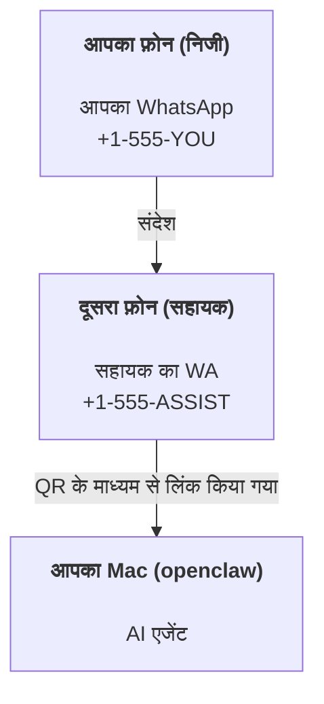

---
read_when:
    - नए सहायक इंस्टेंस की ऑनबोर्डिंग
    - सुरक्षा/अनुमति संबंधी प्रभावों की समीक्षा करना
summary: सुरक्षा संबंधी सावधानियों के साथ OpenClaw को निजी सहायक के रूप में चलाने की शुरू से अंत तक की मार्गदर्शिका
title: व्यक्तिगत सहायक सेटअप
x-i18n:
    generated_at: "2026-07-27T21:44:25Z"
    model: gpt-5.6
    postprocess_version: locale-links-v1
    prompt_version: 32
    provider: openai
    source_hash: ed3e267971fc1ee5c9154194e5b1f98db8c7a7edca8182871a2057a778614217
    source_path: start/openclaw.md
    workflow: 16
---

OpenClaw एक स्वयं-होस्टेड Gateway है, जो Discord, Google Chat, iMessage, Matrix, Microsoft Teams, Signal, Slack, Telegram, WhatsApp, Zalo और अन्य सेवाओं को AI एजेंटों से जोड़ता है। यह मार्गदर्शिका "निजी सहायक" सेटअप के बारे में है: एक समर्पित WhatsApp नंबर, जो आपके हमेशा उपलब्ध AI सहायक की तरह काम करता है।

## पहले सुरक्षा

किसी एजेंट को चैनल देने पर वह आपकी टूल नीति के आधार पर आपकी मशीन पर कमांड चला सकता है, आपके कार्यक्षेत्र में फ़ाइलें पढ़/लिख सकता है और किसी भी कनेक्टेड चैनल से संदेश भेज सकता है। शुरुआत में प्रतिबंधात्मक सेटिंग रखें:

- हमेशा `channels.whatsapp.allowFrom` सेट करें (अपने निजी Mac पर इसे कभी भी सभी के लिए खुला न चलाएँ)।
- सहायक के लिए एक समर्पित WhatsApp नंबर इस्तेमाल करें।
- Heartbeats डिफ़ॉल्ट रूप से हर 30 मिनट में चलते हैं। सेटअप पर भरोसा होने तक `agents.defaults.heartbeat.every: "0m"` सेट करके इन्हें अक्षम रखें।

## पूर्वापेक्षाएँ

- OpenClaw इंस्टॉल और ऑनबोर्ड किया हुआ हो—अगर आपने अभी तक ऐसा नहीं किया है, तो [शुरुआत करें](/hi/start/getting-started) देखें
- सहायक के लिए दूसरा फ़ोन नंबर (SIM/eSIM/प्रीपेड)

## दो फ़ोन वाला सेटअप (अनुशंसित)

आपको यह चाहिए:



अगर आप अपने निजी WhatsApp को OpenClaw से लिंक करते हैं, तो आपको भेजा गया हर संदेश "एजेंट इनपुट" बन जाएगा। आम तौर पर आप ऐसा नहीं चाहेंगे।

## 5 मिनट में त्वरित शुरुआत

1. WhatsApp Web को पेयर करें (QR दिखाई देगा; इसे सहायक वाले फ़ोन से स्कैन करें):

```bash
openclaw channels login
```

2. Gateway शुरू करें (इसे चालू रहने दें):

```bash
openclaw gateway --port 18789
```

3. `~/.openclaw/openclaw.json` में न्यूनतम कॉन्फ़िगरेशन रखें:

```json5
{
  gateway: { mode: "local" },
  channels: { whatsapp: { allowFrom: ["+15555550123"] } },
}
```

अब अनुमत सूची में शामिल अपने फ़ोन से सहायक के नंबर पर संदेश भेजें।

ऑनबोर्डिंग पूरी होने पर OpenClaw अपने आप डैशबोर्ड खोलता है और एक साफ़ (बिना टोकन वाला) लिंक दिखाता है। अगर डैशबोर्ड प्रमाणीकरण माँगता है, तो कॉन्फ़िगर किया गया साझा सीक्रेट Control UI की सेटिंग में पेस्ट करें। ऑनबोर्डिंग डिफ़ॉल्ट रूप से टोकन (`gateway.auth.token`) इस्तेमाल करती है, लेकिन अगर आपने `gateway.auth.mode` को `password` में बदल दिया है, तो पासवर्ड प्रमाणीकरण भी काम करता है। बाद में दोबारा खोलने के लिए: `openclaw dashboard`।

## एजेंट को कार्यक्षेत्र दें (AGENTS)

OpenClaw अपने कार्यक्षेत्र की डायरेक्टरी से संचालन निर्देश और "मेमोरी" पढ़ता है।

डिफ़ॉल्ट रूप से, OpenClaw एजेंट के कार्यक्षेत्र के रूप में `~/.openclaw/workspace` इस्तेमाल करता है और ऑनबोर्डिंग या एजेंट के पहले रन पर इसे (शुरुआती `AGENTS.md`, `SOUL.md`, `TOOLS.md`, `IDENTITY.md`, `USER.md` के साथ) अपने आप बनाता है। `BOOTSTRAP.md` केवल बिल्कुल नए कार्यक्षेत्र के लिए बनती है और इसे मिटाने के बाद दोबारा नहीं बनना चाहिए। `MEMORY.md` वैकल्पिक है और अपने आप कभी नहीं बनती; मौजूद होने पर यह सामान्य सत्रों के लिए लोड होती है। उप-एजेंट सत्र केवल `AGENTS.md` और `TOOLS.md` शामिल करते हैं।

<Tip>
इस फ़ोल्डर को OpenClaw की मेमोरी मानें और इसे एक git रिपॉज़िटरी (आदर्श रूप से निजी) बनाएँ, ताकि आपकी `AGENTS.md` और मेमोरी फ़ाइलों का बैकअप रहे। अगर git इंस्टॉल है, तो बिल्कुल नए कार्यक्षेत्र `git init` के साथ अपने आप आरंभ किए जाते हैं।
</Tip>

पूरा ऑनबोर्डिंग विज़ार्ड चलाए बिना कार्यक्षेत्र और कॉन्फ़िगरेशन फ़ोल्डर बनाने के लिए:

```bash
openclaw setup --baseline
```

(केवल `openclaw setup`, `openclaw onboard` का उपनाम है और पूरा इंटरैक्टिव विज़ार्ड चलाता है।)

कार्यस्थल की पूरी संरचना और बैकअप मार्गदर्शिका: [एजेंट कार्यक्षेत्र](/hi/concepts/agent-workspace)
मेमोरी कार्यप्रवाह: [मेमोरी](/hi/concepts/memory)

वैकल्पिक: `agents.defaults.workspace` से कोई अलग कार्यक्षेत्र चुनें (`~` समर्थित है)।

```json5
{
  agents: {
    defaults: {
      workspace: "~/.openclaw/workspace",
    },
  },
}
```

अगर आप पहले से अपनी रिपॉज़िटरी से स्वयं की कार्यक्षेत्र फ़ाइलें वितरित करते हैं, तो बूटस्ट्रैप फ़ाइलों का निर्माण पूरी तरह अक्षम कर सकते हैं:

```json5
{
  agents: {
    defaults: {
      skipBootstrap: true,
    },
  },
}
```

## वह कॉन्फ़िगरेशन जो इसे "सहायक" बनाता है

OpenClaw डिफ़ॉल्ट रूप से एक अच्छा सहायक सेटअप देता है, लेकिन आम तौर पर आप इन्हें समायोजित करना चाहेंगे:

- [`SOUL.md`](/hi/concepts/soul) में व्यक्तित्व/निर्देश
- सोचने की डिफ़ॉल्ट सेटिंग (अगर चाहें)
- Heartbeats (जब आपको इस पर भरोसा हो जाए)

उदाहरण:

```json5
{
  logging: { level: "info" },
  agents: {
    defaults: {
      model: { primary: "anthropic/claude-opus-5" },
      workspace: "~/.openclaw/workspace",
      thinkingDefault: "high",
      timeoutSeconds: 1800,
      // शुरुआत 0 से करें; बाद में सक्षम करें।
      heartbeat: { every: "0m" },
    },
    list: [
      {
        id: "main",
        default: true,
        groupChat: {
          mentionPatterns: ["@openclaw", "openclaw"],
        },
      },
    ],
  },
  channels: {
    whatsapp: {
      allowFrom: ["+15555550123"],
      groups: {
        "*": { requireMention: true },
      },
    },
  },
  session: {
    scope: "per-sender",
    resetTriggers: ["/new", "/reset"],
    reset: {
      mode: "daily",
      atHour: 4,
      idleMinutes: 10080,
    },
  },
}
```

## सत्र और मेमोरी

- सत्र पंक्तियाँ, ट्रांसक्रिप्ट पंक्तियाँ और मेटाडेटा (टोकन उपयोग, पिछला रूट आदि): `~/.openclaw/agents/<agentId>/agent/openclaw-agent.sqlite`
- पुराने/संग्रहीत ट्रांसक्रिप्ट आर्टिफ़ैक्ट: `~/.openclaw/agents/<agentId>/sessions/`
- पुरानी पंक्तियों के माइग्रेशन का स्रोत: `~/.openclaw/agents/<agentId>/sessions/sessions.json`
- `/new` या `/reset` उस चैट के लिए नया सत्र शुरू करता है (`session.resetTriggers` से कॉन्फ़िगर किया जा सकता है)। इसे अकेले भेजने पर OpenClaw मॉडल को चलाए बिना रीसेट की पुष्टि करता है।
- `/compact [instructions]` सत्र संदर्भ को संकुचित करता है और बचा हुआ संदर्भ बजट बताता है।

## Heartbeats (सक्रिय मोड)

डिफ़ॉल्ट रूप से, OpenClaw इस प्रॉम्प्ट के साथ हर 30 मिनट में Heartbeat चलाता है:
`Follow the heartbeat monitor scratch context when provided. Recurring tasks are cron jobs; create or change their schedules with cron tools or the openclaw cron CLI, not heartbeat scratch. Do not infer or repeat old tasks from prior chats. If nothing needs attention, reply HEARTBEAT_OK.`
अक्षम करने के लिए `agents.defaults.heartbeat.every: "0m"` सेट करें। Heartbeat की चेकलिस्ट मॉनिटर के Cron स्क्रैच में रहती हैं ([Heartbeat](/hi/gateway/heartbeat) देखें); `openclaw doctor --fix` पुराने कार्यक्षेत्र के `HEARTBEAT.md` को उसमें माइग्रेट करता है।

- अगर मॉनिटर स्क्रैच मौजूद है, लेकिन प्रभावी रूप से खाली है (केवल रिक्त पंक्तियाँ, Markdown/HTML टिप्पणियाँ, `# Heading` जैसे Markdown शीर्षक, फ़ेंस मार्कर या खाली चेकलिस्ट स्टब), तो OpenClaw API कॉल बचाने के लिए Heartbeat रन छोड़ देता है।
- अगर कोई स्क्रैच मौजूद नहीं है, तब भी Heartbeat चलता है और मॉडल तय करता है कि क्या करना है।
- अगर एजेंट `HEARTBEAT_OK` से उत्तर देता है (वैकल्पिक रूप से छोटे पैडिंग के साथ; `agents.defaults.heartbeat.ackMaxChars` देखें), तो OpenClaw उस Heartbeat के लिए आउटबाउंड डिलीवरी रोक देता है।
- डिफ़ॉल्ट रूप से DM-शैली के `user:<id>` लक्ष्यों पर Heartbeat डिलीवरी की अनुमति होती है। Heartbeat रन सक्रिय रखते हुए सीधे लक्ष्य पर डिलीवरी रोकने के लिए `agents.defaults.heartbeat.directPolicy: "block"` सेट करें।
- Heartbeats एजेंट के पूरे टर्न चलाते हैं—छोटे अंतराल अधिक टोकन खर्च करते हैं।

```json5
{
  agents: {
    defaults: {
      heartbeat: { every: "30m" },
    },
  },
}
```

## इनकमिंग और आउटगोइंग मीडिया

इनकमिंग अटैचमेंट (चित्र/ऑडियो/दस्तावेज़) टेम्पलेट के माध्यम से आपके कमांड को उपलब्ध कराए जा सकते हैं:

- `{{AttachmentPath}}` (स्थानीय अस्थायी फ़ाइल पथ)
- `{{AttachmentUrl}}` (मूल URL या प्रदाता संदर्भ)
- `{{AttachmentContentType}}` (MIME सामग्री प्रकार)
- `{{AttachmentDir}}` (स्थानीय पथ वाली डायरेक्टरी)
- `{{AttachmentIndex}}` (शून्य-आधारित स्रोत तथ्य अनुक्रमणिका)
- `{{Transcript}}` (अगर ऑडियो ट्रांसक्रिप्शन सक्षम है)

पुराने `{{MediaPath}}`, `{{MediaUrl}}`, `{{MediaType}}` और `{{MediaDir}}`
नाम बहिष्कृत संगतता उपनामों के रूप में उपलब्ध रहते हैं।

एजेंट से आउटबाउंड अटैचमेंट संदेश टूल या उत्तर पेलोड पर संरचित मीडिया फ़ील्ड इस्तेमाल करते हैं, जैसे `media`, `mediaUrl`, `mediaUrls`, `path` या `filePath`। संदेश टूल के आर्ग्युमेंट का उदाहरण:

```json
{
  "message": "यह रहा स्क्रीनशॉट।",
  "mediaUrl": "https://example.com/screenshot.png"
}
```

OpenClaw टेक्स्ट के साथ संरचित मीडिया भेजता है। पुराने अंतिम सहायक उत्तरों को संगतता के लिए अब भी सामान्यीकृत किया जा सकता है, लेकिन टूल आउटपुट, ब्राउज़र आउटपुट, स्ट्रीमिंग ब्लॉक और संदेश क्रियाएँ टेक्स्ट को अटैचमेंट कमांड के रूप में पार्स नहीं करतीं।

स्थानीय पथ का व्यवहार एजेंट के समान फ़ाइल-पठन भरोसा मॉडल का पालन करता है:

- अगर `tools.fs.workspaceOnly`, `true` है, तो आउटबाउंड स्थानीय मीडिया पथ OpenClaw के अस्थायी रूट, मीडिया कैश, एजेंट कार्यक्षेत्र पथ और सैंडबॉक्स से बनाई गई फ़ाइलों तक सीमित रहते हैं।
- अगर `tools.fs.workspaceOnly`, `false` है, तो आउटबाउंड स्थानीय मीडिया उन होस्ट-स्थानीय फ़ाइलों का उपयोग कर सकता है जिन्हें पढ़ने की अनुमति एजेंट के पास पहले से है।
- स्थानीय पथ निरपेक्ष, कार्यक्षेत्र-सापेक्ष या `~/` के साथ होम-सापेक्ष हो सकते हैं।
- होस्ट-स्थानीय प्रेषण में अब भी केवल मीडिया और सुरक्षित दस्तावेज़ प्रकारों (चित्र, ऑडियो, वीडियो, PDF, Office दस्तावेज़ और Markdown/MD, TXT, JSON, YAML तथा YML जैसे सत्यापित टेक्स्ट दस्तावेज़) की अनुमति है। यह मौजूदा होस्ट-पठन भरोसा सीमा का विस्तार है, कोई सीक्रेट स्कैनर नहीं: अगर एजेंट होस्ट-स्थानीय `secret.txt` या `config.json` पढ़ सकता है, तो एक्सटेंशन और सामग्री सत्यापन मेल खाने पर वह उस फ़ाइल को अटैच कर सकता है।

संवेदनशील फ़ाइलों को एजेंट द्वारा पढ़े जा सकने वाले फ़ाइल सिस्टम से बाहर रखें या अधिक प्रतिबंधात्मक स्थानीय-पथ प्रेषण के लिए `tools.fs.workspaceOnly: true` रखें।

## संचालन चेकलिस्ट

```bash
openclaw status          # स्थानीय स्थिति (क्रेडेंशियल, सत्र, कतारबद्ध इवेंट)
openclaw status --all    # पूर्ण निदान (केवल पढ़ने योग्य, पेस्ट किया जा सकने वाला)
openclaw status --deep   # चैनलों की जाँच (WhatsApp Web + Telegram + Discord + Slack + Signal)
openclaw health --json   # WS कनेक्शन पर Gateway की स्वास्थ्य स्थिति का स्नैपशॉट
```

लॉग `/tmp/openclaw/` के अंतर्गत रहते हैं: डिफ़ॉल्ट
प्रोफ़ाइल के लिए `openclaw-YYYY-MM-DD.log` और नामित प्रोफ़ाइल के लिए `openclaw-<profile>-YYYY-MM-DD.log`।

## अगले चरण

- WebChat: [WebChat](/hi/web/webchat)
- Gateway संचालन: [Gateway संचालन पुस्तिका](/hi/gateway)
- Cron + वेकअप: [Cron जॉब](/hi/automation/cron-jobs)
- macOS मेनू बार सहायक: [OpenClaw macOS ऐप](/hi/platforms/macos)
- iOS Node ऐप: [iOS ऐप](/hi/platforms/ios)
- Android Node ऐप: [Android ऐप](/hi/platforms/android)
- Windows हब: [Windows](/hi/platforms/windows)
- Linux स्थिति: [Linux ऐप](/hi/platforms/linux)
- सुरक्षा: [सुरक्षा](/hi/gateway/security)

## संबंधित

- [शुरुआत करें](/hi/start/getting-started)
- [सेटअप](/hi/start/setup)
- [चैनलों का अवलोकन](/hi/channels)
