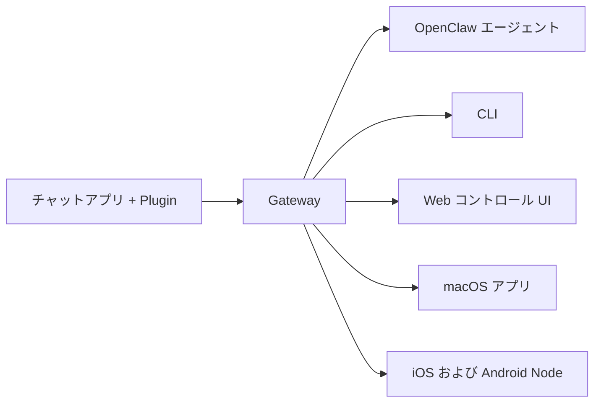

---
read_when:
    - OpenClaw を初めて使う方への紹介
summary: OpenClaw は、あらゆる OS で動作する AI エージェント向けのマルチチャネル Gateway です。
title: OpenClaw
x-i18n:
    generated_at: "2026-07-26T10:17:14Z"
    model: gpt-5.6
    postprocess_version: locale-links-v1
    prompt_version: 32
    provider: openai
    source_hash: 0ce948d12d4b4fcbde2597f9b33f50b99c4f677b69e0f5d72677b2f6683291f3
    source_path: index.md
    workflow: 16
---

# OpenClaw 🦞

<p align="center">
    
    
</p>

> _「角質除去！角質除去！」_ — おそらく宇宙のロブスター

<p align="center">
  <strong>Discord、Google Chat、iMessage、Matrix、Microsoft Teams、Signal、Slack、Telegram、WhatsApp、Zalo などの AI エージェントに対応する、あらゆる OS 向け Gateway。</strong><br />
  メッセージを送ると、手元でエージェントから応答を受け取れます。1 つの Gateway で、チャネル Plugin、WebChat、モバイル Node を実行できます。<br />
  非営利団体の <a href="https://openclaw.org">OpenClaw Foundation</a> によって、オープンに開発されています。
</p>

<Columns>
  <Card title="はじめる" href="/ja-JP/start/getting-started" icon="rocket">
    OpenClaw をインストールし、数分で Gateway を起動します。
  </Card>
  <Card title="オンボーディングを実行" href="/ja-JP/start/wizard" icon="list-checks">
    `openclaw onboard` とペアリングフローを使用したガイド付きセットアップです。
  </Card>
  <Card title="チャネルを接続" href="/ja-JP/channels" icon="message-circle">
    Discord、Signal、Telegram、WhatsApp などを連携し、どこからでもチャットできます。
  </Card>
  <Card title="コントロール UI を開く" href="/ja-JP/web/control-ui" icon="layout-dashboard">
    チャット、設定、セッション用のブラウザダッシュボードを起動します。
  </Card>
</Columns>

## ドキュメントを見る

モバイルブラウザでは、デスクトップ版の完全なタブバーが表示されず、セクションメニューのみ表示される場合があります。ページ本文から同じトップレベルのドキュメント領域にアクセスするには、
以下のハブリンクを使用してください。

<Columns>
  <Card title="はじめに" href="/ja-JP" icon="rocket">
    概要、ショーケース、最初のステップ、セットアップガイド。
  </Card>
  <Card title="インストール" href="/ja-JP/install" icon="download">
    インストール方法、更新、コンテナ、ホスティング、高度なセットアップ。
  </Card>
  <Card title="チャネル" href="/ja-JP/channels" icon="messages-square">
    メッセージングチャネル、ペアリング、ルーティング、アクセスグループ、チャネル QA。
  </Card>
  <Card title="エージェント" href="/ja-JP/concepts/architecture" icon="bot">
    アーキテクチャ、セッション、コンテキスト、メモリ、マルチエージェントルーティング。
  </Card>
  <Card title="機能" href="/ja-JP/tools" icon="wand-sparkles">
    ツール、Skills、Cron、Webhook、自動化機能。
  </Card>
  <Card title="ClawHub" href="/clawhub" icon="store">
    Plugin マーケットプレイス、公開、キュレーション、信頼性に関するガイダンス。
  </Card>
  <Card title="モデル" href="/ja-JP/providers" icon="brain">
    プロバイダー、モデル設定、フェイルオーバー、ローカルモデルサービス。
  </Card>
  <Card title="プラットフォーム" href="/ja-JP/platforms" icon="monitor-smartphone">
    macOS、Windows、iOS、Android、Node、Web インターフェース。
  </Card>
  <Card title="Gateway と運用" href="/ja-JP/gateway" icon="server">
    Gateway の設定、セキュリティ、診断、運用。
  </Card>
  <Card title="リファレンス" href="/ja-JP/cli" icon="terminal">
    CLI リファレンス、スキーマ、RPC、リリースノート、テンプレート。
  </Card>
  <Card title="ヘルプ" href="/ja-JP/help" icon="life-buoy">
    トラブルシューティング、よくある質問、テスト、診断、環境チェック。
  </Card>
</Columns>

## OpenClaw とは？

OpenClaw は、お気に入りのチャットアプリ（Discord、Google Chat、iMessage、Matrix、Microsoft Teams、Signal、Slack、Telegram、WhatsApp、Zalo など）をチャネル Plugin 経由で AI コーディングエージェントに接続する、**セルフホスト型 Gateway** です。自身のマシン（またはサーバー）で 1 つの Gateway プロセスを実行すると、メッセージングアプリと常時利用可能な AI アシスタントをつなぐ橋渡し役になります。

**対象ユーザーは？** データの管理権を手放したり、ホスト型サービスに依存したりせずに、どこからでもメッセージを送れるパーソナル AI アシスタントを求める開発者やパワーユーザーです。

**どこが違うのか？**

- **セルフホスト型**：自身のハードウェア上で、自身のルールに従って動作
- **マルチチャネル**：1 つの Gateway ですべての設定済みチャネル Plugin を同時に提供
- **エージェントネイティブ**：ツール利用、セッション、メモリ、マルチエージェントルーティングを備えたコーディングエージェント向け設計
- **オープンソース**：MIT ライセンス、コミュニティ主導

**必要なものは？** Node 24.15+（推奨）、互換性のための Node 22 LTS（`22.22.3+`）、または Node 25.9+、選択したプロバイダーの API キー、および 5 分です。最高の品質とセキュリティを得るには、利用可能な最新世代の最も高性能なモデルを使用してください。

## 仕組み



Gateway は、セッション、ルーティング、チャネル接続に関する唯一の信頼できる情報源です。

## 主な機能

<Columns>
  <Card title="マルチチャネル Gateway" icon="network" href="/ja-JP/channels">
    1 つの Gateway プロセスで Discord、iMessage、Signal、Slack、Telegram、WhatsApp、WebChat などを利用できます。
  </Card>
  <Card title="Plugin チャネル" icon="plug" href="/ja-JP/tools/plugin">
    チャネル Plugin により Matrix、Nostr、Twitch、Zalo などを追加できます。公式 Plugin は必要に応じてインストールされます。
  </Card>
  <Card title="マルチエージェントルーティング" icon="route" href="/ja-JP/concepts/multi-agent">
    エージェント、ワークスペース、または送信者ごとに分離されたセッション。
  </Card>
  <Card title="メディア対応" icon="image" href="/ja-JP/nodes/images">
    画像、音声、ドキュメントを送受信できます。
  </Card>
  <Card title="Web コントロール UI" icon="monitor" href="/ja-JP/web/control-ui">
    チャット、設定、セッション、Node 用のブラウザダッシュボード。
  </Card>
  <Card title="モバイル Node" icon="smartphone" href="/ja-JP/nodes">
    iOS および Android Node をペアリングし、Canvas、カメラ、音声対応のワークフローで利用できます。
  </Card>
</Columns>

## クイックスタート

<Steps>
  <Step title="OpenClaw をインストール">
    ```bash
    npm install -g openclaw@latest
    ```
  </Step>
  <Step title="オンボーディングを行い、サービスをインストール">
    ```bash
    openclaw onboard --install-daemon
    ```
  </Step>
  <Step title="チャット">
    ブラウザでコントロール UI を開き、メッセージを送信します。

    ```bash
    openclaw dashboard
    ```

    または、チャネル（[Telegram](/ja-JP/channels/telegram) が最速）を接続して、スマートフォンからチャットします。

  </Step>
</Steps>

完全なインストール手順と開発環境のセットアップが必要ですか？[はじめに](/ja-JP/start/getting-started)を参照してください。

## ダッシュボード

Gateway の起動後、ブラウザのコントロール UI を開きます。

- ローカルのデフォルト：[http://127.0.0.1:18789/](http://127.0.0.1:18789/)
- リモートアクセス：[Web インターフェース](/ja-JP/web)および[Tailscale](/ja-JP/gateway/tailscale)

<p align="center">
  
</p>

## 設定（任意）

設定は `~/.openclaw/openclaw.json` にあります。

- **何も設定しない**場合、OpenClaw は同梱の OpenClaw エージェントランタイムを使用します。DM はエージェントのメインセッションを共有し、各グループチャットには個別のセッションが割り当てられます。
- アクセスを制限する場合は、`channels.whatsapp.allowFrom` と、グループの場合はメンションルールから設定を始めます。

例：

```json5
{
  channels: {
    whatsapp: {
      allowFrom: ["+15555550123"],
      groups: { "*": { requireMention: true } },
    },
  },
  messages: { groupChat: { mentionPatterns: ["@openclaw"] } },
}
```

## ここから始める

<Columns>
  <Card title="ドキュメントハブ" href="/ja-JP/start/hubs" icon="book-open">
    ユースケース別に整理された、すべてのドキュメントとガイド。
  </Card>
  <Card title="設定" href="/ja-JP/gateway/configuration" icon="settings">
    Gateway のコア設定、トークン、プロバイダー設定。
  </Card>
  <Card title="リモートアクセス" href="/ja-JP/gateway/remote" icon="globe">
    SSH および tailnet のアクセスパターン。
  </Card>
  <Card title="チャネル" href="/ja-JP/channels/telegram" icon="message-square">
    Discord、Feishu、Microsoft Teams、Telegram、WhatsApp などのチャネル固有のセットアップ。
  </Card>
  <Card title="Node" href="/ja-JP/nodes" icon="smartphone">
    ペアリング、Canvas、カメラ、デバイス操作に対応した iOS および Android Node。
  </Card>
  <Card title="ヘルプ" href="/ja-JP/help" icon="life-buoy">
    一般的な修正方法とトラブルシューティングの開始点。
  </Card>
</Columns>

## 詳細情報

<Columns>
  <Card title="全機能一覧" href="/ja-JP/concepts/features" icon="list">
    チャネル、ルーティング、メディア機能の完全な一覧。
  </Card>
  <Card title="マルチエージェントルーティング" href="/ja-JP/concepts/multi-agent" icon="route">
    ワークスペースの分離とエージェントごとのセッション。
  </Card>
  <Card title="セキュリティ" href="/ja-JP/gateway/security" icon="shield">
    トークン、許可リスト、安全性の制御。
  </Card>
  <Card title="トラブルシューティング" href="/ja-JP/gateway/troubleshooting" icon="wrench">
    Gateway の診断と一般的なエラー。
  </Card>
  <Card title="概要とクレジット" href="/ja-JP/reference/credits" icon="info">
    プロジェクトの起源、コントリビューター、ライセンス。
  </Card>
</Columns>
