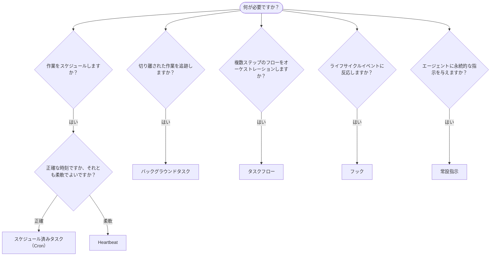

OpenClaw は、タスク、スケジュール済みジョブ、イベントフック、
および常設指示を通じてバックグラウンドで処理を実行します。このページを使用して、適切な仕組みを選択してください。

## クイック判断ガイド

| ユースケース                                | 推奨            | 理由                                              |
| --------------------------------------- | ---------------------- | ------------------------------------------------ |
| 毎日午前 9 時ちょうどにレポートを送信する         | スケジュール済みタスク（Cron） | 正確な時刻、分離された実行                 |
| 20 分後にリマインドする                 | スケジュール済みタスク（Cron） | 正確な時刻での単発実行（`--at`）            |
| 毎週詳細な分析を実行する                | スケジュール済みタスク（Cron） | 独立したタスクで、別のモデルを使用可能         |
| 30 分ごとに受信トレイを確認する                | Heartbeat              | 他の確認処理とまとめて実行し、コンテキストを考慮         |
| 今後のイベントがないかカレンダーを監視する    | Heartbeat              | 定期的な状況把握に自然に適合               |
| サブエージェントまたは ACP 実行の状態を確認する | バックグラウンドタスク       | タスク台帳ですべての切り離された作業を追跡            |
| 何がいつ実行されたかを監査する                 | バックグラウンドタスク       | `openclaw tasks list` および `openclaw tasks audit` |
| 複数ステップで調査してから要約する      | タスクフロー              | リビジョン追跡を備えた永続的なオーケストレーション     |
| セッションのリセット時にスクリプトを実行する           | フック                  | イベント駆動型で、ライフサイクルイベント時に発火          |
| ツール呼び出しのたびにコードを実行する         | Plugin フック           | プロセス内フックでツール呼び出しをインターセプト可能        |
| 返信前に必ずコンプライアンスを確認する | 常設指示        | すべてのセッションに自動的に注入        |

### スケジュール済みタスク（Cron）と Heartbeat の比較

| 観点       | スケジュール済みタスク（Cron）              | Heartbeat                             |
| --------------- | ----------------------------------- | ------------------------------------- |
| タイミング          | 正確（cron 式、単発実行）  | おおよそ（デフォルトでは 30 分ごと）    |
| セッションコンテキスト | 新規（分離）または共有          | メインセッションの完全なコンテキスト             |
| タスクレコード    | 常に作成                      | 作成されない                         |
| 配信        | チャンネル、Webhook、またはサイレント         | メインセッション内でインライン                |
| 最適な用途        | レポート、リマインダー、バックグラウンドジョブ | 受信トレイの確認、カレンダー、通知 |

正確な時刻または分離された実行が必要な場合は、スケジュール済みタスク（Cron）を使用します。完全なセッションコンテキストが役立ち、おおよそのタイミングで問題ない場合は、Heartbeat を使用します。

## 基本概念

### スケジュール済みタスク（cron）

Cron は、正確なタイミングを実現する Gateway 組み込みのスケジューラーです。ジョブを永続化し、適切な時刻にエージェントを起動し、出力をチャットチャンネルまたは Webhook エンドポイントへ配信できます。単発のリマインダー、繰り返し式、および受信 Webhook トリガーをサポートします。

[スケジュール済みタスク](/ja-JP/automation/cron-jobs)を参照してください。

### タスク

バックグラウンドタスク台帳は、ACP 実行、サブエージェントの生成、分離された cron 実行、CLI 操作など、すべての切り離された作業を追跡します。タスクはレコードであり、スケジューラーではありません。確認するには、`openclaw tasks list` と `openclaw tasks audit` を使用します。

[バックグラウンドタスク](/ja-JP/automation/tasks)を参照してください。

### タスクフロー

タスクフローは、バックグラウンドタスクの上位に位置するフローオーケストレーション基盤です。管理同期モードとミラー同期モード、リビジョン追跡、確認用の `openclaw tasks flow list|show|cancel` を備えた、永続的な複数ステップのフローを管理します。

[タスクフロー](/ja-JP/automation/taskflow)を参照してください。

### 常設指示

常設指示は、定義されたプログラムに対する恒久的な運用権限をエージェントに付与します。ワークスペースファイル（通常は `AGENTS.md`）に保存され、すべてのセッションに注入されます。時間に基づく適用には cron と組み合わせてください。

[常設指示](/ja-JP/automation/standing-orders)を参照してください。

### フック

内部フックは、エージェントのライフサイクルイベント
（`/new`、`/reset`、`/stop`）、セッションの Compaction、Gateway の起動、およびメッセージ
フローによってトリガーされるイベント駆動型スクリプトです。フックディレクトリから検出され、
`openclaw hooks` で管理されます。プロセス内でツール呼び出しをインターセプトするには、
[Plugin フック](/ja-JP/plugins/hooks)を使用します。

[フック](/ja-JP/automation/hooks)を参照してください。

### Heartbeat

Heartbeat は、メインセッションで定期的に行われるターンです（デフォルトでは 30 分ごと）。チェックリスト形式の監視（受信トレイ、カレンダー、通知）を、完全なセッションコンテキストを使用して 1 回のエージェントターンにまとめます。Heartbeat ターンはタスクレコードを作成せず、日次またはアイドル時のセッションリセットの鮮度を延長しません。Heartbeat のスクラッチは小さなプロンプトコンテキストです。繰り返し実行する作業は cron ジョブとしてスケジュールしてください。Heartbeat のスクラッチが空の場合は、`empty-heartbeat-file` としてスキップされます。cron の作業が実行中またはキューに入っている間、Heartbeat は延期されます。また、同じエージェントのセッションキーに紐づくサブエージェントまたはネストされたレーンが処理中の場合、`heartbeat.skipWhenBusy` によってそのエージェントを延期することもできます。

[Heartbeat](/ja-JP/gateway/heartbeat)を参照してください。

## 各機能の連携

- **Cron** は、正確なスケジュール（日次レポート、週次レビュー）と単発のリマインダーを処理します。すべての cron 実行でタスクレコードが作成されます。
- **Heartbeat** は、30 分ごとにまとめられた 1 つの監視チェックリストを処理します。独立した間隔が必要な確認処理は cron が担当します。
- **フック** は、特定のイベント（セッションのリセット、Compaction、メッセージフロー）にカスタムスクリプトで反応します。Plugin フックはツール呼び出しを対象とします。
- **常設指示** は、エージェントに永続的なコンテキストと権限の境界を与えます。
- **タスクフロー** は、個々のタスクの上位で複数ステップのフローを調整します。
- **タスク** は、すべての切り離された作業を自動的に追跡し、確認および監査できるようにします。

## 関連項目

- [スケジュール済みタスク](/ja-JP/automation/cron-jobs) — 正確なスケジューリングと単発のリマインダー
- [バックグラウンドタスク](/ja-JP/automation/tasks) — すべての切り離された作業のタスク台帳
- [タスクフロー](/ja-JP/automation/taskflow) — 永続的な複数ステップのフローオーケストレーション
- [フック](/ja-JP/automation/hooks) — イベント駆動型のライフサイクルスクリプト
- [Plugin フック](/ja-JP/plugins/hooks) — プロセス内のツール、プロンプト、メッセージ、およびライフサイクルのフック
- [常設指示](/ja-JP/automation/standing-orders) — 永続的なエージェント指示
- [Heartbeat](/ja-JP/gateway/heartbeat) — メインセッションでの定期的なターン
- [設定リファレンス](/ja-JP/gateway/configuration-reference) — すべての設定キー
