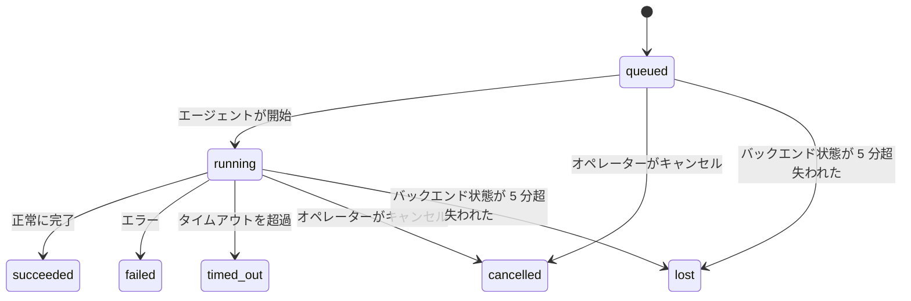

---
read_when:
    - 進行中または最近完了したバックグラウンド処理の確認
    - デタッチされたエージェント実行の配信失敗をデバッグする
    - バックグラウンド実行とセッション、Cron、Heartbeat の関係を理解する
sidebarTitle: Background tasks
summary: ACP 実行、サブエージェント、Cron 実行、CLI 操作のバックグラウンドタスク追跡
title: バックグラウンドタスク
x-i18n:
    generated_at: "2026-07-26T08:51:54Z"
    model: gpt-5.6
    postprocess_version: locale-links-v1
    prompt_version: 32
    provider: openai
    source_hash: dbdc5ced133764fec0c8b9ae7b1957e24272dc9c1c86099de81f6923955d6b5a
    source_path: automation/tasks.md
    workflow: 16
---

<Note>
スケジュール設定をお探しですか？適切な仕組みの選択については、[自動化](/ja-JP/automation)を参照してください。このページはバックグラウンド作業のアクティビティ台帳であり、スケジューラではありません。
</Note>

バックグラウンドタスクは、**メインの会話セッション外**で実行される作業（ACP 実行、サブエージェントの起動、Cron ジョブの実行、CLI から開始された操作）を追跡します。

タスクはセッション、Cron ジョブ、Heartbeat の代わりには**なりません**。タスクは、切り離された作業で何がいつ行われ、成功したかどうかを記録する**アクティビティ台帳**です。

<Note>
すべてのエージェント実行でタスクが作成されるわけではありません。Heartbeat のターンと通常の対話型チャットでは作成されません。すべての Cron 実行、ACP の起動、サブエージェントの起動、Gateway によってディスパッチされた CLI エージェントコマンド、およびエージェントが開始したバックグラウンド `exec` コマンドでは作成されます。
</Note>

## 要約

- タスクはスケジューラではなく**記録**です。Cron と Heartbeat が作業を実行する_タイミング_を決定し、タスクは_何が起きたか_を追跡します。
- ACP、サブエージェント、すべての Cron ジョブ、CLI 操作はタスクを作成します。Heartbeat のターンは作成しません。
- 各タスクは `queued → running → terminal`（成功、失敗、タイムアウト、キャンセル、または喪失）を遷移します。
- Cron ランタイムがジョブを所有している間、Cron タスクはアクティブなままです。メモリ内のランタイム状態が失われた場合、タスクのメンテナンスでは、タスクを喪失とする前に、永続化された Cron 実行履歴を確認します。
- 完了処理はプッシュ駆動です。切り離された作業は、完了時に直接通知するか、要求元のセッションまたは Heartbeat を起動できるため、通常、ステータスをポーリングするループは適切ではありません。
- 分離された Cron 実行とサブエージェントの完了処理では、最終的なクリーンアップ記録の前に、子セッションで追跡されているブラウザタブやプロセスをベストエフォートでクリーンアップします。
- 分離された Cron の配信では、子孫サブエージェントの作業がまだ終了処理中である間、古い中間的な親の応答を抑制し、配信前に最終的な子孫の出力が届いた場合はそれを優先します。
- 完了通知はチャネルに直接配信されるか、次回の Heartbeat 用にキューへ追加されます。
- `openclaw tasks list` はすべてのタスクを表示し、`openclaw tasks audit` は問題を明示します。
- 終了済みの記録は 7 日間（`lost` の記録は 24 時間）保持された後、自動的に削除されます。

## クイックスタート

<Tabs>
  <Tab title="一覧表示と絞り込み">
    ```bash
    # すべてのタスクを一覧表示（新しい順）
    openclaw tasks list

    # ランタイムまたはステータスで絞り込み
    openclaw tasks list --runtime acp
    openclaw tasks list --status running
    ```

  </Tab>
  <Tab title="詳細表示">
    ```bash
    # 特定のタスクの詳細を表示（タスク ID、実行 ID、またはセッションキーを指定）
    openclaw tasks show <lookup>
    ```
  </Tab>
  <Tab title="キャンセルと通知">
    ```bash
    # 実行中のタスクをキャンセル（子セッションを終了）
    openclaw tasks cancel <lookup>

    # タスクの通知ポリシーを変更
    openclaw tasks notify <lookup> state_changes
    ```

  </Tab>
  <Tab title="監査とメンテナンス">
    ```bash
    # 正常性監査を実行
    openclaw tasks audit

    # メンテナンスをプレビューまたは適用
    openclaw tasks maintenance
    openclaw tasks maintenance --apply
    ```

  </Tab>
  <Tab title="タスクフロー">
    ```bash
    # TaskFlow の状態を確認
    openclaw tasks flow list
    openclaw tasks flow show <lookup>
    openclaw tasks flow cancel <lookup>
    ```
  </Tab>
</Tabs>

## タスクが作成される操作

| ソース                 | ランタイム種別 | タスク記録が作成されるタイミング                                          | デフォルトの通知ポリシー |
| ---------------------- | ------------ | ---------------------------------------------------------------------- | --------------------- |
| ACP バックグラウンド実行    | `acp`        | 子 ACP セッションの起動                                           | `done_only`           |
| サブエージェントのオーケストレーション | `subagent`   | `sessions_spawn` によるサブエージェントの起動                               | `done_only`           |
| Cron ジョブ（全種別）  | `cron`       | Cron の実行ごと（メインセッションおよび分離実行）                       | `silent`              |
| CLI 操作         | `cli`        | Gateway を介して実行される `openclaw agent` コマンド                 | `silent`              |
| エージェントのメディアジョブ       | `cli`        | セッションに紐づく `image_generate`/`music_generate`/`video_generate` の実行 | `silent`              |

<AccordionGroup>
  <Accordion title="Cron とメディアの通知デフォルト">
    Cron タスク（メインセッションおよび分離実行）は `silent` 通知ポリシーを使用します。追跡用の記録は作成されますが、タスク固有の通知は生成されません。配信経路は Cron が所有します。

    セッションに紐づく `image_generate`、`music_generate`、`video_generate` の実行も `silent` 通知ポリシーを使用します。これらもタスク記録を作成しますが、完了は内部ウェイクとして元のエージェントセッションに返されるため、エージェント自身がフォローアップメッセージを作成し、完成したメディアを添付できます。要求元のエージェントは通常の可視応答契約に従います。設定されている場合は自動的に最終応答を返し、セッションでメッセージツールによる応答が必要な場合は `message(action="send")` と `NO_REPLY` を使用します。要求元のセッションがアクティブでなくなっているか、アクティブウェイクに失敗し、完了エージェントが生成されたメディアの一部または全部を含めなかった場合、OpenClaw は不足しているメディアのみを含む冪等な直接フォールバックを元のチャネルターゲットへ送信します。

  </Accordion>
  <Accordion title="同時メディア生成のガードレール">
    セッションに紐づくメディア生成タスクがアクティブな間、`image_generate`、`music_generate`、`video_generate` は意図しない再試行を防止します。同じプロンプトまたは要求で呼び出しを繰り返すと、重複するタスクを開始せず、一致するアクティブなタスクのステータスを返します。一方、異なるプロンプトでは独自のタスクを開始できます。エージェント側から進捗やステータスを明示的に照会する場合は、`action: "status"` を使用します。
  </Accordion>
  <Accordion title="タスクを作成しない操作">
    - Heartbeat のターン — メインセッション。[Heartbeat](/ja-JP/gateway/heartbeat)を参照
    - 通常の対話型チャットのターン
    - 直接の `/command` 応答

  </Accordion>
</AccordionGroup>

## タスクのライフサイクル



| ステータス      | 意味                                                               |
| ----------- | --------------------------------------------------------------------------- |
| `queued`    | 作成済みで、エージェントの開始を待機中                                     |
| `running`   | エージェントのターンを実行中                                            |
| `succeeded` | 正常に完了                                                      |
| `failed`    | エラーで完了                                                     |
| `timed_out` | 設定されたタイムアウトを超過                                             |
| `cancelled` | オペレーターが `openclaw tasks cancel` で停止したか、実行が中止された |
| `lost`      | 5 分間の猶予期間後に、ランタイムが信頼できるバックエンド状態を喪失  |

遷移は自動的に行われます。エージェント実行のライフサイクルイベント（開始、終了、エラー）がタスクのステータスを更新するため、手動で管理する必要はありません。

アクティブなタスク記録については、エージェント実行の完了が信頼できる情報源です。切り離された実行が成功すると `succeeded`、通常の実行エラーでは `failed`、タイムアウトでは `timed_out`、キャンセルまたは中止では `cancelled` として確定します。タスクが終了状態になると、その後のライフサイクルシグナルによって状態が後退することはありません。オペレーターによってキャンセルされたタスクや、すでに `failed`/`timed_out`/`lost` となっているタスクは、その後に成功シグナルを受信しても、その状態を維持します。

`lost` はランタイムを考慮します。

- ACP タスク: Gateway 内で実行中のインプロセス ACP ターンのみが、実行が生存していることを証明します。永続化されたセッションメタデータだけでは証明になりません。オフラインの CLI 監査は保守的に動作し、ACP タスクを回収することはありません。
- サブエージェントタスク: バックエンドの子セッションが対象エージェントのストアから消失した場合（または再起動復旧用のトゥームストーンが付いている場合）。
- Cron タスク: Cron ランタイムがジョブをアクティブとして追跡しなくなり、永続化された Cron 実行履歴にもその実行の終了結果がない場合。オフラインの CLI 監査では、自身の空のインプロセス Cron ランタイム状態を信頼できる情報源として扱いません。
- CLI タスク: 実行 ID またはソース ID を持つタスクは実行中の実行コンテキストを使用するため、Gateway が所有する実行が消失した後も残存する子セッション行やチャットセッション行によって生存扱いにはなりません。実行識別情報を持たない従来の CLI タスクのみ、引き続き子セッションにフォールバックします。Gateway を介した `openclaw agent` の実行も実行結果から確定するため、完了済みの実行がスイーパーによって `lost` とされるまでアクティブなままになることはありません。

## 配信と通知

タスクが終了状態に達すると、OpenClaw が通知します。配信経路は 2 つあります。

**直接配信** — タスクにチャネルターゲット（`requesterOrigin`）がある場合、完了メッセージはそのチャネル（Discord、Slack、Telegram など）に直接送信されます。ただし、グループおよびチャネルのタスク完了は、親エージェントが可視応答を作成できるよう、要求元のセッションを介してルーティングされます。サブエージェントの完了については、OpenClaw は可能な場合、紐づけられたスレッドやトピックのルーティングも維持します。また、直接配信を断念する前に、要求元セッションに保存されたルート（`lastChannel` / `lastTo` / `lastAccountId`）から欠落している `to` / アカウントを補完できます。

**セッションキュー配信** — 直接配信に失敗した場合、または送信元が設定されていない場合、更新は要求元セッションのシステムイベントとしてキューに追加され、次回の Heartbeat で表示されます。

<Tip>
セッションキューに追加されたタスク完了は、即時に Heartbeat のウェイクをトリガーするため、結果をすぐに確認できます。次回予定されている Heartbeat のティックを待つ必要はありません。
</Tip>

つまり、通常のワークフローはプッシュベースです。切り離された作業を一度開始し、完了時にランタイムがウェイクまたは通知するのを待ちます。タスクの状態をポーリングするのは、デバッグ、介入、または明示的な監査が必要な場合だけにしてください。

### 通知ポリシー

各タスクについて受け取る通知の量を制御します。

| ポリシー                | 配信される内容                                       |
| --------------------- | ------------------------------------------------------- |
| `done_only`（デフォルト） | 終了状態のみ（成功、失敗など）           |
| `state_changes`       | すべての状態遷移と進捗更新              |
| `silent`              | 一切なし（Cron、CLI、メディアタスクのデフォルト） |

タスクの実行中にポリシーを変更できます。

```bash
openclaw tasks notify <lookup> state_changes
```

## CLI リファレンス

<AccordionGroup>
  <Accordion title="tasks list">
    ```bash
    openclaw tasks list [--runtime <acp|subagent|cron|cli>] [--status <status>] [--json]
    ```

    出力列: タスク、種別、ステータス、配信、実行、子セッション、概要。引数なしの `openclaw tasks` は `openclaw tasks list` と同様に動作します。

  </Accordion>
  <Accordion title="tasks show">
    ```bash
    openclaw tasks show <lookup> [--json]
    ```

    検索トークンには、タスク ID、実行 ID、またはセッションキーを指定できます。タイミング、配信状態、エラー、終了時の概要を含む完全な記録を表示します。

  </Accordion>
  <Accordion title="tasks cancel">
    ```bash
    openclaw tasks cancel <lookup>
    ```

    ACP およびサブエージェントタスクでは、これにより子セッションが終了します。ACP と cron のキャンセルは、実行中の Gateway を経由します（`tasks.cancel`）。CLI で追跡されるタスクでは、キャンセルはタスクレジストリに記録されます（個別の子ランタイムハンドルはありません）。ステータスは `cancelled` に移行し、該当する場合は配信通知が送信されます。

  </Accordion>
  <Accordion title="tasks notify">
    ```bash
    openclaw tasks notify <lookup> <done_only|state_changes|silent>
    ```
  </Accordion>
  <Accordion title="tasks audit">
    ```bash
    openclaw tasks audit [--severity <warn|error>] [--code <name>] [--limit <n>] [--json]
    ```

    タスクと TaskFlow の運用上の問題を 1 つのレポートに表示します。問題が検出された場合、検出結果は `openclaw status` にも表示されます。

    タスクの検出結果：

    | 検出結果                   | 重大度   | トリガー                                                                                                      |
    | ------------------------- | ---------- | ------------------------------------------------------------------------------------------------------------ |
    | `stale_queued`            | warn       | 10 分を超えてキューに登録されている                                                                              |
    | `stale_running`           | error      | 30 分を超えて実行されている                                                                             |
    | `lost`                    | warn/error | ランタイムに裏付けられたタスクの所有権が消失した。保持されている喪失タスクは `cleanupAfter` までは警告となり、その後エラーになる |
    | `delivery_failed`         | warn       | 配信に失敗し、通知ポリシーが `silent` ではない                                                            |
    | `missing_cleanup`         | warn       | クリーンアップのタイムスタンプがない終端タスク                                                                      |
    | `inconsistent_timestamps` | warn       | タイムライン違反（たとえば開始前に終了）                                                        |

    TaskFlow の検出結果：

    | 検出結果                | 重大度   | トリガー                                                                    |
    | ---------------------- | ---------- | --------------------------------------------------------------------------- |
    | `restore_failed`       | error      | SQLite からのフローレジストリの復元に失敗した                                    |
    | `stale_running`        | error      | 実行中のフローが 30 分を超えて進行していない                      |
    | `stale_waiting`        | warn       | 待機中のフローが 30 分を超えて進行していない                      |
    | `stale_blocked`        | warn       | ブロックされたフローが 30 分を超えて進行していない                      |
    | `cancel_stuck`         | warn       | 5 分以上前にキャンセルが要求され、アクティブな子タスクがないにもかかわらず、まだ非終端状態である |
    | `missing_linked_tasks` | warn/error | リンクされたタスクも待機状態もない、古い管理対象フロー                       |
    | `blocked_task_missing` | warn       | ブロックされたフローが、存在しなくなったタスク ID を参照している                      |

  </Accordion>
  <Accordion title="tasks maintenance">
    ```bash
    openclaw tasks maintenance [--json]
    openclaw tasks maintenance --apply [--json]
    ```

    タスク、TaskFlow の状態、および古い cron 実行セッションレジストリ行について、照合、クリーンアップのタイムスタンプ付与、プルーニングをプレビューまたは適用するために使用します。

    照合はランタイムを考慮します：

    - ACP タスクでは Gateway 内に実行中のインプロセスターンが必要です。サブエージェントタスクでは、その基盤となる子セッションを確認します。
    - 子セッションに再起動復旧用のトゥームストーンがあるサブエージェントタスクは、復旧可能な基盤セッションとして扱われるのではなく、喪失としてマークされます。
    - Cron タスクでは cron ランタイムがまだジョブを所有しているかを確認し、`lost` にフォールバックする前に、永続化された cron 実行ログ／ジョブ状態から終端ステータスを復元します。メモリ内の cron アクティブジョブセットについて権威を持つのは Gateway プロセスだけです。オフラインの CLI 監査では永続的な履歴を使用しますが、ローカルセットが空であるという理由だけで cron タスクを喪失としてマークすることはありません。
    - 実行 ID を持つ CLI タスクでは、子セッションまたはチャットセッションの行だけでなく、所有元の実行中コンテキストを確認します。

    完了時のクリーンアップもランタイムを考慮します：

    - サブエージェントの完了時には、通知のクリーンアップを続行する前に、子セッションで追跡されているブラウザタブ／プロセスをベストエフォートで閉じます。
    - 分離された cron の完了時には、実行が完全に終了する前に、cron セッションで追跡されているブラウザタブ／プロセスをベストエフォートで閉じます。
    - 分離された cron の配信では、必要に応じて子孫サブエージェントの後続処理が完了するまで待機し、古い親の確認応答テキストを通知する代わりに抑制します。
    - サブエージェント完了時の配信では、子の最新の可視アシスタントテキストのみを使用します。tool/toolResult の出力が子の結果テキストに昇格することはありません。終端状態が失敗の実行では、取り込まれた応答テキストを再生せずに失敗ステータスを通知します。
    - クリーンアップの失敗によって、実際のタスク結果が隠されることはありません。

    メンテナンスを適用すると、OpenClaw は現在実行中の cron ジョブの行を保持し、cron 以外のセッション行には変更を加えずに、7 日より古い `cron:<jobId>:run:<runId>` セッションレジストリ行も削除します。

  </Accordion>
  <Accordion title="tasks flow list | show | cancel">
    ```bash
    openclaw tasks flow list [--status <status>] [--json]
    openclaw tasks flow show <lookup> [--json]
    openclaw tasks flow cancel <lookup>
    ```

    フロー検索トークンには、フロー ID または所有者キーを指定できます。個別のバックグラウンドタスクレコードではなく、オーケストレーションを行う [Task Flow](/ja-JP/automation/taskflow) を確認したい場合に使用します。

  </Accordion>
</AccordionGroup>

## チャットタスクボード（`/tasks`）

任意のチャットセッションで `/tasks` を使用すると、そのセッションにリンクされたバックグラウンドタスクを確認できます。ボードには、アクティブなタスクと最近完了したタスクが最大 5 件表示され、ランタイム、ステータス、タイミング、進捗またはエラーの詳細を確認できます。

現在のセッションに表示可能なリンク済みタスクがない場合、`/tasks` はエージェントローカルのタスク数にフォールバックするため、他のセッションの詳細を漏らすことなく概要を確認できます。

オペレーター向けの完全な台帳を確認するには、CLI の `openclaw tasks list` を使用します。

### Control UI

Web Control UI のサイドバーには、アクティブなバックグラウンドタスクと最近のバックグラウンドタスクをリアルタイムで表示する **タスク** ページがあります。進捗の確認、リンクされたセッションを開く、台帳の更新、キュー内および実行中のタスクのキャンセルに使用します。

チャットペインには、そのペインのエージェントをスコープとする、折りたたみ可能な **バックグラウンドタスク** レールもあります。停止コントロール付きの実行中タスクとサブエージェント、完了セクション、および各タスクの子セッションへの「トランスクリプトを表示」リンクが含まれます。ペインヘッダーのアクティビティ切り替え（または単一ペインチャットのフローティングアクティビティボタン）から開きます。

レールでタスクを選択すると、範囲が限定された入力プロンプトと、最新の出力またはエラーの概要を確認できます。実行中の作業は完了済みの作業とは分けて表示され、完了済みの行にはタスクが完了したか失敗したかが表示されます。iOS では **チャットアクション → バックグラウンドタスク** を開きます。Android ではチャットのオーバーフローメニューを開き、**バックグラウンドタスク** を選択します。どちらのモバイルビューも同じ「実行中」と「完了」のグループを使用し、選択するとタスクの詳細を開きます。

## ステータス統合（タスク負荷）

`openclaw status` には、タスクの概要をひと目で確認できる行が含まれます：

```
タスク    アクティブ 2 件 · キュー内 1 件 · 実行中 1 件 · 問題 1 件 · 監査は正常 · 追跡中 6 件
```

概要には、アクティブな作業（`queued` + `running`）、失敗（`failed` + `timed_out` + `lost`）、監査の検出結果、および追跡対象レコードの合計が集計されます。JSON ペイロードでは、ランタイム別（`acp`、`subagent`、`cron`、`cli`）の件数も内訳として示されます。

`/status` と `session_status` ツールはどちらも、クリーンアップを考慮したタスクスナップショットを使用します。アクティブなタスクが優先され、期限切れの行は非表示になり、終端タスクは直近の短い時間枠（5 分間）に限って表示されます。アクティブな作業がない場合は失敗が優先表示されます。これにより、ステータスカードは現在重要な情報に集中します。

## ストレージとメンテナンス

### タスクの保存場所

タスクレコードと配信状態は、共有 OpenClaw SQLite 状態データベースに永続化されます：

```
~/.openclaw/state/openclaw.sqlite   （テーブル：task_runs、task_delivery_state、flow_runs）
```

状態ルート全体（デフォルトは `~/.openclaw`）を別の場所に移動するには、`OPENCLAW_STATE_DIR` を設定します。共有データベースのパスもそれに伴って移動します。

レジストリは初回使用時にメモリへ読み込まれ、すべての書き込みが SQLite に永続化されるため、Gateway の再起動後もレコードは保持されます。WAL の増加は、SQLite のデフォルトの自動チェックポイントしきい値と定期的な `PASSIVE` チェックポイントによって制限されます。シャットダウン時および明示的なメンテナンスのチェックポイントでは `TRUNCATE` を使用するため、バックグラウンドスイーパーをアクティブな読み取り処理で待機させることなく、通常の終了時に WAL 領域を回収できます。

以前のインストールに由来する従来のサイドカーストア（`tasks/runs.sqlite`、`flows/registry.sqlite`）は、`openclaw doctor` によって共有データベースへインポートされます。

### 自動メンテナンス

スイーパーは **60 秒** ごと（最初の処理は Gateway の起動から約 5 秒後）に実行され、次の 4 つを処理します：

<Steps>
  <Step title="照合">
    アクティブなタスクに、信頼できるランタイムの裏付けがまだ存在するかを確認します。ACP タスクには実行中のインプロセスターンが必要であり、サブエージェントタスクは子セッションの状態を使用し、cron タスクはアクティブジョブの所有権と永続的な実行履歴を使用し、実行 ID を持つ CLI タスクは所有元の実行コンテキストを使用します。裏付けとなる状態が 5 分を超えて失われている場合（子を持たないネイティブなサブエージェントタスクでは 30 分）、タスクは `lost` としてマークされます。
  </Step>
  <Step title="ACP セッションの修復">
    終端状態または孤立した親所有のワンショット ACP セッションを閉じます。また、アクティブな会話バインディングが残っていない場合に限り、古い終端状態または孤立した永続 ACP セッションを閉じます。
  </Step>
  <Step title="クリーンアップのタイムスタンプ付与">
    終端タスクに `cleanupAfter` タイムスタンプ（終端時刻 + 保持期間）を設定します。保持期間中、喪失タスクは監査で引き続き警告として表示されます。`cleanupAfter` の期限切れ後、またはクリーンアップメタデータがない場合は、エラーになります。
  </Step>
  <Step title="プルーニング">
    `cleanupAfter` の日付を過ぎたレコードを削除します。
  </Step>
</Steps>

<Note>
**保持期間：** 終端タスクのレコードは **7 日間**（`lost` レコードは **24 時間**）保持され、その後自動的にプルーニングされます。設定は不要です。
</Note>

## タスクと他のシステムとの関係

<AccordionGroup>
  <Accordion title="タスクと Task Flow">
    [Task Flow](/ja-JP/automation/taskflow) は、バックグラウンドタスクの上位に位置するフローオーケストレーション層です。1 つのフローは、その存続期間中に管理同期モードまたはミラー同期モードを使用して複数のタスクを調整できます。個別のタスクレコードを確認するには `openclaw tasks` を使用し、オーケストレーションを行うフローを確認するには `openclaw tasks flow` を使用します。

  </Accordion>
  <Accordion title="タスクと cron">
    Cron ジョブの定義、ランタイム実行状態、および実行履歴は、OpenClaw の共有 SQLite 状態データベースに保存されます。メインセッションと分離セッションの両方を含む、cron の **すべての** 実行で、通知ポリシーが `silent` のタスクレコードが作成されます。そのため、cron 実行は独自のタスク通知を生成せずに追跡されます。

    [Cron ジョブ](/ja-JP/automation/cron-jobs)を参照してください。

  </Accordion>
  <Accordion title="タスクと Heartbeat">
    Heartbeat の実行はメインセッションのターンであり、タスクレコードは作成されません。タスクが完了すると、Heartbeat のウェイクをトリガーできるため、結果を速やかに確認できます。

    [Heartbeat](/ja-JP/gateway/heartbeat)を参照してください。

  </Accordion>
  <Accordion title="タスクとセッション">
    タスクは、`childSessionKey`（作業が実行される場所）と `requesterSessionKey`（開始したユーザー）を参照する場合があります。その `agentId` は作業を実行するエージェントを識別し、リクエスターと所有者のフィールドは開始と制御のコンテキストを保持します。セッションは会話のコンテキストであり、タスクはその上に構築されたアクティビティ追跡です。
  </Accordion>
  <Accordion title="タスクとエージェント実行">
    タスクの `runId` は、作業を行うエージェント実行にリンクします。エージェントのライフサイクルイベント（開始、終了、エラー）によってタスクのステータスが自動的に更新されるため、ライフサイクルを手動で管理する必要はありません。
  </Accordion>
</AccordionGroup>

## 関連項目

- [自動化](/ja-JP/automation) - すべての自動化メカニズムの概要
- [CLI：タスク](/ja-JP/cli/tasks) - CLI コマンドリファレンス
- [Heartbeat](/ja-JP/gateway/heartbeat) - メインセッションの定期ターン
- [スケジュール済みタスク](/ja-JP/automation/cron-jobs) - バックグラウンド作業のスケジュール設定
- [タスクフロー](/ja-JP/automation/taskflow) - タスクの上位で行うフローオーケストレーション
