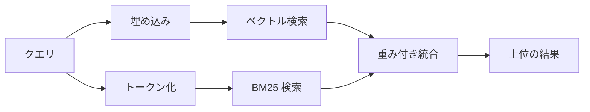

---
read_when:
    - memory_search の仕組みを理解したい場合
    - 埋め込みプロバイダーを選択する場合
    - 検索品質を調整したい場合
summary: 埋め込みとハイブリッド検索を使用してメモリ検索が関連するノートを見つける仕組み
title: メモリ検索
x-i18n:
    generated_at: "2026-07-26T09:38:20Z"
    model: gpt-5.6
    postprocess_version: locale-links-v1
    prompt_version: 32
    provider: openai
    source_hash: b2bd28b63ac55a2a890ed70a3015f76f1c7fbaa792b17a6ead51f4c8712fbd2d
    source_path: concepts/memory-search.md
    workflow: 16
---

`memory_search` は、表現が元のテキストと異なる場合でも、メモリファイルから関連するノートを検索します。メモリを小さな断片に分割し、埋め込み、キーワード、またはその両方を使用して検索します。

## クイックスタート

OpenClaw はデフォルトで OpenAI の埋め込みを使用します。別のプロバイダーを使用するには、明示的に設定します。

```json5
{
  memory: {
    search: {
      provider: "openai", // または "gemini", "voyage", "mistral", "bedrock", "local", "ollama", "lmstudio", "github-copilot", "openai-compatible"
    },
  },
}
```

`provider` は、カスタムの `models.providers.<id>` エントリ（例: `ollama-5080`）を参照することもできます。ただし、そのエントリで `api` が `"ollama"`、またはメモリ埋め込みアダプターを持つ別のプロバイダー ID に設定されている必要があります。

API キーなしでローカル埋め込みを使用するには、公式の llama.cpp プロバイダー Plugin をインストールし、`provider: "local"` を設定します。

```bash
openclaw plugins install @openclaw/llama-cpp-provider
```

ソースチェックアウトでは、引き続きネイティブビルドの承認が必要です。`pnpm approve-builds` を実行してから、`pnpm rebuild node-llama-cpp` を実行します。

一部の OpenAI 互換埋め込みエンドポイントでは、検索用の `"query"` や、インデックス化されたチャンク用の `"document"`/`"passage"` など、非対称な `input_type` ラベルが必要です。これらは `queryInputType` と `documentInputType` で設定します。詳細は[メモリ設定リファレンス](/ja-JP/reference/memory-config#provider-specific-config)を参照してください。

## 対応プロバイダー

| プロバイダー      | ID                  | API キーが必要 | 備考                                   |
| ----------------- | ------------------- | -------------- | -------------------------------------- |
| Bedrock           | `bedrock`           | いいえ         | AWS 認証情報チェーンを使用             |
| DeepInfra         | `deepinfra`         | はい           | デフォルトモデルは `BAAI/bge-m3`       |
| Gemini            | `gemini`            | はい           | 画像および音声のインデックス化に対応   |
| GitHub Copilot    | `github-copilot`    | いいえ         | Copilot サブスクリプションを使用       |
| Local             | `local`             | いいえ         | GGUF モデル、約 0.6 GB を自動ダウンロード |
| LM Studio         | `lmstudio`          | いいえ         | ローカル／セルフホスト型サーバー       |
| Mistral           | `mistral`           | はい           |                                        |
| Ollama            | `ollama`            | いいえ         | ローカル／セルフホスト型サーバー       |
| OpenAI            | `openai`            | はい           | デフォルト                             |
| OpenAI 互換       | `openai-compatible` | 通常は必要     | 汎用 `/v1/embeddings` エンドポイント |
| Voyage            | `voyage`            | はい           |                                        |

## 検索の仕組み

OpenClaw は 2 つの検索経路を並列で実行し、その結果を統合します。



- **ベクトル検索**は、意味が類似する内容を照合します（「gateway host」は「OpenClaw を実行しているマシン」と一致します）。
- **BM25 キーワード検索**は、完全に一致する用語（ID、エラー文字列、設定キー）を照合します。
- **ファイル名検索**は、ノート本文とは別にパスをインデックス化します。完全なフルパス、ベース名、ファイル名の語幹は、部分的なパス一致より上位にランクされますが、スニペットと本文のキーワードスコアは引き続きノートの内容から取得されます。

一方の経路しか利用できない場合は、その経路のみが実行されます。

**FTS 専用モード。** 埋め込みを意図的に無効化し、キーワードのみで検索するには、`provider: "none"` を設定します。`provider` を未設定のままにするか `"auto"` に設定した場合も、埋め込み認証が構成されていなければ、エラーを発生させずにキーワードのみのランキングへフォールバックします。`provider: "local"`（GGUF/llama.cpp プロバイダー）が失敗した場合も同様です。

**明示的に指定したプロバイダーが利用できない場合。** その他のプロバイダー（例: `openai`、`ollama`、`gemini`）を明示的に指定し、リクエスト時に利用できなくなった場合（認証エラー、ネットワーク障害）、`memory_search` は暗黙的に FTS 専用の結果へ機能低下させるのではなく、メモリが利用できないことを報告します。これにより、設定済みプロバイダーの障害が明確になります。意図的に FTS 専用の検索を行うには `provider: "none"` を設定します。セマンティックランキングを復元するには、プロバイダーまたは認証の設定を修正します。

## 検索品質の向上

大規模なノート履歴では、2 つのオプション機能が役立ちます。

### 時間的減衰

古いノートのランキング重みは徐々に低下し、最近の情報が先に表示されるようになります。デフォルトの半減期は 30 日で、先月のノートのスコアは元の重みの 50% になります。`MEMORY.md` と、`memory/` 配下にある日付なしのその他のファイルは恒久的に扱われ、減衰しません。減衰するのは、日付付きの `memory/YYYY-MM-DD.md` ファイルのみです。

<Tip>
エージェントに数か月分の日次ノートがあり、古い情報が最近のコンテキストより上位に表示され続ける場合は、この機能を有効にしてください。
</Tip>

### MMR（多様性）

重複する結果を減らします。5 件のノートがすべて同じルーター設定に言及している場合、MMR によって、同じ内容を繰り返すのではなく、上位の結果が異なるトピックを網羅するようになります。

<Tip>
`memory_search` が異なる日次ノートからほぼ重複するスニペットを返し続ける場合は、この機能を有効にしてください。
</Tip>

### 両方を有効化

```json5
{
  memory: {
    search: {
      query: {
        hybrid: {
          mmr: { enabled: true },
          temporalDecay: { enabled: true },
        },
      },
    },
  },
}
```

## マルチモーダルメモリ

`gemini-embedding-2-preview` を使用すると、Markdown とともに画像や音声をインデックス化できます。これは `memory.search.extraPaths` 配下のファイルにのみ適用され、デフォルトのメモリルート（`MEMORY.md`、`memory/*.md`）は引き続き Markdown のみを扱います。検索クエリはテキストのままですが、視覚および音声コンテンツと照合されます。設定については、[メモリ設定リファレンス](/ja-JP/reference/memory-config#multimodal-memory-gemini)を参照してください。

## セッションメモリ検索

セッショントランスクリプトから完全一致の全文検索を行うには、[`sessions_search`](/ja-JP/concepts/session-search)を使用し、`sessions_history` で結果を開きます。セッションメモリ検索は、セマンティック検索を補完する実験的機能です。

必要に応じてセッショントランスクリプトをインデックス化し、`memory_search` から以前の会話を呼び出せるようにできます。この機能はオプトインです。`experimental.sessionMemory: true` を設定し、`sources` に `"sessions"` を追加します（デフォルトの `sources` は `["memory"]` です）。

セッションの検索結果は `tools.sessions.visibility` に従います。デフォルトの `"tree"` では、現在のセッション、そのセッションが生成したセッション、および周辺グループ認識を通じて監視されている同一エージェントのグループセッションが公開されます。`session.dmScope: "main"` では、複数ユーザーの DM 設定がそのメインセッションを共有するため、そこにルーティングされたユーザーは、監視対象グループのコンテンツを呼び出せます。DM を分離するにはピアごとの `dmScope` を使用するか、可視性を `"self"` に設定して、周辺で監視されているセッションの読み取りを無効にします。それ以外の無関係な同一エージェントのセッションには、引き続き `"agent"` の可視性が必要です。

QMD バックエンドを使用する場合は、トランスクリプトが QMD コレクションへエクスポートされるように、`memory.qmd.sessions.enabled: true` も設定します。`experimental.sessionMemory` と `sources` だけでは、トランスクリプトは QMD にエクスポートされません。詳細は[設定リファレンス](/ja-JP/reference/memory-config#session-memory-search-experimental)を参照してください。

## トラブルシューティング

**結果がありませんか？** `openclaw memory status` を実行してインデックスを確認します。空の場合は、`openclaw memory index --force` を実行します。

**キーワード一致しかありませんか？** 埋め込みプロバイダーが設定されていない可能性があります。`openclaw memory status --deep` を確認してください。

**ローカル埋め込みがタイムアウトしますか？** `ollama`、`lmstudio`、`local` は、プロバイダーが管理するより長いバッチ期限を使用します。プロバイダーの状態を確認し、`openclaw memory index --force` を再実行してください。

**CJK テキストが見つかりませんか？** `openclaw memory index --force` を使用して FTS インデックスを再構築してください。

## 関連項目

- [メモリの概要](/ja-JP/concepts/memory)
- [Active Memory](/ja-JP/concepts/active-memory)
- [組み込みメモリエンジン](/ja-JP/concepts/memory-builtin)
- [メモリ設定リファレンス](/ja-JP/reference/memory-config)
