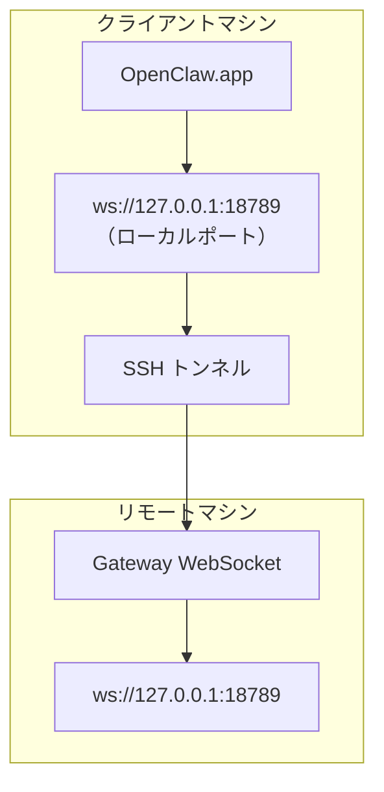

<Note>
このコンテンツは現在、[リモートアクセス](/ja-JP/gateway/remote#macos-persistent-ssh-tunnel-via-launchagent)に移動しています。最新のガイドについてはそちらのページを参照してください。このページはリダイレクト先として残されています。
</Note>

# リモート Gateway で OpenClaw.app を実行する

OpenClaw.app は SSH トンネル経由でリモート Gateway に接続します。SSH `LocalForward` により、ローカルポートがリモートホスト上の Gateway WebSocket ポートにマッピングされます。

## セットアップ

1. `LocalForward 18789 127.0.0.1:18789` を含む SSH 設定エントリを追加します（完全な設定ブロックについては、[リモートアクセス](/ja-JP/gateway/remote#macos-persistent-ssh-tunnel-via-launchagent)を参照してください）。
2. `ssh-copy-id` を使用して、SSH キーをリモートホストにコピーします。
3. `openclaw config set gateway.remote.token "<your-token>"` を使用して `gateway.remote.token`（または `gateway.remote.password`）を設定します。
4. トンネルを開始します：`ssh -N remote-gateway &`。
5. OpenClaw.app を終了して再度開きます。

再起動後も維持され、自動的に再接続するトンネルには、手動の `ssh -N` の代わりに、[リモートアクセス](/ja-JP/gateway/remote#macos-persistent-ssh-tunnel-via-launchagent)ページの LaunchAgent セットアップを使用してください。

## 仕組み

| コンポーネント                       | 動作内容                                                        |
| ------------------------------------ | --------------------------------------------------------------- |
| `LocalForward 18789 127.0.0.1:18789` | ローカルポート 18789 をリモートポート 18789 に転送します          |
| `ssh -N`                             | リモートコマンドを実行せずに SSH 接続します（ポート転送のみ）     |
| `KeepAlive`                          | トンネルがクラッシュした場合に自動的に再起動します（LaunchAgent） |
| `RunAtLoad`                          | LaunchAgent の読み込み時にトンネルを開始します（LaunchAgent）     |

OpenClaw.app はクライアント上の `ws://127.0.0.1:18789` に接続します。トンネルはその接続を、Gateway が実行されているリモートホストのポート 18789 に転送します。

## 関連項目

- [リモートアクセス](/ja-JP/gateway/remote)
- [Tailscale](/ja-JP/gateway/tailscale)
