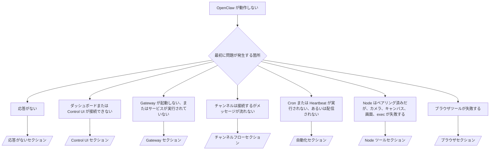

---
read_when:
    - OpenClaw が動作せず、最短で修正する必要がある場合
    - 詳細なランブックを読み込む前に、トリアージの流れが必要な場合
summary: OpenClaw の症状別トラブルシューティングハブ
title: 一般的なトラブルシューティング
x-i18n:
    generated_at: "2026-07-26T10:05:44Z"
    model: gpt-5.6
    postprocess_version: locale-links-v1
    prompt_version: 32
    provider: openai
    source_hash: de3554ed680ac536d105017220b44d94456a4408916e949352500b046f4d5f17
    source_path: help/troubleshooting.md
    workflow: 16
---

トリアージの入口です。2 分で診断し、その後、詳細ページに進みます。

## 最初の 60 秒

次の手順を順番に実行します。

```bash
openclaw status
openclaw status --all
openclaw gateway probe
openclaw gateway status
openclaw doctor
openclaw channels status --probe
openclaw logs --follow
```

正常な出力（各項目 1 行）:

- `openclaw status` は設定済みのチャンネルを表示し、認証エラーはありません。
- `openclaw status --all` は共有可能な完全なレポートを生成します。
- `openclaw gateway probe` は `Reachable: yes` を表示します。`Capability: ...` は
  プローブで確認された認証レベルです。`Read probe: limited - missing scope:
operator.read` は診断機能の低下を示すもので、接続失敗ではありません。
- `openclaw gateway status` は `Runtime: running`、`Connectivity probe:
ok`、および妥当な `Capability: ...` を表示します。
  読み取りスコープの RPC 証明も必須にするには、`--require-rpc` を追加します。
- `openclaw doctor` は、処理を妨げる設定またはサービスのエラーがないことを報告します。
- `openclaw channels status --probe` は、Gateway に到達できる場合、アカウントごとのライブなトランスポート状態
  （`works` / `audit ok`）を返します。到達できない場合は、
  設定のみの概要にフォールバックします。
- `openclaw logs --follow` は安定した動作を示し、致命的なエラーの繰り返しはありません。

## アシスタントの機能が制限されている、またはツールが不足している

有効なツールプロファイルを確認します。

```bash
openclaw status
openclaw status --all
openclaw doctor
```

一般的な原因:

- `tools.profile: "minimal"` は `session_status` のみを許可します。
- `tools.profile: "messaging"` は範囲が狭く、チャット専用エージェント向けです。
- `tools.profile: "coding"` は、新しいローカル設定のデフォルトです（リポジトリ、ファイル、
  シェル、ランタイムの作業）。
- `tools.profile: "full"` はプロファイルの制限を解除します。信頼できる
  オペレーター管理下のエージェントに限定してください。
- エージェントごとの `agents.entries.*.tools` は、1 つのエージェントについて
  ルートプロファイルを狭めるか拡張します。

プロファイルを変更し、Gateway を再起動または再読み込みしてから、
`openclaw status --all` で再確認します。プロファイルとグループの完全な表: [ツールプロファイル](/ja-JP/gateway/config-tools#tool-profiles)。

## Anthropic の長いコンテキストで発生する 429

`HTTP 429: rate_limit_error: Extra usage is required for long context requests`
→ [Anthropic 429: 長いコンテキストには追加使用量が必要](/ja-JP/gateway/troubleshooting#anthropic-429-extra-usage-required-for-long-context)。

## ローカルの OpenAI 互換バックエンドは直接実行すると動作するが、OpenClaw では失敗する

ローカルまたはセルフホストの `/v1` バックエンドは、`/v1/chat/completions` の
直接プローブには応答するものの、`openclaw infer model run` または通常のエージェントターンでは失敗します。

1. エラーに、文字列を期待する `messages[].content` が記載されている場合:
   `models.providers.<provider>.models[].compat.requiresStringContent: true` を設定します。
2. OpenClaw のエージェントターンでのみ引き続き失敗する場合:
   `models.providers.<provider>.models[].compat.supportsTools: false` を設定して再試行します。
3. 小さな直接呼び出しは動作するものの、OpenClaw の大きなプロンプトでバックエンドがクラッシュする場合:
   これは上流のモデルまたはサーバーの制限であり、OpenClaw のバグではありません。
   [ローカルの OpenAI 互換バックエンドは直接プローブに合格するが、エージェント実行は失敗する](/ja-JP/gateway/troubleshooting#local-openai-compatible-backend-passes-direct-probes-but-agent-runs-fail)に進みます。

## openclaw extensions がないため Plugin のインストールが失敗する

`package.json missing openclaw.extensions` は、Plugin パッケージが
OpenClaw でサポートされなくなった形式を使用していることを意味します。

Plugin パッケージで修正します。

1. `package.json` に `openclaw.extensions` を追加し、ビルド済みのランタイム
   ファイル（通常は `./dist/index.js`）を指定します。
2. 再公開してから、`openclaw plugins install <package>` をもう一度実行します。

```json
{
  "name": "@openclaw/my-plugin",
  "version": "1.2.3",
  "openclaw": {
    "extensions": ["./dist/index.js"]
  }
}
```

リファレンス: [Plugin アーキテクチャ](/ja-JP/plugins/architecture)

## インストールポリシーが Plugin のインストールまたは更新をブロックする

更新は完了したものの Plugin が古いまま、無効、または `blocked by install
policy`、`install policy failed closed`、`Disabled "<plugin>" after plugin
update failure` のいずれかを表示する場合は、`security.installPolicy` を確認します。

インストールポリシーは、Plugin のインストールと更新時に実行されます。`@openclaw/*` Plugin の
バージョンは通常 OpenClaw のリリースとともに進むため、OpenClaw の更新後の同期中に
対応する Plugin の更新が必要になる場合があります。

対応するアップグレードルールも管理する場合を除き、次のポリシー形式は避けてください。

- OpenClaw 所有の Plugin を、古い特定の 1 バージョン（たとえば
  `@openclaw/*@2026.5.3` のみ）に固定する。
- ソース種別だけを基準にブロックする（すべての npm、ネットワーク、または `request.mode:
"update"` リクエスト）。
- ポリシーコマンドを任意として扱う。`security.installPolicy` が
  有効な場合、ポリシー実行ファイルが存在しない、遅い、読み取れない、または権限によってブロックされていると、
  フェイルクローズになります。
- リクエストの `openclawVersion` を Plugin 候補のメタデータと
  照合せずにバージョンを承認する。

1 つのリリースを永続的に固定するのではなく、現在のホストと互換性のある、信頼済みの
`@openclaw/*` 更新を許可するルールを優先してください。デフォルトで npm を
ブロックする場合は、使用する Plugin ID に限定した例外を追加し、インストールと同じ
信頼ルールを `request.mode: "update"` にも適用します。

復旧手順:

```bash
openclaw doctor --deep
openclaw plugins update --all
openclaw status --all
```

ポリシーを意図的に厳格にしている場合は、信頼済みのアップグレード期間中だけ緩和し、
`openclaw plugins update --all` を再実行してから、より厳格なルールに戻します。
更新の失敗によって Plugin が無効になった場合は、再有効化する前に調査します。

```bash
openclaw plugins inspect <plugin-id> --runtime --json
openclaw plugins enable <plugin-id>
```

リファレンス: [オペレーターのインストールポリシー](/ja-JP/tools/skills-config#operator-install-policy-securityinstallpolicy)

## Plugin は存在するが、不審な所有権によってブロックされる

`openclaw doctor`、セットアップ、または起動時の警告に次の内容が表示されます。

```text
ブロックされた Plugin 候補: 不審な所有権（... uid=1000、想定される uid=0 または root）
Plugin は存在しますがブロックされています
```

Plugin ファイルの所有者が、それを読み込むプロセスとは異なる Unix ユーザーになっています。
Plugin の設定は削除しないでください。ファイルの所有権を修正するか、状態ディレクトリを
所有するユーザーとして OpenClaw を実行してください。

Docker インストールは `node`（uid `1000`）として実行されます。ホストのバインドマウントを修復します。

```bash
sudo chown -R 1000:1000 /path/to/openclaw-config /path/to/openclaw-workspace
openclaw doctor --fix
```

OpenClaw を意図的に root として実行している場合は、代わりに管理対象の Plugin ルートを
修復します。

```bash
sudo chown -R root:root /path/to/openclaw-config/npm
openclaw doctor --fix
```

詳細ドキュメント: [ブロックされた Plugin パスの所有権](/ja-JP/tools/plugin#blocked-plugin-path-ownership)、[Docker: 権限と EACCES](/ja-JP/install/docker#shell-helpers-optional)

## デシジョンツリー



<AccordionGroup>
  <Accordion title="応答がない">
    ```bash
    openclaw status
    openclaw gateway status
    openclaw channels status --probe
    openclaw pairing list --channel <channel> [--account <id>]
    openclaw logs --follow
    ```

    正常な出力:

    - `Runtime: running`
    - `Connectivity probe: ok`
    - `Capability: read-only`、`write-capable`、または `admin-capable`
    - チャンネルはトランスポートが接続済みであること、および対応している場合は
      `channels status --probe` に `works` または `audit ok` を表示します
    - 送信者が承認済みです（または DM ポリシーが open/allowlist です）

    ログの特徴:

    - `drop guild message (mention required` → Discord のメンションゲートによってメッセージがブロックされました。
    - `pairing request` → 送信者が未承認で、DM ペアリングの承認を待っています。
    - チャンネルログ内の `blocked` / `allowlist` → 送信者、ルーム、またはグループがフィルタリングされました。

    詳細ページ: [応答がない](/ja-JP/gateway/troubleshooting#no-replies)、[チャンネルのトラブルシューティング](/ja-JP/channels/troubleshooting)、[ペアリング](/ja-JP/channels/pairing)

  </Accordion>

  <Accordion title="ダッシュボードまたは Control UI が接続できない">
    ```bash
    openclaw status
    openclaw gateway status
    openclaw logs --follow
    openclaw doctor
    openclaw channels status --probe
    ```

    正常な出力:

    - `openclaw gateway status` に `Dashboard: http://...` が表示されます
    - `Connectivity probe: ok`
    - `Capability: read-only`、`write-capable`、または `admin-capable`
    - ログに認証ループがありません

    ログの特徴:

    - `device identity required` → HTTP または非セキュアなコンテキストではデバイス認証を完了できません。
    - `origin not allowed` → ブラウザの `Origin` は、Control UI の Gateway 接続先で許可されていません。
    - `canRetryWithDeviceToken=true` を伴う `AUTH_TOKEN_MISMATCH` → ペアリング済みトークンのキャッシュされたスコープを再利用し、信頼済みデバイストークンによる再試行が 1 回自動的に行われる場合があります。
    - その再試行後も `unauthorized` が繰り返される → トークンまたはパスワードが間違っている、認証モードが一致していない、またはペアリング済みデバイストークンが古くなっています。
    - `too many failed authentication attempts (retry later)` → そのブラウザの `Origin` から繰り返し失敗したため、一時的にロックアウトされています。localhost の他のオリジンには別のバケットが使用されます。Tailscale Serve の同時再試行に関する注意事項については、[ダッシュボード／Control UI の接続](/ja-JP/gateway/troubleshooting#dashboard-control-ui-connectivity)を参照してください。
    - `gateway connect failed:` → UI が誤った URL またはポートを接続先としているか、Gateway に到達できません。

    詳細ページ: [ダッシュボード／Control UI の接続](/ja-JP/gateway/troubleshooting#dashboard-control-ui-connectivity)、[Control UI](/ja-JP/web/control-ui)、[認証](/ja-JP/gateway/authentication)

  </Accordion>

  <Accordion title="Gateway が起動しない、またはサービスはインストール済みだが実行されていない">
    ```bash
    openclaw status
    openclaw gateway status
    openclaw logs --follow
    openclaw doctor
    openclaw channels status --probe
    ```

    正常な出力:

    - `Service: ... (loaded)`
    - `Runtime: running`
    - `Connectivity probe: ok`
    - `Capability: read-only`、`write-capable`、または `admin-capable`

    ログの特徴:

    - `Gateway start blocked: set gateway.mode=local` または `existing config is missing gateway.mode` → Gateway モードが remote になっているか、設定にローカルモードのスタンプがなく、修復が必要です。
    - `refusing to bind gateway ... without auth` → 有効な認証経路（トークン／パスワード、または設定されている場合は trusted-proxy）がない状態で、非 loopback にバインドしています。
    - `another gateway instance is already listening` または `EADDRINUSE` → ポートがすでに使用されています。

    詳細ページ: [Gateway サービスが実行されていない](/ja-JP/gateway/troubleshooting#gateway-service-not-running)、[バックグラウンドプロセス](/ja-JP/gateway/background-process)、[設定](/ja-JP/gateway/configuration)

  </Accordion>

  <Accordion title="チャンネルは接続するがメッセージが流れない">
    ```bash
    openclaw status
    openclaw gateway status
    openclaw logs --follow
    openclaw doctor
    openclaw channels status --probe
    ```

    正常な出力:

    - チャンネルトランスポートが接続済みです。
    - ペアリング／許可リストのチェックに合格します。
    - 必要な箇所でメンションが検出されます。

    ログの特徴:

    - `mention required` → グループのメンションゲートによって処理がブロックされました。
    - `pairing` / `pending` → DM の送信者がまだ承認されていません。
    - `not_in_channel`、`missing_scope`、`Forbidden`、`401/403` → チャンネル権限トークンの問題です。

    詳細ページ: [チャンネルは接続済みだがメッセージが流れない](/ja-JP/gateway/troubleshooting#channel-connected-messages-not-flowing)、[チャンネルのトラブルシューティング](/ja-JP/channels/troubleshooting)

  </Accordion>

  <Accordion title="Cron または Heartbeat が実行されない、あるいは配信されない">
    ```bash
    openclaw status
    openclaw gateway status
    openclaw cron status
    openclaw cron list
    openclaw cron runs --id <jobId> --limit 20
    openclaw logs --follow
    ```

    正常な出力:

    - `cron status` は、スケジューラーが有効で、次回の起動時刻が設定されていることを示します。
    - `cron runs` は、最近の `ok` エントリを示します。
    - Heartbeat が有効で、アクティブ時間内です。

    ログシグネチャ：

    - `cron: scheduler disabled; jobs will not run automatically` → cron が無効です。
    - `heartbeat skipped` の理由が `quiet-hours` → 設定されたアクティブ時間外です。
    - `heartbeat skipped` の理由が `empty-heartbeat-file` → Heartbeat モニターのスクラッチには、空白、コメント、ヘッダー、フェンス、または空のチェックリストのひな形しか含まれていません。
    - `heartbeat skipped` の理由が `alerts-disabled` → `showOk`、`showAlerts`、`useIndicator` がすべてオフです。
    - `requests-in-flight` → メインレーンがビジー状態のため、Heartbeat の起動が延期されました。
    - `unknown accountId` → Heartbeat の配信先アカウントが存在しません。

    詳細ページ：[Cron と Heartbeat の配信](/ja-JP/gateway/troubleshooting#cron-and-heartbeat-delivery)、[スケジュールされたタスク：トラブルシューティング](/ja-JP/automation/cron-jobs#troubleshooting)、[Heartbeat](/ja-JP/gateway/heartbeat)

  </Accordion>

  <Accordion title="Node はペアリング済みだが、camera、canvas、screen、exec ツールが失敗する">
    ```bash
    openclaw status
    openclaw gateway status
    openclaw nodes status
    openclaw nodes describe --node <idOrNameOrIp>
    openclaw logs --follow
    ```

    正常な出力：

    - Node が接続済みかつペアリング済みとしてロール `node` に表示されます。
    - 呼び出しているコマンドに対応する機能が存在します。
    - ツールの権限状態が許可済みです。

    ログシグネチャ：

    - `NODE_BACKGROUND_UNAVAILABLE` → Node アプリをフォアグラウンドに移動してください。
    - `*_PERMISSION_REQUIRED` → OS 権限が拒否されているか、付与されていません。
    - `SYSTEM_RUN_DENIED: approval required` → exec の承認待ちです。
    - `SYSTEM_RUN_DENIED: allowlist miss` → コマンドが exec の許可リストにありません。

    詳細ページ：[Node はペアリング済みだがツールが失敗する](/ja-JP/gateway/troubleshooting#node-paired-tool-fails)、[Node のトラブルシューティング](/ja-JP/nodes/troubleshooting)、[Exec の承認](/ja-JP/tools/exec-approvals)

  </Accordion>

  <Accordion title="Exec が突然承認を求める">
    ```bash
    openclaw config get tools.exec.host
    openclaw config get tools.exec.security
    openclaw config get tools.exec.ask
    openclaw gateway restart
    ```

    変更点：

    - 未設定の `tools.exec.host` はデフォルトで `auto` になり、サンドボックスランタイムが有効な場合は `sandbox`、
      それ以外の場合は `gateway` に解決されます。
    - `host=auto` はルーティングのみを行います。プロンプトなしの動作は、Gateway/Node 上の
      `security=full` と `ask=off` によって決まります。
    - 未設定の `tools.exec.security` は、`gateway`/`node` ではデフォルトで `full` になります。
    - 未設定の `tools.exec.ask` はデフォルトで `off` になります。
    - 承認が表示される場合は、ホストローカルまたはセッション単位の何らかのポリシーによって、
      exec がこれらのデフォルトより厳しく制限されています。

    現在の承認不要のデフォルトに戻す：

    ```bash
    openclaw config set tools.exec.host gateway
    openclaw config set tools.exec.security full
    openclaw config set tools.exec.ask off
    openclaw gateway restart
    ```

    より安全な代替手段：

    - 安定したホストルーティングには、`tools.exec.host=gateway` のみを設定します。
    - 許可リストにない場合に確認を行うホスト exec には、`security=allowlist` と `ask=on-miss` を使用します。
    - サンドボックスモードを有効にして、`host=auto` が `sandbox` に再び解決されるようにします。

    ログシグネチャ：

    - `Approval required.` → コマンドは `/approve ...` を待機しています。
    - `SYSTEM_RUN_DENIED: approval required` → Node ホストの exec 承認待ちです。
    - `exec host=sandbox requires a sandbox runtime for this session` → サンドボックスが暗黙的または明示的に選択されていますが、サンドボックスモードはオフです。

    詳細ページ：[Exec](/ja-JP/tools/exec)、[Exec の承認](/ja-JP/tools/exec-approvals)、[セキュリティ：監査で確認される項目](/ja-JP/gateway/security#what-the-audit-checks-high-level)

  </Accordion>

  <Accordion title="ブラウザーツールが失敗する">
    ```bash
    openclaw status
    openclaw gateway status
    openclaw browser status
    openclaw logs --follow
    openclaw doctor
    ```

    正常な出力：

    - ブラウザーのステータスに `running: true` と、選択されたブラウザー/プロファイルが表示されます。
    - `openclaw` プロファイルが起動するか、`user` プロファイルがローカルの Chrome タブを検出します。

    ログシグネチャ：

    - `unknown command "browser"` → `plugins.allow` が設定されており、`browser` が除外されています。
    - `Failed to start Chrome CDP on port` → ローカルブラウザーの起動に失敗しました。
    - `browser.executablePath not found` → 設定されたバイナリパスが正しくありません。
    - `browser.cdpUrl must be http(s) or ws(s)` → 設定された CDP URL でサポートされていないスキームが使用されています。
    - `browser.cdpUrl has invalid port` → 設定された CDP URL のポートが無効または範囲外です。
    - `No Chrome tabs found for profile="user"` → Chrome MCP 接続プロファイルで、ローカルの Chrome タブが開かれていません。
    - `Remote CDP for profile "<name>" is not reachable` → 設定されたリモート CDP エンドポイントにこのホストから到達できません。
    - `Browser attachOnly is enabled ... not reachable` → 接続専用プロファイルに稼働中の CDP ターゲットがありません。
    - 接続専用またはリモート CDP プロファイルに古いビューポート/ダークモード/ロケール/オフラインのオーバーライドが残っている → `openclaw browser stop --browser-profile <name>` を実行すると、Gateway を再起動せずに制御セッションを閉じてエミュレーション状態を解除できます。

    詳細ページ：[ブラウザーツールが失敗する](/ja-JP/gateway/troubleshooting#browser-tool-fails)、[ブラウザーコマンドまたはツールが見つからない](/ja-JP/tools/browser#missing-browser-command-or-tool)、[ブラウザー：Linux のトラブルシューティング](/ja-JP/tools/browser-linux-troubleshooting)、[ブラウザー：WSL2/Windows リモート CDP のトラブルシューティング](/ja-JP/tools/browser-wsl2-windows-remote-cdp-troubleshooting)

  </Accordion>

</AccordionGroup>

## 関連項目

- [よくある質問](/ja-JP/help/faq) — よく寄せられる質問
- [Gateway のトラブルシューティング](/ja-JP/gateway/troubleshooting) — Gateway 固有の問題
- [Doctor](/ja-JP/gateway/doctor) — 自動化された健全性チェックと修復
- [チャンネルのトラブルシューティング](/ja-JP/channels/troubleshooting) — チャンネル接続の問題
- [スケジュールされたタスク：トラブルシューティング](/ja-JP/automation/cron-jobs#troubleshooting) — cron と Heartbeat の問題
