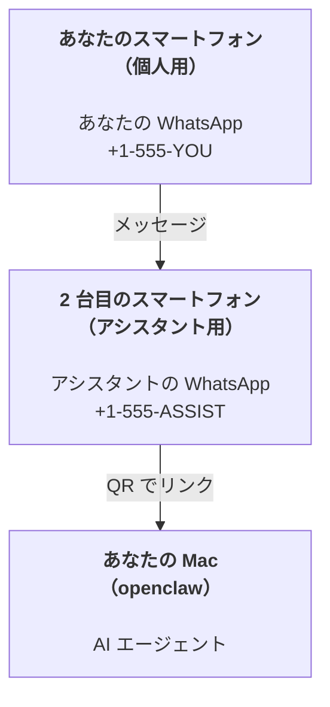

---
read_when:
    - 新しいアシスタントインスタンスのオンボーディング
    - 安全性と権限への影響の確認
summary: 安全上の注意事項を含む、OpenClaw をパーソナルアシスタントとして運用するためのエンドツーエンドガイド
title: パーソナルアシスタントのセットアップ
x-i18n:
    generated_at: "2026-07-26T10:31:56Z"
    model: gpt-5.6
    postprocess_version: locale-links-v1
    prompt_version: 32
    provider: openai
    source_hash: ed3e267971fc1ee5c9154194e5b1f98db8c7a7edca8182871a2057a778614217
    source_path: start/openclaw.md
    workflow: 16
---

OpenClaw は、Discord、Google Chat、iMessage、Matrix、Microsoft Teams、Signal、Slack、Telegram、WhatsApp、Zalo などを AI エージェントに接続するセルフホスト型 Gateway です。このガイドでは、「パーソナルアシスタント」のセットアップ、つまり常時稼働の AI アシスタントとして動作する専用の WhatsApp 番号について説明します。

## 安全を最優先する

エージェントにチャネルを提供すると、ツールポリシーに応じて、マシン上でのコマンド実行、ワークスペース内のファイルの読み書き、接続された任意のチャネルを介したメッセージ送信が可能になります。最初は慎重な設定にしてください。

- 必ず `channels.whatsapp.allowFrom` を設定してください（個人用 Mac で全世界に公開した状態では決して実行しないでください）。
- アシスタントには専用の WhatsApp 番号を使用してください。
- Heartbeat のデフォルト間隔は 30 分です。セットアップを信頼できるようになるまでは、`agents.defaults.heartbeat.every: "0m"` を設定して無効にしてください。

## 前提条件

- OpenClaw がインストールされ、オンボーディング済みであること。まだの場合は、[はじめに](/ja-JP/start/getting-started)を参照してください
- アシスタント用の 2 つ目の電話番号（SIM／eSIM／プリペイド）

## 2 台のスマートフォンを使うセットアップ（推奨）

構成は次のようになります。



個人用の WhatsApp を OpenClaw にリンクすると、あなた宛てのすべてのメッセージが「エージェントへの入力」になります。通常、これは望ましい動作ではありません。

## 5 分でできるクイックスタート

1. WhatsApp Web をペアリングします（QR が表示されるので、アシスタント用スマートフォンでスキャンします）。

```bash
openclaw channels login
```

2. Gateway を起動します（実行したままにします）。

```bash
openclaw gateway --port 18789
```

3. `~/.openclaw/openclaw.json` に最小限の設定を記述します。

```json5
{
  gateway: { mode: "local" },
  channels: { whatsapp: { allowFrom: ["+15555550123"] } },
}
```

許可リストに登録したスマートフォンから、アシスタント用の番号にメッセージを送信します。

オンボーディングが完了すると、OpenClaw はダッシュボードを自動的に開き、トークンを含まない簡潔なリンクを表示します。ダッシュボードで認証を求められた場合は、設定済みの共有シークレットを Control UI の設定に貼り付けます。オンボーディングではデフォルトでトークンを使用します（`gateway.auth.token`）。ただし、`gateway.auth.mode` を `password` に変更している場合は、パスワード認証も使用できます。後で再度開くには、`openclaw dashboard` を使用します。

## エージェントにワークスペースを提供する（AGENTS）

OpenClaw は、ワークスペースディレクトリから操作指示と「メモリ」を読み取ります。

デフォルトでは、OpenClaw は `~/.openclaw/workspace` をエージェントのワークスペースとして使用し、オンボーディング時またはエージェントの初回実行時に、このディレクトリと初期ファイル（`AGENTS.md`、`SOUL.md`、`TOOLS.md`、`IDENTITY.md`、`USER.md`）を自動的に作成します。`BOOTSTRAP.md` は新規ワークスペースに対してのみ作成され、削除した後に再作成されることはありません。`MEMORY.md` は任意であり、自動作成されることはありません。存在する場合は、通常のセッションで読み込まれます。サブエージェントのセッションには、`AGENTS.md` と `TOOLS.md` のみが注入されます。

<Tip>
このフォルダを OpenClaw のメモリとして扱い、`AGENTS.md` とメモリファイルをバックアップできるように、git リポジトリ（できれば非公開）にしてください。git がインストールされている場合、新規ワークスペースは `git init` で自動的に初期化されます。
</Tip>

完全なオンボーディングウィザードを実行せずにワークスペースと設定フォルダを作成するには、次を実行します。

```bash
openclaw setup --baseline
```

（引数なしの `openclaw setup` は `openclaw onboard` のエイリアスであり、完全な対話型ウィザードを実行します。）

ワークスペースの完全なレイアウトとバックアップガイド：[エージェントのワークスペース](/ja-JP/concepts/agent-workspace)
メモリのワークフロー：[メモリ](/ja-JP/concepts/memory)

任意：`agents.defaults.workspace` を使用して別のワークスペースを選択できます（`~` をサポート）。

```json5
{
  agents: {
    defaults: {
      workspace: "~/.openclaw/workspace",
    },
  },
}
```

独自のワークスペースファイルをリポジトリからすでに配布している場合は、ブートストラップファイルの作成を完全に無効にできます。

```json5
{
  agents: {
    defaults: {
      skipBootstrap: true,
    },
  },
}
```

## 「アシスタント」として動作させる設定

OpenClaw のデフォルトは優れたアシスタント向けセットアップですが、通常は次の項目を調整します。

- [`SOUL.md`](/ja-JP/concepts/soul) 内のペルソナ／指示
- 思考のデフォルト設定（必要な場合）
- Heartbeat（信頼できるようになってから）

例：

```json5
{
  logging: { level: "info" },
  agents: {
    defaults: {
      model: { primary: "anthropic/claude-opus-5" },
      workspace: "~/.openclaw/workspace",
      thinkingDefault: "high",
      timeoutSeconds: 1800,
      // 最初は 0 に設定し、後で有効にします。
      heartbeat: { every: "0m" },
    },
    list: [
      {
        id: "main",
        default: true,
        groupChat: {
          mentionPatterns: ["@openclaw", "openclaw"],
        },
      },
    ],
  },
  channels: {
    whatsapp: {
      allowFrom: ["+15555550123"],
      groups: {
        "*": { requireMention: true },
      },
    },
  },
  session: {
    scope: "per-sender",
    resetTriggers: ["/new", "/reset"],
    reset: {
      mode: "daily",
      atHour: 4,
      idleMinutes: 10080,
    },
  },
}
```

## セッションとメモリ

- セッション行、トランスクリプト行、メタデータ（トークン使用量、最後のルートなど）：`~/.openclaw/agents/<agentId>/agent/openclaw-agent.sqlite`
- レガシー／アーカイブのトランスクリプト成果物：`~/.openclaw/agents/<agentId>/sessions/`
- レガシー行の移行元：`~/.openclaw/agents/<agentId>/sessions/sessions.json`
- `/new` または `/reset` は、そのチャットで新しいセッションを開始します（`session.resetTriggers` で設定可能）。単独で送信された場合、OpenClaw はモデルを呼び出さずにリセットを確認します。
- `/compact [instructions]` はセッションコンテキストを圧縮し、残りのコンテキスト予算を報告します。

## Heartbeat（プロアクティブモード）

デフォルトでは、OpenClaw は次のプロンプトを使用して 30 分ごとに Heartbeat を実行します。
`Follow the heartbeat monitor scratch context when provided. Recurring tasks are cron jobs; create or change their schedules with cron tools or the openclaw cron CLI, not heartbeat scratch. Do not infer or repeat old tasks from prior chats. If nothing needs attention, reply HEARTBEAT_OK.`
無効にするには、`agents.defaults.heartbeat.every: "0m"` を設定します。Heartbeat のチェックリストはモニターの Cron スクラッチに保存されます（[Heartbeat](/ja-JP/gateway/heartbeat)を参照）。`openclaw doctor --fix` は、ワークスペース内のレガシーな `HEARTBEAT.md` をそこへ移行します。

- モニターのスクラッチが存在していても、実質的に空の場合（空行、Markdown／HTML コメント、`# Heading` のような Markdown 見出し、フェンスマーカー、または空のチェックリスト項目のみの場合）、OpenClaw は API 呼び出しを節約するため Heartbeat の実行をスキップします。
- スクラッチが存在しない場合でも Heartbeat は実行され、モデルが実行内容を判断します。
- エージェントが `HEARTBEAT_OK` と応答した場合（短いパディングを任意で付加可能。`agents.defaults.heartbeat.ackMaxChars` を参照）、OpenClaw はその Heartbeat の外部配信を抑制します。
- デフォルトでは、DM 形式の `user:<id>` ターゲットへの Heartbeat 配信が許可されています。Heartbeat の実行を有効にしたまま直接ターゲットへの配信を抑制するには、`agents.defaults.heartbeat.directPolicy: "block"` を設定します。
- Heartbeat はエージェントのターンを完全に実行します。間隔を短くすると、より多くのトークンを消費します。

```json5
{
  agents: {
    defaults: {
      heartbeat: { every: "30m" },
    },
  },
}
```

## メディアの入出力

受信した添付ファイル（画像／音声／ドキュメント）は、テンプレートを介してコマンドに渡せます。

- `{{AttachmentPath}}`（ローカル一時ファイルのパス）
- `{{AttachmentUrl}}`（元の URL またはプロバイダー参照）
- `{{AttachmentContentType}}`（MIME コンテンツタイプ）
- `{{AttachmentDir}}`（ローカルパスを含むディレクトリ）
- `{{AttachmentIndex}}`（0 から始まるソースファクトのインデックス）
- `{{Transcript}}`（音声文字起こしが有効な場合）

従来の `{{MediaPath}}`、`{{MediaUrl}}`、`{{MediaType}}`、`{{MediaDir}}`
という名前は、非推奨の互換エイリアスとして引き続き利用できます。

エージェントから送信する添付ファイルでは、メッセージツールまたは返信ペイロードの構造化メディアフィールド（`media`、`mediaUrl`、`mediaUrls`、`path`、`filePath` など）を使用します。メッセージツールの引数の例：

```json
{
  "message": "スクリーンショットを添付します。",
  "mediaUrl": "https://example.com/screenshot.png"
}
```

OpenClaw は、構造化メディアをテキストとともに送信します。レガシーな最終アシスタント応答は、互換性のために引き続き正規化される場合がありますが、ツール出力、ブラウザ出力、ストリーミングブロック、メッセージアクションでは、テキストを添付ファイルコマンドとして解析しません。

ローカルパスの動作には、エージェントと同じファイル読み取りの信頼モデルが適用されます。

- `tools.fs.workspaceOnly` が `true` の場合、送信するローカルメディアのパスは、OpenClaw の一時ルート、メディアキャッシュ、エージェントのワークスペースパス、およびサンドボックスで生成されたファイルに制限されます。
- `tools.fs.workspaceOnly` が `false` の場合、送信するローカルメディアには、エージェントがすでに読み取りを許可されているホスト上のローカルファイルを使用できます。
- ローカルパスには、絶対パス、ワークスペース相対パス、または `~/` を使用したホーム相対パスを指定できます。
- ホスト上のローカルファイルの送信で許可されるのは、引き続きメディアと安全なドキュメント形式（画像、音声、動画、PDF、Office ドキュメント、および Markdown／MD、TXT、JSON、YAML、YML などの検証済みテキストドキュメント）のみです。これは既存のホスト読み取り信頼境界を拡張するものであり、シークレットスキャナーではありません。エージェントがホスト上のローカルな `secret.txt` または `config.json` を読み取れる場合、拡張子とコンテンツの検証に合格すれば、そのファイルを添付できます。

機密ファイルはエージェントが読み取り可能なファイルシステムの外部に保存するか、ローカルパスからの送信をより厳格に制限するため `tools.fs.workspaceOnly: true` を維持してください。

## 運用チェックリスト

```bash
openclaw status          # ローカルの状態（認証情報、セッション、キュー内のイベント）
openclaw status --all    # 完全な診断（読み取り専用、貼り付け可能）
openclaw status --deep   # チャネルを検査（WhatsApp Web + Telegram + Discord + Slack + Signal）
openclaw health --json   # WS 接続経由の Gateway ヘルススナップショット
```

ログは `/tmp/openclaw/` 以下に保存されます。デフォルト
プロファイルでは `openclaw-YYYY-MM-DD.log`、名前付きプロファイルでは `openclaw-<profile>-YYYY-MM-DD.log` です。

## 次のステップ

- WebChat：[WebChat](/ja-JP/web/webchat)
- Gateway の運用：[Gateway ランブック](/ja-JP/gateway)
- Cron とウェイクアップ：[Cron ジョブ](/ja-JP/automation/cron-jobs)
- macOS メニューバーコンパニオン：[OpenClaw macOS アプリ](/ja-JP/platforms/macos)
- iOS Node アプリ：[iOS アプリ](/ja-JP/platforms/ios)
- Android Node アプリ：[Android アプリ](/ja-JP/platforms/android)
- Windows Hub：[Windows](/ja-JP/platforms/windows)
- Linux の状態：[Linux アプリ](/ja-JP/platforms/linux)
- セキュリティ：[セキュリティ](/ja-JP/gateway/security)

## 関連項目

- [はじめに](/ja-JP/start/getting-started)
- [セットアップ](/ja-JP/start/setup)
- [チャネルの概要](/ja-JP/channels)
