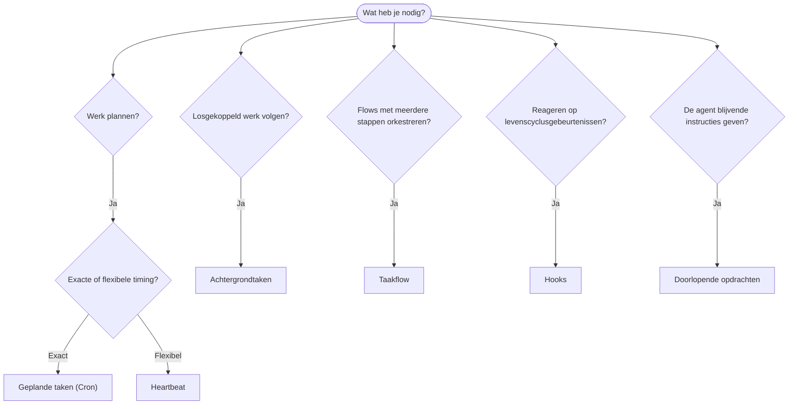

OpenClaw voert werk op de achtergrond uit via taken, geplande opdrachten, event-hooks
en doorlopende instructies. Gebruik deze pagina om het juiste mechanisme te kiezen.

## Snelle keuzehulp

| Gebruikssituatie                              | Aanbevolen              | Waarom                                             |
| --------------------------------------------- | ----------------------- | -------------------------------------------------- |
| Dagelijks rapport stipt om 9.00 uur verzenden | Geplande taken (Cron)   | Exacte timing, geïsoleerde uitvoering              |
| Herinner me over 20 minuten                   | Geplande taken (Cron)   | Eenmalig met nauwkeurige timing (`--at`) |
| Wekelijks een diepgaande analyse uitvoeren    | Geplande taken (Cron)   | Zelfstandige taak, kan een ander model gebruiken   |
| Postvak IN elke 30 min controleren            | Heartbeat               | Gebundeld met andere controles, contextbewust      |
| Agenda op komende gebeurtenissen controleren | Heartbeat               | Past vanzelfsprekend bij periodieke bewaking       |
| Status van een subagent- of ACP-run bekijken  | Achtergrondtaken        | Takenregister volgt al het losgekoppelde werk      |
| Controleren wat wanneer is uitgevoerd         | Achtergrondtaken        | `openclaw tasks list` en `openclaw tasks audit`           |
| Onderzoek in meerdere stappen en samenvatten  | Taakflow                | Duurzame orkestratie met revisietracking           |
| Script uitvoeren wanneer sessie wordt gereset | Hooks                   | Eventgestuurd, geactiveerd bij levenscyclusgebeurtenissen |
| Code uitvoeren bij elke toolaanroep           | Plugin-hooks            | Hooks in hetzelfde proces kunnen toolaanroepen onderscheppen |
| Altijd naleving controleren vóór een antwoord | Doorlopende opdrachten  | Automatisch in elke sessie geïnjecteerd            |

### Geplande taken (Cron) versus Heartbeat

| Dimensie        | Geplande taken (Cron)                 | Heartbeat                                  |
| --------------- | ------------------------------------- | ------------------------------------------ |
| Timing          | Exact (cron-expressies, eenmalig)     | Bij benadering (standaard elke 30 min)     |
| Sessiecontext   | Nieuw (geïsoleerd) of gedeeld         | Volledige context van de hoofdsessie       |
| Taakrecords     | Altijd aangemaakt                     | Nooit aangemaakt                           |
| Aflevering      | Kanaal, webhook of stil               | Inline in de hoofdsessie                   |
| Meest geschikt voor | Rapporten, herinneringen, achtergrondopdrachten | Postvakcontroles, agenda, meldingen |

Gebruik geplande taken (Cron) als je nauwkeurige timing of geïsoleerde uitvoering nodig hebt. Gebruik Heartbeat als het werk baat heeft bij de volledige sessiecontext en timing bij benadering voldoende is.

## Kernbegrippen

### Geplande taken (Cron)

Cron is de ingebouwde planner van de Gateway voor nauwkeurige timing. Cron bewaart opdrachten, activeert de agent op het juiste moment en kan uitvoer afleveren bij een chatkanaal of webhook-eindpunt. Ondersteunt eenmalige herinneringen, terugkerende expressies en triggers van inkomende webhooks.

Zie [Geplande taken](/nl/automation/cron-jobs).

### Taken

Het achtergrondtakenregister volgt al het losgekoppelde werk: ACP-runs, gestarte subagents, geïsoleerde Cron-uitvoeringen en CLI-bewerkingen. Taken zijn records, geen planners. Gebruik `openclaw tasks list` en `openclaw tasks audit` om ze te bekijken.

Zie [Achtergrondtaken](/nl/automation/tasks).

### Taakflow

Taakflow is de onderlaag voor floworkestratie boven achtergrondtaken. Deze beheert duurzame flows met meerdere stappen, met beheerde en gespiegelde synchronisatiemodi, revisietracking en `openclaw tasks flow list|show|cancel` voor inspectie.

Zie [Taakflow](/nl/automation/taskflow).

### Doorlopende opdrachten

Doorlopende opdrachten geven de agent permanente uitvoeringsbevoegdheid voor gedefinieerde programma's. Ze staan in werkruimtebestanden (doorgaans `AGENTS.md`) en worden in elke sessie geïnjecteerd. Combineer ze met Cron voor tijdgebonden handhaving.

Zie [Doorlopende opdrachten](/nl/automation/standing-orders).

### Hooks

Interne hooks zijn eventgestuurde scripts die worden geactiveerd door levenscyclusgebeurtenissen van de agent
(`/new`, `/reset`, `/stop`), Compaction van sessies, het opstarten van de Gateway en de berichtenflow.
Ze worden aangetroffen in hookmappen en beheerd met
`openclaw hooks`. Gebruik voor het onderscheppen van toolaanroepen binnen hetzelfde proces
[Plugin-hooks](/nl/plugins/hooks).

Zie [Hooks](/nl/automation/hooks).

### Heartbeat

Heartbeat is een periodieke beurt in de hoofdsessie (standaard elke 30 minuten). Hiermee wordt bewaking in de vorm van een checklist (Postvak IN, agenda, meldingen) gebundeld in één agentbeurt met de volledige sessiecontext. Heartbeat-beurten maken geen taakrecords aan en verlengen niet de geldigheid voor het dagelijks of wegens inactiviteit resetten van de sessie. Heartbeat-kladtekst is beperkte promptcontext; plan terugkerend werk als Cron-opdrachten. Lege Heartbeat-kladtekst wordt overgeslagen als `empty-heartbeat-file`. Heartbeats worden uitgesteld terwijl Cron-werk actief is of in de wachtrij staat, en `heartbeat.skipWhenBusy` kan een agent ook uitstellen terwijl sessiesleutelgebonden subagent- of geneste lanes van diezelfde agent bezet zijn.

Zie [Heartbeat](/nl/gateway/heartbeat).

## Hoe ze samenwerken

- **Cron** verwerkt nauwkeurige planningen (dagelijkse rapporten, wekelijkse beoordelingen) en eenmalige herinneringen. Alle Cron-uitvoeringen maken taakrecords aan.
- **Heartbeat** verwerkt elke 30 minuten één gebundelde bewakingschecklist; Cron beheert controles die een eigen frequentie nodig hebben.
- **Hooks** reageren met aangepaste scripts op specifieke gebeurtenissen (sessieresets, Compaction, berichtenflow). Plugin-hooks verwerken toolaanroepen.
- **Doorlopende opdrachten** geven de agent blijvende context en bevoegdheidsgrenzen.
- **Taakflow** coördineert flows met meerdere stappen boven afzonderlijke taken.
- **Taken** volgen automatisch al het losgekoppelde werk, zodat je het kunt bekijken en controleren.

## Gerelateerd

- [Geplande taken](/nl/automation/cron-jobs) — nauwkeurige planning en eenmalige herinneringen
- [Achtergrondtaken](/nl/automation/tasks) — takenregister voor al het losgekoppelde werk
- [Taakflow](/nl/automation/taskflow) — duurzame orkestratie van flows met meerdere stappen
- [Hooks](/nl/automation/hooks) — eventgestuurde levenscyclusscripts
- [Plugin-hooks](/nl/plugins/hooks) — hooks voor tools, prompts, berichten en de levenscyclus binnen hetzelfde proces
- [Doorlopende opdrachten](/nl/automation/standing-orders) — blijvende agentinstructies
- [Heartbeat](/nl/gateway/heartbeat) — periodieke beurten in de hoofdsessie
- [Configuratiereferentie](/nl/gateway/configuration-reference) — alle configuratiesleutels
