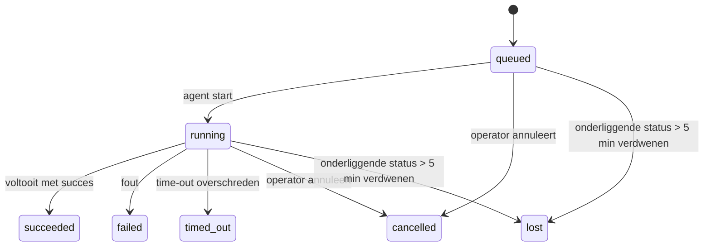

---
read_when:
    - Lopend of recent voltooid achtergrondwerk inspecteren
    - Foutopsporing bij afleveringsfouten voor losgekoppelde agentuitvoeringen
    - Begrijpen hoe achtergrondruns zich verhouden tot sessies, Cron en Heartbeat
sidebarTitle: Background tasks
summary: Bijhouden van achtergrondtaken voor ACP-runs, subagents, Cron-uitvoeringen en CLI-bewerkingen
title: Achtergrondtaken
x-i18n:
    generated_at: "2026-07-27T04:46:45Z"
    model: gpt-5.6
    postprocess_version: locale-links-v1
    prompt_version: 32
    provider: openai
    source_hash: dbdc5ced133764fec0c8b9ae7b1957e24272dc9c1c86099de81f6923955d6b5a
    source_path: automation/tasks.md
    workflow: 16
---

<Note>
Op zoek naar planning? Zie [Automatisering](/nl/automation) om het juiste mechanisme te kiezen. Deze pagina is het activiteitenregister voor achtergrondwerk, niet de planner.
</Note>

Achtergrondtaken volgen werk dat **buiten je hoofdgesprekssessie** wordt uitgevoerd: ACP-runs, het starten van subagents, uitvoeringen van Cron-taken en via de CLI gestarte bewerkingen.

Taken vervangen sessies, Cron-taken of Heartbeats **niet**: ze vormen het **activiteitenregister** waarin wordt vastgelegd welk losgekoppeld werk is uitgevoerd, wanneer dat gebeurde en of het is geslaagd.

<Note>
Niet elke agentrun maakt een taak aan. Heartbeat-beurten en normale interactieve chats doen dat niet. Alle Cron-uitvoeringen, gestarte ACP-sessies, gestarte subagents, door de Gateway verzonden CLI-agentopdrachten en door agents gestarte `exec`-achtergrondopdrachten doen dat wel.
</Note>

## Kort samengevat

- Taken zijn **registraties**, geen planners: Cron en Heartbeat bepalen _wanneer_ werk wordt uitgevoerd; taken houden bij _wat er is gebeurd_.
- ACP, subagents, alle Cron-taken en CLI-bewerkingen maken taken aan. Heartbeat-beurten doen dat niet.
- Elke taak doorloopt `queued → running → terminal` (geslaagd, mislukt, verlopen, geannuleerd of verloren).
- Cron-taken blijven actief zolang de Cron-runtime nog eigenaar is van de taak; als de runtimestatus in het geheugen verdwenen is, controleert taakonderhoud eerst de duurzame uitvoeringsgeschiedenis van Cron voordat een taak als verloren wordt gemarkeerd.
- Voltooiing wordt via push afgehandeld: losgekoppeld werk kan rechtstreeks een melding sturen of de sessie/Heartbeat van de aanvrager activeren zodra het klaar is. Lussen die de status blijven opvragen, zijn daarom meestal niet de juiste aanpak.
- Geïsoleerde Cron-runs en voltooide subagents proberen zo goed mogelijk bijgehouden browsertabbladen en -processen van hun kindsessie op te ruimen voordat de laatste opruimadministratie wordt uitgevoerd.
- Bij levering vanuit een geïsoleerde Cron-run worden verouderde tussentijdse antwoorden van de bovenliggende sessie onderdrukt zolang werk van onderliggende subagents nog wordt afgerond. Als de definitieve uitvoer van een onderliggende subagent vóór de levering binnenkomt, krijgt die de voorkeur.
- Voltooiingsmeldingen worden rechtstreeks aan een kanaal geleverd of in de wachtrij geplaatst voor de volgende Heartbeat.
- `openclaw tasks list` toont alle taken; `openclaw tasks audit` brengt problemen aan het licht.
- Definitieve registraties worden 7 dagen bewaard (`lost`-registraties 24 uur) en daarna automatisch opgeschoond.

## Snel aan de slag

<Tabs>
  <Tab title="Weergeven en filteren">
    ```bash
    # Alle taken weergeven (nieuwste eerst)
    openclaw tasks list

    # Filteren op runtime of status
    openclaw tasks list --runtime acp
    openclaw tasks list --status running
    ```

  </Tab>
  <Tab title="Inspecteren">
    ```bash
    # Details van een specifieke taak tonen (op taak-id, run-id of sessiesleutel)
    openclaw tasks show <lookup>
    ```
  </Tab>
  <Tab title="Annuleren en melden">
    ```bash
    # Een actieve taak annuleren (beëindigt de kindsessie)
    openclaw tasks cancel <lookup>

    # Het meldingsbeleid voor een taak wijzigen
    openclaw tasks notify <lookup> state_changes
    ```

  </Tab>
  <Tab title="Controle en onderhoud">
    ```bash
    # Een statuscontrole uitvoeren
    openclaw tasks audit

    # Onderhoud bekijken of toepassen
    openclaw tasks maintenance
    openclaw tasks maintenance --apply
    ```

  </Tab>
  <Tab title="Taakflow">
    ```bash
    # De TaskFlow-status inspecteren
    openclaw tasks flow list
    openclaw tasks flow show <lookup>
    openclaw tasks flow cancel <lookup>
    ```
  </Tab>
</Tabs>

## Wat een taak aanmaakt

| Bron                   | Runtimetype | Wanneer een taakregistratie wordt aangemaakt                            | Standaard meldingsbeleid |
| ---------------------- | ----------- | ----------------------------------------------------------------------- | ------------------------ |
| ACP-achtergrondruns    | `acp`        | Bij het starten van een ACP-kindsessie                                  | `done_only`           |
| Subagentorkestratie    | `subagent`   | Bij het starten van een subagent via `sessions_spawn`                   | `done_only`           |
| Cron-taken (alle typen)| `cron`       | Bij elke Cron-uitvoering (hoofdsessie en geïsoleerd)                    | `silent`              |
| CLI-bewerkingen        | `cli`        | `openclaw agent`-opdrachten die via de Gateway worden uitgevoerd        | `silent`              |
| Mediataken van agents  | `cli`        | Sessiegebonden `image_generate`-/`music_generate`-/`video_generate`-runs | `silent`              |

<AccordionGroup>
  <Accordion title="Standaardmeldingen voor Cron en media">
    Cron-taken (voor de hoofdsessie en geïsoleerd) gebruiken het meldingsbeleid `silent`: ze maken registraties aan om ze te kunnen volgen, maar genereren zelf geen taakmeldingen; Cron beheert het leveringspad.

    Sessiegebonden `image_generate`-, `music_generate`- en `video_generate`-runs gebruiken ook het meldingsbeleid `silent`. Ze maken nog steeds taakregistraties aan, maar de voltooiing wordt als interne activering teruggestuurd naar de oorspronkelijke agentsessie, zodat de agent het vervolgbericht kan schrijven en de voltooide media zelf kan bijvoegen. De aanvragende agent volgt het normale contract voor zichtbare antwoorden: automatisch een definitief antwoord indien geconfigureerd, of `message(action="send")` plus `NO_REPLY` wanneer de sessie antwoorden via het berichthulpmiddel vereist. Als de aanvragende sessie niet meer actief is of de actieve activering mislukt, en de voltooiingsagent enkele of alle gegenereerde media mist, stuurt OpenClaw een idempotente rechtstreekse terugvalmelding met alleen de ontbrekende media naar het oorspronkelijke kanaaldoel.

  </Accordion>
  <Accordion title="Beveiliging tegen gelijktijdige mediageneratie">
    Zolang een sessiegebonden taak voor mediageneratie actief is, beschermen `image_generate`, `music_generate` en `video_generate` tegen onbedoelde nieuwe pogingen: als de aanroep voor dezelfde prompt/aanvraag wordt herhaald, wordt de status van de overeenkomende actieve taak geretourneerd in plaats van een duplicaat te starten. Een andere prompt kan wel een eigen taak starten. Gebruik `action: "status"` als je vanaf de agentzijde expliciet de voortgang of status wilt opvragen.
  </Accordion>
  <Accordion title="Wat geen taken aanmaakt">
    - Heartbeat-beurten in de hoofdsessie; zie [Heartbeat](/nl/gateway/heartbeat)
    - Normale interactieve chatbeurten
    - Rechtstreekse `/command`-antwoorden

  </Accordion>
</AccordionGroup>

## Levenscyclus van taken



| Status      | Betekenis                                                                   |
| ----------- | --------------------------------------------------------------------------- |
| `queued`    | Aangemaakt en wacht tot de agent start                                     |
| `running`   | De agentbeurt wordt actief uitgevoerd                                      |
| `succeeded` | Met succes voltooid                                                         |
| `failed`    | Voltooid met een fout                                                       |
| `timed_out` | De geconfigureerde time-out is overschreden                                |
| `cancelled` | Gestopt door de operator via `openclaw tasks cancel`, of de run is afgebroken |
| `lost`      | De runtime verloor na een respijtperiode van 5 minuten de gezaghebbende onderliggende status |

Overgangen vinden automatisch plaats: levenscyclusgebeurtenissen van de agentrun (start, einde, fout) werken de taakstatus bij; je beheert deze niet handmatig.

De voltooiing van de agentrun is gezaghebbend voor actieve taakregistraties. Een geslaagde losgekoppelde run eindigt als `succeeded`, gewone runfouten eindigen als `failed`, time-outs eindigen als `timed_out` en annuleringen/afbrekingen eindigen als `cancelled`. Zodra een taak definitief is, kunnen latere levenscyclussignalen de status niet meer terugzetten: een door de operator geannuleerde of al `failed`/`timed_out`/`lost` taak behoudt die status, zelfs als daarna een successignaal binnenkomt.

`lost` houdt rekening met de runtime:

- ACP-taken: alleen een actieve ACP-beurt binnen het Gateway-proces bewijst dat de run nog actief is; alleen persistente sessiemetadata is onvoldoende. Offline CLI-controle blijft terughoudend en neemt ACP-taken nooit terug.
- Subagenttaken: de onderliggende kindsessie is verdwenen uit de opslag van de doelagent (of bevat een grafsteen voor herstel na opnieuw opstarten).
- Cron-taken: de Cron-runtime houdt de taak niet meer als actief bij en de duurzame uitvoeringsgeschiedenis van Cron bevat geen definitief resultaat voor die run. Offline CLI-controle beschouwt de eigen lege Cron-runtimestatus in het proces niet als gezaghebbend.
- CLI-taken: taken met een run-id/bron-id gebruiken de actieve runcontext, zodat achtergebleven rijen voor kindsessies of chatsessies ze niet actief houden nadat de door de Gateway beheerde run verdwijnt. Verouderde CLI-taken zonder runidentiteit vallen nog terug op de kindsessie. Door de Gateway ondersteunde `openclaw agent`-runs worden ook afgerond op basis van hun runresultaat, zodat voltooide runs niet actief blijven totdat de opruimer ze als `lost` markeert.

## Levering en meldingen

Wanneer een taak een definitieve status bereikt, stelt OpenClaw je daarvan op de hoogte. Er zijn twee leveringspaden:

**Rechtstreekse levering**: als de taak een kanaaldoel heeft (de `requesterOrigin`), gaat het voltooiingsbericht rechtstreeks naar dat kanaal (Discord, Slack, Telegram enzovoort). Voltooiingen van groeps- en kanaaltaken worden in plaats daarvan via de aanvragende sessie geleid, zodat de bovenliggende agent het zichtbare antwoord kan schrijven. Voor voltooide subagents behoudt OpenClaw indien beschikbaar ook de gekoppelde thread-/onderwerproutering en kan het een ontbrekende `to` / account aanvullen vanuit de opgeslagen route van de aanvragende sessie (`lastChannel` / `lastTo` / `lastAccountId`) voordat rechtstreekse levering wordt opgegeven.

**Levering via de sessiewachtrij**: als rechtstreekse levering mislukt of geen oorsprong is ingesteld, wordt de update als systeemgebeurtenis in de sessie van de aanvrager in de wachtrij geplaatst en verschijnt deze bij de volgende Heartbeat.

<Tip>
Voltooiingen van taken in de sessiewachtrij activeren onmiddellijk een Heartbeat, zodat je het resultaat snel ziet; je hoeft niet op de volgende geplande Heartbeat-tik te wachten.
</Tip>

Dit betekent dat de gebruikelijke workflow op push is gebaseerd: start losgekoppeld werk één keer en laat de runtime je vervolgens bij voltooiing activeren of informeren. Vraag de taakstatus alleen op wanneer je moet debuggen, ingrijpen of een expliciete controle moet uitvoeren.

### Meldingsbeleid

Bepaal hoeveel je over elke taak hoort:

| Beleid                | Wat wordt geleverd                                      |
| --------------------- | ------------------------------------------------------- |
| `done_only` (standaard) | Alleen de definitieve status (geslaagd, mislukt enzovoort) |
| `state_changes`       | Elke statusovergang en voortgangsupdate                 |
| `silent`              | Helemaal niets (standaard voor Cron-, CLI- en mediataken) |

Wijzig het beleid terwijl een taak actief is:

```bash
openclaw tasks notify <lookup> state_changes
```

## CLI-referentie

<AccordionGroup>
  <Accordion title="tasks list">
    ```bash
    openclaw tasks list [--runtime <acp|subagent|cron|cli>] [--status <status>] [--json]
    ```

    Uitvoerkolommen: Taak, Soort, Status, Levering, Run, Kindsessie, Samenvatting. Losse `openclaw tasks` werkt hetzelfde als `openclaw tasks list`.

  </Accordion>
  <Accordion title="tasks show">
    ```bash
    openclaw tasks show <lookup> [--json]
    ```

    Het zoektoken accepteert een taak-id, run-id of sessiesleutel. Toont de volledige registratie, inclusief timing, leveringsstatus, fout en definitieve samenvatting.

  </Accordion>
  <Accordion title="tasks cancel">
    ```bash
    openclaw tasks cancel <lookup>
    ```

    Voor ACP- en subagenttaken beëindigt dit de kindsessie; annuleringen van ACP en Cron worden via de actieve Gateway afgehandeld (`tasks.cancel`). Voor taken die door de CLI worden bijgehouden, wordt de annulering vastgelegd in het taakregister (er is geen afzonderlijke runtime-handle voor het kindproces). De status gaat over naar `cancelled` en indien van toepassing wordt een bezorgingsmelding verzonden.

  </Accordion>
  <Accordion title="tasks notify">
    ```bash
    openclaw tasks notify <lookup> <done_only|state_changes|silent>
    ```
  </Accordion>
  <Accordion title="tasks audit">
    ```bash
    openclaw tasks audit [--severity <warn|error>] [--code <name>] [--limit <n>] [--json]
    ```

    Brengt operationele problemen voor taken **en** TaskFlows samen in één rapport. Bevindingen verschijnen ook in `openclaw status` wanneer problemen worden gedetecteerd.

    Taakbevindingen:

    | Bevinding                 | Ernst      | Aanleiding                                                                                                  |
    | ------------------------- | ---------- | ----------------------------------------------------------------------------------------------------------- |
    | `stale_queued`        | waarschuwing | Staat langer dan 10 minuten in de wachtrij                                                                |
    | `stale_running`        | fout       | Wordt langer dan 30 minuten uitgevoerd                                                                      |
    | `lost`        | waarschuwing/fout | Het eigenaarschap van de runtime-ondersteunde taak is verdwenen; behouden verloren taken geven een waarschuwing tot `cleanupAfter` en worden daarna fouten |
    | `delivery_failed`        | waarschuwing | Bezorging is mislukt en het meldingsbeleid is niet `silent`                                     |
    | `missing_cleanup`        | waarschuwing | Afgesloten taak zonder tijdstempel voor opschoning                                                        |
    | `inconsistent_timestamps`        | waarschuwing | Schending van de tijdlijn (bijvoorbeeld beëindigd vóór gestart)                                           |

    TaskFlow-bevindingen:

    | Bevinding                 | Ernst      | Aanleiding                                                                    |
    | ------------------------- | ---------- | ----------------------------------------------------------------------------- |
    | `restore_failed`        | fout       | Herstel van het flowregister uit SQLite is mislukt                             |
    | `stale_running`        | fout       | De actieve flow is al meer dan 30 minuten niet gevorderd                       |
    | `stale_waiting`        | waarschuwing | De wachtende flow is al meer dan 30 minuten niet gevorderd                   |
    | `stale_blocked`        | waarschuwing | De geblokkeerde flow is al meer dan 30 minuten niet gevorderd                |
    | `cancel_stuck`        | waarschuwing | Annulering is meer dan 5 minuten geleden aangevraagd, er zijn geen actieve kindtaken en de flow is nog niet afgesloten |
    | `missing_linked_tasks`        | waarschuwing/fout | Verouderde beheerde flow zonder gekoppelde taken of wachtstatus          |
    | `blocked_task_missing`        | waarschuwing | De geblokkeerde flow verwijst naar een taak-id dat niet meer bestaat         |

  </Accordion>
  <Accordion title="tasks maintenance">
    ```bash
    openclaw tasks maintenance [--json]
    openclaw tasks maintenance --apply [--json]
    ```

    Gebruik dit om reconciliatie, het toevoegen van opschoningstijdstempels en het verwijderen van taken, TaskFlow-status en verouderde registerrijen van Cron-uitvoeringssessies vooraf te bekijken of toe te passen.

    Reconciliatie houdt rekening met de runtime:

    - ACP-taken vereisen een actieve in-process beurt in de Gateway; subagenttaken controleren hun onderliggende kindsessie.
    - Subagenttaken waarvan de kindsessie een tombstone voor herstel na een herstart heeft, worden als verloren gemarkeerd in plaats van als herstelbare onderliggende sessies te worden behandeld.
    - Cron-taken controleren of de Cron-runtime nog steeds eigenaar van de taak is en herstellen vervolgens de afsluitstatus uit permanente Cron-uitvoeringslogboeken/taakstatus voordat ze terugvallen op `lost`. Alleen het Gateway-proces is gezaghebbend voor de actieve Cron-taakset in het geheugen; een offline CLI-audit gebruikt permanente geschiedenis, maar markeert een Cron-taak niet als verloren uitsluitend omdat die lokale set leeg is.
    - CLI-taken met een uitvoeringsidentiteit controleren de bijbehorende actieve uitvoeringscontext, niet alleen rijen van kind- of chatsessies.

    Opschoning na voltooiing houdt ook rekening met de runtime:

    - Bij voltooiing van een subagent worden bijgehouden browsertabbladen/-processen voor de kindsessie naar beste vermogen gesloten voordat de opschoning voor de aankondiging doorgaat.
    - Bij voltooiing van een geïsoleerde Cron-uitvoering worden bijgehouden browsertabbladen/-processen voor de Cron-sessie naar beste vermogen gesloten voordat de uitvoering volledig wordt afgebouwd.
    - De bezorging van een geïsoleerde Cron-uitvoering wacht indien nodig totdat vervolgwerk van onderliggende subagents is voltooid en onderdrukt verouderde bevestigingstekst van de bovenliggende taak in plaats van deze aan te kondigen.
    - Bij de bezorging na voltooiing van een subagent wordt alleen de meest recente zichtbare assistenttekst van het kind gebruikt. Uitvoer van tool/toolResult wordt niet tot resultaattekst van het kind verheven. Afgesloten mislukte uitvoeringen kondigen de foutstatus aan zonder vastgelegde antwoordtekst opnieuw af te spelen.
    - Fouten bij het opschonen verhullen het werkelijke taakresultaat niet.

    Bij het toepassen van onderhoud verwijdert OpenClaw ook verouderde `cron:<jobId>:run:<runId>`-sessieregisterrijen die ouder zijn dan 7 dagen, terwijl rijen voor momenteel actieve Cron-taken behouden blijven en sessierijen die niet van Cron zijn ongemoeid blijven.

  </Accordion>
  <Accordion title="tasks flow list | show | cancel">
    ```bash
    openclaw tasks flow list [--status <status>] [--json]
    openclaw tasks flow show <lookup> [--json]
    openclaw tasks flow cancel <lookup>
    ```

    Het zoektoken voor de flow accepteert een flow-id of eigenaarsleutel. Gebruik deze wanneer de orkestrerende [Task Flow](/nl/automation/taskflow) belangrijker is dan één afzonderlijk record van een achtergrondtaak.

  </Accordion>
</AccordionGroup>

## Chattaakbord (`/tasks`)

Gebruik `/tasks` in elke chatsessie om achtergrondtaken te bekijken die aan die sessie zijn gekoppeld. Het bord toont maximaal vijf actieve en onlangs voltooide taken met runtime, status, timing en voortgangs- of foutdetails.

Wanneer de huidige sessie geen zichtbare gekoppelde taken heeft, valt `/tasks` terug op agentlokale taakaantallen, zodat je toch een overzicht krijgt zonder details van andere sessies prijs te geven.

Gebruik voor het volledige operatorlogboek de CLI: `openclaw tasks list`.

### Control UI

De Control UI op het web heeft in de zijbalk een pagina **Taken** met actuele actieve en recente achtergrondtaken. Gebruik deze om de voortgang te bekijken, gekoppelde sessies te openen, het logboek te vernieuwen of taken in de wachtrij en actieve taken te annuleren.

Chatvensters hebben ook een inklapbare rail **Achtergrondtaken**, beperkt tot de agent van het venster: actieve taken en subagents met een stopknop, een sectie met voltooide taken en links Transcript bekijken naar de kindsessie van elke taak. Open deze via de activiteitsschakelaar in de koptekst van het venster (of via de zwevende activiteitsknop in een chat met één venster).

Selecteer een taak in de rail om de afgebakende invoerprompt en de meest recente uitvoer of foutsamenvatting te bekijken. Actief werk blijft gescheiden van voltooid werk en voltooide rijen geven aan of de taak is voltooid of mislukt. Open op iOS **Chat actions → Background Tasks**; open op Android het overloopmenu van Chat en selecteer **Background tasks**. Beide mobiele weergaven gebruiken dezelfde groepering Running en Finished en openen taakdetails wanneer je een taak selecteert.

## Statusintegratie (taakdruk)

`openclaw status` bevat een taakregel die in één oogopslag inzicht geeft:

```
Taken    2 actief · 1 in wachtrij · 1 wordt uitgevoerd · 1 probleem · audit schoon · 6 bijgehouden
```

De samenvatting telt actief werk (`queued` + `running`), fouten (`failed` + `timed_out` + `lost`), auditbevindingen en het totale aantal bijgehouden records; de JSON-payload splitst de aantallen ook uit per runtime (`acp`, `subagent`, `cron`, `cli`).

Zowel `/status` als de tool `session_status` gebruikt een taakmomentopname die rekening houdt met opschoning: actieve taken hebben voorrang, verlopen rijen worden verborgen en afgesloten taken verschijnen slechts gedurende een kort recent tijdvenster (5 minuten), waarbij fouten worden uitgelicht als er geen actief werk overblijft. Hierdoor richt de statuskaart zich op wat nu belangrijk is.

## Opslag en onderhoud

### Waar taken worden opgeslagen

Taakrecords en bezorgingsstatus worden permanent opgeslagen in de gedeelde SQLite-statusdatabase van OpenClaw:

```
~/.openclaw/state/openclaw.sqlite   (tabellen: task_runs, task_delivery_state, flow_runs)
```

Stel `OPENCLAW_STATE_DIR` in om de volledige statushoofdmap (standaard `~/.openclaw`) elders te plaatsen; het pad naar de gedeelde database verhuist mee.

Het register wordt bij het eerste gebruik in het geheugen geladen en elke schrijfactie wordt permanent naar SQLite weggeschreven, zodat records herstarts van de Gateway overleven. De groei van WAL blijft begrensd door de standaarddrempel voor automatische checkpoints van SQLite plus periodieke `PASSIVE`-checkpoints; checkpoints bij afsluiten en expliciet onderhoud gebruiken `TRUNCATE`, zodat bij normale afsluiting WAL-ruimte wordt teruggewonnen zonder dat de achtergrondsweeper op actieve lezers hoeft te wachten.

Verouderde sidecar-opslagplaatsen uit oudere installaties (`tasks/runs.sqlite`, `flows/registry.sqlite`) worden door `openclaw doctor` in de gedeelde database geïmporteerd.

### Automatisch onderhoud

Elke **60 seconden** wordt een sweeper uitgevoerd (de eerste keer ongeveer 5 seconden nadat de Gateway is gestart), die vier zaken afhandelt:

<Steps>
  <Step title="Reconciliatie">
    Controleert of actieve taken nog gezaghebbende runtime-ondersteuning hebben. ACP-taken vereisen een actieve in-process beurt, subagenttaken gebruiken de status van de kindsessie, Cron-taken gebruiken eigenaarschap van actieve taken plus permanente uitvoeringsgeschiedenis en CLI-taken met een uitvoeringsidentiteit gebruiken de bijbehorende uitvoeringscontext. Als de onderliggende status langer dan 5 minuten verdwenen is (30 minuten voor ingebouwde subagenttaken zonder kind), wordt de taak gemarkeerd als `lost`.
  </Step>
  <Step title="Herstel van ACP-sessies">
    Sluit afgesloten of verweesde eenmalige ACP-sessies waarvan de bovenliggende taak eigenaar is, en sluit verouderde afgesloten of verweesde permanente ACP-sessies alleen wanneer er geen actieve gesprekskoppeling meer bestaat.
  </Step>
  <Step title="Opschoningstijdstempel">
    Stelt een tijdstempel `cleanupAfter` in voor afgesloten taken (afsluittijd + bewaartermijn). Tijdens de bewaartermijn verschijnen verloren taken nog steeds als waarschuwingen in de audit; nadat `cleanupAfter` verloopt of wanneer opschoningsmetadata ontbreekt, worden het fouten.
  </Step>
  <Step title="Verwijderen">
    Verwijdert records waarvan de datum `cleanupAfter` is verstreken.
  </Step>
</Steps>

<Note>
**Bewaartermijn:** records van afgesloten taken worden **7 dagen** bewaard (`lost`-records **24 uur**) en daarna automatisch verwijderd. Geen configuratie nodig.
</Note>

## Relatie tussen taken en andere systemen

<AccordionGroup>
  <Accordion title="Taken en Task Flow">
    [Task Flow](/nl/automation/taskflow) is de laag voor floworkestratie boven achtergrondtaken. Eén flow kan gedurende zijn levensduur meerdere taken coördineren via beheerde of gespiegelde synchronisatiemodi. Gebruik `openclaw tasks` om afzonderlijke taakrecords te bekijken en `openclaw tasks flow` om de orkestrerende flow te bekijken.

  </Accordion>
  <Accordion title="Taken en Cron">
    Cron-taakdefinities, de runtime-uitvoeringsstatus en uitvoeringsgeschiedenis bevinden zich in de gedeelde SQLite-statusdatabase van OpenClaw. **Elke** Cron-uitvoering maakt een taakrecord aan — zowel in de hoofdsessie als geïsoleerd — met meldingsbeleid `silent`, zodat Cron-uitvoeringen worden bijgehouden zonder zelf taakmeldingen te genereren.

    Zie [Cron-taken](/nl/automation/cron-jobs).

  </Accordion>
  <Accordion title="Taken en Heartbeat">
    Heartbeat-uitvoeringen zijn beurten in de hoofdsessie — ze maken geen taakrecords aan. Wanneer een taak wordt voltooid, kan deze een Heartbeat-activering starten, zodat je het resultaat snel ziet.

    Zie [Heartbeat](/nl/gateway/heartbeat).

  </Accordion>
  <Accordion title="Taken en sessies">
    Een taak kan verwijzen naar een `childSessionKey` (waar het werk wordt uitgevoerd) en een `requesterSessionKey` (wie de taak heeft gestart). De `agentId` identificeert de agent die het werk uitvoert, terwijl de velden voor de aanvrager en eigenaar de context voor het starten en beheren behouden. Sessies vormen de gesprekscontext; taken volgen de activiteiten die daarop plaatsvinden.
  </Accordion>
  <Accordion title="Taken en agentuitvoeringen">
    De `runId` van een taak verwijst naar de agentuitvoering die het werk verricht. Levenscyclusgebeurtenissen van de agent (start, einde, fout) werken de taakstatus automatisch bij; je hoeft de levenscyclus niet handmatig te beheren.
  </Accordion>
</AccordionGroup>

## Gerelateerd

- [Automatisering](/nl/automation) - alle automatiseringsmechanismen in één oogopslag
- [CLI: Taken](/nl/cli/tasks) - naslaginformatie voor CLI-opdrachten
- [Heartbeat](/nl/gateway/heartbeat) - periodieke beurten in de hoofdsessie
- [Geplande taken](/nl/automation/cron-jobs) - achtergrondwerk plannen
- [Taakflow](/nl/automation/taskflow) - floworkestratie boven op taken
