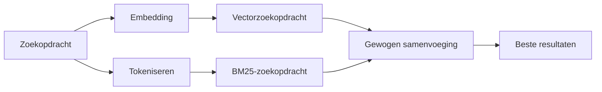

---
read_when:
    - Je wilt begrijpen hoe memory_search werkt
    - Je wilt een embeddingprovider kiezen
    - Je wilt de zoekkwaliteit optimaliseren
summary: Hoe zoeken in het geheugen relevante notities vindt met behulp van embeddings en hybride retrieval
title: Geheugen doorzoeken
x-i18n:
    generated_at: "2026-07-27T05:43:28Z"
    model: gpt-5.6
    postprocess_version: locale-links-v1
    prompt_version: 32
    provider: openai
    source_hash: b2bd28b63ac55a2a890ed70a3015f76f1c7fbaa792b17a6ead51f4c8712fbd2d
    source_path: concepts/memory-search.md
    workflow: 16
---

`memory_search` vindt relevante notities in je geheugenbestanden, zelfs wanneer de
formulering afwijkt van de oorspronkelijke tekst. Het verdeelt het geheugen in kleine stukken en
doorzoekt deze met embeddings, trefwoorden of beide.

## Snel aan de slag

OpenClaw gebruikt standaard OpenAI-embeddings. Stel een andere provider
expliciet in om die te gebruiken:

```json5
{
  memory: {
    search: {
      provider: "openai", // of "gemini", "voyage", "mistral", "bedrock", "local", "ollama", "lmstudio", "github-copilot", "openai-compatible"
    },
  },
}
```

`provider` kan ook verwijzen naar een aangepaste `models.providers.<id>`-vermelding (bijvoorbeeld
`ollama-5080`), zolang die vermelding `api` instelt op `"ollama"` of
een andere provider-id met een adapter voor geheugenembeddings.

Installeer voor lokale embeddings zonder API-sleutel de officiële
llama.cpp-providerplugin en stel `provider: "local"` in:

```bash
openclaw plugins install @openclaw/llama-cpp-provider
```

Voor broncodecheck-outs is nog steeds goedkeuring voor een native build vereist: `pnpm approve-builds`, daarna
`pnpm rebuild node-llama-cpp`.

Sommige OpenAI-compatibele embedding-eindpunten vereisen asymmetrische `input_type`-labels,
zoals `"query"` voor zoekopdrachten en `"document"`/`"passage"` voor geïndexeerde
stukken. Stel deze in met `queryInputType` en `documentInputType`; zie
[Referentie voor geheugenconfiguratie](/nl/reference/memory-config#provider-specific-config).

## Ondersteunde providers

| Provider          | ID                  | API-sleutel vereist | Opmerkingen                             |
| ----------------- | ------------------- | ------------------- | --------------------------------------- |
| Bedrock           | `bedrock`           | Nee                 | Gebruikt de AWS-referentieketen         |
| DeepInfra         | `deepinfra`         | Ja                  | Standaardmodel `BAAI/bge-m3`       |
| Gemini            | `gemini`            | Ja                  | Ondersteunt indexering van beeld/audio  |
| GitHub Copilot    | `github-copilot`    | Nee                 | Gebruikt je Copilot-abonnement          |
| Lokaal            | `local`             | Nee                 | GGUF-model, automatische download van ~0.6 GB |
| LM Studio         | `lmstudio`          | Nee                 | Lokale/zelfgehoste server               |
| Mistral           | `mistral`           | Ja                  |                                         |
| Ollama            | `ollama`            | Nee                 | Lokale/zelfgehoste server               |
| OpenAI            | `openai`            | Ja                  | Standaard                               |
| OpenAI-compatibel | `openai-compatible` | Meestal             | Algemeen `/v1/embeddings`-eindpunt    |
| Voyage            | `voyage`            | Ja                  |                                         |

## Hoe zoeken werkt

OpenClaw voert twee ophaalpaden parallel uit en voegt de resultaten samen:



- **Vectorzoekopdracht** zoekt naar vergelijkbare betekenissen ("gateway-host" komt overeen met "de
  machine waarop OpenClaw wordt uitgevoerd").
- **BM25-trefwoordzoekopdracht** zoekt naar exacte termen (ID's, foutteksten, configuratiesleutels).
- **Bestandsnaamzoekopdracht** indexeert paden afzonderlijk van de inhoud van notities. Exacte volledige
  paden, basisnamen en bestandsnaamstammen krijgen een hogere rang dan gedeeltelijke padovereenkomsten,
  terwijl fragmenten en trefwoordscores voor de inhoud nog steeds uit de notitie-inhoud komen.

Als slechts één pad beschikbaar is, wordt dat zelfstandig uitgevoerd.

**Alleen-FTS-modus.** Stel `provider: "none"` in om embeddings bewust uit te schakelen
en alleen met trefwoorden te zoeken. Als `provider` niet is ingesteld of is ingesteld op `"auto"`,
wordt ook teruggevallen op rangschikking met alleen trefwoorden als geen embedding-authenticatie is geconfigureerd,
zonder een fout te geven. Hetzelfde geldt voor `provider: "local"` (de GGUF/llama.cpp-
provider) wanneer deze mislukt.

**Expliciete provider niet beschikbaar.** Als je een andere provider expliciet opgeeft
(bijvoorbeeld `openai`, `ollama`, `gemini`) en deze tijdens de aanvraag niet beschikbaar
wordt (onjuiste authenticatie, netwerkstoring), meldt `memory_search` dat het geheugen
niet beschikbaar is in plaats van ongemerkt over te schakelen op resultaten met alleen FTS. Zo blijft een
defecte geconfigureerde provider zichtbaar. Stel `provider: "none"` in voor bewust
ophalen met alleen FTS, of herstel de provider-/authenticatieconfiguratie om semantische
rangschikking te herstellen.

## Zoekkwaliteit verbeteren

Twee optionele functies helpen bij een uitgebreide notitiegeschiedenis.

### Temporeel verval

Oude notities verliezen geleidelijk gewicht in de rangschikking, zodat recente informatie als eerste verschijnt.
Met de standaard halveringstijd van 30 dagen scoort een notitie van vorige maand 50% van het
oorspronkelijke gewicht. `MEMORY.md` en andere bestanden zonder datum onder `memory/` zijn
blijvend relevant en vervallen nooit; alleen gedateerde `memory/YYYY-MM-DD.md`-bestanden vervallen.

<Tip>
Schakel dit in als je agent maanden aan dagelijkse notities heeft en verouderde informatie
steeds hoger eindigt dan recente context.
</Tip>

### MMR (diversiteit)

Vermindert redundante resultaten. Als vijf notities allemaal dezelfde routerconfiguratie vermelden,
zorgt MMR ervoor dat de beste resultaten verschillende onderwerpen behandelen in plaats van zich te herhalen.

<Tip>
Schakel dit in als `memory_search` steeds bijna identieke fragmenten uit
verschillende dagelijkse notities retourneert.
</Tip>

### Beide inschakelen

```json5
{
  memory: {
    search: {
      query: {
        hybrid: {
          mmr: { enabled: true },
          temporalDecay: { enabled: true },
        },
      },
    },
  },
}
```

## Multimodaal geheugen

Met `gemini-embedding-2-preview` kun je naast Markdown ook afbeeldingen en audio
indexeren. Dit geldt alleen voor bestanden onder `memory.search.extraPaths`; standaard
geheugenhoofdmappen (`MEMORY.md`, `memory/*.md`) blijven uitsluitend voor Markdown. Zoekopdrachten
blijven tekst, maar worden vergeleken met visuele en audio-inhoud. Zie
[Referentie voor geheugenconfiguratie](/nl/reference/memory-config#multimodal-memory-gemini)
voor de configuratie.

## Zoeken in sessiegeheugen

Gebruik voor het exact opzoeken van volledige tekst uit sessietranscripten [`sessions_search`](/nl/concepts/session-search)
en open daarna een resultaat met `sessions_history`. Zoeken in sessiegeheugen blijft de semantische,
experimentele aanvulling.

Indexeer desgewenst sessietranscripten zodat `memory_search` eerdere
gesprekken kan terugvinden. Dit is opt-in: stel `experimental.sessionMemory: true` in en voeg
`"sessions"` toe aan `sources` (standaard is `sources` `["memory"]`).

Sessieresultaten volgen `tools.sessions.visibility`: de standaardwaarde `"tree"` maakt de
huidige sessie zichtbaar, de sessies die deze heeft gestart en groepssessies van dezelfde agent die
via omgevingsbewustzijn voor groepen worden gevolgd. Met `session.dmScope: "main"` deelt een DM-configuratie
voor meerdere gebruikers die hoofdsessie, zodat gebruikers die daarheen worden doorgestuurd inhoud
uit de gevolgde groepen kunnen terugvinden. Gebruik een `dmScope` per gesprekspartner voor DM-isolatie, of stel
de zichtbaarheid in op `"self"` om het lezen van gevolgde omgevingssessies uit te schakelen. Andere
niet-gerelateerde sessies van dezelfde agent vereisen nog steeds zichtbaarheid met `"agent"`.

Stel bij gebruik van de QMD-backend ook `memory.qmd.sessions.enabled: true` in, zodat
transcripten naar de QMD-verzameling worden geëxporteerd; alleen `experimental.sessionMemory`
en `sources` exporteren geen transcripten naar QMD. Zie de
[configuratiereferentie](/nl/reference/memory-config#session-memory-search-experimental).

## Problemen oplossen

**Geen resultaten?** Voer `openclaw memory status` uit om de index te controleren. Voer bij een lege index
`openclaw memory index --force` uit.

**Alleen trefwoordovereenkomsten?** Je embedding-provider is mogelijk niet geconfigureerd. Controleer
`openclaw memory status --deep`.

**Time-out bij lokale embeddings?** `ollama`, `lmstudio` en `local` gebruiken langere
door de provider beheerde batchdeadlines. Controleer de status van de provider en voer
`openclaw memory index --force` opnieuw uit.

**CJK-tekst niet gevonden?** Bouw de FTS-index opnieuw op met
`openclaw memory index --force`.

## Gerelateerd

- [Geheugenoverzicht](/nl/concepts/memory)
- [Active Memory](/nl/concepts/active-memory)
- [Ingebouwde geheugenengine](/nl/concepts/memory-builtin)
- [Referentie voor geheugenconfiguratie](/nl/reference/memory-config)
