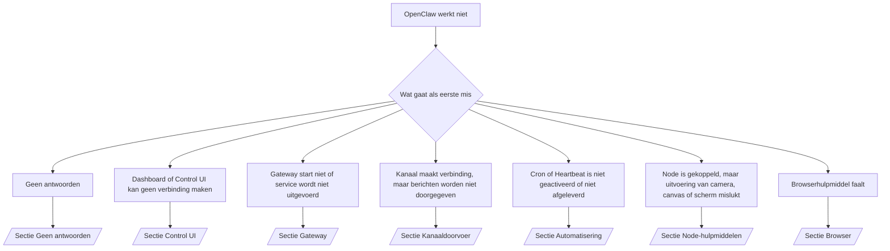

---
read_when:
    - OpenClaw werkt niet en je hebt de snelste weg naar een oplossing nodig
    - Je wilt een triageflow voordat je in diepgaande runbooks duikt
summary: Probleemgerichte hub voor probleemoplossing voor OpenClaw
title: Algemene probleemoplossing
x-i18n:
    generated_at: "2026-07-27T05:56:24Z"
    model: gpt-5.6
    postprocess_version: locale-links-v1
    prompt_version: 32
    provider: openai
    source_hash: de3554ed680ac536d105017220b44d94456a4408916e949352500b046f4d5f17
    source_path: help/troubleshooting.md
    workflow: 16
---

Triage-ingang. In 2 minuten tot een diagnose, ga daarna naar de verdiepende pagina.

## Eerste 60 seconden

Voer deze reeks in de aangegeven volgorde uit:

```bash
openclaw status
openclaw status --all
openclaw gateway probe
openclaw gateway status
openclaw doctor
openclaw channels status --probe
openclaw logs --follow
```

Goede uitvoer, elk één regel:

- `openclaw status` toont geconfigureerde kanalen, zonder authenticatiefouten.
- `openclaw status --all` produceert een volledig, deelbaar rapport.
- `openclaw gateway probe` toont `Reachable: yes`. `Capability: ...` is het
  authenticatieniveau dat door de controle is bewezen; `Read probe: limited - missing scope:
operator.read` betreft beperkte diagnostiek, geen verbindingsfout.
- `openclaw gateway status` toont `Runtime: running`, `Connectivity probe:
ok` en een aannemelijke `Capability: ...`. Voeg `--require-rpc` toe om ook
  bewijs via een RPC met leesbereik te vereisen.
- `openclaw doctor` meldt geen blokkerende configuratie- of servicefouten.
- `openclaw channels status --probe` retourneert de actuele transportstatus per account
  (`works` / `audit ok`) wanneer de Gateway bereikbaar is; valt terug op
  samenvattingen die alleen op de configuratie zijn gebaseerd wanneer deze niet bereikbaar is.
- `openclaw logs --follow` toont constante activiteit, zonder terugkerende fatale fouten.

## Assistent voelt beperkt aan of mist hulpmiddelen

Controleer het effectieve hulpmiddelenprofiel:

```bash
openclaw status
openclaw status --all
openclaw doctor
```

Veelvoorkomende oorzaken:

- `tools.profile: "minimal"` staat alleen `session_status` toe.
- `tools.profile: "messaging"` is beperkt en bedoeld voor agents die alleen chatten.
- `tools.profile: "coding"` is de standaard voor nieuwe lokale configuraties (werk aan repo's, bestanden,
  shells en runtimes).
- `tools.profile: "full"` verwijdert profielbeperkingen; beperk dit tot vertrouwde
  agents onder beheer van operators.
- `agents.entries.*.tools` per agent overschrijft of verruimt het hoofdprofiel
  voor één agent.

Wijzig het profiel, herstart of herlaad de Gateway en controleer het daarna opnieuw met
`openclaw status --all`. Volledige tabel met profielen en groepen: [Hulpmiddelenprofielen](/nl/gateway/config-tools#tool-profiles).

## Lange context van Anthropic: 429

`HTTP 429: rate_limit_error: Extra usage is required for long context requests`
→ [Voor lange context vereist Anthropic 429 extra gebruik](/nl/gateway/troubleshooting#anthropic-429-extra-usage-required-for-long-context).

## Lokale OpenAI-compatibele backend werkt rechtstreeks, maar faalt in OpenClaw

Je lokale/zelfgehoste `/v1`-backend beantwoordt rechtstreekse `/v1/chat/completions`-
controles, maar faalt bij `openclaw infer model run` of normale agentbeurten:

1. Fout vermeldt dat `messages[].content` een tekenreeks verwacht: stel
   `models.providers.<provider>.models[].compat.requiresStringContent: true` in.
2. Faalt nog steeds alleen tijdens OpenClaw-agentbeurten: stel
   `models.providers.<provider>.models[].compat.supportsTools: false` in en probeer het opnieuw.
3. Kleine rechtstreekse aanroepen werken, maar grotere OpenClaw-prompts laten de backend vastlopen: dat
   is een limiet van het bovenliggende model of de server, geen fout in OpenClaw. Ga verder op
   [Lokale OpenAI-compatibele backend doorstaat rechtstreekse controles, maar agentuitvoeringen falen](/nl/gateway/troubleshooting#local-openai-compatible-backend-passes-direct-probes-but-agent-runs-fail).

## Plugin-installatie faalt door ontbrekende OpenClaw-extensies

`package.json missing openclaw.extensions` betekent dat het pluginpakket een
structuur gebruikt die OpenClaw niet meer accepteert.

Los dit op in het pluginpakket:

1. Voeg `openclaw.extensions` toe aan `package.json` en laat deze verwijzen naar gebouwde runtime-
   bestanden (meestal `./dist/index.js`).
2. Publiceer opnieuw en voer daarna `openclaw plugins install <package>` nogmaals uit.

```json
{
  "name": "@openclaw/my-plugin",
  "version": "1.2.3",
  "openclaw": {
    "extensions": ["./dist/index.js"]
  }
}
```

Naslag: [Pluginarchitectuur](/nl/plugins/architecture)

## Installatiebeleid blokkeert installaties of updates van plugins

De update wordt voltooid, maar plugins zijn verouderd, uitgeschakeld of tonen `blocked by install
policy`, `install policy failed closed` of `Disabled "<plugin>" after plugin
update failure`: controleer `security.installPolicy`.

Installatiebeleid wordt toegepast op installaties en updates van plugins. Versies van `@openclaw/*`-plugins
worden normaal gesproken samen met de OpenClaw-release bijgewerkt, waardoor een OpenClaw-update
tijdens de synchronisatie na de update een bijbehorende pluginupdate kan
vereisen.

Vermijd deze beleidsvormen, tenzij je ook de bijbehorende upgraderegel onderhoudt:

- Door OpenClaw beheerde plugins vastzetten op één exacte oude versie (bijvoorbeeld alleen
  `@openclaw/*@2026.5.3`).
- Alleen op basis van het brontype blokkeren (elk npm-, netwerk- of `request.mode:
"update"`-verzoek).
- De beleidsopdracht als optioneel behandelen: wanneer `security.installPolicy` is
  ingeschakeld, leidt een ontbrekend, traag, onleesbaar of door machtigingen geblokkeerd uitvoerbaar
  beleidsbestand tot een gesloten foutstatus.
- Versies goedkeuren zonder de `openclawVersion` van het verzoek te vergelijken met
  de metadata van de kandidaat-plugin.

Geef de voorkeur aan regels die vertrouwde `@openclaw/*`-updates toestaan die compatibel zijn met de
huidige host, in plaats van één release permanent vast te zetten. Als je npm standaard
blokkeert, voeg dan een beperkte uitzondering toe voor de plugin-id's die je gebruikt en pas dezelfde
vertrouwensregel toe op `request.mode: "update"` als op installaties.

Herstel:

```bash
openclaw doctor --deep
openclaw plugins update --all
openclaw status --all
```

Als het beleid bewust streng is, versoepel het dan gedurende het vertrouwde upgrade-
venster, voer `openclaw plugins update --all` opnieuw uit en herstel daarna de strengere regel.
Als een mislukte update een plugin heeft uitgeschakeld, inspecteer deze dan voordat je hem opnieuw inschakelt:

```bash
openclaw plugins inspect <plugin-id> --runtime --json
openclaw plugins enable <plugin-id>
```

Naslag: [Installatiebeleid voor operators](/nl/tools/skills-config#operator-install-policy-securityinstallpolicy)

## Plugin is aanwezig, maar geblokkeerd vanwege verdacht eigendom

`openclaw doctor`, de installatie of opstartwaarschuwingen tonen:

```text
geblokkeerde kandidaat-plugin: verdacht eigendom (... uid=1000, verwacht uid=0 of root)
plugin aanwezig maar geblokkeerd
```

De pluginbestanden zijn eigendom van een andere Unix-gebruiker dan het proces dat
ze laadt. Verwijder de pluginconfiguratie niet; herstel het bestandseigendom of voer
OpenClaw uit als de gebruiker die eigenaar is van de statusmap.

Docker-installaties worden uitgevoerd als `node` (uid `1000`). Herstel de bind-mounts op de host:

```bash
sudo chown -R 1000:1000 /path/to/openclaw-config /path/to/openclaw-workspace
openclaw doctor --fix
```

Als je OpenClaw bewust als root uitvoert, herstel dan in plaats daarvan de beheerde hoofdmap voor plugins:

```bash
sudo chown -R root:root /path/to/openclaw-config/npm
openclaw doctor --fix
```

Verdiepende documentatie: [Geblokkeerd eigendom van pluginpad](/nl/tools/plugin#blocked-plugin-path-ownership), [Docker: machtigingen en EACCES](/nl/install/docker#shell-helpers-optional)

## Beslisboom



<AccordionGroup>
  <Accordion title="Geen antwoorden">
    ```bash
    openclaw status
    openclaw gateway status
    openclaw channels status --probe
    openclaw pairing list --channel <channel> [--account <id>]
    openclaw logs --follow
    ```

    Goede uitvoer:

    - `Runtime: running`
    - `Connectivity probe: ok`
    - `Capability: read-only`, `write-capable` of `admin-capable`
    - Kanaal toont dat het transport verbonden is en, indien ondersteund, `works` of
      `audit ok` in `channels status --probe`
    - Afzender is goedgekeurd (of het DM-beleid is open of gebruikt een toestemmingslijst)

    Logboekpatronen:

    - `drop guild message (mention required` → de vermeldingsfilter van Discord heeft het bericht geblokkeerd.
    - `pairing request` → afzender is niet goedgekeurd en wacht op goedkeuring van de DM-koppeling.
    - `blocked` / `allowlist` in kanaallogboeken → afzender, ruimte of groep is uitgefilterd.

    Verdiepende pagina's: [Geen antwoorden](/nl/gateway/troubleshooting#no-replies), [Probleemoplossing voor kanalen](/nl/channels/troubleshooting), [Koppeling](/nl/channels/pairing)

  </Accordion>

  <Accordion title="Dashboard of Control UI kan geen verbinding maken">
    ```bash
    openclaw status
    openclaw gateway status
    openclaw logs --follow
    openclaw doctor
    openclaw channels status --probe
    ```

    Goede uitvoer:

    - `Dashboard: http://...` wordt weergegeven in `openclaw gateway status`
    - `Connectivity probe: ok`
    - `Capability: read-only`, `write-capable` of `admin-capable`
    - Geen authenticatielus in de logboeken

    Logboekpatronen:

    - `device identity required` → een HTTP-/onbeveiligde context kan apparaatauthenticatie niet voltooien.
    - `origin not allowed` → browser-`Origin` is niet toegestaan voor het Gateway-doel van de Control UI.
    - `AUTH_TOKEN_MISMATCH` met `canRetryWithDeviceToken=true` → er kan automatisch één nieuwe poging met een vertrouwd apparaattoken plaatsvinden, waarbij de gecachte bereiken van het gekoppelde token opnieuw worden gebruikt.
    - herhaald `unauthorized` na die nieuwe poging → verkeerd token/wachtwoord, niet-overeenkomende authenticatiemodus of verouderd gekoppeld apparaattoken.
    - `too many failed authentication attempts (retry later)` → herhaalde fouten vanuit die browser-`Origin` zijn tijdelijk geblokkeerd; andere localhost-oorsprongen gebruiken afzonderlijke groepen. Zie [Connectiviteit van Dashboard/Control UI](/nl/gateway/troubleshooting#dashboard-control-ui-connectivity) voor de nuance rond gelijktijdige nieuwe pogingen met Tailscale Serve.
    - `gateway connect failed:` → de UI richt zich op de verkeerde URL/poort of de Gateway is onbereikbaar.

    Verdiepende pagina's: [Connectiviteit van Dashboard/Control UI](/nl/gateway/troubleshooting#dashboard-control-ui-connectivity), [Control UI](/nl/web/control-ui), [Authenticatie](/nl/gateway/authentication)

  </Accordion>

  <Accordion title="Gateway start niet of service is geïnstalleerd maar wordt niet uitgevoerd">
    ```bash
    openclaw status
    openclaw gateway status
    openclaw logs --follow
    openclaw doctor
    openclaw channels status --probe
    ```

    Goede uitvoer:

    - `Service: ... (loaded)`
    - `Runtime: running`
    - `Connectivity probe: ok`
    - `Capability: read-only`, `write-capable` of `admin-capable`

    Logboekpatronen:

    - `Gateway start blocked: set gateway.mode=local` of `existing config is missing gateway.mode` → de Gateway-modus is extern of de configuratie mist de markering voor lokale modus en moet worden hersteld.
    - `refusing to bind gateway ... without auth` → koppeling buiten loopback zonder geldig authenticatiepad (token/wachtwoord of vertrouwde proxy waar geconfigureerd).
    - `another gateway instance is already listening` of `EADDRINUSE` → poort is al in gebruik.

    Verdiepende pagina's: [Gateway-service wordt niet uitgevoerd](/nl/gateway/troubleshooting#gateway-service-not-running), [Achtergrondproces](/nl/gateway/background-process), [Configuratie](/nl/gateway/configuration)

  </Accordion>

  <Accordion title="Kanaal maakt verbinding, maar berichten worden niet doorgegeven">
    ```bash
    openclaw status
    openclaw gateway status
    openclaw logs --follow
    openclaw doctor
    openclaw channels status --probe
    ```

    Goede uitvoer:

    - Kanaaltransport is verbonden.
    - Controles voor koppeling/toestemmingslijst slagen.
    - Vermeldingen worden gedetecteerd waar vereist.

    Logboekpatronen:

    - `mention required` → groepsvermeldingsfilter heeft de verwerking geblokkeerd.
    - `pairing` / `pending` → DM-afzender is nog niet goedgekeurd.
    - `not_in_channel`, `missing_scope`, `Forbidden`, `401/403` → probleem met het machtigingstoken van het kanaal.

    Verdiepende pagina's: [Kanaal verbonden, berichten worden niet doorgegeven](/nl/gateway/troubleshooting#channel-connected-messages-not-flowing), [Probleemoplossing voor kanalen](/nl/channels/troubleshooting)

  </Accordion>

  <Accordion title="Cron of Heartbeat is niet geactiveerd of niet afgeleverd">
    ```bash
    openclaw status
    openclaw gateway status
    openclaw cron status
    openclaw cron list
    openclaw cron runs --id <jobId> --limit 20
    openclaw logs --follow
    ```

    Goede uitvoer:

    - `cron status` toont dat de planner is ingeschakeld met een volgende activering.
    - `cron runs` toont recente `ok`-vermeldingen.
    - Heartbeat is ingeschakeld en valt binnen de actieve uren.

    Logboekpatronen:

    - `cron: scheduler disabled; jobs will not run automatically` → Cron is uitgeschakeld.
    - `heartbeat skipped` reden `quiet-hours` → buiten de geconfigureerde actieve uren.
    - `heartbeat skipped` reden `empty-heartbeat-file` → het kladbestand van de Heartbeat-monitor bevat alleen lege regels, opmerkingen, koppen, fences of een lege checkliststructuur.
    - `heartbeat skipped` reden `alerts-disabled` → `showOk`, `showAlerts` en `useIndicator` zijn allemaal uitgeschakeld.
    - `requests-in-flight` → hoofdbaan bezet; Heartbeat-activering uitgesteld.
    - `unknown accountId` → het doelaccount voor Heartbeat-bezorging bestaat niet.

    Verdiepende pagina's: [Bezorging van Cron en Heartbeat](/nl/gateway/troubleshooting#cron-and-heartbeat-delivery), [Geplande taken: probleemoplossing](/nl/automation/cron-jobs#troubleshooting), [Heartbeat](/nl/gateway/heartbeat)

  </Accordion>

  <Accordion title="Node is gekoppeld, maar tool voor camera, canvas, scherm of exec mislukt">
    ```bash
    openclaw status
    openclaw gateway status
    openclaw nodes status
    openclaw nodes describe --node <idOrNameOrIp>
    openclaw logs --follow
    ```

    Goede uitvoer:

    - Node wordt vermeld als verbonden en gekoppeld voor de rol `node`.
    - De mogelijkheid bestaat voor de opdracht die je aanroept.
    - De machtigingsstatus voor de tool is toegekend.

    Logboekpatronen:

    - `NODE_BACKGROUND_UNAVAILABLE` → breng de Node-app naar de voorgrond.
    - `*_PERMISSION_REQUIRED` → OS-machtiging geweigerd of ontbreekt.
    - `SYSTEM_RUN_DENIED: approval required` → exec-goedkeuring is in behandeling.
    - `SYSTEM_RUN_DENIED: allowlist miss` → opdracht staat niet op de exec-toelatingslijst.

    Verdiepende pagina's: [Node gekoppeld, tool mislukt](/nl/gateway/troubleshooting#node-paired-tool-fails), [Probleemoplossing voor Node](/nl/nodes/troubleshooting), [Exec-goedkeuringen](/nl/tools/exec-approvals)

  </Accordion>

  <Accordion title="Exec vraagt plotseling om goedkeuring">
    ```bash
    openclaw config get tools.exec.host
    openclaw config get tools.exec.security
    openclaw config get tools.exec.ask
    openclaw gateway restart
    ```

    Wat is gewijzigd:

    - Niet-ingestelde `tools.exec.host` gebruikt standaard `auto`, wat wordt omgezet in `sandbox`
      wanneer een sandboxruntime actief is, en anders in `gateway`.
    - `host=auto` bepaalt alleen de routering; het gedrag zonder prompt komt van
      `security=full` plus `ask=off` op Gateway/Node.
    - Niet-ingestelde `tools.exec.security` gebruikt standaard `full` op `gateway`/`node`.
    - Niet-ingestelde `tools.exec.ask` gebruikt standaard `off`.
    - Als je goedkeuringsverzoeken ziet, heeft lokaal beleid van een host of beleid per sessie
      exec strenger gemaakt dan deze standaardwaarden.

    Herstel de huidige standaardwaarden zonder goedkeuring:

    ```bash
    openclaw config set tools.exec.host gateway
    openclaw config set tools.exec.security full
    openclaw config set tools.exec.ask off
    openclaw gateway restart
    ```

    Veiligere alternatieven:

    - Stel alleen `tools.exec.host=gateway` in voor stabiele hostroutering.
    - Gebruik `security=allowlist` met `ask=on-miss` voor exec op de host met beoordeling bij
      opdrachten die niet op de toelatingslijst staan.
    - Schakel de sandboxmodus in, zodat `host=auto` weer wordt omgezet in `sandbox`.

    Logboekpatronen:

    - `Approval required.` → opdracht wacht op `/approve ...`.
    - `SYSTEM_RUN_DENIED: approval required` → goedkeuring voor exec op de Node-host is in behandeling.
    - `exec host=sandbox requires a sandbox runtime for this session` → impliciete/expliciete sandboxselectie, maar de sandboxmodus is uitgeschakeld.

    Verdiepende pagina's: [Exec](/nl/tools/exec), [Exec-goedkeuringen](/nl/tools/exec-approvals), [Beveiliging: wat de audit controleert](/nl/gateway/security#what-the-audit-checks-high-level)

  </Accordion>

  <Accordion title="Browsertool mislukt">
    ```bash
    openclaw status
    openclaw gateway status
    openclaw browser status
    openclaw logs --follow
    openclaw doctor
    ```

    Goede uitvoer:

    - De browserstatus toont `running: true` en een gekozen browser/profiel.
    - Het profiel `openclaw` start of het profiel `user` ziet lokale Chrome-tabbladen.

    Logboekpatronen:

    - `unknown command "browser"` → `plugins.allow` is ingesteld en sluit `browser` uit.
    - `Failed to start Chrome CDP on port` → starten van lokale browser mislukt.
    - `browser.executablePath not found` → het geconfigureerde pad naar het uitvoerbare bestand is onjuist.
    - `browser.cdpUrl must be http(s) or ws(s)` → de geconfigureerde CDP-URL gebruikt een niet-ondersteund schema.
    - `browser.cdpUrl has invalid port` → de geconfigureerde CDP-URL heeft een ongeldige poort of een poort buiten het toegestane bereik.
    - `No Chrome tabs found for profile="user"` → het Chrome MCP-koppelprofiel heeft geen geopende lokale Chrome-tabbladen.
    - `Remote CDP for profile "<name>" is not reachable` → het geconfigureerde externe CDP-eindpunt is vanaf deze host niet bereikbaar.
    - `Browser attachOnly is enabled ... not reachable` → het profiel dat alleen koppelen toestaat, heeft geen actief CDP-doel.
    - Verouderde overrides voor viewport, donkere modus, landinstelling of offlinemodus bij profielen die alleen koppelen toestaan of externe CDP-profielen → voer `openclaw browser stop --browser-profile <name>` uit om de besturingssessie te sluiten en de emulatiestatus vrij te geven zonder de Gateway opnieuw te starten.

    Verdiepende pagina's: [Browsertool mislukt](/nl/gateway/troubleshooting#browser-tool-fails), [Browseropdracht of -tool ontbreekt](/nl/tools/browser#missing-browser-command-or-tool), [Browser: Linux-probleemoplossing](/nl/tools/browser-linux-troubleshooting), [Browser: probleemoplossing voor externe CDP in WSL2/Windows](/nl/tools/browser-wsl2-windows-remote-cdp-troubleshooting)

  </Accordion>

</AccordionGroup>

## Gerelateerd

- [Veelgestelde vragen](/nl/help/faq) — veelgestelde vragen
- [Probleemoplossing voor Gateway](/nl/gateway/troubleshooting) — Gateway-specifieke problemen
- [Doctor](/nl/gateway/doctor) — geautomatiseerde statuscontroles en reparaties
- [Probleemoplossing voor kanalen](/nl/channels/troubleshooting) — verbindingsproblemen met kanalen
- [Geplande taken: probleemoplossing](/nl/automation/cron-jobs#troubleshooting) — problemen met Cron en Heartbeat
