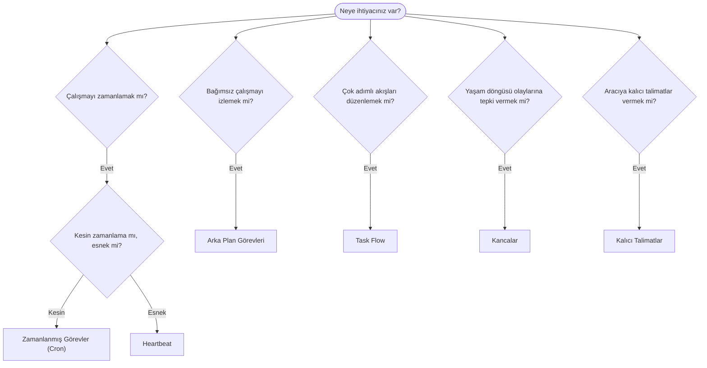

OpenClaw; görevler, zamanlanmış işler, olay kancaları ve kalıcı talimatlar aracılığıyla çalışmaları arka planda yürütür. Doğru mekanizmayı seçmek için bu sayfayı kullanın.

## Hızlı karar kılavuzu

| Kullanım alanı                                      | Önerilen                    | Nedeni                                                    |
| --------------------------------------------------- | --------------------------- | --------------------------------------------------------- |
| Günlük raporu tam saat 09.00'da gönderme            | Zamanlanmış Görevler (Cron) | Kesin zamanlama, yalıtılmış yürütme                        |
| 20 dakika sonra hatırlatma                          | Zamanlanmış Görevler (Cron) | Kesin zamanlamalı tek seferlik çalışma (`--at`) |
| Haftalık derin analiz çalıştırma                    | Zamanlanmış Görevler (Cron) | Bağımsız görev, farklı bir model kullanabilir              |
| Gelen kutusunu her 30 dakikada bir kontrol etme     | Heartbeat                   | Diğer kontrollerle toplu işlenir, bağlamdan yararlanır     |
| Yaklaşan etkinlikler için takvimi izleme            | Heartbeat                   | Periyodik farkındalık için doğal olarak uygundur           |
| Bir alt aracının veya ACP çalışmasının durumunu inceleme | Arka Plan Görevleri     | Görev defteri tüm bağımsız çalışmaları izler               |
| Nelerin ne zaman çalıştığını denetleme              | Arka Plan Görevleri         | `openclaw tasks list` ve `openclaw tasks audit`                   |
| Çok adımlı araştırma yapıp ardından özetleme        | Task Flow                   | Revizyon takibiyle dayanıklı düzenleme                     |
| Oturum sıfırlandığında betik çalıştırma             | Kancalar                    | Olay güdümlüdür, yaşam döngüsü olaylarında tetiklenir      |
| Her araç çağrısında kod yürütme                     | Plugin kancaları            | Süreç içi kancalar araç çağrılarına müdahale edebilir      |
| Yanıtlamadan önce her zaman uyumluluğu kontrol etme | Kalıcı Talimatlar           | Her oturuma otomatik olarak eklenir                        |

### Zamanlanmış Görevler (Cron) ile Heartbeat karşılaştırması

| Boyut           | Zamanlanmış Görevler (Cron)         | Heartbeat                                  |
| --------------- | ----------------------------------- | ------------------------------------------ |
| Zamanlama       | Kesin (cron ifadeleri, tek seferlik) | Yaklaşık (varsayılan olarak her 30 dakikada bir) |
| Oturum bağlamı  | Yeni (yalıtılmış) veya paylaşılan    | Ana oturumun tam bağlamı                   |
| Görev kayıtları | Her zaman oluşturulur                | Hiçbir zaman oluşturulmaz                  |
| Teslim          | Kanal, webhook veya sessiz           | Ana oturum içinde                          |
| En uygun olduğu işler | Raporlar, hatırlatmalar, arka plan işleri | Gelen kutusu kontrolleri, takvim, bildirimler |

Kesin zamanlama veya yalıtılmış yürütme gerektiğinde Zamanlanmış Görevleri (Cron) kullanın. Çalışma tam oturum bağlamından yararlanıyorsa ve yaklaşık zamanlama yeterliyse Heartbeat kullanın.

## Temel kavramlar

### Zamanlanmış görevler (cron)

Cron, kesin zamanlama için Gateway'in yerleşik zamanlayıcısıdır. İşleri kalıcı olarak saklar, aracıyı doğru zamanda uyandırır ve çıktıyı bir sohbet kanalına veya webhook uç noktasına teslim edebilir. Tek seferlik hatırlatmaları, yinelenen ifadeleri ve gelen webhook tetikleyicilerini destekler.

Bkz. [Zamanlanmış Görevler](/tr/automation/cron-jobs).

### Görevler

Arka plan görev defteri tüm bağımsız çalışmaları izler: ACP çalışmaları, alt aracı başlatmaları, yalıtılmış cron yürütmeleri ve CLI işlemleri. Görevler zamanlayıcı değil, kayıttır. Bunları incelemek için `openclaw tasks list` ve `openclaw tasks audit` kullanın.

Bkz. [Arka Plan Görevleri](/tr/automation/tasks).

### Task Flow

Task Flow, arka plan görevlerinin üzerindeki akış düzenleme altyapısıdır. Yönetilen ve yansıtılmış eşitleme modlarına, revizyon takibine ve inceleme için `openclaw tasks flow list|show|cancel` desteğine sahip dayanıklı çok adımlı akışları yönetir.

Bkz. [Task Flow](/tr/automation/taskflow).

### Kalıcı talimatlar

Kalıcı talimatlar, tanımlanmış programlar için aracıya kalıcı işletim yetkisi verir. Çalışma alanı dosyalarında (genellikle `AGENTS.md`) bulunur ve her oturuma eklenir. Zamana dayalı uygulama için cron ile birleştirin.

Bkz. [Kalıcı Talimatlar](/tr/automation/standing-orders).

### Kancalar

Dahili kancalar; aracı yaşam döngüsü olayları
(`/new`, `/reset`, `/stop`), oturum Compaction işlemi, gateway başlangıcı ve mesaj
akışı tarafından tetiklenen olay güdümlü betiklerdir. Kanca dizinlerinde keşfedilir ve
`openclaw hooks` ile yönetilir. Süreç içi araç çağrısı müdahalesi için
[Plugin kancalarını](/tr/plugins/hooks) kullanın.

Bkz. [Kancalar](/tr/automation/hooks).

### Heartbeat

Heartbeat, periyodik bir ana oturum turudur (varsayılan olarak her 30 dakikada bir). Kontrol listesi tarzındaki izleme işlemlerini (gelen kutusu, takvim, bildirimler), tam oturum bağlamına sahip tek bir aracı turunda toplu olarak işler. Heartbeat turları görev kaydı oluşturmaz ve günlük/boşta kalma kaynaklı oturum sıfırlama güncelliğini uzatmaz. Heartbeat çalışma alanı küçük bir istem bağlamıdır; yinelenen çalışmaları cron işleri olarak zamanlayın. Boş Heartbeat çalışma alanı, `empty-heartbeat-file` olarak atlanır. Cron çalışması etkin veya kuyruktayken Heartbeat'ler ertelenir; ayrıca `heartbeat.skipWhenBusy`, aynı aracının oturum anahtarlı alt aracı veya iç içe hatları meşgulken aracıyı erteleyebilir.

Bkz. [Heartbeat](/tr/gateway/heartbeat).

## Birlikte nasıl çalışırlar?

- **Cron**, kesin zamanlamaları (günlük raporlar, haftalık incelemeler) ve tek seferlik hatırlatmaları yönetir. Tüm cron yürütmeleri görev kaydı oluşturur.
- **Heartbeat**, her 30 dakikada bir toplu olarak işlenen tek bir izleme kontrol listesini yönetir; bağımsız aralıklar gerektiren kontrolleri cron yönetir.
- **Kancalar**, belirli olaylara (oturum sıfırlamaları, Compaction, mesaj akışı) özel betiklerle tepki verir. Plugin kancaları araç çağrılarını kapsar.
- **Kalıcı talimatlar**, aracıya kalıcı bağlam ve yetki sınırları sağlar.
- **Task Flow**, tek tek görevlerin üzerindeki çok adımlı akışları koordine eder.
- **Görevler**, inceleyip denetleyebilmeniz için tüm bağımsız çalışmaları otomatik olarak izler.

## İlgili içerikler

- [Zamanlanmış Görevler](/tr/automation/cron-jobs) — kesin zamanlama ve tek seferlik hatırlatmalar
- [Arka Plan Görevleri](/tr/automation/tasks) — tüm bağımsız çalışmalar için görev defteri
- [Task Flow](/tr/automation/taskflow) — dayanıklı çok adımlı akış düzenlemesi
- [Kancalar](/tr/automation/hooks) — olay güdümlü yaşam döngüsü betikleri
- [Plugin kancaları](/tr/plugins/hooks) — süreç içi araç, istem, mesaj ve yaşam döngüsü kancaları
- [Kalıcı Talimatlar](/tr/automation/standing-orders) — kalıcı aracı talimatları
- [Heartbeat](/tr/gateway/heartbeat) — periyodik ana oturum turları
- [Yapılandırma Referansı](/tr/gateway/configuration-reference) — tüm yapılandırma anahtarları
