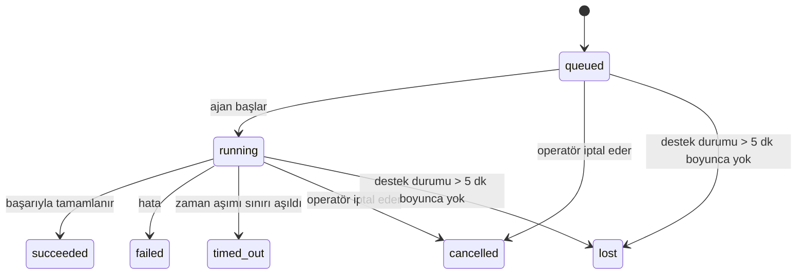

---
read_when:
    - Devam eden veya kısa süre önce tamamlanan arka plan çalışmalarını inceleme
    - Bağımsız agent çalıştırmalarındaki teslim hatalarında hata ayıklama
    - Arka plan çalıştırmalarının oturumlar, Cron ve Heartbeat ile ilişkisini anlama
sidebarTitle: Background tasks
summary: ACP çalıştırmaları, alt ajanlar, cron yürütmeleri ve CLI işlemleri için arka plan görevi takibi
title: Arka plan görevleri
x-i18n:
    generated_at: "2026-07-26T22:34:12Z"
    model: gpt-5.6
    postprocess_version: locale-links-v1
    prompt_version: 32
    provider: openai
    source_hash: dbdc5ced133764fec0c8b9ae7b1957e24272dc9c1c86099de81f6923955d6b5a
    source_path: automation/tasks.md
    workflow: 16
---

<Note>
Zamanlama mı arıyorsunuz? Doğru mekanizmayı seçmek için [Otomasyon](/tr/automation) sayfasına bakın. Bu sayfa zamanlayıcı değil, arka plan çalışmalarının etkinlik defteridir.
</Note>

Arka plan görevleri, **ana konuşma oturumunuzun dışında** çalışan işleri izler: ACP çalıştırmaları, alt ajan başlatmaları, cron işi yürütmeleri ve CLI tarafından başlatılan işlemler.

Görevler oturumların, cron işlerinin veya heartbeat'lerin yerini **almaz**; bunlar, hangi ayrık çalışmanın ne zaman gerçekleştiğini ve başarılı olup olmadığını kaydeden **etkinlik defteridir**.

<Note>
Her ajan çalıştırması bir görev oluşturmaz. Heartbeat turları ve normal etkileşimli sohbet oluşturmaz. Tüm cron yürütmeleri, ACP başlatmaları, alt ajan başlatmaları, Gateway tarafından gönderilen CLI ajan komutları ve ajan tarafından başlatılan arka plan `exec` komutları oluşturur.
</Note>

## Kısaca

- Görevler zamanlayıcı değil, **kayıtlardır**; cron ve heartbeat işin _ne zaman_ çalışacağını belirler, görevler ise _ne olduğunu_ izler.
- ACP, alt ajanlar, tüm cron işleri ve CLI işlemleri görev oluşturur. Heartbeat turları oluşturmaz.
- Her görev `queued → running → terminal` durumlarından birine geçer (başarılı, başarısız, zaman aşımına uğramış, iptal edilmiş veya kayıp).
- Cron çalışma zamanı işe hâlâ sahipken cron görevleri etkin kalır; bellek içi çalışma zamanı durumu kaybolmuşsa görev bakımı, görevi kayıp olarak işaretlemeden önce kalıcı cron çalıştırma geçmişini kontrol eder.
- Tamamlama, gönderim odaklıdır: ayrık çalışma tamamlandığında doğrudan bildirimde bulunabilir veya istekte bulunan oturumu/heartbeat'i uyandırabilir; bu nedenle durum yoklama döngüleri genellikle yanlış yaklaşımdır.
- Yalıtılmış cron çalıştırmaları ve alt ajan tamamlamaları, son temizlik kaydından önce alt oturumlarının izlenen tarayıcı sekmelerini/süreçlerini mümkün olan en iyi şekilde temizler.
- Yalıtılmış cron teslimi, alt ajanların ardıl çalışmaları hâlâ tamamlanırken eski geçici üst yanıtları engeller ve teslimden önce ulaşırsa son ardıl çıktıyı tercih eder.
- Tamamlama bildirimleri doğrudan bir kanala teslim edilir veya bir sonraki heartbeat için kuyruğa alınır.
- `openclaw tasks list` tüm görevleri gösterir; `openclaw tasks audit` sorunları görünür kılar.
- Sonlanmış kayıtlar 7 gün boyunca (`lost` kayıtları 24 saat boyunca) tutulur, ardından otomatik olarak temizlenir.

## Hızlı başlangıç

<Tabs>
  <Tab title="Listeleme ve filtreleme">
    ```bash
    # Tüm görevleri listele (önce en yeniler)
    openclaw tasks list

    # Çalışma zamanına veya duruma göre filtrele
    openclaw tasks list --runtime acp
    openclaw tasks list --status running
    ```

  </Tab>
  <Tab title="İnceleme">
    ```bash
    # Belirli bir görevin ayrıntılarını göster (görev kimliğine, çalıştırma kimliğine veya oturum anahtarına göre)
    openclaw tasks show <lookup>
    ```
  </Tab>
  <Tab title="İptal ve bildirim">
    ```bash
    # Çalışan bir görevi iptal et (alt oturumu sonlandırır)
    openclaw tasks cancel <lookup>

    # Bir görevin bildirim politikasını değiştir
    openclaw tasks notify <lookup> state_changes
    ```

  </Tab>
  <Tab title="Denetim ve bakım">
    ```bash
    # Sağlık denetimi çalıştır
    openclaw tasks audit

    # Bakımı önizle veya uygula
    openclaw tasks maintenance
    openclaw tasks maintenance --apply
    ```

  </Tab>
  <Tab title="Görev akışı">
    ```bash
    # TaskFlow durumunu incele
    openclaw tasks flow list
    openclaw tasks flow show <lookup>
    openclaw tasks flow cancel <lookup>
    ```
  </Tab>
</Tabs>

## Görevi ne oluşturur?

| Kaynak                 | Çalışma zamanı türü | Görev kaydının oluşturulduğu zaman                                          | Varsayılan bildirim politikası |
| ---------------------- | ------------ | ---------------------------------------------------------------------- | --------------------- |
| ACP arka plan çalıştırmaları    | `acp`        | Alt ACP oturumu başlatıldığında                                           | `done_only`           |
| Alt ajan orkestrasyonu | `subagent`   | `sessions_spawn` aracılığıyla bir alt ajan başlatıldığında                               | `done_only`           |
| Cron işleri (tüm türler)  | `cron`       | Her cron yürütmesinde (ana oturum ve yalıtılmış)                       | `silent`              |
| CLI işlemleri         | `cli`        | Gateway üzerinden çalışan `openclaw agent` komutlarında                 | `silent`              |
| Ajan medya işleri       | `cli`        | Oturum destekli `image_generate`/`music_generate`/`video_generate` çalıştırmalarında | `silent`              |

<AccordionGroup>
  <Accordion title="Cron ve medya için varsayılan bildirimler">
    Cron görevleri (ana oturum ve yalıtılmış) `silent` bildirim politikasını kullanır; izleme amacıyla kayıt oluşturur ancak kendi görev bildirimlerini üretmezler. Teslim yolunun sahibi cron'dur.

    Oturum destekli `image_generate`, `music_generate` ve `video_generate` çalıştırmaları da `silent` bildirim politikasını kullanır. Yine de görev kayıtları oluştururlar ancak tamamlama, ajanın takip mesajını yazabilmesi ve tamamlanan medyayı kendisinin ekleyebilmesi için dahili bir uyandırma olarak özgün ajan oturumuna geri aktarılır. İstekte bulunan ajan normal görünür yanıt sözleşmesini izler: yapılandırılmışsa otomatik son yanıt veya oturum mesaj aracı yanıtları gerektiriyorsa `message(action="send")` ile `NO_REPLY`. İstekte bulunan oturum artık etkin değilse veya etkin uyandırması başarısız olursa ve tamamlama ajanı oluşturulan medyanın bir kısmını ya da tamamını kaçırırsa OpenClaw, yalnızca eksik medyayı içeren bir kerelik doğrudan yedeği özgün kanal hedefine gönderir.

  </Accordion>
  <Accordion title="Eşzamanlı medya üretimi koruması">
    Oturum destekli bir medya üretimi görevi hâlâ etkinken `image_generate`, `music_generate` ve `video_generate` yanlışlıkla yapılan yeniden denemelere karşı koruma sağlar: aynı istem/istek için çağrının tekrarlanması, yinelenen bir görev başlatmak yerine eşleşen etkin görevin durumunu döndürür; farklı bir istem ise kendi görevini başlatabilir. Ajan tarafından açık bir ilerleme/durum sorgulaması yapmak istediğinizde `action: "status"` kullanın.
  </Accordion>
  <Accordion title="Neler görev oluşturmaz?">
    - Heartbeat turları — ana oturum; bkz. [Heartbeat](/tr/gateway/heartbeat)
    - Normal etkileşimli sohbet turları
    - Doğrudan `/command` yanıtları

  </Accordion>
</AccordionGroup>

## Görev yaşam döngüsü



| Durum      | Anlamı                                                               |
| ----------- | --------------------------------------------------------------------------- |
| `queued`    | Oluşturuldu, ajanın başlaması bekleniyor                                     |
| `running`   | Ajan turu etkin olarak yürütülüyor                                            |
| `succeeded` | Başarıyla tamamlandı                                                      |
| `failed`    | Hatayla tamamlandı                                                     |
| `timed_out` | Yapılandırılmış zaman aşımı sınırını geçti                                             |
| `cancelled` | Operatör tarafından `openclaw tasks cancel` aracılığıyla durduruldu veya çalıştırma iptal edildi |
| `lost`      | Çalışma zamanı, 5 dakikalık ek sürenin ardından yetkili destek durumunu kaybetti  |

Geçişler otomatik olarak gerçekleşir; ajan çalıştırma yaşam döngüsü olayları (başlangıç, bitiş, hata) görev durumunu günceller. Bunları elle yönetmezsiniz.

Ajan çalıştırmasının tamamlanması, etkin görev kayıtları için belirleyicidir. Başarılı bir ayrık çalıştırma `succeeded` olarak, sıradan çalıştırma hataları `failed` olarak, zaman aşımları `timed_out` olarak, iptal/durdurma sonuçları ise `cancelled` olarak sonlandırılır. Bir görev son durumuna ulaştığında sonraki yaşam döngüsü sinyalleri durumunu geriye götürmez; operatör tarafından iptal edilen veya zaten `failed`/`timed_out`/`lost` olan görev, daha sonra başarı sinyali gelse bile bu durumda kalır.

`lost` çalışma zamanı farkındalığına sahiptir:

- ACP görevleri: yalnızca Gateway içindeki canlı, süreç içi bir ACP turu çalıştırmanın etkin olduğunu kanıtlar; kalıcı oturum meta verileri tek başına yeterli değildir. Çevrimdışı CLI denetimi ihtiyatlı davranır ve ACP görevlerini hiçbir zaman geri almaz.
- Alt ajan görevleri: destekleyen alt oturum, hedef ajan deposundan kaybolmuştur (veya yeniden başlatma kurtarma mezar taşı içeriyordur).
- Cron görevleri: cron çalışma zamanı artık işi etkin olarak izlemiyordur ve kalıcı cron çalıştırma geçmişi bu çalıştırma için bir son durum sonucu göstermiyordur. Çevrimdışı CLI denetimi, kendi boş süreç içi cron çalışma zamanı durumunu yetkili kabul etmez.
- CLI görevleri: çalıştırma kimliği/kaynak kimliği bulunan görevler canlı çalıştırma bağlamını kullanır; böylece kalan alt oturum veya sohbet oturumu satırları, Gateway'in sahip olduğu çalıştırma kaybolduktan sonra görevleri etkin tutmaz. Çalıştırma kimliği bulunmayan eski CLI görevleri hâlâ alt oturumu yedek olarak kullanır. Gateway destekli `openclaw agent` çalıştırmaları da çalıştırma sonucuyla sonlandırılır; böylece tamamlanmış çalıştırmalar, temizleyici bunları `lost` olarak işaretleyene kadar etkin kalmaz.

## Teslim ve bildirimler

Bir görev son durumuna ulaştığında OpenClaw bildirim gönderir. İki teslim yolu vardır:

**Doğrudan teslim** — görevin bir kanal hedefi (`requesterOrigin`) varsa tamamlama mesajı doğrudan bu kanala gider (Discord, Slack, Telegram vb.). Grup ve kanal görevlerinin tamamlanmaları ise üst ajanın görünür yanıtı yazabilmesi için istekte bulunan oturum üzerinden yönlendirilir. OpenClaw, alt ajan tamamlamalarında mevcut olduğunda bağlı ileti dizisi/konu yönlendirmesini de korur ve doğrudan teslimden vazgeçmeden önce eksik `to` / hesabı, istekte bulunan oturumun saklanan rotasından (`lastChannel` / `lastTo` / `lastAccountId`) doldurabilir.

**Oturum kuyruğuna teslim** — doğrudan teslim başarısız olursa veya kaynak ayarlanmamışsa güncelleme, istekte bulunan kişinin oturumunda sistem olayı olarak kuyruğa alınır ve bir sonraki heartbeat'te görünür.

<Tip>
Oturum kuyruğundaki görev tamamlamaları anında bir heartbeat uyandırmasını tetikler; böylece sonucu hızlıca görürsünüz ve bir sonraki zamanlanmış heartbeat zamanını beklemeniz gerekmez.
</Tip>

Bu, olağan iş akışının gönderim tabanlı olduğu anlamına gelir: ayrık çalışmayı bir kez başlatın, ardından çalışma zamanının tamamlandığında sizi uyandırmasına veya bilgilendirmesine izin verin. Görev durumunu yalnızca hata ayıklama, müdahale veya açık bir denetim gerektiğinde sorgulayın.

### Bildirim politikaları

Her görev hakkında ne kadar bildirim alacağınızı denetleyin:

| Politika                | Teslim edilenler                                       |
| --------------------- | ------------------------------------------------------- |
| `done_only` (varsayılan) | Yalnızca son durum (başarılı, başarısız vb.)           |
| `state_changes`       | Her durum geçişi ve ilerleme güncellemesi              |
| `silent`              | Hiçbir şey (cron, CLI ve medya görevleri için varsayılan) |

Görev çalışırken politikayı değiştirin:

```bash
openclaw tasks notify <lookup> state_changes
```

## CLI referansı

<AccordionGroup>
  <Accordion title="tasks list">
    ```bash
    openclaw tasks list [--runtime <acp|subagent|cron|cli>] [--status <status>] [--json]
    ```

    Çıktı sütunları: Görev, Tür, Durum, Teslim, Çalıştırma, Alt Oturum, Özet. Parametresiz `openclaw tasks`, `openclaw tasks list` gibi davranır.

  </Accordion>
  <Accordion title="tasks show">
    ```bash
    openclaw tasks show <lookup> [--json]
    ```

    Arama belirteci bir görev kimliğini, çalıştırma kimliğini veya oturum anahtarını kabul eder. Zamanlama, teslim durumu, hata ve son durum özeti dâhil tam kaydı gösterir.

  </Accordion>
  <Accordion title="tasks cancel">
    ```bash
    openclaw tasks cancel <lookup>
    ```

    ACP ve alt ajan görevlerinde bu işlem alt oturumu sonlandırır; ACP ve Cron iptalleri çalışan Gateway üzerinden yönlendirilir (`tasks.cancel`). CLI tarafından izlenen görevlerde iptal, görev kayıt defterine kaydedilir (ayrı bir alt çalışma zamanı tanıtıcısı yoktur). Durum `cancelled` olarak değişir ve uygun olduğunda bir teslimat bildirimi gönderilir.

  </Accordion>
  <Accordion title="tasks notify">
    ```bash
    openclaw tasks notify <lookup> <done_only|state_changes|silent>
    ```
  </Accordion>
  <Accordion title="tasks audit">
    ```bash
    openclaw tasks audit [--severity <warn|error>] [--code <name>] [--limit <n>] [--json]
    ```

    Görevler **ve** TaskFlow'lar için operasyonel sorunları tek bir raporda gösterir. Sorunlar algılandığında bulgular `openclaw status` içinde de görünür.

    Görev bulguları:

    | Bulgu                     | Önem düzeyi | Tetikleyici                                                                                                  |
    | ------------------------- | ---------- | ------------------------------------------------------------------------------------------------------------ |
    | `stale_queued`            | warn       | 10 dakikadan uzun süredir kuyrukta                                                                           |
    | `stale_running`           | error      | 30 dakikadan uzun süredir çalışıyor                                                                          |
    | `lost`                    | warn/error | Çalışma zamanı destekli görev sahipliği kayboldu; tutulan kayıp görevler `cleanupAfter` zamanına kadar uyarı verir, ardından hata olur |
    | `delivery_failed`         | warn       | Teslimat başarısız oldu ve bildirim ilkesi `silent` değil                                                     |
    | `missing_cleanup`         | warn       | Temizleme zaman damgası olmayan sonlandırılmış görev                                                          |
    | `inconsistent_timestamps` | warn       | Zaman çizelgesi ihlali (örneğin başlamadan önce sona erme)                                                    |

    TaskFlow bulguları:

    | Bulgu                  | Önem düzeyi | Tetikleyici                                                                  |
    | ---------------------- | ---------- | --------------------------------------------------------------------------- |
    | `restore_failed`       | error      | Akış kayıt defterinin SQLite'tan geri yüklenmesi başarısız oldu              |
    | `stale_running`        | error      | Çalışan akış 30 dakikadan uzun süredir ilerlemedi                            |
    | `stale_waiting`        | warn       | Bekleyen akış 30 dakikadan uzun süredir ilerlemedi                           |
    | `stale_blocked`        | warn       | Engellenen akış 30 dakikadan uzun süredir ilerlemedi                         |
    | `cancel_stuck`         | warn       | İptal 5 dakikadan uzun süre önce istendi, etkin alt görev yok, hâlâ sonlandırılmadı |
    | `missing_linked_tasks` | warn/error | Bağlı görevi veya bekleme durumu olmayan eski yönetilen akış                 |
    | `blocked_task_missing` | warn       | Engellenen akış artık mevcut olmayan bir görev kimliğine işaret ediyor       |

  </Accordion>
  <Accordion title="tasks maintenance">
    ```bash
    openclaw tasks maintenance [--json]
    openclaw tasks maintenance --apply [--json]
    ```

    Görevler, TaskFlow durumu ve eski Cron çalıştırma oturumu kayıt defteri satırları için mutabakatı, temizleme damgalamasını ve budamayı önizlemek veya uygulamak üzere bunu kullanın.

    Mutabakat, çalışma zamanını dikkate alır:

    - ACP görevleri Gateway içinde canlı bir süreç içi tur gerektirir; alt ajan görevleri, bunları destekleyen alt oturumu denetler.
    - Alt oturumunda yeniden başlatma kurtarma mezar taşı bulunan alt ajan görevleri, kurtarılabilir destek oturumları olarak değerlendirilmek yerine kayıp olarak işaretlenir.
    - Cron görevleri önce Cron çalışma zamanının işi hâlâ sahiplenip sahiplenmediğini denetler, ardından `lost` durumuna geri dönmeden önce kalıcı Cron çalıştırma günlüklerinden/iş durumundan sonlandırılmış durumu kurtarır. Bellek içindeki etkin Cron işleri kümesi için yalnızca Gateway süreci yetkilidir; çevrimdışı CLI denetimi kalıcı geçmişi kullanır ancak yalnızca bu yerel küme boş olduğu için bir Cron görevini kayıp olarak işaretlemez.
    - Çalıştırma kimliği bulunan CLI görevleri yalnızca alt oturum veya sohbet oturumu satırlarını değil, sahibi olan canlı çalıştırma bağlamını denetler.

    Tamamlama temizliği de çalışma zamanını dikkate alır:

    - Alt ajan tamamlaması, duyuru temizliği devam etmeden önce alt oturum için izlenen tarayıcı sekmelerini/süreçlerini mümkün olduğunca kapatır.
    - Yalıtılmış Cron tamamlaması, çalıştırma tamamen sonlandırılmadan önce Cron oturumu için izlenen tarayıcı sekmelerini/süreçlerini mümkün olduğunca kapatır.
    - Yalıtılmış Cron teslimatı, gerektiğinde alt ajan soyundan gelen takip işlemlerinin bitmesini bekler ve eski üst öğe onay metnini duyurmak yerine bastırır.
    - Alt ajan tamamlama teslimatı yalnızca alt öğenin en son görünür asistan metnini kullanır. Tool/toolResult çıktısı, alt öğe sonuç metnine yükseltilmez. Sonlandırılmış başarısız çalıştırmalar, yakalanan yanıt metnini yeniden oynatmadan başarısızlık durumunu duyurur.
    - Temizleme hataları gerçek görev sonucunu gizlemez.

    Bakım uygulanırken OpenClaw ayrıca 7 günden eski `cron:<jobId>:run:<runId>` oturum kayıt defteri satırlarını kaldırır; çalışmakta olan Cron işleriyle ilişkili satırları korur ve Cron dışı oturum satırlarına dokunmaz.

  </Accordion>
  <Accordion title="tasks flow list | show | cancel">
    ```bash
    openclaw tasks flow list [--status <status>] [--json]
    openclaw tasks flow show <lookup> [--json]
    openclaw tasks flow cancel <lookup>
    ```

    Akış arama belirteci bir akış kimliğini veya sahip anahtarını kabul eder. Tek bir arka plan görev kaydı yerine düzenleyici [Görev Akışı](/tr/automation/taskflow) önemli olduğunda bunları kullanın.

  </Accordion>
</AccordionGroup>

## Sohbet görev panosu (`/tasks`)

Bu oturuma bağlı arka plan görevlerini görmek için herhangi bir sohbet oturumunda `/tasks` kullanın. Pano; çalışma zamanı, durum, zamanlama ve ilerleme veya hata ayrıntılarıyla birlikte en fazla beş etkin ve yakın zamanda tamamlanmış görevi gösterir.

Geçerli oturumda görünür bağlı görev yoksa `/tasks`, diğer oturumların ayrıntılarını sızdırmadan genel görünüm sunabilmek için ajan yerelindeki görev sayılarına geri döner.

Operatör kayıtlarının tamamı için CLI'ı kullanın: `openclaw tasks list`.

### Control UI

Web Control UI'ın kenar çubuğunda canlı etkin ve yakın tarihli arka plan görevlerini içeren bir **Tasks** sayfası bulunur. İlerlemeyi incelemek, bağlı oturumları açmak, kayıt defterini yenilemek veya kuyruktaki ve çalışan görevleri iptal etmek için bunu kullanın.

Sohbet bölmelerinde ayrıca bölmenin ajanıyla kapsamlandırılmış, daraltılabilir bir **Background tasks** rayı bulunur: durdurma denetimli çalışan görevler ve alt ajanlar, tamamlananlar bölümü ve her görevin alt oturumuna yönlendiren View transcript bağlantıları. Bunu bölme başlığındaki etkinlik düğmesinden (veya tek bölmeli sohbetteki yüzen etkinlik düğmesinden) açın.

Sınırlandırılmış giriş istemini ve en son çıktı veya hata özetini incelemek için rayda bir görev seçin. Çalışan işler tamamlanan işlerden ayrı tutulur ve tamamlanan satırlar görevin başarıyla mı yoksa başarısızlıkla mı sonuçlandığını gösterir. iOS'ta **Chat actions → Background Tasks** öğesini açın; Android'de Chat taşma menüsünü açıp **Background tasks** öğesini seçin. Her iki mobil görünüm de aynı Running ve Finished gruplandırmasını kullanır ve seçim yapıldığında görev ayrıntılarını açar.

## Durum entegrasyonu (görev baskısı)

`openclaw status`, bir bakışta anlaşılabilen bir görev satırı içerir:

```
Görevler    2 etkin · 1 kuyrukta · 1 çalışıyor · 1 sorun · denetim temiz · 6 izleniyor
```

Özet; etkin işleri (`queued` + `running`), başarısızlıkları (`failed` + `timed_out` + `lost`), denetim bulgularını ve izlenen toplam kayıt sayısını içerir; JSON yükü ayrıca sayıları çalışma zamanına göre ayırır (`acp`, `subagent`, `cron`, `cli`).

Hem `/status` hem de `session_status` aracı temizlemeyi dikkate alan bir görev anlık görüntüsü kullanır: etkin görevlere öncelik verilir, süresi dolan satırlar gizlenir ve sonlandırılmış görevler yalnızca kısa bir yakın dönem penceresinde (5 dakika) görünür; etkin iş kalmadığında başarısızlıklara odaklanılır. Bu, durum kartının şu anda önemli olan konulara odaklanmasını sağlar.

## Depolama ve bakım

### Görevlerin bulunduğu yer

Görev kayıtları ve teslimat durumu, paylaşılan OpenClaw SQLite durum veritabanında kalıcı olarak saklanır:

```
~/.openclaw/state/openclaw.sqlite   (tablolar: task_runs, task_delivery_state, flow_runs)
```

Tüm durum kökünü (varsayılan `~/.openclaw`) başka bir konuma taşımak için `OPENCLAW_STATE_DIR` ayarlayın; paylaşılan veritabanı yolu da onunla birlikte taşınır.

Kayıt defteri ilk kullanımda belleğe yüklenir ve her yazma işlemini SQLite'a kaydeder; böylece kayıtlar Gateway yeniden başlatmalarından sonra da korunur. WAL büyümesi, SQLite'ın varsayılan otomatik denetim noktası eşiği ve düzenli `PASSIVE` denetim noktalarıyla sınırlandırılır; kapatma ve açık bakım denetim noktaları `TRUNCATE` kullanır, böylece normal kapatmalar arka plan süpürücüsünü etkin okuyucuları bekletmeden WAL alanını geri kazanır.

Eski kurulumlardan kalan yan dosya depoları (`tasks/runs.sqlite`, `flows/registry.sqlite`), `openclaw doctor` tarafından paylaşılan veritabanına içe aktarılır.

### Otomatik bakım

Bir süpürücü her **60 saniyede** bir çalışır (ilk geçiş Gateway başladıktan yaklaşık 5 saniye sonra gerçekleşir) ve dört işlemi yürütür:

<Steps>
  <Step title="Mutabakat">
    Etkin görevlerin hâlâ yetkili çalışma zamanı desteğine sahip olup olmadığını denetler. ACP görevleri canlı bir süreç içi tur gerektirir, alt ajan görevleri alt oturum durumunu kullanır, Cron görevleri etkin iş sahipliğinin yanı sıra kalıcı çalıştırma geçmişini kullanır ve çalıştırma kimliği bulunan CLI görevleri sahibi olan çalıştırma bağlamını kullanır. Destek durumu 5 dakikadan uzun süredir yoksa (alt öğesi olmayan yerel alt ajan görevleri için 30 dakika), görev `lost` olarak işaretlenir.
  </Step>
  <Step title="ACP oturumu onarımı">
    Sonlandırılmış veya sahipsiz, üst öğeye ait tek kullanımlık ACP oturumlarını kapatır; eski, sonlandırılmış veya sahipsiz kalıcı ACP oturumlarını ise yalnızca etkin konuşma bağlantısı kalmadığında kapatır.
  </Step>
  <Step title="Temizleme damgalaması">
    Sonlandırılmış görevlerde bir `cleanupAfter` zaman damgası (sonlandırılma zamanı + saklama penceresi) ayarlar. Saklama süresi boyunca kayıp görevler denetimde uyarı olarak görünmeye devam eder; `cleanupAfter` süresi dolduktan sonra veya temizleme meta verileri eksik olduğunda hataya dönüşür.
  </Step>
  <Step title="Budama">
    `cleanupAfter` tarihini geçen kayıtları siler.
  </Step>
</Steps>

<Note>
**Saklama:** sonlandırılmış görev kayıtları **7 gün** (`lost` kayıtları **24 saat**) tutulur, ardından otomatik olarak budanır. Yapılandırma gerekmez.
</Note>

## Görevlerin diğer sistemlerle ilişkisi

<AccordionGroup>
  <Accordion title="Görevler ve Görev Akışı">
    [Görev Akışı](/tr/automation/taskflow), arka plan görevlerinin üzerindeki akış düzenleme katmanıdır. Tek bir akış, kullanım ömrü boyunca yönetilen veya yansıtılmış eşitleme modlarını kullanarak birden fazla görevi koordine edebilir. Tek tek görev kayıtlarını incelemek için `openclaw tasks`, düzenleyici akışı incelemek için `openclaw tasks flow` kullanın.

  </Accordion>
  <Accordion title="Görevler ve Cron">
    Cron işi tanımları, çalışma zamanı yürütme durumu ve çalıştırma geçmişi OpenClaw'ın paylaşılan SQLite durum veritabanında bulunur. Ana oturumdaki ve yalıtılmış olanlar dâhil **her** Cron yürütmesi, `silent` bildirim ilkesiyle bir görev kaydı oluşturur; böylece Cron çalıştırmaları kendi görev bildirimlerini üretmeden izlenir.

    Bkz. [Cron İşleri](/tr/automation/cron-jobs).

  </Accordion>
  <Accordion title="Görevler ve Heartbeat">
    Heartbeat çalıştırmaları ana oturum turlarıdır; görev kaydı oluşturmazlar. Bir görev tamamlandığında, sonucu hızlıca görebilmeniz için bir Heartbeat uyandırmasını tetikleyebilir.

    Bkz. [Heartbeat](/tr/gateway/heartbeat).

  </Accordion>
  <Accordion title="Görevler ve oturumlar">
    Bir görev, bir `childSessionKey` (işin yürütüldüğü yer) ve bir `requesterSessionKey` (görevi başlatan kişi) ile ilişkili olabilir. Görevin `agentId` alanı, işi yürüten agent'ı tanımlarken talep eden ve sahip alanları başlatma ve denetim bağlamını korur. Oturumlar konuşma bağlamıdır; görevler ise bunun üzerindeki etkinlik takibidir.
  </Accordion>
  <Accordion title="Görevler ve agent çalıştırmaları">
    Bir görevin `runId` alanı, işi gerçekleştiren agent çalıştırmasına bağlanır. Agent yaşam döngüsü olayları (başlatma, sonlandırma, hata) görev durumunu otomatik olarak günceller; yaşam döngüsünü manuel olarak yönetmeniz gerekmez.
  </Accordion>
</AccordionGroup>

## İlgili

- [Otomasyon](/tr/automation) - tüm otomasyon mekanizmalarına genel bakış
- [CLI: Görevler](/tr/cli/tasks) - CLI komut referansı
- [Heartbeat](/tr/gateway/heartbeat) - periyodik ana oturum turları
- [Zamanlanmış Görevler](/tr/automation/cron-jobs) - arka plan çalışmalarını zamanlama
- [Görev Akışı](/tr/automation/taskflow) - görevlerin üzerindeki akış orkestrasyonu
