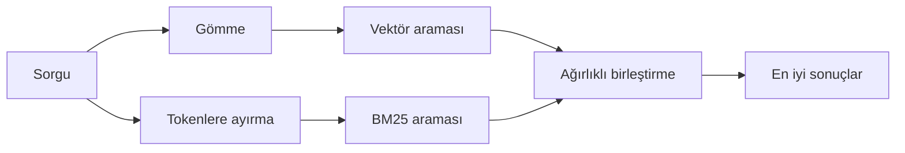

---
read_when:
    - memory_search'ün nasıl çalıştığını anlamak istiyorsunuz
    - Bir gömme sağlayıcısı seçmek istiyorsunuz
    - Arama kalitesini ayarlamak istiyorsunuz
summary: Bellek aramasının gömmeler ve hibrit erişim kullanarak ilgili notları nasıl bulduğu
title: Bellek araması
x-i18n:
    generated_at: "2026-07-26T23:38:08Z"
    model: gpt-5.6
    postprocess_version: locale-links-v1
    prompt_version: 32
    provider: openai
    source_hash: b2bd28b63ac55a2a890ed70a3015f76f1c7fbaa792b17a6ead51f4c8712fbd2d
    source_path: concepts/memory-search.md
    workflow: 16
---

`memory_search`, ifadeler özgün metinden farklı olsa bile bellek dosyalarınızdaki ilgili notları bulur. Belleği küçük parçalara böler ve
bunları gömmelerle, anahtar kelimelerle veya her ikisiyle arar.

## Hızlı başlangıç

OpenClaw varsayılan olarak OpenAI gömmelerini kullanır. Başka bir sağlayıcı kullanmak için bunu
açıkça ayarlayın:

```json5
{
  memory: {
    search: {
      provider: "openai", // veya "gemini", "voyage", "mistral", "bedrock", "local", "ollama", "lmstudio", "github-copilot", "openai-compatible"
    },
  },
}
```

`provider`, özel bir `models.providers.<id>` girdisine de başvurabilir (örneğin
`ollama-5080`); bunun için söz konusu girdinin `api` değerini `"ollama"` veya
bellek gömme bağdaştırıcısı bulunan başka bir sağlayıcı kimliği olarak ayarlaması gerekir.

API anahtarı olmadan yerel gömmeler kullanmak için resmî llama.cpp sağlayıcı
Plugin'ini yükleyin ve `provider: "local"` değerini ayarlayın:

```bash
openclaw plugins install @openclaw/llama-cpp-provider
```

Kaynak kod çalışma kopyalarında yine de yerel derleme onayı gerekir: `pnpm approve-builds`, ardından
`pnpm rebuild node-llama-cpp`.

Bazı OpenAI uyumlu gömme uç noktaları, aramalar için `"query"` ve dizine alınmış
parçalar için `"document"`/`"passage"` gibi asimetrik `input_type`
etiketleri gerektirir. Bunları `queryInputType` ve `documentInputType` ile ayarlayın; bkz.
[Bellek yapılandırma başvurusu](/tr/reference/memory-config#provider-specific-config).

## Desteklenen sağlayıcılar

| Sağlayıcı         | Kimlik              | API anahtarı gerekli | Notlar                              |
| ----------------- | ------------------- | -------------------- | ----------------------------------- |
| Bedrock           | `bedrock`           | Hayır                | AWS kimlik bilgisi zincirini kullanır |
| DeepInfra         | `deepinfra`         | Evet                 | Varsayılan model `BAAI/bge-m3` |
| Gemini            | `gemini`            | Evet                 | Görüntü/ses dizinlemeyi destekler   |
| GitHub Copilot    | `github-copilot`    | Hayır                | Copilot aboneliğinizi kullanır      |
| Yerel             | `local`             | Hayır                | GGUF modeli, ~0.6 GB otomatik indirme |
| LM Studio         | `lmstudio`          | Hayır                | Yerel/kendi barındırdığınız sunucu  |
| Mistral           | `mistral`           | Evet                 |                                     |
| Ollama            | `ollama`            | Hayır                | Yerel/kendi barındırdığınız sunucu  |
| OpenAI            | `openai`            | Evet                 | Varsayılan                          |
| OpenAI uyumlu     | `openai-compatible` | Genellikle           | Genel `/v1/embeddings` uç noktası |
| Voyage            | `voyage`            | Evet                 |                                     |

## Arama nasıl çalışır?

OpenClaw iki getirme yolunu paralel olarak çalıştırır ve sonuçları birleştirir:



- **Vektör araması** benzer anlamları eşleştirir ("gateway ana makinesi", "OpenClaw'ı
  çalıştıran makine" ile eşleşir).
- **BM25 anahtar kelime araması** tam terimleri eşleştirir (kimlikler, hata dizeleri, yapılandırma
  anahtarları).
- **Dosya adı araması**, yolları not gövdelerinden ayrı olarak dizine alır. Tam
  yollar, temel dosya adları ve dosya adı kökleri kısmi yol eşleşmelerinden daha üstte sıralanırken,
  parçacıklar ve gövde anahtar kelime puanları yine not içeriğinden gelir.

Yollardan yalnızca biri kullanılabiliyorsa diğeri tek başına çalışır.

**Yalnızca FTS modu.** Gömmeleri kasıtlı olarak devre dışı bırakmak ve yalnızca
anahtar kelimelerle arama yapmak için `provider: "none"` değerini ayarlayın. `provider` değerini ayarlamamak veya `"auto"`
olarak ayarlamak da gömme kimlik doğrulaması yapılandırılmamışsa hata vermeden
yalnızca anahtar kelime sıralamasına geri döner; `provider: "local"` (GGUF/llama.cpp
sağlayıcısı) başarısız olduğunda da aynı davranış geçerlidir.

**Açıkça belirtilen sağlayıcı kullanılamıyor.** Başka herhangi bir sağlayıcıyı açıkça
belirtirseniz (örneğin `openai`, `ollama`, `gemini`) ve istek sırasında kullanılamaz
duruma gelirse (hatalı kimlik doğrulaması, ağ arızası), `memory_search` sessizce yalnızca FTS
sonuçlarına geçmek yerine belleğin kullanılamadığını bildirir. Böylece yapılandırılmış
bozuk bir sağlayıcı görünür kalır. Bilinçli olarak yalnızca FTS ile hatırlama için
`provider: "none"` değerini ayarlayın veya anlamsal sıralamayı geri yüklemek için sağlayıcı/kimlik doğrulama
yapılandırmasını düzeltin.

## Arama kalitesini iyileştirme

İki isteğe bağlı özellik, geniş bir not geçmişinde yardımcı olur.

### Zamansal azalma

Eski notların sıralama ağırlığı zamanla azalır; böylece güncel bilgiler önce gösterilir.
Varsayılan 30 günlük yarı ömürle geçen aya ait bir not, özgün ağırlığının %50'si kadar
puan alır. `MEMORY.md` ve `memory/` altındaki diğer tarihsiz dosyalar
kalıcıdır ve ağırlıkları hiçbir zaman azalmaz; yalnızca tarihli `memory/YYYY-MM-DD.md` dosyalarının ağırlığı azalır.

<Tip>
Aracınızda aylarca birikmiş günlük notlar varsa ve eski bilgiler
güncel bağlamdan daha üstte sıralanmaya devam ediyorsa bunu etkinleştirin.
</Tip>

### MMR (çeşitlilik)

Yinelenen sonuçları azaltır. Beş notun tümü aynı yönlendirici yapılandırmasından söz ediyorsa
MMR, en iyi sonuçların tekrar etmek yerine farklı konuları kapsamasını sağlar.

<Tip>
`memory_search`, farklı günlük notlardan birbirine çok benzeyen parçacıklar
döndürmeye devam ediyorsa bunu etkinleştirin.
</Tip>

### İkisini de etkinleştirme

```json5
{
  memory: {
    search: {
      query: {
        hybrid: {
          mmr: { enabled: true },
          temporalDecay: { enabled: true },
        },
      },
    },
  },
}
```

## Çok modlu bellek

`gemini-embedding-2-preview` ile Markdown'ın yanı sıra görüntüleri ve sesleri de
dizine alabilirsiniz. Bu yalnızca `memory.search.extraPaths` altındaki dosyalar için geçerlidir; varsayılan
bellek kökleri (`MEMORY.md`, `memory/*.md`) yalnızca Markdown olarak kalır. Arama sorguları
metin olarak kalır ancak görsel ve sesli içerikle eşleşir. Kurulum için
[Bellek yapılandırma başvurusuna](/tr/reference/memory-config#multimodal-memory-gemini)
bakın.

## Oturum belleği araması

Oturum dökümlerinden tam metni bire bir hatırlamak için [`sessions_search`](/tr/concepts/session-search)
kullanın ve ardından `sessions_history` ile bir sonucu açın. Oturum belleği araması, anlamsal ve
deneysel tamamlayıcı olmaya devam eder.

İsteğe bağlı olarak oturum dökümlerini dizine alarak `memory_search` öğesinin önceki
konuşmaları hatırlamasını sağlayabilirsiniz. Bu özellik tercihe bağlıdır: `experimental.sessionMemory: true` değerini ayarlayın ve
`sources` içine `"sessions"` ekleyin (varsayılan `sources`, `["memory"]` değeridir).

Oturum eşleşmeleri `tools.sessions.visibility` ayarına uyar: varsayılan `"tree"`, mevcut
oturumu, onun başlattığı oturumları ve ortamdaki grup farkındalığı aracılığıyla izlenen
aynı araca ait grup oturumlarını erişilebilir kılar. `session.dmScope: "main"` kullanıldığında çok kullanıcılı
bir DM kurulumu bu ana oturumu paylaşır; dolayısıyla buraya yönlendirilen kullanıcılar, onun izlediği
gruplardaki içeriği hatırlayabilir. DM yalıtımı için eş başına bir `dmScope` kullanın veya
ortamda izlenen oturumların okunmasını devre dışı bırakmak için görünürlüğü `"self"` olarak ayarlayın. İlişkisiz
diğer aynı araç oturumları için yine `"agent"` görünürlüğü gerekir.

QMD arka ucunu kullanırken dökümlerin QMD koleksiyonuna aktarılması için
`memory.qmd.sessions.enabled: true` değerini de ayarlayın; yalnızca `experimental.sessionMemory`
ve `sources`, dökümleri QMD'ye aktarmaz. Bkz.
[yapılandırma başvurusu](/tr/reference/memory-config#session-memory-search-experimental).

## Sorun giderme

**Sonuç yok mu?** Dizini denetlemek için `openclaw memory status` komutunu çalıştırın. Boşsa
`openclaw memory index --force` komutunu çalıştırın.

**Yalnızca anahtar kelime eşleşmeleri mi var?** Gömme sağlayıcınız yapılandırılmamış olabilir.
`openclaw memory status --deep` değerini denetleyin.

**Yerel gömmeler zaman aşımına mı uğruyor?** `ollama`, `lmstudio` ve `local`, sağlayıcının
sahip olduğu daha uzun toplu işlem zaman sınırlarını kullanır. Sağlayıcının durumunu denetleyin ve
`openclaw memory index --force` komutunu yeniden çalıştırın.

**CJK metni bulunamıyor mu?** FTS dizinini
`openclaw memory index --force` ile yeniden oluşturun.

## İlgili konular

- [Belleğe genel bakış](/tr/concepts/memory)
- [Active Memory](/tr/concepts/active-memory)
- [Yerleşik bellek motoru](/tr/concepts/memory-builtin)
- [Bellek yapılandırma başvurusu](/tr/reference/memory-config)
