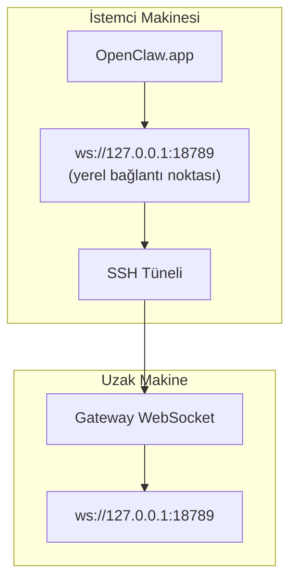

<Note>
Bu içerik artık [Uzaktan Erişim](/tr/gateway/remote#macos-persistent-ssh-tunnel-via-launchagent) sayfasında yer alıyor. Güncel kılavuz için o sayfayı kullanın; bu sayfa yönlendirme hedefi olarak kalır.
</Note>

# OpenClaw.app'i Uzak Bir Gateway ile Çalıştırma

OpenClaw.app, bir SSH tüneli üzerinden uzak bir Gateway'e erişir: bir SSH `LocalForward`, yerel bir bağlantı noktasını uzak ana makinedeki Gateway WebSocket bağlantı noktasına eşler.

## Kurulum

1. `LocalForward 18789 127.0.0.1:18789` ile bir SSH yapılandırma girdisi ekleyin (tam yapılandırma bloğu için [Uzaktan Erişim](/tr/gateway/remote#macos-persistent-ssh-tunnel-via-launchagent) sayfasına bakın).
2. SSH anahtarınızı `ssh-copy-id` ile uzak ana makineye kopyalayın.
3. `gateway.remote.token` (veya `gateway.remote.password`) değerini `openclaw config set gateway.remote.token "<your-token>"` aracılığıyla ayarlayın.
4. Tüneli başlatın: `ssh -N remote-gateway &`.
5. OpenClaw.app'ten çıkın ve uygulamayı yeniden açın.

Yeniden başlatmalardan sonra çalışmaya devam eden ve bağlantıyı otomatik olarak yeniden kuran bir tünel için manuel `ssh -N` yerine [Uzaktan Erişim](/tr/gateway/remote#macos-persistent-ssh-tunnel-via-launchagent) sayfasındaki LaunchAgent kurulumunu kullanın.

## Nasıl çalışır?

| Bileşen                            | İşlevi                                                  |
| ------------------------------------ | ------------------------------------------------------------- |
| `LocalForward 18789 127.0.0.1:18789` | Yerel 18789 bağlantı noktasını uzak 18789 bağlantı noktasına yönlendirir                |
| `ssh -N`                             | Uzak komutları yürütmeden SSH bağlantısı kurar (yalnızca bağlantı noktası yönlendirme)  |
| `KeepAlive`                          | Tünel çökerse otomatik olarak yeniden başlatır (LaunchAgent) |
| `RunAtLoad`                          | LaunchAgent yüklendiğinde tüneli başlatır (LaunchAgent)    |

OpenClaw.app, istemcideki `ws://127.0.0.1:18789` adresine bağlanır. Tünel, bu bağlantıyı Gateway'in çalıştığı uzak ana makinedeki 18789 bağlantı noktasına yönlendirir.

## İlgili

- [Uzaktan erişim](/tr/gateway/remote)
- [Tailscale](/tr/gateway/tailscale)
