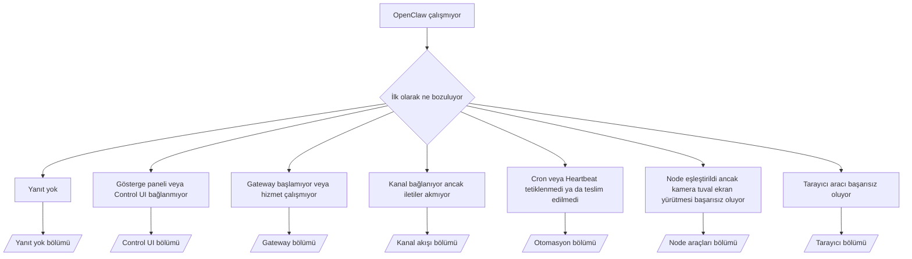

---
read_when:
    - OpenClaw çalışmıyor ve sorunu düzeltmenin en hızlı yoluna ihtiyacınız var
    - Ayrıntılı çalışma kılavuzlarına geçmeden önce bir triyaj akışı istiyorsunuz
summary: OpenClaw için belirti odaklı sorun giderme merkezi
title: Genel sorun giderme
x-i18n:
    generated_at: "2026-07-27T00:01:23Z"
    model: gpt-5.6
    postprocess_version: locale-links-v1
    prompt_version: 32
    provider: openai
    source_hash: de3554ed680ac536d105017220b44d94456a4408916e949352500b046f4d5f17
    source_path: help/troubleshooting.md
    workflow: 16
---

Ön değerlendirme giriş noktası. 2 dakika içinde tanı koyun, ardından ayrıntılı sayfaya geçin.

## İlk 60 saniye

Bu adımları sırayla çalıştırın:

```bash
openclaw status
openclaw status --all
openclaw gateway probe
openclaw gateway status
openclaw doctor
openclaw channels status --probe
openclaw logs --follow
```

İyi çıktı, her biri tek satır:

- `openclaw status` yapılandırılmış kanalları gösterir; kimlik doğrulama hatası yoktur.
- `openclaw status --all` eksiksiz ve paylaşılabilir bir rapor oluşturur.
- `openclaw gateway probe`, `Reachable: yes` gösterir. `Capability: ...`, yoklamanın
  doğruladığı kimlik doğrulama düzeyidir; `Read probe: limited - missing scope:
operator.read` bağlantı hatası değil, kısıtlı tanılamadır.
- `openclaw gateway status`; `Runtime: running`, `Connectivity probe:
ok` ve makul bir `Capability: ...` gösterir. Okuma kapsamlı RPC kanıtını da zorunlu kılmak için
  `--require-rpc` ekleyin.
- `openclaw doctor`, engelleyici yapılandırma/hizmet hatası olmadığını bildirir.
- `openclaw channels status --probe`, Gateway erişilebilir olduğunda hesap başına canlı aktarım durumunu
  (`works` / `audit ok`) döndürür; erişilemediğinde yalnızca
  yapılandırmaya dayalı özetlere geri döner.
- `openclaw logs --follow`, sürekli etkinlik gösterir; yinelenen önemli hata yoktur.

## Asistan kısıtlı görünüyor veya araçlar eksik

Geçerli araç profilini denetleyin:

```bash
openclaw status
openclaw status --all
openclaw doctor
```

Yaygın nedenler:

- `tools.profile: "minimal"` yalnızca `session_status` kullanımına izin verir.
- `tools.profile: "messaging"`, yalnızca sohbet eden aracılar için dar kapsamlıdır.
- `tools.profile: "coding"`, yeni yerel yapılandırmaların varsayılanıdır (depo, dosya,
  kabuk ve çalışma zamanı işlemleri).
- `tools.profile: "full"` profil kısıtlamalarını kaldırır; yalnızca güvenilir
  operatör denetimindeki aracılarla sınırlandırın.
- Aracı başına `agents.entries.*.tools`, tek bir aracı için kök profilini daraltır veya
  genişletir.

Profili değiştirin, Gateway'i yeniden başlatın veya yeniden yükleyin, ardından
`openclaw status --all` ile tekrar denetleyin. Tam profil/grup tablosu: [Araç profilleri](/tr/gateway/config-tools#tool-profiles).

## Anthropic uzun bağlam 429

`HTTP 429: rate_limit_error: Extra usage is required for long context requests`
→ [Uzun bağlam için Anthropic 429 ek kullanım gereksinimi](/tr/gateway/troubleshooting#anthropic-429-extra-usage-required-for-long-context).

## Yerel OpenAI uyumlu arka uç doğrudan çalışıyor ancak OpenClaw'da başarısız oluyor

Yerel/kendi barındırdığınız `/v1` arka ucu, doğrudan `/v1/chat/completions`
yoklamalarına yanıt veriyor ancak `openclaw infer model run` veya normal aracı turlarında başarısız oluyor:

1. Hata, `messages[].content` için dize beklendiğini belirtiyor: 
   `models.providers.<provider>.models[].compat.requiresStringContent: true` ayarlayın.
2. Hâlâ yalnızca OpenClaw aracı turlarında başarısız oluyor: 
   `models.providers.<provider>.models[].compat.supportsTools: false` ayarlayıp yeniden deneyin.
3. Küçük doğrudan çağrılar çalışıyor ancak daha büyük OpenClaw istemleri arka ucu çökertiyor: bu,
   bir OpenClaw hatası değil, üst model/sunucu sınırıdır. [Yerel OpenAI uyumlu arka uç doğrudan yoklamaları geçiyor ancak aracı çalıştırmaları başarısız oluyor](/tr/gateway/troubleshooting#local-openai-compatible-backend-passes-direct-probes-but-agent-runs-fail)
   bölümünden devam edin.

## Eksik openclaw uzantıları nedeniyle Plugin kurulumu başarısız oluyor

`package.json missing openclaw.extensions`, Plugin paketinin OpenClaw'ın artık
kabul etmediği bir biçim kullandığı anlamına gelir.

Plugin paketinde düzeltin:

1. Derlenmiş çalışma zamanı dosyalarını (genellikle `./dist/index.js`) gösterecek şekilde
   `package.json` içine `openclaw.extensions` ekleyin.
2. Yeniden yayımlayın, ardından `openclaw plugins install <package>` komutunu tekrar çalıştırın.

```json
{
  "name": "@openclaw/my-plugin",
  "version": "1.2.3",
  "openclaw": {
    "extensions": ["./dist/index.js"]
  }
}
```

Başvuru: [Plugin mimarisi](/tr/plugins/architecture)

## Kurulum ilkesi Plugin kurulumlarını veya güncellemelerini engelliyor

Güncelleme tamamlanıyor ancak Plugin'ler eski kalıyor, devre dışı bırakılıyor ya da `blocked by install
policy`, `install policy failed closed` veya `Disabled "<plugin>" after plugin
update failure` gösteriyor: `security.installPolicy` denetleyin.

Kurulum ilkesi, Plugin kurulumlarında ve güncellemelerinde çalışır. `@openclaw/*` Plugin
sürümleri normalde OpenClaw sürümüyle birlikte ilerlediğinden, bir OpenClaw güncellemesi
güncelleme sonrası eşitleme sırasında buna uygun bir Plugin güncellemesi gerektirebilir.

Eşleşen yükseltme kuralını da sürdürmüyorsanız şu ilke biçimlerinden kaçının:

- OpenClaw'a ait Plugin'leri tek ve tam olarak belirtilmiş eski bir sürümde sabitlemek (örneğin, yalnızca
  `@openclaw/*@2026.5.3`).
- Yalnızca kaynak türüne göre engellemek (her npm, ağ veya `request.mode:
"update"` isteği).
- İlke komutunu isteğe bağlı saymak: `security.installPolicy`
  etkinleştirildiğinde eksik, yavaş, okunamayan veya izinlerce engellenmiş bir ilke
  yürütülebilir dosyası güvenli biçimde başarısız olur.
- İsteğin `openclawVersion` değerini Plugin adayının meta verileriyle karşılaştırmadan
  sürümleri onaylamak.

Tek bir sürümü sonsuza kadar sabitlemek yerine, mevcut ana makineyle uyumlu güvenilir
`@openclaw/*` güncellemelerine izin veren kuralları tercih edin. npm'yi varsayılan olarak
engelliyorsanız kullandığınız Plugin kimlikleri için dar kapsamlı bir istisna ekleyin ve kurulumlara
uyguladığınız güven kuralını `request.mode: "update"` için de uygulayın.

Kurtarma:

```bash
openclaw doctor --deep
openclaw plugins update --all
openclaw status --all
```

İlke bilinçli olarak katıysa güvenilir yükseltme
aralığı için gevşetin, `openclaw plugins update --all` komutunu yeniden çalıştırın, ardından daha katı kuralı geri yükleyin.
Güncelleme hatası bir Plugin'i devre dışı bıraktıysa yeniden etkinleştirmeden önce inceleyin:

```bash
openclaw plugins inspect <plugin-id> --runtime --json
openclaw plugins enable <plugin-id>
```

Başvuru: [Operatör kurulum ilkesi](/tr/tools/skills-config#operator-install-policy-securityinstallpolicy)

## Plugin mevcut ancak şüpheli sahiplik nedeniyle engelleniyor

`openclaw doctor`, kurulum veya başlangıç uyarıları şunu gösteriyor:

```text
engellenen Plugin adayı: şüpheli sahiplik (... uid=1000, beklenen uid=0 veya root)
Plugin mevcut ancak engellendi
```

Plugin dosyalarının sahibi, dosyaları yükleyen işlemden farklı bir Unix kullanıcısıdır.
Plugin yapılandırmasını kaldırmayın; dosya sahipliğini düzeltin veya OpenClaw'ı
durum dizininin sahibi olan kullanıcı olarak çalıştırın.

Docker kurulumları `node` (uid `1000`) olarak çalışır. Ana makine bağlama noktalarını onarın:

```bash
sudo chown -R 1000:1000 /path/to/openclaw-config /path/to/openclaw-workspace
openclaw doctor --fix
```

OpenClaw'ı bilinçli olarak root kullanıcısı şeklinde çalıştırıyorsanız bunun yerine yönetilen Plugin kökünü
onarın:

```bash
sudo chown -R root:root /path/to/openclaw-config/npm
openclaw doctor --fix
```

Daha ayrıntılı belgeler: [Engellenen Plugin yolu sahipliği](/tr/tools/plugin#blocked-plugin-path-ownership), [Docker: İzinler ve EACCES](/tr/install/docker#shell-helpers-optional)

## Karar ağacı



<AccordionGroup>
  <Accordion title="Yanıt yok">
    ```bash
    openclaw status
    openclaw gateway status
    openclaw channels status --probe
    openclaw pairing list --channel <channel> [--account <id>]
    openclaw logs --follow
    ```

    İyi çıktı:

    - `Runtime: running`
    - `Connectivity probe: ok`
    - `Capability: read-only`, `write-capable` veya `admin-capable`
    - Kanal, aktarımın bağlı olduğunu ve desteklendiği durumlarda `channels status --probe` içinde
      `works` veya `audit ok` gösterir
    - Gönderen onaylıdır (veya DM ilkesi açık/izin listesi şeklindedir)

    Günlük imzaları:

    - `drop guild message (mention required` → Discord bahsetme kapısı iletiyi engelledi.
    - `pairing request` → gönderen onaylanmadı, DM eşleştirme onayı bekleniyor.
    - Kanal günlüklerinde `blocked` / `allowlist` → gönderen, oda veya grup filtrelendi.

    Ayrıntılı sayfalar: [Yanıt yok](/tr/gateway/troubleshooting#no-replies), [Kanal sorunlarını giderme](/tr/channels/troubleshooting), [Eşleştirme](/tr/channels/pairing)

  </Accordion>

  <Accordion title="Gösterge paneli veya Control UI bağlanmıyor">
    ```bash
    openclaw status
    openclaw gateway status
    openclaw logs --follow
    openclaw doctor
    openclaw channels status --probe
    ```

    İyi çıktı:

    - `openclaw gateway status` içinde `Dashboard: http://...` gösteriliyor
    - `Connectivity probe: ok`
    - `Capability: read-only`, `write-capable` veya `admin-capable`
    - Günlüklerde kimlik doğrulama döngüsü yok

    Günlük imzaları:

    - `device identity required` → HTTP/güvenli olmayan bağlam, cihaz kimlik doğrulamasını tamamlayamaz.
    - `origin not allowed` → tarayıcı `Origin`, Control UI Gateway hedefi için izinli değildir.
    - `canRetryWithDeviceToken=true` ile `AUTH_TOKEN_MISMATCH` → eşleştirilen token'ın önbelleğe alınmış kapsamlarını yeniden kullanan tek bir güvenilir cihaz token'ı yeniden denemesi otomatik olarak gerçekleşebilir.
    - bu yeniden denemeden sonra yinelenen `unauthorized` → yanlış token/parola, kimlik doğrulama modu uyuşmazlığı veya eski eşleştirilmiş cihaz token'ı.
    - `too many failed authentication attempts (retry later)` → bu tarayıcı `Origin` kaynağından gelen yinelenen hatalar geçici olarak kilitlendi; diğer localhost kaynakları ayrı gruplar kullanır. Tailscale Serve eşzamanlı yeniden deneme ayrıntısı için [Gösterge paneli/Control UI bağlantısı](/tr/gateway/troubleshooting#dashboard-control-ui-connectivity) bölümüne bakın.
    - `gateway connect failed:` → UI yanlış URL'yi/portu hedefliyor veya Gateway'e erişilemiyor.

    Ayrıntılı sayfalar: [Gösterge paneli/Control UI bağlantısı](/tr/gateway/troubleshooting#dashboard-control-ui-connectivity), [Control UI](/tr/web/control-ui), [Kimlik doğrulama](/tr/gateway/authentication)

  </Accordion>

  <Accordion title="Gateway başlamıyor veya hizmet kurulu olmasına rağmen çalışmıyor">
    ```bash
    openclaw status
    openclaw gateway status
    openclaw logs --follow
    openclaw doctor
    openclaw channels status --probe
    ```

    İyi çıktı:

    - `Service: ... (loaded)`
    - `Runtime: running`
    - `Connectivity probe: ok`
    - `Capability: read-only`, `write-capable` veya `admin-capable`

    Günlük imzaları:

    - `Gateway start blocked: set gateway.mode=local` veya `existing config is missing gateway.mode` → Gateway modu uzaktır veya yapılandırmada yerel mod damgası eksiktir ve onarılması gerekir.
    - `refusing to bind gateway ... without auth` → geçerli bir kimlik doğrulama yolu (token/parola veya yapılandırılmışsa güvenilir proxy) olmadan geri döngü dışı bağlama.
    - `another gateway instance is already listening` veya `EADDRINUSE` → port zaten kullanımda.

    Ayrıntılı sayfalar: [Gateway hizmeti çalışmıyor](/tr/gateway/troubleshooting#gateway-service-not-running), [Arka plan işlemi](/tr/gateway/background-process), [Yapılandırma](/tr/gateway/configuration)

  </Accordion>

  <Accordion title="Kanal bağlanıyor ancak iletiler akmıyor">
    ```bash
    openclaw status
    openclaw gateway status
    openclaw logs --follow
    openclaw doctor
    openclaw channels status --probe
    ```

    İyi çıktı:

    - Kanal aktarımı bağlı.
    - Eşleştirme/izin listesi denetimleri başarılı.
    - Gerekli yerlerde bahsetmeler algılandı.

    Günlük imzaları:

    - `mention required` → grup bahsetme kapısı işlemeyi engelledi.
    - `pairing` / `pending` → DM göndereni henüz onaylanmadı.
    - `not_in_channel`, `missing_scope`, `Forbidden`, `401/403` → kanal izin token'ı sorunu.

    Ayrıntılı sayfalar: [Kanal bağlı, iletiler akmıyor](/tr/gateway/troubleshooting#channel-connected-messages-not-flowing), [Kanal sorunlarını giderme](/tr/channels/troubleshooting)

  </Accordion>

  <Accordion title="Cron veya Heartbeat tetiklenmedi ya da teslim edilmedi">
    ```bash
    openclaw status
    openclaw gateway status
    openclaw cron status
    openclaw cron list
    openclaw cron runs --id <jobId> --limit 20
    openclaw logs --follow
    ```

    İyi çıktı:

    - `cron status`, zamanlayıcının etkin olduğunu ve bir sonraki uyanmanın ayarlandığını gösterir.
    - `cron runs`, son `ok` girdilerini gösterir.
    - Heartbeat etkindir ve etkin saatler içindedir.

    Günlük işaretleri:

    - `cron: scheduler disabled; jobs will not run automatically` → Cron devre dışıdır.
    - `heartbeat skipped` nedeni `quiet-hours` → yapılandırılmış etkin saatlerin dışındadır.
    - `heartbeat skipped` nedeni `empty-heartbeat-file` → Heartbeat izleyicisinin karalama alanı yalnızca boşluk, yorum, başlık, çit veya boş kontrol listesi iskeleti içerir.
    - `heartbeat skipped` nedeni `alerts-disabled` → `showOk`, `showAlerts` ve `useIndicator` seçeneklerinin tümü kapalıdır.
    - `requests-in-flight` → ana hat meşguldür; Heartbeat uyanması ertelenmiştir.
    - `unknown accountId` → Heartbeat teslim hedefi hesabı mevcut değildir.

    Ayrıntılı sayfalar: [Cron ve Heartbeat teslimi](/tr/gateway/troubleshooting#cron-and-heartbeat-delivery), [Zamanlanmış görevler: Sorun giderme](/tr/automation/cron-jobs#troubleshooting), [Heartbeat](/tr/gateway/heartbeat)

  </Accordion>

  <Accordion title="Node eşleştirildi ancak araç kamera, tuval, ekran veya exec için başarısız oluyor">
    ```bash
    openclaw status
    openclaw gateway status
    openclaw nodes status
    openclaw nodes describe --node <idOrNameOrIp>
    openclaw logs --follow
    ```

    İyi çıktı:

    - Node, `node` rolü için bağlı ve eşleştirilmiş olarak listelenir.
    - Çağırdığınız komut için yetenek mevcuttur.
    - Araç için izin durumu verilmiş olarak görünür.

    Günlük işaretleri:

    - `NODE_BACKGROUND_UNAVAILABLE` → Node uygulamasını ön plana getirin.
    - `*_PERMISSION_REQUIRED` → işletim sistemi izni reddedilmiş veya eksiktir.
    - `SYSTEM_RUN_DENIED: approval required` → exec onayı beklemededir.
    - `SYSTEM_RUN_DENIED: allowlist miss` → komut exec izin listesindedir değildir.

    Ayrıntılı sayfalar: [Node eşleştirildi, araç başarısız oluyor](/tr/gateway/troubleshooting#node-paired-tool-fails), [Node sorun giderme](/tr/nodes/troubleshooting), [Exec onayları](/tr/tools/exec-approvals)

  </Accordion>

  <Accordion title="Exec aniden onay istiyor">
    ```bash
    openclaw config get tools.exec.host
    openclaw config get tools.exec.security
    openclaw config get tools.exec.ask
    openclaw gateway restart
    ```

    Değişenler:

    - Ayarlanmamış `tools.exec.host` varsayılan olarak `auto` değerini kullanır; bu değer,
      bir sandbox çalışma zamanı etkinken `sandbox`, aksi durumda `gateway` olarak çözümlenir.
    - `host=auto` yalnızca yönlendirme yapar; istemsiz davranış gateway/node üzerindeki
      `security=full` ile `ask=off` ayarlarından kaynaklanır.
    - Ayarlanmamış `tools.exec.security`, `gateway`/`node` üzerinde varsayılan olarak `full` değerini kullanır.
    - Ayarlanmamış `tools.exec.ask`, varsayılan olarak `off` değerini kullanır.
    - Onaylar görüyorsanız ana bilgisayara özgü veya oturum başına uygulanan bir politika,
      exec ayarlarını bu varsayılanlardan daha kısıtlı hâle getirmiştir.

    Geçerli onaysız varsayılanları geri yükleyin:

    ```bash
    openclaw config set tools.exec.host gateway
    openclaw config set tools.exec.security full
    openclaw config set tools.exec.ask off
    openclaw gateway restart
    ```

    Daha güvenli alternatifler:

    - Kararlı ana bilgisayar yönlendirmesi için yalnızca `tools.exec.host=gateway` ayarını belirleyin.
    - İzin listesi eşleşmediğinde inceleme yapılan ana bilgisayar exec işlemleri için `security=allowlist` ile `ask=on-miss` kullanın.
    - `host=auto` değerinin yeniden `sandbox` olarak çözümlenmesi için sandbox modunu etkinleştirin.

    Günlük işaretleri:

    - `Approval required.` → komut `/approve ...` bekliyor.
    - `SYSTEM_RUN_DENIED: approval required` → Node ana bilgisayarındaki exec onayı beklemededir.
    - `exec host=sandbox requires a sandbox runtime for this session` → örtük/açık sandbox seçimi yapılmış ancak sandbox modu kapalıdır.

    Ayrıntılı sayfalar: [Exec](/tr/tools/exec), [Exec onayları](/tr/tools/exec-approvals), [Güvenlik: Denetimin kontrol ettikleri](/tr/gateway/security#what-the-audit-checks-high-level)

  </Accordion>

  <Accordion title="Tarayıcı aracı başarısız oluyor">
    ```bash
    openclaw status
    openclaw gateway status
    openclaw browser status
    openclaw logs --follow
    openclaw doctor
    ```

    İyi çıktı:

    - Tarayıcı durumu, `running: true` değerini ve seçilmiş bir tarayıcı/profili gösterir.
    - `openclaw` profili başlatılır veya `user` profili yerel Chrome sekmelerini görür.

    Günlük işaretleri:

    - `unknown command "browser"` → `plugins.allow` ayarlanmıştır ve `browser` değerini hariç tutar.
    - `Failed to start Chrome CDP on port` → yerel tarayıcı başlatılamadı.
    - `browser.executablePath not found` → yapılandırılmış ikili dosya yolu yanlıştır.
    - `browser.cdpUrl must be http(s) or ws(s)` → yapılandırılmış CDP URL'si desteklenmeyen bir şema kullanır.
    - `browser.cdpUrl has invalid port` → yapılandırılmış CDP URL'sinin bağlantı noktası geçersiz veya aralık dışıdır.
    - `No Chrome tabs found for profile="user"` → Chrome MCP bağlanma profilinde açık yerel Chrome sekmesi yoktur.
    - `Remote CDP for profile "<name>" is not reachable` → yapılandırılmış uzak CDP uç noktasına bu ana bilgisayardan erişilemiyor.
    - `Browser attachOnly is enabled ... not reachable` → yalnızca bağlanma profilinde etkin CDP hedefi yoktur.
    - Yalnızca bağlanma veya uzak CDP profillerindeki eski görünüm alanı/koyu mod/yerel ayar/çevrimdışı geçersiz kılmaları → gateway'i yeniden başlatmadan denetim oturumunu kapatmak ve öykünme durumunu serbest bırakmak için `openclaw browser stop --browser-profile <name>` çalıştırın.

    Ayrıntılı sayfalar: [Tarayıcı aracı başarısız oluyor](/tr/gateway/troubleshooting#browser-tool-fails), [Eksik tarayıcı komutu veya aracı](/tr/tools/browser#missing-browser-command-or-tool), [Tarayıcı: Linux sorun giderme](/tr/tools/browser-linux-troubleshooting), [Tarayıcı: WSL2/Windows uzak CDP sorun giderme](/tr/tools/browser-wsl2-windows-remote-cdp-troubleshooting)

  </Accordion>

</AccordionGroup>

## İlgili

- [SSS](/tr/help/faq) — sık sorulan sorular
- [Gateway Sorun Giderme](/tr/gateway/troubleshooting) — Gateway'e özgü sorunlar
- [Doctor](/tr/gateway/doctor) — otomatik sistem durumu kontrolleri ve onarımlar
- [Kanal Sorun Giderme](/tr/channels/troubleshooting) — kanal bağlantısı sorunları
- [Zamanlanmış görevler: Sorun giderme](/tr/automation/cron-jobs#troubleshooting) — Cron ve Heartbeat sorunları
