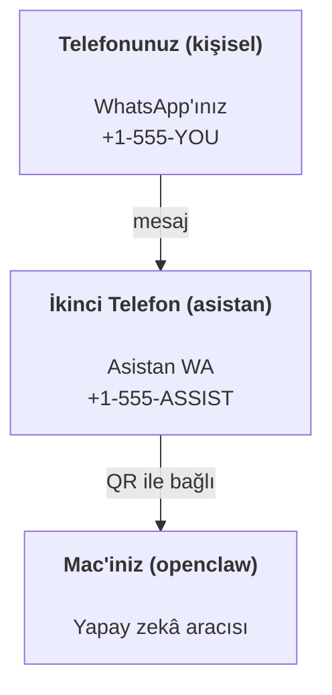

---
read_when:
    - Yeni bir asistan örneğini kullanıma hazırlama
    - Güvenlik/izin etkilerini inceleme
summary: OpenClaw'u güvenlik uyarılarıyla kişisel asistan olarak çalıştırmaya yönelik uçtan uca kılavuz
title: Kişisel asistan kurulumu
x-i18n:
    generated_at: "2026-07-27T00:18:59Z"
    model: gpt-5.6
    postprocess_version: locale-links-v1
    prompt_version: 32
    provider: openai
    source_hash: ed3e267971fc1ee5c9154194e5b1f98db8c7a7edca8182871a2057a778614217
    source_path: start/openclaw.md
    workflow: 16
---

OpenClaw; Discord, Google Chat, iMessage, Matrix, Microsoft Teams, Signal, Slack, Telegram, WhatsApp, Zalo ve daha fazlasını yapay zekâ aracılarına bağlayan, kendi sunucunuzda barındırılan bir Gateway'dir. Bu kılavuz, "kişisel asistan" kurulumunu kapsar: her zaman açık yapay zekâ asistanınız gibi davranan, özel bir WhatsApp numarası.

## Önce güvenlik

Bir aracıya kanal vermek; onu (araç politikanıza bağlı olarak) makinenizde komut çalıştırabilecek, çalışma alanınızdaki dosyaları okuyup yazabilecek ve bağlı herhangi bir kanal üzerinden dışarı mesaj gönderebilecek bir konuma getirir. Başlangıçta ihtiyatlı davranın:

- Her zaman `channels.whatsapp.allowFrom` ayarını yapın (kişisel Mac'inizde asla tüm dünyaya açık şekilde çalıştırmayın).
- Asistan için özel bir WhatsApp numarası kullanın.
- Heartbeat varsayılan olarak her 30 dakikada bir çalışır. Kuruluma güvenene kadar `agents.defaults.heartbeat.every: "0m"` ayarını yaparak devre dışı bırakın.

## Ön koşullar

- OpenClaw kurulmuş ve ilk katılım tamamlanmış olmalıdır; bunu henüz yapmadıysanız [Başlangıç](/tr/start/getting-started) sayfasına bakın
- Asistan için ikinci bir telefon numarası (SIM/eSIM/ön ödemeli)

## İki telefonlu kurulum (önerilen)

İstenen yapı şudur:



Kişisel WhatsApp hesabınızı OpenClaw'a bağlarsanız size gelen her mesaj "aracı girdisi" hâline gelir. Genellikle istenen bu değildir.

## 5 dakikalık hızlı başlangıç

1. WhatsApp Web'i eşleştirin (QR gösterilir; asistan telefonuyla tarayın):

```bash
openclaw channels login
```

2. Gateway'i başlatın (çalışır durumda bırakın):

```bash
openclaw gateway --port 18789
```

3. `~/.openclaw/openclaw.json` içine asgari bir yapılandırma koyun:

```json5
{
  gateway: { mode: "local" },
  channels: { whatsapp: { allowFrom: ["+15555550123"] } },
}
```

Şimdi izin listesindeki telefonunuzdan asistan numarasına mesaj gönderin.

İlk katılım tamamlandığında OpenClaw, kontrol panelini otomatik olarak açar ve temiz (token içermeyen) bir bağlantı yazdırır. Kontrol paneli kimlik doğrulaması isterse yapılandırılmış paylaşılan gizli anahtarı Control UI ayarlarına yapıştırın. İlk katılım varsayılan olarak token kullanır (`gateway.auth.token`), ancak `gateway.auth.mode` ayarını `password` olarak değiştirdiyseniz parolayla kimlik doğrulaması da çalışır. Daha sonra yeniden açmak için: `openclaw dashboard`.

## Aracıya bir çalışma alanı verin (AGENTS)

OpenClaw, çalışma talimatlarını ve "belleği" çalışma alanı dizininden okur.

OpenClaw varsayılan olarak aracı çalışma alanı olarak `~/.openclaw/workspace` kullanır ve ilk katılımda veya aracının ilk çalıştırılmasında bunu (başlangıç `AGENTS.md`, `SOUL.md`, `TOOLS.md`, `IDENTITY.md`, `USER.md` dosyalarıyla birlikte) otomatik olarak oluşturur. `BOOTSTRAP.md` yalnızca yepyeni bir çalışma alanında oluşturulur ve silindikten sonra yeniden gelmemelidir. `MEMORY.md` isteğe bağlıdır ve hiçbir zaman otomatik oluşturulmaz; mevcut olduğunda normal oturumlar için yüklenir. Alt aracı oturumları yalnızca `AGENTS.md` ve `TOOLS.md` ekler.

<Tip>
Bu klasörü OpenClaw'ın belleği gibi ele alın ve `AGENTS.md` ile bellek dosyalarınızın yedeklenmesi için onu bir git deposu (tercihen özel) yapın. Git kuruluysa yepyeni çalışma alanları `git init` ile otomatik olarak başlatılır.
</Tip>

Tam ilk katılım sihirbazını çalıştırmadan çalışma alanı ve yapılandırma klasörlerini oluşturmak için:

```bash
openclaw setup --baseline
```

(Yalın `openclaw setup`, `openclaw onboard` için bir diğer addır ve tam etkileşimli sihirbazı çalıştırır.)

Tam çalışma alanı düzeni ve yedekleme kılavuzu: [Aracı çalışma alanı](/tr/concepts/agent-workspace)
Bellek iş akışı: [Bellek](/tr/concepts/memory)

İsteğe bağlı: `agents.defaults.workspace` ile farklı bir çalışma alanı seçin (`~` desteklenir).

```json5
{
  agents: {
    defaults: {
      workspace: "~/.openclaw/workspace",
    },
  },
}
```

Kendi çalışma alanı dosyalarınızı zaten bir depodan sağlıyorsanız önyükleme dosyalarının oluşturulmasını tamamen devre dışı bırakabilirsiniz:

```json5
{
  agents: {
    defaults: {
      skipBootstrap: true,
    },
  },
}
```

## Onu "bir asistana" dönüştüren yapılandırma

OpenClaw varsayılan olarak iyi bir asistan kurulumuyla gelir, ancak genellikle şunları ayarlamak istersiniz:

- [`SOUL.md`](/tr/concepts/soul) içindeki persona/talimatlar
- düşünme varsayılanları (istenirse)
- Heartbeat'ler (güvenmeye başladıktan sonra)

Örnek:

```json5
{
  logging: { level: "info" },
  agents: {
    defaults: {
      model: { primary: "anthropic/claude-opus-5" },
      workspace: "~/.openclaw/workspace",
      thinkingDefault: "high",
      timeoutSeconds: 1800,
      // 0 ile başlayın; daha sonra etkinleştirin.
      heartbeat: { every: "0m" },
    },
    list: [
      {
        id: "main",
        default: true,
        groupChat: {
          mentionPatterns: ["@openclaw", "openclaw"],
        },
      },
    ],
  },
  channels: {
    whatsapp: {
      allowFrom: ["+15555550123"],
      groups: {
        "*": { requireMention: true },
      },
    },
  },
  session: {
    scope: "per-sender",
    resetTriggers: ["/new", "/reset"],
    reset: {
      mode: "daily",
      atHour: 4,
      idleMinutes: 10080,
    },
  },
}
```

## Oturumlar ve bellek

- Oturum satırları, transkript satırları ve meta veriler (token kullanımı, son rota vb.): `~/.openclaw/agents/<agentId>/agent/openclaw-agent.sqlite`
- Eski/arşiv transkript yapıtları: `~/.openclaw/agents/<agentId>/sessions/`
- Eski satır geçişi kaynağı: `~/.openclaw/agents/<agentId>/sessions/sessions.json`
- `/new` veya `/reset`, ilgili sohbet için yeni bir oturum başlatır (`session.resetTriggers` aracılığıyla yapılandırılabilir). Tek başına gönderilirse OpenClaw modeli çağırmadan sıfırlamayı onaylar.
- `/compact [instructions]`, oturum bağlamını sıkıştırır ve kalan bağlam bütçesini bildirir.

## Heartbeat'ler (proaktif mod)

OpenClaw varsayılan olarak aşağıdaki istemle her 30 dakikada bir Heartbeat çalıştırır:
`Follow the heartbeat monitor scratch context when provided. Recurring tasks are cron jobs; create or change their schedules with cron tools or the openclaw cron CLI, not heartbeat scratch. Do not infer or repeat old tasks from prior chats. If nothing needs attention, reply HEARTBEAT_OK.`
Devre dışı bırakmak için `agents.defaults.heartbeat.every: "0m"` olarak ayarlayın. Heartbeat kontrol listeleri, izleyicinin Cron geçici alanında bulunur (bkz. [Heartbeat](/tr/gateway/heartbeat)); `openclaw doctor --fix`, eski çalışma alanı `HEARTBEAT.md` dosyasını buraya taşır.

- İzleyicinin geçici alanı mevcut ancak işlevsel olarak boşsa (yalnızca boş satırlar, Markdown/HTML yorumları, `# Heading` gibi Markdown başlıkları, çit işaretleri veya boş kontrol listesi taslakları varsa), OpenClaw API çağrılarından tasarruf etmek için Heartbeat çalıştırmasını atlar.
- Geçici alan yoksa Heartbeat yine çalışır ve model ne yapılacağına karar verir.
- Aracı `HEARTBEAT_OK` ile yanıt verirse (isteğe bağlı olarak kısa dolgu metniyle; bkz. `agents.defaults.heartbeat.ackMaxChars`), OpenClaw bu Heartbeat için dışarıya teslimatı engeller.
- Varsayılan olarak DM tarzı `user:<id>` hedeflerine Heartbeat teslimatına izin verilir. Heartbeat çalıştırmalarını etkin tutarken doğrudan hedefe teslimatı engellemek için `agents.defaults.heartbeat.directPolicy: "block"` olarak ayarlayın.
- Heartbeat'ler tam aracı turları çalıştırır; daha kısa aralıklar daha fazla token tüketir.

```json5
{
  agents: {
    defaults: {
      heartbeat: { every: "30m" },
    },
  },
}
```

## Gelen ve giden medya

Gelen ekler (görseller/ses/belgeler) şablonlar aracılığıyla komutunuza sunulabilir:

- `{{AttachmentPath}}` (yerel geçici dosya yolu)
- `{{AttachmentUrl}}` (özgün URL veya sağlayıcı referansı)
- `{{AttachmentContentType}}` (MIME içerik türü)
- `{{AttachmentDir}}` (yerel yolu içeren dizin)
- `{{AttachmentIndex}}` (sıfır tabanlı kaynak olgusu dizini)
- `{{Transcript}}` (ses transkripsiyonu etkinse)

Eski `{{MediaPath}}`, `{{MediaUrl}}`, `{{MediaType}}` ve `{{MediaDir}}`
adları, kullanımdan kaldırılmış uyumluluk diğer adları olarak kullanılmaya devam eder.

Aracıdan giden ekler; mesaj aracındaki veya yanıt yükündeki `media`, `mediaUrl`, `mediaUrls`, `path` ya da `filePath` gibi yapılandırılmış medya alanlarını kullanır. Örnek mesaj aracı bağımsız değişkenleri:

```json
{
  "message": "Ekran görüntüsü burada.",
  "mediaUrl": "https://example.com/screenshot.png"
}
```

OpenClaw, yapılandırılmış medyayı metinle birlikte gönderir. Eski nihai asistan yanıtları uyumluluk amacıyla hâlâ normalleştirilebilir; ancak araç çıktısı, tarayıcı çıktısı, akış blokları ve mesaj eylemleri metni ek komutları olarak ayrıştırmaz.

Yerel yol davranışı, aracıyla aynı dosya okuma güven modelini izler:

- `tools.fs.workspaceOnly`, `true` ise giden yerel medya yolları OpenClaw geçici kökü, medya önbelleği, aracı çalışma alanı yolları ve korumalı alan tarafından oluşturulan dosyalarla sınırlı kalır.
- `tools.fs.workspaceOnly`, `false` ise giden yerel medya, aracının okumasına zaten izin verilen ana makineye yerel dosyaları kullanabilir.
- Yerel yollar mutlak, çalışma alanına göreli veya `~/` ile ev dizinine göreli olabilir.
- Ana makineye yerel gönderimler yine yalnızca medya ve güvenli belge türlerine (görseller, ses, video, PDF, Office belgeleri ve Markdown/MD, TXT, JSON, YAML ve YML gibi doğrulanmış metin belgeleri) izin verir. Bu, mevcut ana makine okuma güven sınırının genişletilmesidir; bir gizli bilgi tarayıcısı değildir: aracı ana makineye yerel bir `secret.txt` veya `config.json` dosyasını okuyabiliyorsa uzantı ve içerik doğrulaması eşleştiğinde bu dosyayı ekleyebilir.

Hassas dosyaları aracının okuyabildiği dosya sisteminin dışında tutun veya daha sıkı yerel yol gönderimleri için `tools.fs.workspaceOnly: true` ayarını koruyun.

## İşletim kontrol listesi

```bash
openclaw status          # yerel durum (kimlik bilgileri, oturumlar, kuyruğa alınmış olaylar)
openclaw status --all    # tam tanılama (salt okunur, yapıştırılabilir)
openclaw status --deep   # kanalları yokla (WhatsApp Web + Telegram + Discord + Slack + Signal)
openclaw health --json   # WS bağlantısı üzerinden gateway sistem durumu anlık görüntüsü
```

Günlükler `/tmp/openclaw/` altında bulunur: varsayılan
profil için `openclaw-YYYY-MM-DD.log`, adlandırılmış profiller için `openclaw-<profile>-YYYY-MM-DD.log`.

## Sonraki adımlar

- WebChat: [WebChat](/tr/web/webchat)
- Gateway işlemleri: [Gateway çalışma kılavuzu](/tr/gateway)
- Cron + uyandırmalar: [Cron işleri](/tr/automation/cron-jobs)
- macOS menü çubuğu yardımcı uygulaması: [OpenClaw macOS uygulaması](/tr/platforms/macos)
- iOS Node uygulaması: [iOS uygulaması](/tr/platforms/ios)
- Android Node uygulaması: [Android uygulaması](/tr/platforms/android)
- Windows Merkezi: [Windows](/tr/platforms/windows)
- Linux durumu: [Linux uygulaması](/tr/platforms/linux)
- Güvenlik: [Güvenlik](/tr/gateway/security)

## İlgili

- [Başlangıç](/tr/start/getting-started)
- [Kurulum](/tr/start/setup)
- [Kanallara genel bakış](/tr/channels)
