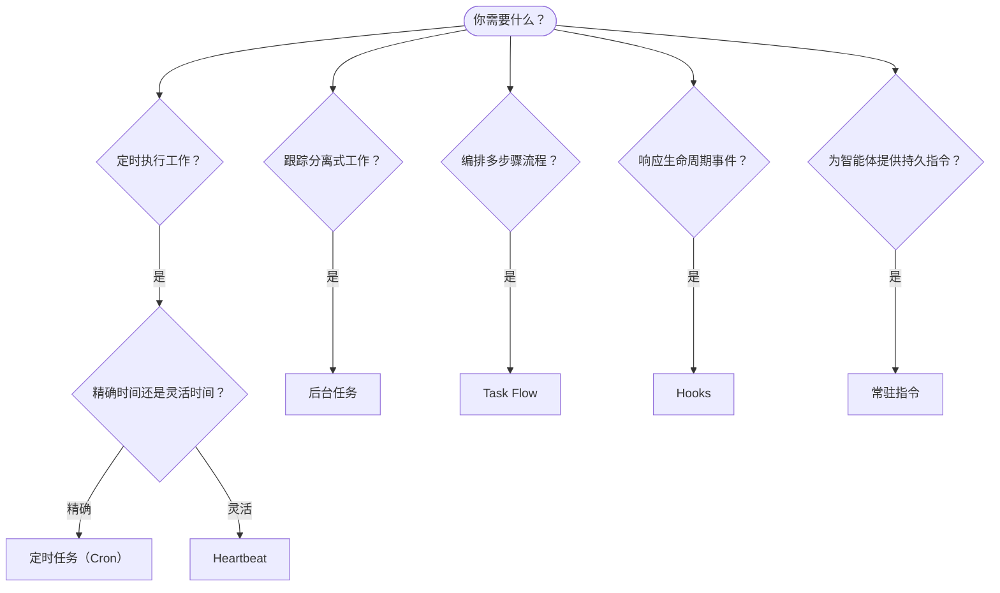

OpenClaw 通过任务、定时作业、事件钩子和常驻指令在后台运行工作。使用本页选择合适的机制。

## 快速决策指南

| 使用场景                                | 推荐机制            | 原因                                              |
| --------------------------------------- | ---------------------- | ------------------------------------------------ |
| 每天上午 9 点准时发送报告         | 定时任务（Cron） | 精确时间、隔离执行                 |
| 20 分钟后提醒我                 | 定时任务（Cron） | 精确时间的一次性任务（`--at`）            |
| 每周运行深度分析                | 定时任务（Cron） | 独立任务，可以使用不同的模型         |
| 每 30 分钟检查收件箱                | Heartbeat              | 与其他检查批量执行，并可感知上下文         |
| 监控日历中的即将到来的事件    | Heartbeat              | 自然适合周期性感知               |
| 检查子智能体或 ACP 运行的状态 | 后台任务       | 任务账本会跟踪所有分离式工作            |
| 审计运行了什么以及运行时间                 | 后台任务       | `openclaw tasks list` 和 `openclaw tasks audit` |
| 先进行多步骤研究，然后总结      | Task Flow              | 提供修订跟踪的持久编排     |
| 会话重置时运行脚本           | Hooks                  | 事件驱动，在生命周期事件发生时触发          |
| 每次调用工具时执行代码         | 插件钩子           | 进程内钩子可以拦截工具调用        |
| 回复前始终检查合规性 | 常驻指令        | 自动注入每个会话        |

### 定时任务（Cron）与 Heartbeat

| 维度       | 定时任务（Cron）              | Heartbeat                             |
| --------------- | ----------------------------------- | ------------------------------------- |
| 时间          | 精确（cron 表达式、一次性任务）  | 近似（默认每 30 分钟）    |
| 会话上下文 | 全新（隔离）或共享          | 完整的主会话上下文             |
| 任务记录    | 始终创建                      | 从不创建                         |
| 交付        | 渠道、webhook 或静默         | 内联到主会话中                |
| 最适合        | 报告、提醒、后台作业 | 收件箱检查、日历、通知 |

需要精确时间或隔离执行时，请使用定时任务（Cron）。如果工作能受益于完整的会话上下文，并且近似时间即可满足需求，请使用 Heartbeat。

## 核心概念

### 定时任务（cron）

Cron 是 Gateway 网关内置的精确定时调度器。它会持久保存作业，在适当的时间唤醒智能体，并可将输出交付到聊天渠道或 webhook 端点。支持一次性提醒、循环表达式和入站 webhook 触发器。

请参阅[定时任务](/zh-CN/automation/cron-jobs)。

### 任务

后台任务账本会跟踪所有分离式工作：ACP 运行、子智能体生成、隔离的 cron 执行和 CLI 操作。任务是记录，而不是调度器。使用 `openclaw tasks list` 和 `openclaw tasks audit` 检查这些任务。

请参阅[后台任务](/zh-CN/automation/tasks)。

### Task Flow

Task Flow 是构建在后台任务之上的流程编排基础层。它通过托管和镜像同步模式、修订跟踪以及用于检查的 `openclaw tasks flow list|show|cancel`，管理持久的多步骤流程。

请参阅 [Task Flow](/zh-CN/automation/taskflow)。

### 常驻指令

常驻指令授予智能体针对已定义程序的永久操作权限。它们存放在工作区文件中（通常为 `AGENTS.md`），并注入每个会话。可与 cron 结合使用，以实现基于时间的强制执行。

请参阅[常驻指令](/zh-CN/automation/standing-orders)。

### Hooks

内部钩子是由智能体生命周期事件
（`/new`、`/reset`、`/stop`）、会话压缩、Gateway 网关启动和消息
流触发的事件驱动脚本。系统会从钩子目录中发现它们，并使用
`openclaw hooks` 进行管理。若要在进程内拦截工具调用，请使用
[插件钩子](/zh-CN/plugins/hooks)。

请参阅 [Hooks](/zh-CN/automation/hooks)。

### Heartbeat

Heartbeat 是周期性的主会话轮次（默认每 30 分钟一次）。它会在一个具有完整会话上下文的智能体轮次中，批量执行清单式监控（收件箱、日历、通知）。Heartbeat 轮次不会创建任务记录，也不会延长每日/空闲会话重置的新鲜度。Heartbeat 暂存区只是少量提示词上下文；请将周期性工作安排为定时任务。空的 Heartbeat 暂存区会以 `empty-heartbeat-file` 跳过。当 cron 工作正在运行或排队时，Heartbeat 会推迟执行；当同一智能体的会话键控子智能体或嵌套通道繁忙时，`heartbeat.skipWhenBusy` 也可以推迟该智能体。

请参阅 [Heartbeat](/zh-CN/gateway/heartbeat)。

## 它们如何协同工作

- **Cron** 处理精确日程（每日报告、每周审查）和一次性提醒。所有 cron 执行都会创建任务记录。
- **Heartbeat** 每 30 分钟处理一次批量监控清单；需要独立执行周期的检查由 cron 负责。
- **Hooks** 使用自定义脚本响应特定事件（会话重置、压缩、消息流）。插件钩子负责工具调用。
- **常驻指令** 为智能体提供持久上下文和权限边界。
- **Task Flow** 在单个任务之上协调多步骤流程。
- **任务** 自动跟踪所有分离式工作，以便你检查和审计。

## 相关内容

- [定时任务](/zh-CN/automation/cron-jobs) — 精确定时和一次性提醒
- [后台任务](/zh-CN/automation/tasks) — 所有分离式工作的任务账本
- [Task Flow](/zh-CN/automation/taskflow) — 持久的多步骤流程编排
- [Hooks](/zh-CN/automation/hooks) — 事件驱动的生命周期脚本
- [插件钩子](/zh-CN/plugins/hooks) — 进程内工具、提示词、消息和生命周期钩子
- [常驻指令](/zh-CN/automation/standing-orders) — 持久的智能体指令
- [Heartbeat](/zh-CN/gateway/heartbeat) — 周期性主会话轮次
- [配置参考](/zh-CN/gateway/configuration-reference) — 所有配置键
