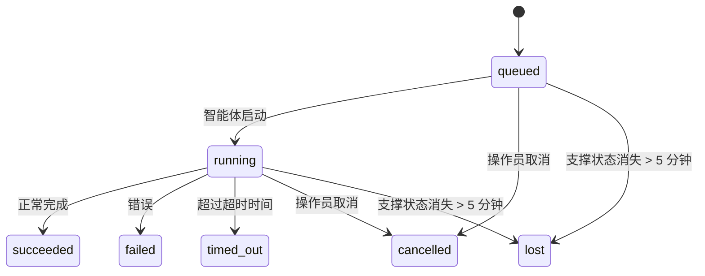

---
read_when:
    - 检查正在进行或最近完成的后台工作
    - 调试分离式智能体运行的消息投递失败
    - 了解后台运行与会话、定时任务和 Heartbeat 的关系
sidebarTitle: Background tasks
summary: ACP 运行、子智能体、定时任务执行和 CLI 操作的后台任务跟踪
title: 后台任务
x-i18n:
    generated_at: "2026-07-26T05:38:45Z"
    model: gpt-5.6
    postprocess_version: locale-links-v1
    prompt_version: 32
    provider: openai
    source_hash: dbdc5ced133764fec0c8b9ae7b1957e24272dc9c1c86099de81f6923955d6b5a
    source_path: automation/tasks.md
    workflow: 16
---

<Note>
在寻找调度功能？请参阅[自动化](/zh-CN/automation)以选择合适的机制。本页面是后台工作的活动账本，而不是调度器。
</Note>

后台任务跟踪在**主对话会话之外**运行的工作：ACP 运行、子智能体生成、定时任务执行以及由 CLI 发起的操作。

任务**不会**取代会话、定时任务或 Heartbeat——它们是记录已发生哪些分离式工作、发生时间及其是否成功的**活动账本**。

<Note>
并非每次智能体运行都会创建任务。Heartbeat 轮次和普通交互式聊天不会。所有定时任务执行、ACP 生成、子智能体生成、由 Gateway 网关分派的 CLI 智能体命令，以及智能体启动的后台 `exec` 命令都会创建任务。
</Note>

## 简而言之

- 任务是**记录**，而不是调度器——定时任务和 Heartbeat 决定工作在_何时_运行，任务跟踪_发生了什么_。
- ACP、子智能体、所有定时任务和 CLI 操作都会创建任务。Heartbeat 轮次不会。
- 每个任务都会经历 `queued → running → terminal`（成功、失败、超时、已取消或丢失）。
- 只要定时任务运行时仍拥有该作业，定时任务就会保持活动状态；如果内存中的运行时状态已消失，任务维护会先检查持久化的定时任务运行历史，然后再将任务标记为丢失。
- 完成通知由推送驱动：分离式工作完成时可以直接通知，也可以唤醒请求方会话或 Heartbeat，因此状态轮询循环通常不是正确的实现方式。
- 隔离的定时任务运行和子智能体完成后，会尽力为其子会话清理受跟踪的浏览器标签页和进程，然后再执行最终清理记录工作。
- 当后代子智能体工作仍在收尾时，隔离的定时任务交付会抑制过时的父级中间回复；如果最终后代输出在交付前到达，则优先使用该输出。
- 完成通知会直接发送到渠道，或排队等待下一次 Heartbeat。
- `openclaw tasks list` 显示所有任务；`openclaw tasks audit` 会显示问题。
- 终止状态记录保留 7 天（`lost` 记录保留 24 小时），之后自动清理。

## 快速开始

<Tabs>
  <Tab title="列出和筛选">
    ```bash
    # 列出所有任务（最新的在前）
    openclaw tasks list

    # 按运行时或状态筛选
    openclaw tasks list --runtime acp
    openclaw tasks list --status running
    ```

  </Tab>
  <Tab title="检查">
    ```bash
    # 显示特定任务的详细信息（按任务 ID、运行 ID 或会话键）
    openclaw tasks show <lookup>
    ```
  </Tab>
  <Tab title="取消和通知">
    ```bash
    # 取消正在运行的任务（终止子会话）
    openclaw tasks cancel <lookup>

    # 更改任务的通知策略
    openclaw tasks notify <lookup> state_changes
    ```

  </Tab>
  <Tab title="审计和维护">
    ```bash
    # 运行健康审计
    openclaw tasks audit

    # 预览或应用维护操作
    openclaw tasks maintenance
    openclaw tasks maintenance --apply
    ```

  </Tab>
  <Tab title="任务流">
    ```bash
    # 检查 TaskFlow 状态
    openclaw tasks flow list
    openclaw tasks flow show <lookup>
    openclaw tasks flow cancel <lookup>
    ```
  </Tab>
</Tabs>

## 哪些操作会创建任务

| 来源                   | 运行时类型 | 创建任务记录的时机                                                       | 默认通知策略 |
| ---------------------- | ---------- | ------------------------------------------------------------------------ | ------------ |
| ACP 后台运行           | `acp`        | 生成子 ACP 会话                                                          | `done_only`           |
| 子智能体编排           | `subagent`   | 通过 `sessions_spawn` 生成子智能体                                       | `done_only`           |
| 定时任务（所有类型）   | `cron`       | 每次定时任务执行（主会话和隔离会话）                                     | `silent`              |
| CLI 操作               | `cli`        | 通过 Gateway 网关运行的 `openclaw agent` 命令                            | `silent`              |
| 智能体媒体作业         | `cli`        | 基于会话的 `image_generate`/`music_generate`/`video_generate` 运行 | `silent`              |

<AccordionGroup>
  <Accordion title="定时任务和媒体的默认通知设置">
    定时任务（主会话和隔离会话）使用 `silent` 通知策略——它们会创建记录以供跟踪，但不会自行生成任务通知；定时任务拥有自己的交付路径。

    基于会话的 `image_generate`、`music_generate` 和 `video_generate` 运行也使用 `silent` 通知策略。它们仍会创建任务记录，但完成结果会作为内部唤醒信号交回原始智能体会话，以便智能体自行编写后续消息并附上已生成的媒体。请求方智能体遵循其常规的可见回复约定：配置后自动发送最终回复；如果会话要求使用消息工具回复，则使用 `message(action="send")` 和 `NO_REPLY`。如果请求方会话已不再活动或其主动唤醒失败，并且完成处理智能体遗漏了部分或全部生成的媒体，OpenClaw 会向原始渠道目标发送仅包含缺失媒体的幂等直接回退消息。

  </Accordion>
  <Accordion title="并发媒体生成防护机制">
    当基于会话的媒体生成任务仍处于活动状态时，`image_generate`、`music_generate` 和 `video_generate` 会防止意外重试：针对相同提示词或请求重复调用时，将返回匹配的活动任务状态，而不会启动重复任务；不同的提示词则可以启动自己的任务。需要从智能体侧显式查询进度或状态时，请使用 `action: "status"`。
  </Accordion>
  <Accordion title="哪些操作不会创建任务">
    - Heartbeat 轮次——主会话；请参阅 [Heartbeat](/zh-CN/gateway/heartbeat)
    - 普通交互式聊天轮次
    - 直接 `/command` 响应

  </Accordion>
</AccordionGroup>

## 任务生命周期



| 状态        | 含义                                                                        |
| ----------- | --------------------------------------------------------------------------- |
| `queued`    | 已创建，等待智能体启动                                                      |
| `running`   | 智能体轮次正在执行                                                          |
| `succeeded` | 已成功完成                                                                  |
| `failed`    | 因错误而完成                                                                |
| `timed_out` | 超过配置的超时时间                                                          |
| `cancelled` | 操作员通过 `openclaw tasks cancel` 停止，或运行已中止 |
| `lost`      | 经过 5 分钟宽限期后，运行时丢失了权威支撑状态                              |

状态会自动转换——智能体运行生命周期事件（启动、结束、错误）会更新任务状态；无需手动管理。

对于活动任务记录，智能体运行完成结果具有权威性。成功的分离式运行最终确定为 `succeeded`，普通运行错误最终确定为 `failed`，超时最终确定为 `timed_out`，取消或中止结果最终确定为 `cancelled`。任务一旦进入终止状态，后续生命周期信号不会将其降级——由操作员取消或已经处于 `failed`/`timed_out`/`lost` 状态的任务会保持原状，即使之后收到成功信号也是如此。

`lost` 会感知运行时：

- ACP 任务：只有 Gateway 网关中处于活动状态的进程内 ACP 轮次才能证明运行仍然存活；仅有持久化的会话元数据无法证明。离线 CLI 审计采取保守策略，绝不会回收 ACP 任务。
- 子智能体任务：支撑它的子会话已从目标智能体存储中消失（或带有重启恢复墓碑）。
- 定时任务：定时任务运行时不再将该作业作为活动作业跟踪，并且持久化的定时任务运行历史中没有该次运行的终止结果。离线 CLI 审计不会将其自身为空的进程内定时任务运行时状态视为权威依据。
- CLI 任务：具有运行 ID 或来源 ID 的任务使用实时运行上下文，因此在 Gateway 网关拥有的运行消失后，残留的子会话或聊天会话行不会使其继续保持活动状态。没有运行标识的旧版 CLI 任务仍会回退到子会话。由 Gateway 网关支持的 `openclaw agent` 运行也会根据其运行结果最终确定状态，因此已完成的运行不会一直保持活动状态，直到清理器将其标记为 `lost`。

## 交付和通知

当任务进入终止状态时，OpenClaw 会通知你。有两种交付路径：

**直接交付**——如果任务具有渠道目标（即 `requesterOrigin`），完成消息会直接发送到该渠道（Discord、Slack、Telegram 等）。群组和频道任务的完成消息则会通过请求方会话路由，以便父智能体编写可见回复。对于子智能体完成消息，OpenClaw 还会在可用时保留已绑定的线程或主题路由，并且在放弃直接交付前，可以使用请求方会话中存储的路由（`lastChannel` / `lastTo` / `lastAccountId`）补全缺失的 `to` 或账号。

**会话排队交付**——如果直接交付失败或未设置来源，更新会作为系统事件排入请求方会话，并在下一次 Heartbeat 时显示。

<Tip>
在会话中排队的任务完成消息会立即触发 Heartbeat 唤醒，因此你可以快速看到结果——无需等待下一次计划的 Heartbeat 时点。
</Tip>

这意味着常规工作流以推送为基础：只需启动一次分离式工作，然后让运行时在完成后唤醒或通知你。仅在需要调试、干预或显式审计时轮询任务状态。

### 通知策略

控制每个任务向你报告多少信息：

| 策略                  | 交付内容                                                |
| --------------------- | ------------------------------------------------------- |
| `done_only`（默认） | 仅终止状态（成功、失败等）                              |
| `state_changes`       | 每次状态转换和进度更新                                  |
| `silent`              | 完全不交付（定时任务、CLI 和媒体任务的默认设置）        |

在任务运行期间更改策略：

```bash
openclaw tasks notify <lookup> state_changes
```

## CLI 参考

<AccordionGroup>
  <Accordion title="tasks list">
    ```bash
    openclaw tasks list [--runtime <acp|subagent|cron|cli>] [--status <status>] [--json]
    ```

    输出列：任务、类型、状态、交付、运行、子会话、摘要。不带参数的 `openclaw tasks` 与 `openclaw tasks list` 行为相同。

  </Accordion>
  <Accordion title="tasks show">
    ```bash
    openclaw tasks show <lookup> [--json]
    ```

    查询令牌接受任务 ID、运行 ID 或会话键。显示完整记录，包括时间信息、交付状态、错误和终止摘要。

  </Accordion>
  <Accordion title="tasks cancel">
    ```bash
    openclaw tasks cancel <lookup>
    ```

    对于 ACP 和子智能体任务，这会终止子会话；ACP 和定时任务取消会经由正在运行的 Gateway 网关（`tasks.cancel`）处理。对于由 CLI 跟踪的任务，取消操作会记录在任务注册表中（不存在单独的子运行时句柄）。状态将转换为 `cancelled`，并在适用时发送交付通知。

  </Accordion>
  <Accordion title="任务通知">
    ```bash
    openclaw tasks notify <lookup> <done_only|state_changes|silent>
    ```
  </Accordion>
  <Accordion title="任务审计">
    ```bash
    openclaw tasks audit [--severity <warn|error>] [--code <name>] [--limit <n>] [--json]
    ```

    在一份报告中呈现任务**和** TaskFlow 的运行问题。检测到问题时，发现结果也会显示在 `openclaw status` 中。

    任务发现结果：

    | 发现结果                   | 严重程度   | 触发条件                                                                                                      |
    | ------------------------- | ---------- | ------------------------------------------------------------------------------------------------------------ |
    | `stale_queued`            | 警告       | 排队超过 10 分钟                                                                              |
    | `stale_running`           | 错误      | 运行超过 30 分钟                                                                             |
    | `lost`                    | 警告/错误 | 由运行时支持的任务所有权已消失；保留的丢失任务在 `cleanupAfter` 之前为警告，之后变为错误 |
    | `delivery_failed`         | 警告       | 交付失败且通知策略不是 `silent`                                                            |
    | `missing_cleanup`         | 警告       | 终止任务没有清理时间戳                                                                      |
    | `inconsistent_timestamps` | 警告       | 时间线违规（例如结束时间早于开始时间）                                                        |

    TaskFlow 发现结果：

    | 发现结果                | 严重程度   | 触发条件                                                                    |
    | ---------------------- | ---------- | --------------------------------------------------------------------------- |
    | `restore_failed`       | 错误      | 从 SQLite 恢复流程注册表失败                                    |
    | `stale_running`        | 错误      | 正在运行的流程超过 30 分钟没有进展                      |
    | `stale_waiting`        | 警告       | 等待中的流程超过 30 分钟没有进展                      |
    | `stale_blocked`        | 警告       | 已阻塞的流程超过 30 分钟没有进展                      |
    | `cancel_stuck`         | 警告       | 已在 5 分钟前请求取消，没有活动的子任务，但仍未终止 |
    | `missing_linked_tasks` | 警告/错误 | 过期的托管流程没有关联任务或等待状态                       |
    | `blocked_task_missing` | 警告       | 已阻塞的流程指向不再存在的任务 ID                      |

  </Accordion>
  <Accordion title="任务维护">
    ```bash
    openclaw tasks maintenance [--json]
    openclaw tasks maintenance --apply [--json]
    ```

    使用此命令预览或应用任务、TaskFlow 状态以及过期定时任务运行会话注册表行的协调、清理标记和剪枝。

    协调会感知运行时：

    - ACP 任务要求 Gateway 网关中存在活动的进程内轮次；子智能体任务会检查其后端子会话。
    - 如果子智能体任务的子会话带有重启恢复墓碑，则会将其标记为丢失，而不是视为可恢复的后端会话。
    - 定时任务会检查定时任务运行时是否仍拥有该作业，然后从持久化的定时任务运行日志/作业状态中恢复终止状态，之后才回退到 `lost`。只有 Gateway 网关进程对内存中的定时任务活动作业集合具有权威性；离线 CLI 审计会使用持久化历史记录，但不会仅仅因为该本地集合为空就将定时任务标记为丢失。
    - 具有运行标识的 CLI 任务会检查所属的活动运行上下文，而不只是子会话或聊天会话行。

    完成清理也会感知运行时：

    - 子智能体完成时，会尽力关闭为子会话跟踪的浏览器标签页/进程，然后再继续进行通知清理。
    - 隔离的定时任务完成时，会尽力关闭为定时任务会话跟踪的浏览器标签页/进程，然后再完全结束此次运行。
    - 隔离的定时任务交付会在需要时等待后代子智能体完成后续工作，并抑制过期的父级确认文本，而不是将其通知出去。
    - 子智能体完成交付仅使用子会话中最新的可见智能体文本。工具/toolResult 输出不会提升为子会话结果文本。终止的失败运行会通知失败状态，而不会重放捕获的回复文本。
    - 清理失败不会掩盖真实的任务结果。

    应用维护时，OpenClaw 还会删除早于 7 天的过期 `cron:<jobId>:run:<runId>` 会话注册表行，同时保留当前正在运行的定时任务对应行，并且不改动非定时任务会话行。

  </Accordion>
  <Accordion title="任务流程列表 | 显示 | 取消">
    ```bash
    openclaw tasks flow list [--status <status>] [--json]
    openclaw tasks flow show <lookup> [--json]
    openclaw tasks flow cancel <lookup>
    ```

    流程查找令牌接受流程 ID 或所有者键。如果你关注的是编排用的 [Task Flow](/zh-CN/automation/taskflow)，而不是某一条后台任务记录，请使用这些命令。

  </Accordion>
</AccordionGroup>

## 聊天任务看板（`/tasks`）

在任意聊天会话中使用 `/tasks`，即可查看与该会话关联的后台任务。看板最多显示五个活动任务和最近完成的任务，并提供运行时、状态、时间及进度或错误详情。

当当前会话没有可见的关联任务时，`/tasks` 会回退到 Agent 本地任务计数，让你仍能获得概览，同时不会泄露其他会话的详情。

如需完整的操作员账本，请使用 CLI：`openclaw tasks list`。

### Control UI

Web Control UI 的侧边栏中有一个**任务**页面，其中显示实时的活动任务和近期后台任务。你可以用它检查进度、打开关联会话、刷新账本，或取消排队中和运行中的任务。

聊天窗格还有一个可折叠的**后台任务**栏，其范围限定为该窗格的 Agent：其中包含带停止控件的运行中任务和子智能体、已完成部分，以及用于进入各任务子会话的“查看转录”链接。可通过窗格标题栏中的活动切换按钮打开它（在单窗格聊天中，也可通过浮动活动按钮打开）。

在该栏中选择任务，即可检查其限定范围的输入提示词以及最新输出或错误摘要。运行中的工作与已完成的工作分开显示，已完成行会指明任务是成功完成还是失败。在 iOS 上，打开 **Chat actions → Background Tasks**；在 Android 上，打开 Chat 溢出菜单并选择 **Background tasks**。两个移动端视图均使用相同的 Running 和 Finished 分组，并在选择任务时打开任务详情。

## 状态集成（任务压力）

`openclaw status` 包含一行一目了然的任务信息：

```
任务    2 个活动 · 1 个排队中 · 1 个运行中 · 1 个问题 · 审计无异常 · 共跟踪 6 个
```

摘要会统计活动工作（`queued` + `running`）、失败（`failed` + `timed_out` + `lost`）、审计发现结果和跟踪记录总数；JSON 载荷还会按运行时细分计数（`acp`、`subagent`、`cron`、`cli`）。

`/status` 和 `session_status` 工具都使用可感知清理状态的任务快照：优先显示活动任务，隐藏已过期的行，终止任务仅在近期短窗口内（5 分钟）显示；没有活动工作时，则重点显示失败任务。这使状态卡片始终聚焦于当前最重要的信息。

## 存储与维护

### 任务的存储位置

任务记录和交付状态持久化在共享的 OpenClaw SQLite 状态数据库中：

```
~/.openclaw/state/openclaw.sqlite   (表：task_runs、task_delivery_state、flow_runs)
```

设置 `OPENCLAW_STATE_DIR` 可将整个状态根目录（默认为 `~/.openclaw`）移动到其他位置；共享数据库路径也会随之移动。

注册表在首次使用时加载到内存中，并将每次写入持久化回 SQLite，因此记录在 Gateway 网关重启后仍会保留。通过 SQLite 的默认自动检查点阈值以及定期的 `PASSIVE` 检查点，将 WAL 增长控制在有限范围内；关闭和显式维护检查点使用 `TRUNCATE`，因此正常关闭可以回收 WAL 空间，而无需让后台清理程序等待活动读取者。

旧版安装中的遗留边车存储（`tasks/runs.sqlite`、`flows/registry.sqlite`）由 `openclaw doctor` 导入共享数据库。

### 自动维护

清理程序每 **60 秒**运行一次（Gateway 网关启动约 5 秒后进行首次处理），并处理以下四项工作：

<Steps>
  <Step title="协调">
    检查活动任务是否仍有权威的运行时后端。ACP 任务要求存在活动的进程内轮次，子智能体任务使用子会话状态，定时任务使用活动作业所有权和持久化运行历史，具有运行标识的 CLI 任务则使用所属的运行上下文。如果后端状态消失超过 5 分钟（没有子会话的原生子智能体任务为 30 分钟），任务将标记为 `lost`。
  </Step>
  <Step title="ACP 会话修复">
    关闭已终止或孤立且由父级拥有的一次性 ACP 会话；对于过期且已终止或孤立的持久 ACP 会话，仅在不存在活动的对话绑定时将其关闭。
  </Step>
  <Step title="清理标记">
    为终止任务设置 `cleanupAfter` 时间戳（终止时间 + 保留窗口）。在保留期内，丢失的任务仍会在审计中显示为警告；`cleanupAfter` 过期后，或者清理元数据缺失时，它们将变为错误。
  </Step>
  <Step title="剪枝">
    删除超过其 `cleanupAfter` 日期的记录。
  </Step>
</Steps>

<Note>
**保留期：**终止任务记录保留 **7 天**（`lost` 记录保留 **24 小时**），之后自动剪枝。无需配置。
</Note>

## 任务与其他系统的关系

<AccordionGroup>
  <Accordion title="任务与 Task Flow">
    [Task Flow](/zh-CN/automation/taskflow) 是位于后台任务之上的流程编排层。单个流程可在其生命周期中使用托管或镜像同步模式协调多个任务。使用 `openclaw tasks` 检查单条任务记录，使用 `openclaw tasks flow` 检查编排流程。

  </Accordion>
  <Accordion title="任务与定时任务">
    定时任务定义、运行时执行状态和运行历史记录存储在 OpenClaw 的共享 SQLite 状态数据库中。**每次**定时任务执行都会创建一条任务记录——包括主会话和隔离会话——并采用 `silent` 通知策略，因此可以跟踪定时任务运行，而不会由其自身生成任务通知。

    请参阅[定时任务](/zh-CN/automation/cron-jobs)。

  </Accordion>
  <Accordion title="任务与 Heartbeat">
    Heartbeat 运行属于主会话轮次，不会创建任务记录。任务完成时，可以触发 Heartbeat 唤醒，以便你及时看到结果。

    请参阅 [Heartbeat](/zh-CN/gateway/heartbeat)。

  </Accordion>
  <Accordion title="任务和会话">
    任务可以引用 `childSessionKey`（工作运行的位置）和 `requesterSessionKey`（发起者）。其 `agentId` 标识执行工作的智能体，而请求者和所有者字段保留启动和控制上下文。会话是对话上下文；任务则在此基础上跟踪活动。
  </Accordion>
  <Accordion title="任务和智能体运行">
    任务的 `runId` 链接到执行该工作的智能体运行。智能体生命周期事件（开始、结束、错误）会自动更新任务状态——无需手动管理生命周期。
  </Accordion>
</AccordionGroup>

## 相关内容

- [自动化](/zh-CN/automation) - 一览所有自动化机制
- [CLI：任务](/zh-CN/cli/tasks) - CLI 命令参考
- [Heartbeat](/zh-CN/gateway/heartbeat) - 周期性的主会话轮次
- [定时任务](/zh-CN/automation/cron-jobs) - 调度后台工作
- [Task Flow](/zh-CN/automation/taskflow) - 任务之上的流程编排
