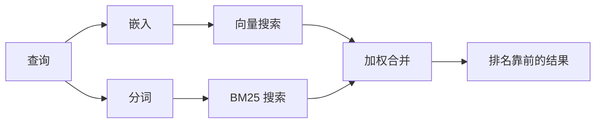

---
read_when:
    - 你想了解 `memory_search` 的工作原理
    - 你想选择一个嵌入提供商
    - 你想要优化搜索质量
summary: 记忆搜索如何使用嵌入和混合检索查找相关笔记
title: 记忆搜索
x-i18n:
    generated_at: "2026-07-26T06:40:14Z"
    model: gpt-5.6
    postprocess_version: locale-links-v1
    prompt_version: 32
    provider: openai
    source_hash: b2bd28b63ac55a2a890ed70a3015f76f1c7fbaa792b17a6ead51f4c8712fbd2d
    source_path: concepts/memory-search.md
    workflow: 16
---

`memory_search` 可从记忆文件中查找相关笔记，即使其措辞与原文不同。它会将记忆分割成小片段，并使用嵌入、关键词或两者结合进行搜索。

## 快速开始

OpenClaw 默认使用 OpenAI 嵌入。要使用其他提供商，请显式设置：

```json5
{
  memory: {
    search: {
      provider: "openai", // or "gemini", "voyage", "mistral", "bedrock", "local", "ollama", "lmstudio", "github-copilot", "openai-compatible"
    },
  },
}
```

`provider` 也可以引用自定义的 `models.providers.<id>` 条目（例如 `ollama-5080`），只要该条目将 `api` 设置为 `"ollama"`，或设置为其他具有记忆嵌入适配器的提供商 ID。

若要使用无需 API key 的本地嵌入，请安装官方 llama.cpp 提供商插件并设置 `provider: "local"`：

```bash
openclaw plugins install @openclaw/llama-cpp-provider
```

源码检出仍需批准原生构建：先执行 `pnpm approve-builds`，然后执行 `pnpm rebuild node-llama-cpp`。

某些 OpenAI 兼容的嵌入端点需要非对称的 `input_type` 标签，例如搜索使用 `"query"`，已索引片段使用 `"document"`/`"passage"`。通过 `queryInputType` 和 `documentInputType` 设置这些标签；请参阅[记忆配置参考](/zh-CN/reference/memory-config#provider-specific-config)。

## 支持的提供商

| 提供商            | ID                  | 需要 API key | 说明                              |
| ----------------- | ------------------- | ------------- | --------------------------------- |
| Bedrock           | `bedrock`           | 否            | 使用 AWS 凭证链                   |
| DeepInfra         | `deepinfra`         | 是           | 默认模型 `BAAI/bge-m3`       |
| Gemini            | `gemini`            | 是           | 支持图像/音频索引                 |
| GitHub Copilot    | `github-copilot`    | 否            | 使用你的 Copilot 订阅             |
| 本地              | `local`             | 否            | GGUF 模型，自动下载约 0.6 GB      |
| LM Studio         | `lmstudio`          | 否            | 本地/自托管服务器                 |
| Mistral           | `mistral`           | 是           |                                   |
| Ollama            | `ollama`            | 否            | 本地/自托管服务器                 |
| OpenAI            | `openai`            | 是           | 默认                              |
| OpenAI 兼容       | `openai-compatible` | 通常需要      | 通用 `/v1/embeddings` 端点      |
| Voyage            | `voyage`            | 是           |                                   |

## 搜索的工作原理

OpenClaw 会并行运行两条检索路径，并合并结果：



- **向量搜索**匹配相近的含义（“gateway host”可匹配“运行 OpenClaw 的机器”）。
- **BM25 关键词搜索**匹配精确术语（ID、错误字符串、配置键）。
- **文件名搜索**将路径与笔记正文分开索引。精确的完整路径、基本文件名和文件名主干的排名高于部分路径匹配，而摘要和正文关键词分数仍来自笔记内容。

如果只有一条路径可用，则仅运行该路径。

**仅 FTS 模式。** 设置 `provider: "none"` 可有意禁用嵌入，仅使用关键词搜索。如果未设置 `provider` 或将其设置为 `"auto"`，且未配置嵌入身份验证，也会回退到仅关键词排名而不会报错；`provider: "local"`（GGUF/llama.cpp 提供商）失败时同样如此。

**显式指定的提供商不可用。** 如果显式指定任何其他提供商（例如 `openai`、`ollama`、`gemini`），而它在请求时不可用（身份验证错误、网络故障），`memory_search` 会报告记忆不可用，而不是静默降级为仅 FTS 结果。这样可以显现已配置但发生故障的提供商。若要有意仅使用 FTS 进行召回，请设置 `provider: "none"`；或者修复提供商/身份验证配置以恢复语义排名。

## 提高搜索质量

两项可选功能有助于处理大量历史笔记。

### 时间衰减

旧笔记的排名权重会逐渐降低，使近期信息优先显示。采用默认的 30 天半衰期时，上个月的笔记得分为其原始权重的 50%。`MEMORY.md` 和 `memory/` 下其他未注明日期的文件属于长期有效内容，永不衰减；只有带日期的 `memory/YYYY-MM-DD.md` 文件会衰减。

<Tip>
如果你的智能体积累了数月的每日笔记，并且过时信息总是排在近期上下文之前，请启用此功能。
</Tip>

### MMR（多样性）

减少重复结果。如果五条笔记都提到相同的路由器配置，MMR 会确保排名靠前的结果涵盖不同主题，而不是重复相同内容。

<Tip>
如果 `memory_search` 总是从不同的每日笔记中返回近乎重复的摘要，请启用此功能。
</Tip>

### 同时启用两者

```json5
{
  memory: {
    search: {
      query: {
        hybrid: {
          mmr: { enabled: true },
          temporalDecay: { enabled: true },
        },
      },
    },
  },
}
```

## 多模态记忆

使用 `gemini-embedding-2-preview`，可以将图像和音频与 Markdown 一同编入索引。此功能仅适用于 `memory.search.extraPaths` 下的文件；默认记忆根目录（`MEMORY.md`、`memory/*.md`）仍仅支持 Markdown。搜索查询仍为文本，但可以匹配视觉和音频内容。设置方法请参阅[记忆配置参考](/zh-CN/reference/memory-config#multimodal-memory-gemini)。

## 会话记忆搜索

若要从会话转录中进行精确全文召回，请使用 [`sessions_search`](/zh-CN/concepts/session-search)，然后使用 `sessions_history` 打开结果。会话记忆搜索仍是语义化的实验性补充功能。

可以选择为会话转录建立索引，以便 `memory_search` 召回早期对话。此功能需要主动启用：设置 `experimental.sessionMemory: true`，并将 `"sessions"` 添加到 `sources`（`sources` 的默认值为 `["memory"]`）。

会话命中结果遵循 `tools.sessions.visibility`：默认的 `"tree"` 会公开当前会话、由其创建的会话，以及通过环境群组感知功能监视的同一智能体群组会话。使用 `session.dmScope: "main"` 时，多用户私信设置会共享该主会话，因此路由到该会话的用户可以召回其监视群组中的内容。使用按对端设置的 `dmScope` 来隔离私信，或将可见性设置为 `"self"`，以选择退出对环境监视会话的读取。其他无关的同一智能体会话仍需要 `"agent"` 可见性。

使用 QMD 后端时，还需设置 `memory.qmd.sessions.enabled: true`，以便将转录导出到 QMD 集合；仅设置 `experimental.sessionMemory` 和 `sources` 不会将转录导出到 QMD。请参阅[配置参考](/zh-CN/reference/memory-config#session-memory-search-experimental)。

## 故障排查

**没有结果？** 运行 `openclaw memory status` 检查索引。如果索引为空，请运行 `openclaw memory index --force`。

**只有关键词匹配？** 你的嵌入提供商可能尚未配置。请检查 `openclaw memory status --deep`。

**本地嵌入超时？** `ollama`、`lmstudio` 和 `local` 使用由提供商负责设置的更长批处理截止时间。请检查提供商健康状态，然后重新运行 `openclaw memory index --force`。

**找不到 CJK 文本？** 使用 `openclaw memory index --force` 重建 FTS 索引。

## 相关内容

- [记忆概览](/zh-CN/concepts/memory)
- [主动记忆](/zh-CN/concepts/active-memory)
- [内置记忆引擎](/zh-CN/concepts/memory-builtin)
- [记忆配置参考](/zh-CN/reference/memory-config)
