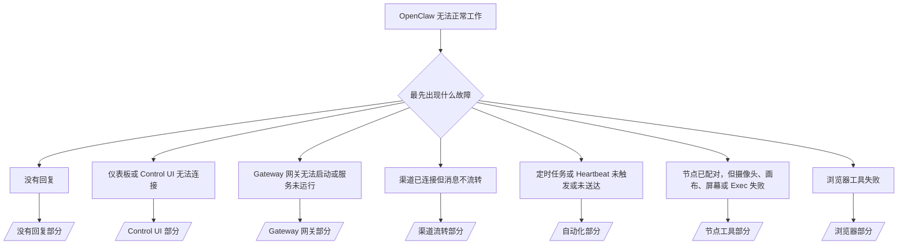

---
read_when:
    - OpenClaw 无法正常工作，你需要最快的修复方法
    - 你希望在深入查看详细运行手册之前，先进行问题分类排查。
summary: OpenClaw 症状优先故障排查中心
title: 常规故障排除
x-i18n:
    generated_at: "2026-07-26T06:48:32Z"
    model: gpt-5.6
    postprocess_version: locale-links-v1
    prompt_version: 32
    provider: openai
    source_hash: de3554ed680ac536d105017220b44d94456a4408916e949352500b046f4d5f17
    source_path: help/troubleshooting.md
    workflow: 16
---

分诊入口。用 2 分钟完成诊断，然后跳转到深入页面。

## 最初的六十秒

按顺序运行以下命令：

```bash
openclaw status
openclaw status --all
openclaw gateway probe
openclaw gateway status
openclaw doctor
openclaw channels status --probe
openclaw logs --follow
```

正常输出，每项一行：

- `openclaw status` 显示已配置的渠道，且没有身份验证错误。
- `openclaw status --all` 生成一份完整、可共享的报告。
- `openclaw gateway probe` 显示 `Reachable: yes`。`Capability: ...` 是探测所证实的
  身份验证级别；`Read probe: limited - missing scope:
operator.read` 表示诊断能力降级，而不是连接失败。
- `openclaw gateway status` 显示 `Runtime: running`、`Connectivity probe:
ok` 和一个合理的 `Capability: ...`。添加 `--require-rpc` 还可要求
  提供读取权限范围的 RPC 证明。
- `openclaw doctor` 报告没有阻塞性的配置或服务错误。
- `openclaw channels status --probe` 在 Gateway 网关可达时返回每个账号的实时传输状态
  （`works` / `audit ok`）；不可达时则回退到
  仅含配置的摘要。
- `openclaw logs --follow` 显示活动稳定，且没有重复出现的致命错误。

## 助手似乎能力受限或缺少工具

检查实际生效的工具配置档案：

```bash
openclaw status
openclaw status --all
openclaw doctor
```

常见原因：

- `tools.profile: "minimal"` 仅允许 `session_status`。
- `tools.profile: "messaging"` 范围较窄，适用于仅聊天的智能体。
- `tools.profile: "coding"` 是新建本地配置的默认值（仓库、文件、
  shell 和运行时工作）。
- `tools.profile: "full"` 会移除配置档案限制；仅用于由受信任
  操作员控制的智能体。
- 每个智能体的 `agents.entries.*.tools` 可为单个智能体缩小或扩大根配置档案的
  范围。

更改配置档案，重启或重新加载 Gateway 网关，然后使用
`openclaw status --all` 重新检查。完整配置档案/分组表：[工具配置档案](/zh-CN/gateway/config-tools#tool-profiles)。

## Anthropic 长上下文 429

`HTTP 429: rate_limit_error: Extra usage is required for long context requests`
→ [Anthropic 429：长上下文需要额外用量](/zh-CN/gateway/troubleshooting#anthropic-429-extra-usage-required-for-long-context)。

## 本地 OpenAI 兼容后端可直接使用，但在 OpenClaw 中失败

你的本地/自托管 `/v1` 后端能够响应直接的 `/v1/chat/completions`
探测，但在 `openclaw infer model run` 或普通智能体轮次中失败：

1. 错误提到 `messages[].content` 应为字符串：设置
   `models.providers.<provider>.models[].compat.requiresStringContent: true`。
2. 仍然仅在 OpenClaw 智能体轮次中失败：设置
   `models.providers.<provider>.models[].compat.supportsTools: false` 并重试。
3. 小型直接调用可以正常工作，但较大的 OpenClaw 提示词会导致后端崩溃：这
   是上游模型/服务器限制，而不是 OpenClaw 错误。请继续参阅
   [本地 OpenAI 兼容后端通过直接探测，但智能体运行失败](/zh-CN/gateway/troubleshooting#local-openai-compatible-backend-passes-direct-probes-but-agent-runs-fail)。

## 安装插件时因缺少 openclaw extensions 而失败

`package.json missing openclaw.extensions` 表示插件包使用了
OpenClaw 不再接受的结构。

在插件包中修复：

1. 将 `openclaw.extensions` 添加到 `package.json`，并指向构建后的运行时
   文件（通常为 `./dist/index.js`）。
2. 重新发布，然后再次运行 `openclaw plugins install <package>`。

```json
{
  "name": "@openclaw/my-plugin",
  "version": "1.2.3",
  "openclaw": {
    "extensions": ["./dist/index.js"]
  }
}
```

参考：[插件架构](/zh-CN/plugins/architecture)

## 安装策略阻止插件安装或更新

更新已完成，但插件仍然过时、被禁用，或显示 `blocked by install
policy`、`install policy failed closed` 或 `Disabled "<plugin>" after plugin
update failure`：检查 `security.installPolicy`。

安装策略会在插件安装和更新时运行。`@openclaw/*` 插件
版本通常会随 OpenClaw 版本一起变更，因此 OpenClaw 更新可能
需要在更新后同步期间执行匹配的插件更新。

除非你同时维护相应的升级规则，否则应避免使用以下策略形式：

- 将 OpenClaw 所有的插件冻结在某个确切的旧版本（例如，仅允许
  `@openclaw/*@2026.5.3`）。
- 仅根据来源类型进行阻止（所有 npm、网络或 `request.mode:
"update"` 请求）。
- 将策略命令视为可选：启用 `security.installPolicy` 时，
  如果策略可执行文件缺失、响应缓慢、不可读或因权限被阻止，
  系统将以关闭方式失败。
- 批准版本时，不根据插件候选项元数据检查请求中的 `openclawVersion`。

应优先采用允许与当前主机兼容的受信任 `@openclaw/*` 更新的规则，
而不是永久固定在某个版本。如果你默认阻止 npm，
请为所使用的插件 ID 添加范围严格的例外，并对 `request.mode: "update"` 应用与安装相同的
信任规则。

恢复：

```bash
openclaw doctor --deep
openclaw plugins update --all
openclaw status --all
```

如果策略有意设置得很严格，请在受信任的升级
窗口期间放宽策略，重新运行 `openclaw plugins update --all`，然后恢复更严格的规则。
如果更新失败导致插件被禁用，请先检查再重新启用：

```bash
openclaw plugins inspect <plugin-id> --runtime --json
openclaw plugins enable <plugin-id>
```

参考：[操作员安装策略](/zh-CN/tools/skills-config#operator-install-policy-securityinstallpolicy)

## 插件存在，但因所有权可疑而被阻止

`openclaw doctor`、设置或启动警告显示：

```text
插件候选项已被阻止：所有权可疑（... uid=1000，预期 uid=0 或 root）
插件存在但被阻止
```

插件文件的所有者与加载它们的进程所属 Unix 用户不同。
不要移除插件配置；请修复文件所有权，或以状态目录所有者的身份运行
OpenClaw。

Docker 安装以 `node`（uid `1000`）运行。修复主机绑定挂载：

```bash
sudo chown -R 1000:1000 /path/to/openclaw-config /path/to/openclaw-workspace
openclaw doctor --fix
```

如果你有意以 root 身份运行 OpenClaw，请改为修复托管插件根目录：

```bash
sudo chown -R root:root /path/to/openclaw-config/npm
openclaw doctor --fix
```

深入文档：[被阻止的插件路径所有权](/zh-CN/tools/plugin#blocked-plugin-path-ownership)、[Docker：权限和 EACCES](/zh-CN/install/docker#shell-helpers-optional)

## 决策树



<AccordionGroup>
  <Accordion title="没有回复">
    ```bash
    openclaw status
    openclaw gateway status
    openclaw channels status --probe
    openclaw pairing list --channel <channel> [--account <id>]
    openclaw logs --follow
    ```

    正常输出：

    - `Runtime: running`
    - `Connectivity probe: ok`
    - `Capability: read-only`、`write-capable` 或 `admin-capable`
    - 渠道显示传输已连接，并在支持的情况下于 `channels status --probe` 中显示 `works` 或
      `audit ok`
    - 发送者已获批准（或私信策略为开放/允许列表）

    日志特征：

    - `drop guild message (mention required` → Discord 提及门控阻止了消息。
    - `pairing request` → 发送者尚未获批准，正在等待私信配对审批。
    - 渠道日志中的 `blocked` / `allowlist` → 发送者、房间或群组被过滤。

    深入页面：[没有回复](/zh-CN/gateway/troubleshooting#no-replies)、[渠道故障排查](/zh-CN/channels/troubleshooting)、[配对](/zh-CN/channels/pairing)

  </Accordion>

  <Accordion title="仪表板或 Control UI 无法连接">
    ```bash
    openclaw status
    openclaw gateway status
    openclaw logs --follow
    openclaw doctor
    openclaw channels status --probe
    ```

    正常输出：

    - `openclaw gateway status` 中显示 `Dashboard: http://...`
    - `Connectivity probe: ok`
    - `Capability: read-only`、`write-capable` 或 `admin-capable`
    - 日志中没有身份验证循环

    日志特征：

    - `device identity required` → HTTP/非安全上下文无法完成设备身份验证。
    - `origin not allowed` → Control UI 的 Gateway 网关目标不允许浏览器 `Origin`。
    - `AUTH_TOKEN_MISMATCH` 与 `canRetryWithDeviceToken=true` 同时出现 → 可能会自动进行一次受信任的设备令牌重试，并复用已配对令牌的缓存权限范围。
    - 重试后仍重复出现 `unauthorized` → 令牌/密码错误、身份验证模式不匹配或已配对设备令牌过期。
    - `too many failed authentication attempts (retry later)` → 来自该浏览器 `Origin` 的重复失败请求被暂时锁定；其他 localhost 来源使用独立的限流桶。有关 Tailscale Serve 并发重试的细微差异，请参阅[仪表板/Control UI 连接](/zh-CN/gateway/troubleshooting#dashboard-control-ui-connectivity)。
    - `gateway connect failed:` → UI 指向错误的 URL/端口，或 Gateway 网关不可达。

    深入页面：[仪表板/Control UI 连接](/zh-CN/gateway/troubleshooting#dashboard-control-ui-connectivity)、[Control UI](/zh-CN/web/control-ui)、[身份验证](/zh-CN/gateway/authentication)

  </Accordion>

  <Accordion title="Gateway 网关无法启动，或服务已安装但未运行">
    ```bash
    openclaw status
    openclaw gateway status
    openclaw logs --follow
    openclaw doctor
    openclaw channels status --probe
    ```

    正常输出：

    - `Service: ... (loaded)`
    - `Runtime: running`
    - `Connectivity probe: ok`
    - `Capability: read-only`、`write-capable` 或 `admin-capable`

    日志特征：

    - `Gateway start blocked: set gateway.mode=local` 或 `existing config is missing gateway.mode` → Gateway 网关模式为远程，或配置中缺少本地模式标记，需要修复。
    - `refusing to bind gateway ... without auth` → 绑定到非回环地址，但没有有效的身份验证路径（令牌/密码，或已配置的受信任代理）。
    - `another gateway instance is already listening` 或 `EADDRINUSE` → 端口已被占用。

    深入页面：[Gateway 网关服务未运行](/zh-CN/gateway/troubleshooting#gateway-service-not-running)、[后台进程](/zh-CN/gateway/background-process)、[配置](/zh-CN/gateway/configuration)

  </Accordion>

  <Accordion title="渠道已连接但消息不流转">
    ```bash
    openclaw status
    openclaw gateway status
    openclaw logs --follow
    openclaw doctor
    openclaw channels status --probe
    ```

    正常输出：

    - 渠道传输已连接。
    - 配对/允许列表检查通过。
    - 在需要时检测到提及。

    日志特征：

    - `mention required` → 群组提及门控阻止了处理。
    - `pairing` / `pending` → 私信发送者尚未获批准。
    - `not_in_channel`、`missing_scope`、`Forbidden`、`401/403` → 渠道权限令牌问题。

    深入页面：[渠道已连接但消息不流转](/zh-CN/gateway/troubleshooting#channel-connected-messages-not-flowing)、[渠道故障排查](/zh-CN/channels/troubleshooting)

  </Accordion>

  <Accordion title="定时任务或 Heartbeat 未触发或未送达">
    ```bash
    openclaw status
    openclaw gateway status
    openclaw cron status
    openclaw cron list
    openclaw cron runs --id <jobId> --limit 20
    openclaw logs --follow
    ```

    正常输出：

    - `cron status` 显示调度器已启用，并标明下一次唤醒时间。
    - `cron runs` 显示最近的 `ok` 条目。
    - Heartbeat 已启用，且当前处于活动时段内。

    日志特征：

    - `cron: scheduler disabled; jobs will not run automatically` → cron 已禁用。
    - `heartbeat skipped` 原因 `quiet-hours` → 当前不在配置的活动时段内。
    - `heartbeat skipped` 原因 `empty-heartbeat-file` → Heartbeat 监控暂存内容仅包含空白、注释、标题、围栏或空清单框架。
    - `heartbeat skipped` 原因 `alerts-disabled` → `showOk`、`showAlerts` 和 `useIndicator` 均已关闭。
    - `requests-in-flight` → 主通道繁忙；Heartbeat 唤醒已推迟。
    - `unknown accountId` → Heartbeat 投递目标账户不存在。

    深入阅读：[Cron 和 Heartbeat 投递](/zh-CN/gateway/troubleshooting#cron-and-heartbeat-delivery)、[定时任务：故障排查](/zh-CN/automation/cron-jobs#troubleshooting)、[Heartbeat](/zh-CN/gateway/heartbeat)

  </Accordion>

  <Accordion title="节点已配对，但工具无法执行 camera canvas screen exec">
    ```bash
    openclaw status
    openclaw gateway status
    openclaw nodes status
    openclaw nodes describe --node <idOrNameOrIp>
    openclaw logs --follow
    ```

    正常输出：

    - 节点显示为已连接、已配对，角色为 `node`。
    - 存在所调用命令所需的能力。
    - 工具权限状态为已授予。

    日志特征：

    - `NODE_BACKGROUND_UNAVAILABLE` → 将节点应用切换到前台。
    - `*_PERMISSION_REQUIRED` → 操作系统权限被拒绝或缺失。
    - `SYSTEM_RUN_DENIED: approval required` → Exec 审批待处理。
    - `SYSTEM_RUN_DENIED: allowlist miss` → 命令不在 Exec 允许列表中。

    深入阅读：[节点已配对，但工具失败](/zh-CN/gateway/troubleshooting#node-paired-tool-fails)、[节点故障排查](/zh-CN/nodes/troubleshooting)、[Exec 审批](/zh-CN/tools/exec-approvals)

  </Accordion>

  <Accordion title="Exec 突然要求审批">
    ```bash
    openclaw config get tools.exec.host
    openclaw config get tools.exec.security
    openclaw config get tools.exec.ask
    openclaw gateway restart
    ```

    发生的变化：

    - 未设置的 `tools.exec.host` 默认为 `auto`；沙箱运行时处于活动状态时，其解析为 `sandbox`，
      否则解析为 `gateway`。
    - `host=auto` 只负责路由；无需提示的行为来自 Gateway 网关/节点上的
      `security=full` 与 `ask=off`。
    - 在 `gateway`/`node` 上，未设置的 `tools.exec.security` 默认为 `full`。
    - 未设置的 `tools.exec.ask` 默认为 `off`。
    - 如果出现审批提示，说明某项主机本地策略或每会话策略
      收紧了 Exec 权限，使其偏离这些默认值。

    恢复当前的免审批默认值：

    ```bash
    openclaw config set tools.exec.host gateway
    openclaw config set tools.exec.security full
    openclaw config set tools.exec.ask off
    openclaw gateway restart
    ```

    更安全的替代方案：

    - 仅设置 `tools.exec.host=gateway`，以获得稳定的主机路由。
    - 将 `security=allowlist` 与 `ask=on-miss` 配合使用，以便在主机执行未命中
      允许列表时进行审核。
    - 启用沙箱模式，使 `host=auto` 重新解析为 `sandbox`。

    日志特征：

    - `Approval required.` → 命令正在等待 `/approve ...`。
    - `SYSTEM_RUN_DENIED: approval required` → 节点主机的 Exec 审批待处理。
    - `exec host=sandbox requires a sandbox runtime for this session` → 已隐式或显式选择沙箱，但沙箱模式处于关闭状态。

    深入阅读：[Exec](/zh-CN/tools/exec)、[Exec 审批](/zh-CN/tools/exec-approvals)、[安全：审计检查的内容](/zh-CN/gateway/security#what-the-audit-checks-high-level)

  </Accordion>

  <Accordion title="浏览器工具失败">
    ```bash
    openclaw status
    openclaw gateway status
    openclaw browser status
    openclaw logs --follow
    openclaw doctor
    ```

    正常输出：

    - 浏览器状态显示 `running: true`，并显示已选择的浏览器/配置文件。
    - `openclaw` 配置文件可以启动，或者 `user` 配置文件可以看到本地 Chrome 标签页。

    日志特征：

    - `unknown command "browser"` → 已设置 `plugins.allow`，且其中排除了 `browser`。
    - `Failed to start Chrome CDP on port` → 本地浏览器启动失败。
    - `browser.executablePath not found` → 配置的二进制文件路径错误。
    - `browser.cdpUrl must be http(s) or ws(s)` → 配置的 CDP URL 使用了不受支持的方案。
    - `browser.cdpUrl has invalid port` → 配置的 CDP URL 端口无效或超出范围。
    - `No Chrome tabs found for profile="user"` → Chrome MCP 附加配置文件没有已打开的本地 Chrome 标签页。
    - `Remote CDP for profile "<name>" is not reachable` → 无法从此主机访问配置的远程 CDP 端点。
    - `Browser attachOnly is enabled ... not reachable` → 仅附加配置文件没有可用的 CDP 目标。
    - 仅附加或远程 CDP 配置文件中存在残留的视口/深色模式/区域设置/离线覆盖项 → 运行 `openclaw browser stop --browser-profile <name>` 关闭控制会话并释放模拟状态，无需重启 Gateway 网关。

    深入阅读：[浏览器工具失败](/zh-CN/gateway/troubleshooting#browser-tool-fails)、[缺少浏览器命令或工具](/zh-CN/tools/browser#missing-browser-command-or-tool)、[浏览器：Linux 故障排查](/zh-CN/tools/browser-linux-troubleshooting)、[浏览器：WSL2/Windows 远程 CDP 故障排查](/zh-CN/tools/browser-wsl2-windows-remote-cdp-troubleshooting)

  </Accordion>

</AccordionGroup>

## 相关内容

- [常见问题](/zh-CN/help/faq) — 常见问题解答
- [Gateway 网关故障排查](/zh-CN/gateway/troubleshooting) — Gateway 网关特有问题
- [Doctor](/zh-CN/gateway/doctor) — 自动运行的健康检查和修复
- [渠道故障排查](/zh-CN/channels/troubleshooting) — 渠道连接问题
- [定时任务：故障排查](/zh-CN/automation/cron-jobs#troubleshooting) — cron 和 Heartbeat 问题
