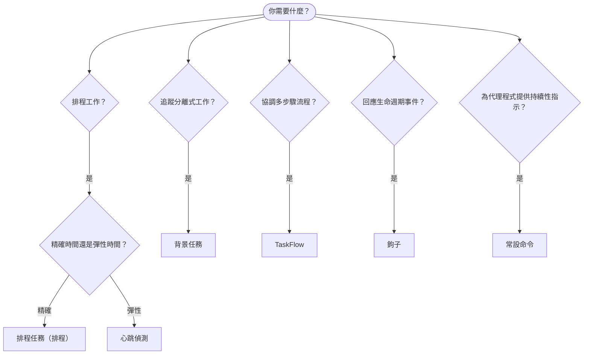

OpenClaw 透過任務、排程作業、事件鉤子和常設指示，在背景執行工作。使用本頁選擇正確的機制。

## 快速決策指南

| 使用情境                                | 建議機制            | 原因                                              |
| --------------------------------------- | ---------------------- | ------------------------------------------------ |
| 每天上午 9 點準時傳送報告         | 排程任務（排程） | 精確時間、隔離執行                 |
| 20 分鐘後提醒我                 | 排程任務（排程） | 精確計時的單次執行（`--at`）            |
| 每週執行深入分析                | 排程任務（排程） | 獨立任務，可使用不同模型         |
| 每 30 分鐘檢查收件匣                | 心跳偵測              | 與其他檢查批次執行，具備情境感知能力         |
| 監控行事曆中的近期活動    | 心跳偵測              | 非常適合定期感知               |
| 檢查子代理程式或 ACP 執行的狀態 | 背景任務       | 任務帳本會追蹤所有分離式工作            |
| 稽核執行了什麼以及執行時間                 | 背景任務       | `openclaw tasks list` 和 `openclaw tasks audit` |
| 執行多步驟研究後進行摘要      | TaskFlow              | 具備修訂追蹤的持久協調機制     |
| 工作階段重設時執行指令碼           | 鉤子                  | 事件驅動，在生命週期事件發生時觸發          |
| 每次工具呼叫時執行程式碼         | 外掛鉤子           | 同處理程序鉤子可攔截工具呼叫        |
| 回覆前一律檢查合規性 | 常設命令        | 自動注入每個工作階段        |

### 排程任務（排程）與心跳偵測的比較

| 面向       | 排程任務（排程）              | 心跳偵測                             |
| --------------- | ----------------------------------- | ------------------------------------- |
| 時間          | 精確（排程運算式、單次執行）  | 約略（預設每 30 分鐘）    |
| 工作階段情境 | 全新（隔離）或共用          | 完整的主要工作階段情境             |
| 任務記錄    | 一律建立                      | 從不建立                         |
| 傳送        | 頻道、網路鉤子或靜默         | 內嵌於主要工作階段                |
| 最適合        | 報告、提醒、背景作業 | 收件匣檢查、行事曆、通知 |

需要精確時間或隔離執行時，請使用排程任務（排程）。工作可受益於完整工作階段情境，且約略時間即可接受時，請使用心跳偵測。

## 核心概念

### 排程任務（排程）

排程是閘道內建的精確計時排程器。它會保存作業、在正確時間喚醒代理程式，並可將輸出傳送至聊天頻道或網路鉤子端點。支援單次提醒、週期運算式和傳入網路鉤子觸發程序。

請參閱[排程任務](/zh-TW/automation/cron-jobs)。

### 任務

背景任務帳本會追蹤所有分離式工作：ACP 執行、子代理程式衍生、隔離的排程執行和命令列介面操作。任務是記錄，而不是排程器。使用 `openclaw tasks list` 和 `openclaw tasks audit` 進行檢查。

請參閱[背景任務](/zh-TW/automation/tasks)。

### TaskFlow

TaskFlow 是位於背景任務之上的流程協調基礎層。它使用受管理和鏡像同步模式來管理持久的多步驟流程，並提供修訂追蹤及 `openclaw tasks flow list|show|cancel` 供檢查使用。

請參閱 [TaskFlow](/zh-TW/automation/taskflow)。

### 常設命令

常設命令為代理程式授予執行已定義方案的永久權限。它們位於工作區檔案中（通常為 `AGENTS.md`），並會注入每個工作階段。與排程結合使用，以進行以時間為基礎的強制執行。

請參閱[常設命令](/zh-TW/automation/standing-orders)。

### 鉤子

內部鉤子是由代理程式生命週期事件
（`/new`、`/reset`、`/stop`）、工作階段壓縮、閘道啟動和訊息
流程所觸發的事件驅動指令碼。系統會從鉤子目錄探索它們，並使用
`openclaw hooks` 進行管理。若要在處理程序內攔截工具呼叫，請使用
[外掛鉤子](/zh-TW/plugins/hooks)。

請參閱[鉤子](/zh-TW/automation/hooks)。

### 心跳偵測

心跳偵測是定期的主要工作階段回合（預設每 30 分鐘）。它會在一個具備完整工作階段情境的代理程式回合中，批次執行檢查清單式監控（收件匣、行事曆、通知）。心跳偵測回合不會建立任務記錄，也不會延長每日／閒置工作階段重設的新鮮度。心跳偵測暫存內容只佔用少量提示詞情境；請將週期性工作排程為排程作業。空白的心跳偵測暫存內容會以 `empty-heartbeat-file` 略過。當排程工作正在執行或排隊時，心跳偵測會延後；當同一代理程式以工作階段鍵值識別的子代理程式或巢狀通道忙碌時，`heartbeat.skipWhenBusy` 也能延後該代理程式。

請參閱[心跳偵測](/zh-TW/gateway/heartbeat)。

## 它們如何協同運作

- **排程**處理精確排程（每日報告、每週審查）和單次提醒。所有排程執行都會建立任務記錄。
- **心跳偵測**每 30 分鐘處理一份批次監控檢查清單；需要獨立週期的檢查則由排程負責。
- **鉤子**使用自訂指令碼回應特定事件（工作階段重設、壓縮、訊息流程）。外掛鉤子負責工具呼叫。
- **常設命令**為代理程式提供持續性情境和權限界線。
- **TaskFlow**在個別任務之上協調多步驟流程。
- **任務**會自動追蹤所有分離式工作，讓你可以檢查和稽核。

## 相關內容

- [排程任務](/zh-TW/automation/cron-jobs) — 精確排程和單次提醒
- [背景任務](/zh-TW/automation/tasks) — 所有分離式工作的任務帳本
- [TaskFlow](/zh-TW/automation/taskflow) — 持久的多步驟流程協調
- [鉤子](/zh-TW/automation/hooks) — 事件驅動的生命週期指令碼
- [外掛鉤子](/zh-TW/plugins/hooks) — 處理程序內的工具、提示詞、訊息和生命週期鉤子
- [常設命令](/zh-TW/automation/standing-orders) — 持續性的代理程式指示
- [心跳偵測](/zh-TW/gateway/heartbeat) — 定期的主要工作階段回合
- [設定參考](/zh-TW/gateway/configuration-reference) — 所有設定鍵
