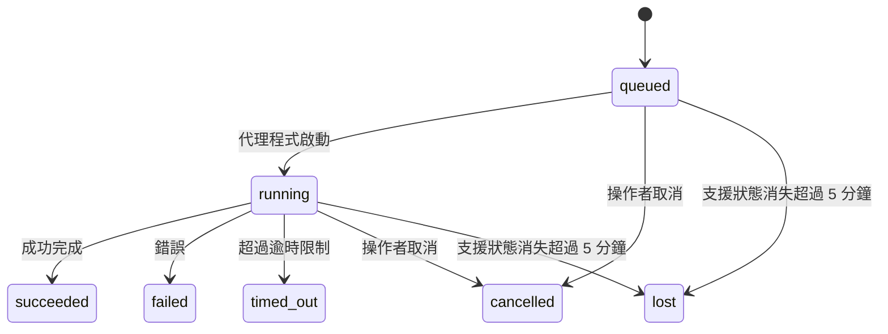

---
read_when:
    - 檢視進行中或最近完成的背景工作
    - 偵錯分離式代理程式執行的傳遞失敗
    - 了解背景執行如何與工作階段、排程及心跳偵測相關聯
sidebarTitle: Background tasks
summary: ACP 執行、子代理程式、排程執行及命令列介面操作的背景工作追蹤
title: 背景工作
x-i18n:
    generated_at: "2026-07-26T07:07:48Z"
    model: gpt-5.6
    postprocess_version: locale-links-v1
    prompt_version: 32
    provider: openai
    source_hash: dbdc5ced133764fec0c8b9ae7b1957e24272dc9c1c86099de81f6923955d6b5a
    source_path: automation/tasks.md
    workflow: 16
---

<Note>
想要排程嗎？請參閱[自動化](/zh-TW/automation)，以選擇合適的機制。本頁是背景工作的活動紀錄，而非排程器。
</Note>

背景任務會追蹤**主要對話工作階段之外**執行的工作：ACP 執行、子代理程式產生、排程工作執行，以及透過命令列介面啟動的操作。

任務**不會**取代工作階段、排程工作或心跳偵測，而是記錄已發生哪些分離式工作、發生時間及是否成功的**活動紀錄**。

<Note>
並非每次代理程式執行都會建立任務。心跳偵測回合和一般互動式聊天不會。所有排程執行、ACP 產生、子代理程式產生、由閘道分派的命令列介面代理程式命令，以及代理程式啟動的背景 `exec` 命令都會建立任務。
</Note>

## 重點摘要

- 任務是**紀錄**，而非排程器；排程和心跳偵測決定工作_何時_執行，任務則追蹤_發生了什麼_。
- ACP、子代理程式、所有排程工作及命令列介面操作都會建立任務。心跳偵測回合不會。
- 每項任務都會經歷 `queued → running → terminal`（成功、失敗、逾時、取消或遺失）。
- 只要排程執行階段仍擁有該工作，排程任務就會保持作用中；若記憶體內的執行階段狀態已消失，任務維護會先檢查持久化的排程執行歷史記錄，再將任務標記為遺失。
- 完成通知由推送驅動：分離式工作完成時可直接通知，或喚醒請求者工作階段／心跳偵測，因此狀態輪詢迴圈通常不是正確的做法。
- 隔離的排程執行和子代理程式完成時，會在最終清理記帳前，盡力清理其子工作階段所追蹤的瀏覽器分頁／程序。
- 當後代子代理程式工作仍在收尾時，隔離的排程傳遞會抑制過時的父層中間回覆；若最終後代輸出在傳遞前抵達，則會優先採用該輸出。
- 完成通知會直接傳遞至頻道，或排入佇列以待下一次心跳偵測。
- `openclaw tasks list` 顯示所有任務；`openclaw tasks audit` 則會呈現問題。
- 終止狀態紀錄會保留 7 天（`lost` 紀錄保留 24 小時），之後自動刪除。

## 快速開始

<Tabs>
  <Tab title="列出與篩選">
    ```bash
    # 列出所有任務（最新的優先）
    openclaw tasks list

    # 依執行階段或狀態篩選
    openclaw tasks list --runtime acp
    openclaw tasks list --status running
    ```

  </Tab>
  <Tab title="檢查">
    ```bash
    # 顯示特定任務的詳細資料（依任務 ID、執行 ID 或工作階段金鑰）
    openclaw tasks show <lookup>
    ```
  </Tab>
  <Tab title="取消與通知">
    ```bash
    # 取消執行中的任務（終止子工作階段）
    openclaw tasks cancel <lookup>

    # 變更任務的通知原則
    openclaw tasks notify <lookup> state_changes
    ```

  </Tab>
  <Tab title="稽核與維護">
    ```bash
    # 執行健康狀態稽核
    openclaw tasks audit

    # 預覽或套用維護
    openclaw tasks maintenance
    openclaw tasks maintenance --apply
    ```

  </Tab>
  <Tab title="任務流程">
    ```bash
    # 檢查 TaskFlow 狀態
    openclaw tasks flow list
    openclaw tasks flow show <lookup>
    openclaw tasks flow cancel <lookup>
    ```
  </Tab>
</Tabs>

## 哪些動作會建立任務

| 來源                   | 執行階段類型 | 建立任務紀錄的時機                                                       | 預設通知原則 |
| ---------------------- | ------------ | ------------------------------------------------------------------------ | ------------ |
| ACP 背景執行           | `acp`        | 產生 ACP 子工作階段                                                       | `done_only`           |
| 子代理程式協調         | `subagent`   | 透過 `sessions_spawn` 產生子代理程式                                     | `done_only`           |
| 排程工作（所有類型）   | `cron`       | 每次排程執行（主要工作階段和隔離式）                                     | `silent`              |
| 命令列介面操作         | `cli`        | 透過閘道執行的 `openclaw agent` 命令                                     | `silent`              |
| 代理程式媒體工作       | `cli`        | 以工作階段為基礎的 `image_generate`/`music_generate`/`video_generate` 執行 | `silent`              |

<AccordionGroup>
  <Accordion title="排程與媒體的通知預設值">
    排程任務（主要工作階段和隔離式）使用 `silent` 通知原則；它們會建立紀錄以供追蹤，但不會自行產生任務通知，因為傳遞路徑由排程擁有。

    以工作階段為基礎的 `image_generate`、`music_generate` 和 `video_generate` 執行也使用 `silent` 通知原則。它們仍會建立任務紀錄，但完成事件會以內部喚醒的方式交回原始代理程式工作階段，讓代理程式撰寫後續訊息並自行附加完成的媒體。請求者代理程式會遵循其一般可見回覆契約：設定後自動傳送最終回覆，或在工作階段要求使用訊息工具回覆時使用 `message(action="send")` 加上 `NO_REPLY`。如果請求者工作階段已不再作用中，或其主動喚醒失敗，且完成代理程式遺漏部分或全部產生的媒體，OpenClaw 會以等冪方式直接回退傳送，僅將遺漏的媒體傳送至原始頻道目標。

  </Accordion>
  <Accordion title="並行媒體產生防護機制">
    當以工作階段為基礎的媒體產生任務仍在作用中時，`image_generate`、`music_generate` 和 `video_generate` 會防止意外重試：針對相同提示／請求重複呼叫時，會傳回相符的作用中任務狀態，而不會啟動重複任務；不同的提示則可啟動自己的任務。若要從代理程式端明確查詢進度／狀態，請使用 `action: "status"`。
  </Accordion>
  <Accordion title="哪些動作不會建立任務">
    - 心跳偵測回合－主要工作階段；請參閱[心跳偵測](/zh-TW/gateway/heartbeat)
    - 一般互動式聊天回合
    - 直接 `/command` 回應

  </Accordion>
</AccordionGroup>

## 任務生命週期



| 狀態        | 意義                                                                         |
| ----------- | ---------------------------------------------------------------------------- |
| `queued`    | 已建立，正在等待代理程式啟動                                                 |
| `running`   | 代理程式回合正在執行                                                         |
| `succeeded` | 已成功完成                                                                   |
| `failed`    | 完成時發生錯誤                                                               |
| `timed_out` | 超過設定的逾時時間                                                           |
| `cancelled` | 操作者透過 `openclaw tasks cancel` 停止，或執行已中止 |
| `lost`      | 經過 5 分鐘寬限期後，執行階段失去具權威性的支援狀態                          |

狀態轉換會自動發生；代理程式執行生命週期事件（開始、結束、錯誤）會更新任務狀態，你不需要手動管理。

對於作用中的任務紀錄，代理程式執行完成事件具有權威性。成功的分離式執行會結束為 `succeeded`，一般執行錯誤會結束為 `failed`，逾時會結束為 `timed_out`，取消／中止結果則會結束為 `cancelled`。任務進入終止狀態後，後續生命週期訊號不會將其降級；由操作者取消或已為 `failed`/`timed_out`/`lost` 的任務，即使之後收到成功訊號，仍會維持原狀。

`lost` 會依執行階段而定：

- ACP 任務：只有閘道中作用中的處理程序內 ACP 回合才能證明執行仍在進行；僅有持久化的工作階段中繼資料並不足以證明。離線命令列介面稽核會採保守策略，且絕不回收 ACP 任務。
- 子代理程式任務：支援該任務的子工作階段已從目標代理程式儲存區消失（或帶有重新啟動復原墓碑）。
- 排程任務：排程執行階段已不再將該工作追蹤為作用中，且持久化的排程執行歷史記錄中沒有該次執行的終止結果。離線命令列介面稽核不會將自身空白的處理程序內排程執行階段狀態視為權威依據。
- 命令列介面任務：具有執行 ID／來源 ID 的任務會使用即時執行內容，因此閘道所擁有的執行消失後，殘留的子工作階段或聊天工作階段資料列不會讓它們繼續保持作用中。沒有執行識別資訊的舊版命令列介面任務仍會回退使用子工作階段。以閘道為基礎的 `openclaw agent` 執行也會根據其執行結果結束，因此已完成的執行不會持續保持作用中，直到清理程式將它們標記為 `lost`。

## 傳遞與通知

當任務到達終止狀態時，OpenClaw 會通知你。有兩種傳遞路徑：

**直接傳遞**－如果任務有頻道目標（`requesterOrigin`），完成訊息會直接傳送至該頻道（Discord、Slack、Telegram 等）。群組和頻道任務的完成事件則會改由請求者工作階段路由，讓父代理程式撰寫可見回覆。對於子代理程式完成事件，OpenClaw 也會在可用時保留已繫結的討論串／主題路由，並可在放棄直接傳遞前，從請求者工作階段儲存的路由（`lastChannel` / `lastTo` / `lastAccountId`）補上缺少的 `to`／帳號。

**工作階段佇列傳遞**－如果直接傳遞失敗或未設定來源，更新會以系統事件的形式排入請求者工作階段的佇列，並在下一次心跳偵測時呈現。

<Tip>
排入工作階段佇列的任務完成事件會立即觸發心跳偵測喚醒，因此你能迅速看到結果，而不必等待下一個排定的心跳偵測週期。
</Tip>

這表示一般工作流程以推送為基礎：啟動分離式工作一次，然後讓執行階段在完成時喚醒或通知你。只有在需要偵錯、介入或明確稽核時，才輪詢任務狀態。

### 通知原則

控制每項任務通知你的詳細程度：

| 原則                  | 傳遞內容                                                |
| --------------------- | ------------------------------------------------------- |
| `done_only`（預設） | 僅終止狀態（成功、失敗等）                              |
| `state_changes`       | 每次狀態轉換和進度更新                                  |
| `silent`              | 完全不傳遞（排程、命令列介面和媒體任務的預設值）        |

任務執行期間可變更原則：

```bash
openclaw tasks notify <lookup> state_changes
```

## 命令列介面參考

<AccordionGroup>
  <Accordion title="tasks list">
    ```bash
    openclaw tasks list [--runtime <acp|subagent|cron|cli>] [--status <status>] [--json]
    ```

    輸出欄位：任務、種類、狀態、傳遞、執行、子工作階段、摘要。單獨使用 `openclaw tasks` 的行為與 `openclaw tasks list` 相同。

  </Accordion>
  <Accordion title="tasks show">
    ```bash
    openclaw tasks show <lookup> [--json]
    ```

    查詢權杖接受任務 ID、執行 ID 或工作階段金鑰。顯示完整紀錄，包括時間資訊、傳遞狀態、錯誤和終止摘要。

  </Accordion>
  <Accordion title="tasks cancel">
    ```bash
    openclaw tasks cancel <lookup>
    ```

    對於 ACP 和子代理程式工作，這會終止子工作階段；ACP 和排程取消會透過執行中的閘道路由（`tasks.cancel`）。對於由命令列介面追蹤的工作，取消會記錄在工作登錄中（沒有獨立的子執行階段控制代碼）。狀態會轉換為 `cancelled`，並在適用時傳送交付通知。

  </Accordion>
  <Accordion title="工作通知">
    ```bash
    openclaw tasks notify <lookup> <done_only|state_changes|silent>
    ```
  </Accordion>
  <Accordion title="工作稽核">
    ```bash
    openclaw tasks audit [--severity <warn|error>] [--code <name>] [--limit <n>] [--json]
    ```

    在一份報告中呈現工作**以及** TaskFlow 的操作問題。偵測到問題時，發現也會出現在 `openclaw status` 中。

    工作發現：

    | 發現                      | 嚴重性     | 觸發條件                                                                                                     |
    | ------------------------- | ---------- | ------------------------------------------------------------------------------------------------------------ |
    | `stale_queued`            | 警告       | 已排入佇列超過 10 分鐘                                                                                       |
    | `stale_running`           | 錯誤       | 已執行超過 30 分鐘                                                                                           |
    | `lost`                    | 警告/錯誤 | 有執行階段支援的工作所有權已消失；保留的遺失工作在 `cleanupAfter` 前會發出警告，之後則變為錯誤 |
    | `delivery_failed`         | 警告       | 交付失敗，且通知原則不是 `silent`                                                                  |
    | `missing_cleanup`         | 警告       | 終止工作沒有清理時間戳記                                                                                     |
    | `inconsistent_timestamps` | 警告       | 時間軸違規（例如結束時間早於開始時間）                                                                       |

    TaskFlow 發現：

    | 發現                   | 嚴重性     | 觸發條件                                                                    |
    | ---------------------- | ---------- | --------------------------------------------------------------------------- |
    | `restore_failed`       | 錯誤       | 從 SQLite 還原流程登錄失敗                                                  |
    | `stale_running`        | 錯誤       | 執行中的流程超過 30 分鐘沒有進展                                            |
    | `stale_waiting`        | 警告       | 等待中的流程超過 30 分鐘沒有進展                                            |
    | `stale_blocked`        | 警告       | 受阻的流程超過 30 分鐘沒有進展                                              |
    | `cancel_stuck`         | 警告       | 已在超過 5 分鐘前要求取消、沒有作用中的子工作，但仍未終止                   |
    | `missing_linked_tasks` | 警告/錯誤 | 過時的受管理流程沒有連結的工作或等待狀態                                    |
    | `blocked_task_missing` | 警告       | 受阻的流程指向已不存在的工作 ID                                             |

  </Accordion>
  <Accordion title="工作維護">
    ```bash
    openclaw tasks maintenance [--json]
    openclaw tasks maintenance --apply [--json]
    ```

    使用此功能可預覽或套用工作、TaskFlow 狀態和過時排程執行工作階段登錄資料列的協調、清理標記與修剪。

    協調會感知執行階段：

    - ACP 工作要求閘道中存在作用中的處理程序內回合；子代理程式工作會檢查其支援的子工作階段。
    - 子工作階段具有重新啟動復原墓碑的子代理程式工作會標示為遺失，而不會將其視為可復原的支援工作階段。
    - 排程工作會檢查排程執行階段是否仍擁有該工作，接著從持久化的排程執行記錄／工作狀態復原終止狀態，最後才退回至 `lost`。只有閘道處理程序對記憶體內的排程作用中工作集合具有權威性；離線命令列介面稽核會使用持久化歷程，但不會只因本機集合為空就將排程工作標示為遺失。
    - 具有執行識別資訊的命令列介面工作會檢查其所屬的作用中執行內容，而不只是子工作階段或聊天工作階段資料列。

    完成清理也會感知執行階段：

    - 子代理程式完成時，會盡力關閉子工作階段所追蹤的瀏覽器分頁／處理程序，然後再繼續公告清理。
    - 隔離的排程完成時，會盡力關閉排程工作階段所追蹤的瀏覽器分頁／處理程序，然後才完整結束執行。
    - 隔離的排程交付會在需要時等待後代子代理程式完成後續工作，並抑制過時的父層確認文字，而不予公告。
    - 子代理程式完成交付只會使用子工作階段最新且可見的助理文字。工具／toolResult 輸出不會提升為子工作結果文字。終止且失敗的執行會公告失敗狀態，但不會重播擷取的回覆文字。
    - 清理失敗不會掩蓋真正的工作結果。

    套用維護時，OpenClaw 也會移除超過 7 天的過時 `cron:<jobId>:run:<runId>` 工作階段登錄資料列，同時保留目前執行中排程工作的資料列，並且不變更非排程工作階段資料列。

  </Accordion>
  <Accordion title="工作流程清單 | 顯示 | 取消">
    ```bash
    openclaw tasks flow list [--status <status>] [--json]
    openclaw tasks flow show <lookup> [--json]
    openclaw tasks flow cancel <lookup>
    ```

    流程查詢權杖接受流程 ID 或擁有者索引鍵。當你關心的是負責協調的[工作流程](/zh-TW/automation/taskflow)，而不是單一背景工作記錄時，請使用這些命令。

  </Accordion>
</AccordionGroup>

## 聊天工作面板（`/tasks`）

在任何聊天工作階段中使用 `/tasks`，即可查看連結至該工作階段的背景工作。面板最多會顯示五個作用中和最近完成的工作，並包含執行階段、狀態、時間，以及進度或錯誤詳細資訊。

當目前工作階段沒有可見的連結工作時，`/tasks` 會退回顯示代理程式本機工作計數，讓你仍可取得概覽，而不會洩漏其他工作階段的詳細資訊。

如需完整的操作員總帳，請使用命令列介面：`openclaw tasks list`。

### 控制介面

網頁控制介面的側邊欄中有一個**工作**頁面，會即時顯示作用中和最近的背景工作。你可以使用它來檢查進度、開啟連結的工作階段、重新整理總帳，或取消已排入佇列和執行中的工作。

聊天窗格也有一個可收合的**背景工作**側欄，其範圍限定於該窗格的代理程式：其中包含具有停止控制項的執行中工作和子代理程式、已完成區段，以及可進入每個工作子工作階段的「檢視轉錄內容」連結。請從窗格標題列中的活動切換按鈕開啟它（在單窗格聊天中則使用浮動活動按鈕）。

在側欄中選取工作，即可檢查其限定範圍的輸入提示，以及最新輸出或錯誤摘要。執行中的工作會與已完成的工作分開，而已完成的資料列會顯示工作是成功完成還是失敗。在 iOS 上，開啟 **Chat actions → Background Tasks**；在 Android 上，開啟 Chat 的溢位選單並選取 **Background tasks**。兩個行動版檢視都使用相同的 Running 和 Finished 分組，並會在選取時開啟工作詳細資料。

## 狀態整合（工作壓力）

`openclaw status` 包含一行可快速瀏覽的工作資訊：

```
工作    2 個作用中 · 1 個已排入佇列 · 1 個執行中 · 1 個問題 · 稽核正常 · 6 筆已追蹤
```

摘要會計算作用中的工作（`queued` + `running`）、失敗（`failed` + `timed_out` + `lost`）、稽核發現和追蹤記錄總數；JSON 承載資料也會依執行階段細分計數（`acp`、`subagent`、`cron`、`cli`）。

`/status` 和 `session_status` 工具都使用會感知清理狀態的工作快照：優先顯示作用中工作、隱藏已過期資料列，而且終止工作只會在短暫的近期時間範圍（5 分鐘）內顯示；當沒有剩餘的作用中工作時，則會聚焦顯示失敗。這能讓狀態卡片專注於目前最重要的資訊。

## 儲存與維護

### 工作的儲存位置

工作記錄和交付狀態會持久化在共用的 OpenClaw SQLite 狀態資料庫中：

```
~/.openclaw/state/openclaw.sqlite   （資料表：task_runs、task_delivery_state、flow_runs）
```

設定 `OPENCLAW_STATE_DIR` 可將整個狀態根目錄（預設為 `~/.openclaw`）移至其他位置；共用資料庫路徑也會隨之移動。

登錄會在首次使用時載入記憶體，並將每次寫入持久化回 SQLite，因此記錄可在閘道重新啟動後保留。WAL 增長會透過 SQLite 的預設自動檢查點閾值，加上定期的 `PASSIVE` 檢查點維持在有限範圍內；關閉和明確維護的檢查點會使用 `TRUNCATE`，讓正常關閉能回收 WAL 空間，而不會使背景清理程式等待作用中的讀取者。

舊版安裝中的傳統附屬儲存區（`tasks/runs.sqlite`、`flows/registry.sqlite`）會由 `openclaw doctor` 匯入共用資料庫。

### 自動維護

清理程式每 **60 秒**執行一次（首次執行約在閘道啟動後 5 秒），並處理四件事：

<Steps>
  <Step title="協調">
    檢查作用中工作是否仍具有權威的執行階段支援。ACP 工作要求作用中的處理程序內回合，子代理程式工作使用子工作階段狀態，排程工作使用作用中工作所有權加上持久化執行歷程，而具有執行識別資訊的命令列介面工作則使用其所屬的執行內容。如果支援狀態消失超過 5 分鐘（沒有子工作階段的原生子代理程式工作為 30 分鐘），工作會標示為 `lost`。
  </Step>
  <Step title="ACP 工作階段修復">
    關閉已終止或孤立、由父層擁有的一次性 ACP 工作階段；僅在沒有剩餘作用中對話繫結時，才關閉過時且已終止或孤立的持久 ACP 工作階段。
  </Step>
  <Step title="清理標記">
    在終止工作上設定 `cleanupAfter` 時間戳記（終止時間 + 保留期間）。在保留期間內，遺失的工作仍會在稽核中顯示為警告；`cleanupAfter` 到期後，或缺少清理中繼資料時，則會變為錯誤。
  </Step>
  <Step title="修剪">
    刪除超過其 `cleanupAfter` 日期的記錄。
  </Step>
</Steps>

<Note>
**保留期間：**終止工作記錄會保留 **7 天**（`lost` 記錄保留 **24 小時**），之後自動修剪。不需要任何設定。
</Note>

## 工作與其他系統的關係

<AccordionGroup>
  <Accordion title="工作與工作流程">
    [工作流程](/zh-TW/automation/taskflow)是位於背景工作之上的流程協調層。單一流程可在其生命週期內使用受管理或鏡像同步模式協調多個工作。使用 `openclaw tasks` 檢查個別工作記錄，並使用 `openclaw tasks flow` 檢查負責協調的流程。

  </Accordion>
  <Accordion title="工作與排程">
    排程工作定義、執行階段執行狀態和執行歷程會儲存在 OpenClaw 的共用 SQLite 狀態資料庫中。**每次**排程執行都會建立工作記錄，包括主要工作階段和隔離工作階段，且通知原則為 `silent`，因此可追蹤排程執行，而不會產生其自身的工作通知。

    請參閱[排程工作](/zh-TW/automation/cron-jobs)。

  </Accordion>
  <Accordion title="工作與心跳偵測">
    心跳偵測執行屬於主要工作階段回合，不會建立工作記錄。工作完成時，可以觸發心跳偵測喚醒，讓你迅速看到結果。

    請參閱[心跳偵測](/zh-TW/gateway/heartbeat)。

  </Accordion>
  <Accordion title="任務與工作階段">
    任務可能會參照 `childSessionKey`（工作執行的位置）和 `requesterSessionKey`（啟動工作的人員）。其 `agentId` 用於識別執行工作的代理，而請求者與擁有者欄位則保留啟動和控制的情境。工作階段是對話情境；任務則是在其上進行的活動追蹤。
  </Accordion>
  <Accordion title="任務與代理執行">
    任務的 `runId` 會連結至執行該工作的代理執行。代理生命週期事件（開始、結束、錯誤）會自動更新任務狀態，你不需要手動管理生命週期。
  </Accordion>
</AccordionGroup>

## 相關內容

- [自動化](/zh-TW/automation) - 一覽所有自動化機制
- [命令列介面：任務](/zh-TW/cli/tasks) - 命令列介面指令參考
- [心跳偵測](/zh-TW/gateway/heartbeat) - 定期執行的主要工作階段輪次
- [排程任務](/zh-TW/automation/cron-jobs) - 排程背景工作
- [TaskFlow](/zh-TW/automation/taskflow) - 位於任務之上的流程協調機制
