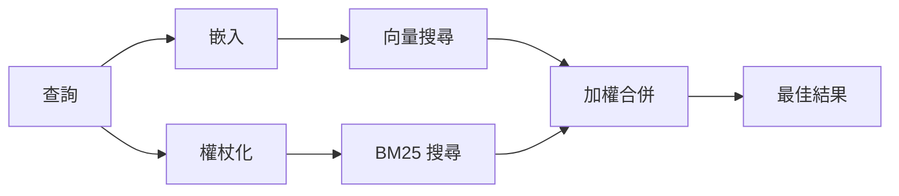

---
read_when:
    - 你想了解 memory_search 的運作方式
    - 你想要選擇嵌入模型供應商
    - 你想要調整搜尋品質
summary: 記憶搜尋如何使用嵌入向量與混合式檢索找出相關筆記
title: 記憶搜尋
x-i18n:
    generated_at: "2026-07-26T08:15:24Z"
    model: gpt-5.6
    postprocess_version: locale-links-v1
    prompt_version: 32
    provider: openai
    source_hash: b2bd28b63ac55a2a890ed70a3015f76f1c7fbaa792b17a6ead51f4c8712fbd2d
    source_path: concepts/memory-search.md
    workflow: 16
---

`memory_search` 會從你的記憶檔案中找出相關筆記，即使其措辭與原文不同。它會將記憶分割成小片段，並使用嵌入、關鍵字或兩者進行搜尋。

## 快速開始

OpenClaw 預設使用 OpenAI 嵌入。若要使用其他供應商，請明確設定：

```json5
{
  memory: {
    search: {
      provider: "openai", // 或 "gemini"、"voyage"、"mistral"、"bedrock"、"local"、"ollama"、"lmstudio"、"github-copilot"、"openai-compatible"
    },
  },
}
```

`provider` 也可以參照自訂的 `models.providers.<id>` 項目（例如 `ollama-5080`），只要該項目將 `api` 設為 `"ollama"`，或設為另一個具備記憶嵌入轉接器的供應商 ID。

若要使用不需 API 金鑰的本機嵌入，請安裝官方 llama.cpp 供應商外掛並設定 `provider: "local"`：

```bash
openclaw plugins install @openclaw/llama-cpp-provider
```

原始碼簽出仍需核准原生建置：先執行 `pnpm approve-builds`，再執行 `pnpm rebuild node-llama-cpp`。

部分與 OpenAI 相容的嵌入端點需要非對稱的 `input_type` 標籤，例如搜尋使用 `"query"`，索引片段使用 `"document"`/`"passage"`。請透過 `queryInputType` 和 `documentInputType` 設定；詳見[記憶設定參考](/zh-TW/reference/memory-config#provider-specific-config)。

## 支援的供應商

| 供應商            | ID                  | 需要 API 金鑰 | 備註                              |
| ----------------- | ------------------- | ------------- | --------------------------------- |
| Bedrock           | `bedrock`           | 否            | 使用 AWS 認證資訊鏈               |
| DeepInfra         | `deepinfra`         | 是            | 預設模型 `BAAI/bge-m3`       |
| Gemini            | `gemini`            | 是            | 支援圖片／音訊索引                 |
| GitHub Copilot    | `github-copilot`    | 否            | 使用你的 Copilot 訂閱              |
| 本機              | `local`             | 否            | GGUF 模型，自動下載約 0.6 GB       |
| LM Studio         | `lmstudio`          | 否            | 本機／自行託管的伺服器             |
| Mistral           | `mistral`           | 是            |                                   |
| Ollama            | `ollama`            | 否            | 本機／自行託管的伺服器             |
| OpenAI            | `openai`            | 是            | 預設                              |
| OpenAI 相容       | `openai-compatible` | 通常需要      | 通用 `/v1/embeddings` 端點      |
| Voyage            | `voyage`            | 是            |                                   |

## 搜尋的運作方式

OpenClaw 會平行執行兩條擷取路徑，並合併結果：



- **向量搜尋**會比對相近的語意（「閘道主機」可比對到「執行 OpenClaw 的機器」）。
- **BM25 關鍵字搜尋**會比對完全相同的詞彙（ID、錯誤字串、設定鍵）。
- **檔名搜尋**會將路徑與筆記內文分開建立索引。完全相符的完整路徑、基礎檔名及檔名主幹，排名會高於部分路徑相符項目；摘要與內文關鍵字分數仍取自筆記內容。

若只有其中一條路徑可用，另一條會單獨執行。

**僅 FTS 模式。** 將 `provider: "none"` 設定為刻意停用嵌入，並僅使用關鍵字搜尋。若未設定 `provider` 或將其設為 `"auto"`，且未設定嵌入驗證，也會回復為僅使用關鍵字排名而不會報錯；`provider: "local"`（GGUF/llama.cpp 供應商）失敗時亦同。

**明確指定的供應商無法使用。** 若你明確指定任何其他供應商（例如 `openai`、`ollama`、`gemini`），而該供應商在請求時無法使用（驗證錯誤、網路故障），`memory_search` 會回報記憶無法使用，而不會無聲降級為僅 FTS 結果。這可讓設定錯誤的供應商問題保持可見。若要刻意使用僅 FTS 的回憶功能，請設定 `provider: "none"`；或修正供應商／驗證設定，以恢復語意排名。

## 改善搜尋品質

兩項選用功能可協助處理大量筆記歷程。

### 時間衰減

舊筆記的排名權重會逐漸降低，讓近期資訊優先顯示。採用預設的 30 天半衰期時，上個月的筆記分數會降至原始權重的 50%。`MEMORY.md` 及 `memory/` 下其他不含日期的檔案屬於長期有效內容，永不衰減；只有含日期的 `memory/YYYY-MM-DD.md` 檔案會衰減。

<Tip>
如果你的代理程式累積了數月的每日筆記，且過時資訊持續排在近期脈絡之前，請啟用此功能。
</Tip>

### MMR（多樣性）

減少重複結果。如果五則筆記都提到相同的路由器設定，MMR 可確保最佳結果涵蓋不同主題，而非反覆顯示相同內容。

<Tip>
如果 `memory_search` 持續從不同的每日筆記傳回近似重複的片段，請啟用此功能。
</Tip>

### 同時啟用兩者

```json5
{
  memory: {
    search: {
      query: {
        hybrid: {
          mmr: { enabled: true },
          temporalDecay: { enabled: true },
        },
      },
    },
  },
}
```

## 多模態記憶

使用 `gemini-embedding-2-preview`，你可以將圖片與音訊和 Markdown 一併建立索引。這僅適用於 `memory.search.extraPaths` 下的檔案；預設記憶根目錄（`MEMORY.md`、`memory/*.md`）仍僅支援 Markdown。搜尋查詢仍為文字，但可與視覺及音訊內容進行比對。設定方式請參閱[記憶設定參考](/zh-TW/reference/memory-config#multimodal-memory-gemini)。

## 工作階段記憶搜尋

若要從工作階段逐字稿進行精確全文回憶，請使用 [`sessions_search`](/zh-TW/concepts/session-search)，再透過 `sessions_history` 開啟結果。工作階段記憶搜尋仍是實驗性的語意補充功能。

你也可以選擇為工作階段逐字稿建立索引，讓 `memory_search` 能回憶較早的對話。這是選用功能：請設定 `experimental.sessionMemory: true`，並將 `"sessions"` 加入 `sources`（`sources` 的預設值為 `["memory"]`）。

工作階段命中結果遵循 `tools.sessions.visibility`：預設的 `"tree"` 會開放目前工作階段、由其衍生的工作階段，以及透過環境群組感知監看的同代理程式群組工作階段。使用 `session.dmScope: "main"` 時，多使用者私訊設定會共用該主要工作階段，因此被路由至該處的使用者可以回憶其所監看群組中的內容。若要隔離私訊，請使用每位對象獨立的 `dmScope`；或將可見性設為 `"self"`，以停用環境監看工作階段的讀取。其他不相關的同代理程式工作階段仍需要 `"agent"` 可見性。

使用 QMD 後端時，也請設定 `memory.qmd.sessions.enabled: true`，讓逐字稿匯出至 QMD 集合；僅設定 `experimental.sessionMemory` 和 `sources` 不會將逐字稿匯出至 QMD。詳見[設定參考](/zh-TW/reference/memory-config#session-memory-search-experimental)。

## 疑難排解

**沒有結果？** 執行 `openclaw memory status` 檢查索引。若索引為空，請執行 `openclaw memory index --force`。

**只有關鍵字相符結果？** 你的嵌入供應商可能尚未設定。請檢查 `openclaw memory status --deep`。

**本機嵌入逾時？** `ollama`、`lmstudio` 和 `local` 使用由供應商管理的較長批次期限。請檢查供應商健康狀態，並重新執行 `openclaw memory index --force`。

**找不到 CJK 文字？** 請使用 `openclaw memory index --force` 重建 FTS 索引。

## 相關內容

- [記憶概覽](/zh-TW/concepts/memory)
- [主動記憶](/zh-TW/concepts/active-memory)
- [內建記憶引擎](/zh-TW/concepts/memory-builtin)
- [記憶設定參考](/zh-TW/reference/memory-config)
