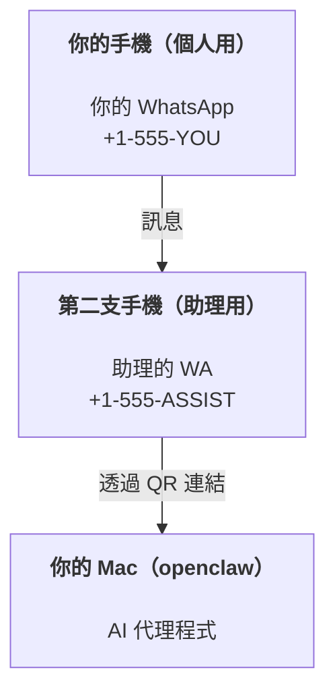

---
read_when:
    - 新助理執行個體的初始設定
    - 檢視安全性／權限影響
summary: 將 OpenClaw 作為個人助理執行的端對端指南，包含安全注意事項
title: 個人助理設定
x-i18n:
    generated_at: "2026-07-26T08:48:58Z"
    model: gpt-5.6
    postprocess_version: locale-links-v1
    prompt_version: 32
    provider: openai
    source_hash: ed3e267971fc1ee5c9154194e5b1f98db8c7a7edca8182871a2057a778614217
    source_path: start/openclaw.md
    workflow: 16
---

OpenClaw 是一個自行託管的閘道，可將 Discord、Google Chat、iMessage、Matrix、Microsoft Teams、Signal、Slack、Telegram、WhatsApp、Zalo 等服務連接至 AI 代理程式。本指南涵蓋「個人助理」設定：使用專用的 WhatsApp 號碼，作為隨時待命的 AI 助理。

## 安全第一

為代理程式提供頻道後，它便能執行你機器上的命令（依你的工具政策而定）、讀取／寫入工作區中的檔案，以及透過任何已連線的頻道傳送訊息。請先採取保守設定：

- 務必設定 `channels.whatsapp.allowFrom`（切勿在你的個人 Mac 上對全世界開放執行）。
- 為助理使用專用的 WhatsApp 號碼。
- 心跳偵測預設每 30 分鐘執行一次。在你信任此設定之前，請將 `agents.defaults.heartbeat.every: "0m"` 設為停用。

## 先決條件

- 已安裝 OpenClaw 並完成初始設定——若尚未完成，請參閱[開始使用](/zh-TW/start/getting-started)
- 供助理使用的第二個電話號碼（SIM／eSIM／預付卡）

## 雙手機設定（建議）

你需要如下設定：



如果將你的個人 WhatsApp 連結至 OpenClaw，每則傳給你的訊息都會成為「代理程式輸入」。這通常不是你想要的結果。

## 5 分鐘快速開始

1. 配對 WhatsApp Web（顯示 QR 碼；使用助理手機掃描）：

```bash
openclaw channels login
```

2. 啟動閘道（保持執行）：

```bash
openclaw gateway --port 18789
```

3. 將最基本的設定放入 `~/.openclaw/openclaw.json`：

```json5
{
  gateway: { mode: "local" },
  channels: { whatsapp: { allowFrom: ["+15555550123"] } },
}
```

現在從允許清單中的手機傳訊息給助理號碼。

初始設定完成後，OpenClaw 會自動開啟儀表板，並輸出乾淨（未包含權杖）的連結。如果儀表板要求驗證，請將已設定的共用密鑰貼到 Control UI 設定中。初始設定預設使用權杖（`gateway.auth.token`），但若你已將 `gateway.auth.mode` 切換為 `password`，也可以使用密碼驗證。若要稍後重新開啟：`openclaw dashboard`。

## 為代理程式提供工作區（AGENTS）

OpenClaw 會從工作區目錄讀取操作指示和「記憶」。

OpenClaw 預設使用 `~/.openclaw/workspace` 作為代理程式工作區，並在初始設定或第一次執行代理程式時自動建立該工作區（以及起始用的 `AGENTS.md`、`SOUL.md`、`TOOLS.md`、`IDENTITY.md`、`USER.md`）。`BOOTSTRAP.md` 只會為全新的工作區建立，刪除後不應再次出現。`MEMORY.md` 為選用項目，且絕不會自動建立；若存在，則會在一般工作階段中載入。子代理程式工作階段只會注入 `AGENTS.md` 和 `TOOLS.md`。

<Tip>
將此資料夾視為 OpenClaw 的記憶，並設為 git 儲存庫（最好是私人儲存庫），以備份你的 `AGENTS.md` 和記憶檔案。如果已安裝 git，全新的工作區會自動使用 `git init` 初始化。
</Tip>

若要建立工作區和設定資料夾，而不執行完整的初始設定精靈：

```bash
openclaw setup --baseline
```

（單獨使用 `openclaw setup` 是 `openclaw onboard` 的別名，會執行完整的互動式精靈。）

完整工作區配置與備份指南：[代理程式工作區](/zh-TW/concepts/agent-workspace)
記憶工作流程：[記憶](/zh-TW/concepts/memory)

選用：使用 `agents.defaults.workspace` 選擇不同的工作區（支援 `~`）。

```json5
{
  agents: {
    defaults: {
      workspace: "~/.openclaw/workspace",
    },
  },
}
```

如果你已從儲存庫提供自己的工作區檔案，可以完全停用啟動檔案建立功能：

```json5
{
  agents: {
    defaults: {
      skipBootstrap: true,
    },
  },
}
```

## 將其變成「助理」的設定

OpenClaw 預設提供良好的助理設定，但通常仍需調整：

- [`SOUL.md`](/zh-TW/concepts/soul) 中的角色／指示
- 思考預設值（如有需要）
- 心跳偵測（信任其運作後）

範例：

```json5
{
  logging: { level: "info" },
  agents: {
    defaults: {
      model: { primary: "anthropic/claude-opus-5" },
      workspace: "~/.openclaw/workspace",
      thinkingDefault: "high",
      timeoutSeconds: 1800,
      // 從 0 開始；稍後再啟用。
      heartbeat: { every: "0m" },
    },
    list: [
      {
        id: "main",
        default: true,
        groupChat: {
          mentionPatterns: ["@openclaw", "openclaw"],
        },
      },
    ],
  },
  channels: {
    whatsapp: {
      allowFrom: ["+15555550123"],
      groups: {
        "*": { requireMention: true },
      },
    },
  },
  session: {
    scope: "per-sender",
    resetTriggers: ["/new", "/reset"],
    reset: {
      mode: "daily",
      atHour: 4,
      idleMinutes: 10080,
    },
  },
}
```

## 工作階段與記憶

- 工作階段資料列、對話記錄資料列和中繼資料（權杖使用量、上次路由等）：`~/.openclaw/agents/<agentId>/agent/openclaw-agent.sqlite`
- 舊版／封存的對話記錄成品：`~/.openclaw/agents/<agentId>/sessions/`
- 舊版資料列遷移來源：`~/.openclaw/agents/<agentId>/sessions/sessions.json`
- `/new` 或 `/reset` 會為該聊天啟動新的工作階段（可透過 `session.resetTriggers` 設定）。如果單獨傳送，OpenClaw 會確認重設，而不叫用模型。
- `/compact [instructions]` 會壓縮工作階段內容，並回報剩餘的內容額度。

## 心跳偵測（主動模式）

OpenClaw 預設每 30 分鐘使用以下提示詞執行一次心跳偵測：
`Follow the heartbeat monitor scratch context when provided. Recurring tasks are cron jobs; create or change their schedules with cron tools or the openclaw cron CLI, not heartbeat scratch. Do not infer or repeat old tasks from prior chats. If nothing needs attention, reply HEARTBEAT_OK.`
將 `agents.defaults.heartbeat.every: "0m"` 設為停用。心跳偵測檢查清單位於監控程式的排程暫存區（請參閱[心跳偵測](/zh-TW/gateway/heartbeat)）；`openclaw doctor --fix` 會將舊版工作區的 `HEARTBEAT.md` 遷移至該處。

- 如果監控暫存區存在但實際上是空的（只包含空白行、Markdown／HTML 註解、如 `# Heading` 的 Markdown 標題、程式碼圍欄標記或空白檢查清單項目），OpenClaw 會略過心跳偵測執行，以節省 API 呼叫。
- 如果暫存區不存在，心跳偵測仍會執行，並由模型決定該採取什麼動作。
- 如果代理程式回覆 `HEARTBEAT_OK`（可選擇加入少量填充內容；請參閱 `agents.defaults.heartbeat.ackMaxChars`），OpenClaw 會抑制該次心跳偵測的對外傳送。
- 預設允許將心跳偵測傳送至私訊類型的 `user:<id>` 目標。將 `agents.defaults.heartbeat.directPolicy: "block"` 設為抑制直接目標傳送，同時保持心跳偵測執行。
- 心跳偵測會執行完整的代理程式回合——間隔越短，消耗的權杖越多。

```json5
{
  agents: {
    defaults: {
      heartbeat: { every: "30m" },
    },
  },
}
```

## 傳入與傳出媒體

傳入附件（圖片／音訊／文件）可透過範本提供給你的命令：

- `{{AttachmentPath}}`（本機暫存檔案路徑）
- `{{AttachmentUrl}}`（原始 URL 或供應商參照）
- `{{AttachmentContentType}}`（MIME 內容類型）
- `{{AttachmentDir}}`（包含本機路徑的目錄）
- `{{AttachmentIndex}}`（從零開始的來源事實索引）
- `{{Transcript}}`（若已啟用音訊轉錄）

較舊的 `{{MediaPath}}`、`{{MediaUrl}}`、`{{MediaType}}` 和 `{{MediaDir}}`
名稱仍可作為已淘汰的相容性別名使用。

代理程式的傳出附件會使用訊息工具或回覆承載資料中的結構化媒體欄位，例如 `media`、`mediaUrl`、`mediaUrls`、`path` 或 `filePath`。訊息工具引數範例：

```json
{
  "message": "這是螢幕擷取畫面。",
  "mediaUrl": "https://example.com/screenshot.png"
}
```

OpenClaw 會將結構化媒體與文字一起傳送。舊版最終助理回覆可能仍會為了相容性而正規化，但工具輸出、瀏覽器輸出、串流區塊和訊息動作不會將文字解析為附件命令。

本機路徑行為遵循與代理程式相同的檔案讀取信任模型：

- 如果 `tools.fs.workspaceOnly` 為 `true`，傳出的本機媒體路徑仍僅限於 OpenClaw 暫存根目錄、媒體快取、代理程式工作區路徑，以及沙箱產生的檔案。
- 如果 `tools.fs.workspaceOnly` 為 `false`，傳出的本機媒體可以使用代理程式已獲准讀取的主機本機檔案。
- 本機路徑可以是絕對路徑、工作區相對路徑，或使用 `~/` 的家目錄相對路徑。
- 主機本機傳送仍只允許媒體與安全的文件類型（圖片、音訊、影片、PDF、Office 文件，以及經驗證的文字文件，例如 Markdown／MD、TXT、JSON、YAML 和 YML）。這是對既有主機讀取信任邊界的延伸，而不是機密掃描器：如果代理程式可以讀取主機本機的 `secret.txt` 或 `config.json`，且副檔名與內容驗證相符，就能附加該檔案。

請將敏感檔案放在代理程式可讀取的檔案系統之外，或保留 `tools.fs.workspaceOnly: true`，以對本機路徑傳送施加更嚴格的限制。

## 操作檢查清單

```bash
openclaw status          # 本機狀態（認證資訊、工作階段、佇列中的事件）
openclaw status --all    # 完整診斷（唯讀、可直接貼上）
openclaw status --deep   # 探測頻道（WhatsApp Web + Telegram + Discord + Slack + Signal）
openclaw health --json   # 透過 WS 連線取得閘道健康狀態快照
```

記錄檔位於 `/tmp/openclaw/` 下：預設設定檔使用 `openclaw-YYYY-MM-DD.log`，
具名設定檔則使用 `openclaw-<profile>-YYYY-MM-DD.log`。

## 後續步驟

- WebChat：[WebChat](/zh-TW/web/webchat)
- 閘道操作：[閘道操作手冊](/zh-TW/gateway)
- 排程與喚醒：[排程工作](/zh-TW/automation/cron-jobs)
- macOS 選單列輔助程式：[OpenClaw macOS 應用程式](/zh-TW/platforms/macos)
- iOS 節點應用程式：[iOS 應用程式](/zh-TW/platforms/ios)
- Android 節點應用程式：[Android 應用程式](/zh-TW/platforms/android)
- Windows Hub：[Windows](/zh-TW/platforms/windows)
- Linux 狀態：[Linux 應用程式](/zh-TW/platforms/linux)
- 安全性：[安全性](/zh-TW/gateway/security)

## 相關內容

- [開始使用](/zh-TW/start/getting-started)
- [設定](/zh-TW/start/setup)
- [頻道概覽](/zh-TW/channels)
